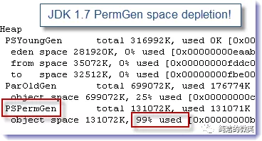
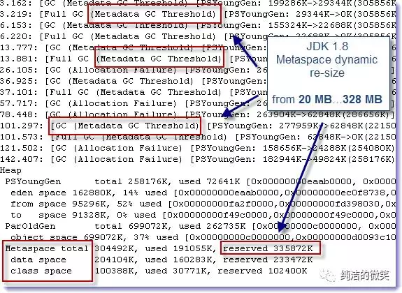
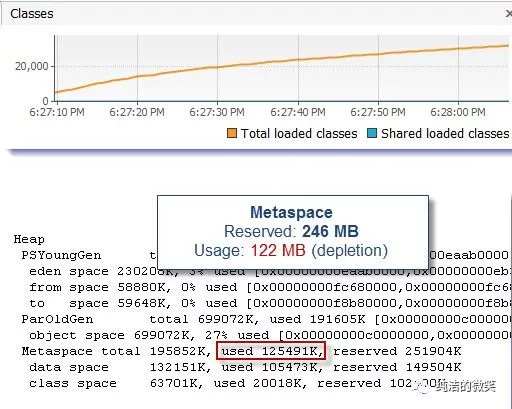

# JVM系列学习-Java8从永久代到metaspace

---

### 概述

Java 8介绍了一些新语言以及运行时新特点。其中一个特点便是完全移除了持久代(PermGen)，自从Oracle公司发布了JDK1.7后就已经宣布了这个决定。还有比如内部字符串，从JDK1.7开始就从持久代移除了，JDK8的发布彻底废除了它。在这个部分，我们会讨论持久代的继任者：Metaspace。

当执行一个Java程序并出现了“泄露”类元数据对象时我们会比较HotSpot 1.7和HotSpot 1.8的运行时行为的不同点。

JDK8 HotSpot JVM现在使用了本地内存来存储类元数据，被称为Metaspace，和Oracle JRockit以及IBM JVM类似。

好消息是它意味着java.lang.OutOfMemoryError：PermGen space问题会越来越少，也不再需要你去调整和监控内存空间。然而这种变化默认是可不见的，接下来我们给你展示的，是你仍然需要关注类元数据内存占用。请记住，这些新特点并不会很神奇的消除类和类加载器的内存泄露，你需要使用不同的方法和学习新的命名约定来找出问题的根源。

1、持久代场景

* 这块内存区域被完全移除。 
* PermSize和MaxPermSize JVM 参数会被忽略，并且在启动的时候会给出警告信息。

2、Metaspace 内存分配模型 

* 对于类元数据的大多数内存分配都不会发生在本地内存。 
* 被用于描述类元数据的类对象被移除。

3、Metaspace 容量 

* 默认的，类元数据分配限制于可用的本地内存 (容量大小依赖于你用32位jvm或者64位jvm的操作系统可用虚拟内存)。 
* 新的标记已经可以使用 (MaxMetaspaceSize)，它允许你限制用于类元数据的本地内存大小。如果你没有指定这个标记，Metaspace会根据运行时应用程序的需求来动态的控制大小。

4、Metaspace 垃圾收集 

* 一旦类元数据的使用量达到了“MaxMetaspaceSize”指定的值，对于无用的类和类加载器，垃圾收集此时会触发。 
* 为了控制这种垃圾收集的频率和延迟，合适的监控和调整Metaspace非常有必要。过于频繁的Metaspace垃圾收集是类和类加载器发生内存泄露的征兆，同时也说明你的应用程序内存大小不合适，需要调整。

5、Java 堆空间影响 

* 一些杂项数据被移到了Java堆空间。这意味着当你更新到JDK8后会观察到Java堆空间的增长。

6、Metaspace 监控 

* Metaspace 的使用可以通过HotSpot 1.8的详细的GC日志输出观察到。 
* 在基于b75上测试的时候Jstat 和 JVisualVM 还没有更新，旧的持久代空间引用依然存在。

足够的理论知识就介绍到这，让我们在行动中通过会发生泄露的Java程序来看看新的内存空间…

### 持久代 vs Metaspace运行时比较

1、下面的场景将会被测试：

* 使用JDK1.7运行这个Java程序，目的是为了监控和消耗设置好的128M持久代空间。 
* 使用JDK1.8(b75)运行这个Java程序，目的是为了监控Metaspace内存空间的动态增长和垃圾收集。 
* 使用JDK1.8(b75)运行这个Java程序，设置MaxMetaspaceSize为128M，目的是为了模拟Metaspace空间的消耗。

2、JDK 1.7 @64-bit – 持久代消耗 

* 一个包含5万个配置好的迭代的程序 
* 1024M的java堆 
* 128M java持久代(-XX:MaxPermSize=128m) 

从JVisualVM里可以看到，持久代的消耗在加载了超过3万个类之后几乎达到了临界。我们也可以从Java程序和GC输出中看到这种消耗。

现在让我们用HotSpot JDK 1.8 来执行这个程序。

3、JDK 1.8 @64-bit – Metaspace 动态大小 

* 一个包含5万个配置好的迭代的程序 
* 1024M的堆 
* Java Metaspace空间：无限(默认) 

从详细的GC输出可以看到，JVM的metaspace的确动态的把本地内存从20M扩展到了320M，目的是为了适应增长的Java程序中类元数据的内存占用。我们也可以观察到JVM会尝试进行垃圾收集的事件，目的是为了消灭无用的类和类加载器对象。自从我们的Java程序开始泄露内存，JVM没有选择，只能动态扩展Metaspace内存空间。

这个程序可以运行5万次迭代而不会发生OOM事件，并且加载了超过5万个类。让我们转移到我们最后一次测试场景：

4、JDK 1.8 @64-bit – Metaspace 消耗 

* 一个包含5万个配置好的迭代的程序 
* 1024M的堆 
* Java Metaspace空间：128 MB (-XX:MaxMetaspaceSize=128m) 

从JVisualVM里可以看到，在加载了超过3万个类后，Metaspace消耗达到了临界，和用JDK1.7运行的结果类似。我们可以从程序和GC输出中看到这个结果。另一个有意思的观察结果是本地内存占用是指定最大值的2倍。这或许可以说明，一种好的调整metaspace扩容的策略有可能避免本地内存的浪费。

和用JDK1.7运行一样，我们指定了metaspace最大容量为128M，但它在我们程序里并不能完成5万次的迭代。新的OOM会被抛出。上面的OOM事件是在内存分配失败后由JVM从metaspace里抛出的。

目前观察到的结果完全说明了合适的监控和调优是非常必要的，目的是为了尽量避免类似我们最后一种测试场景中过多的metaspace GC或者OOM触发的问题。

   

---

