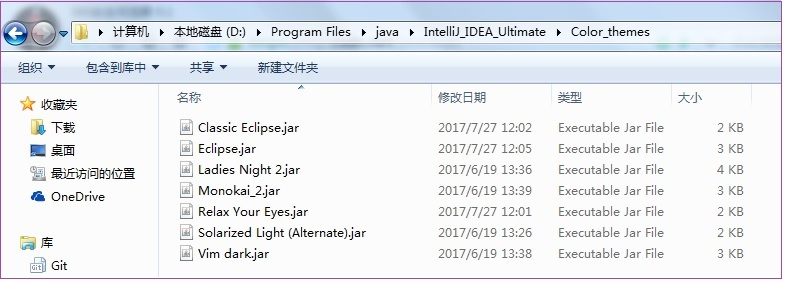
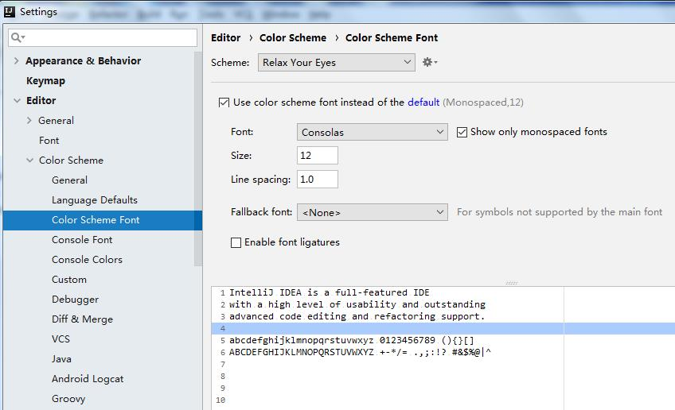

# IDEA设置主题

---

IDEA默认情况下只有两个风格的主题。可以通过以下网站下载使用自己喜欢的主题：

* http://www.riaway.com/
* http://color-themes.com/?view=index

将下载好的jar包放置到一个目录下，推荐在IDEA安装目录下新建color_themes文件夹，把我们下载的主题的jar放进入，以后喜欢的主题都可以下载后放置到这里。

打开IDEA，从主菜单选择 File->Import Setting，选择刚才下载主题的jar文件。加载完后，此时会提示重启工具。重启后，在工具中配置我们刚才加载进来的主题，打开File->Settings->Editor->Colors Scheme Font：

   

---

