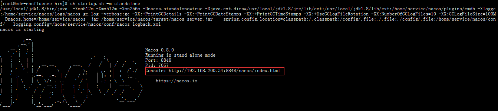
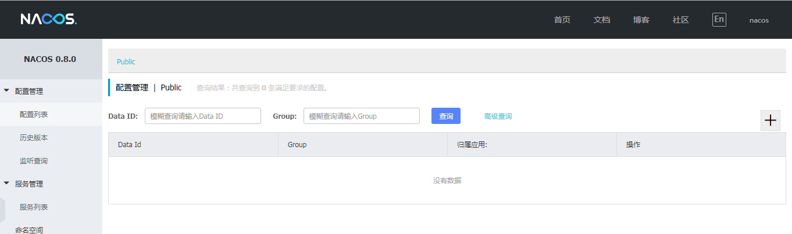
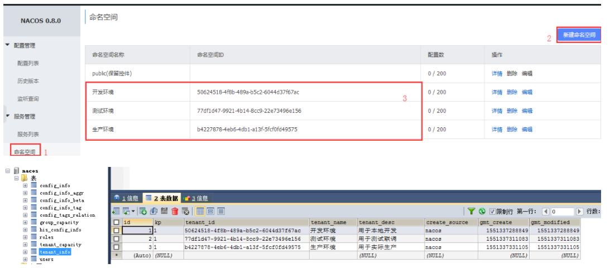
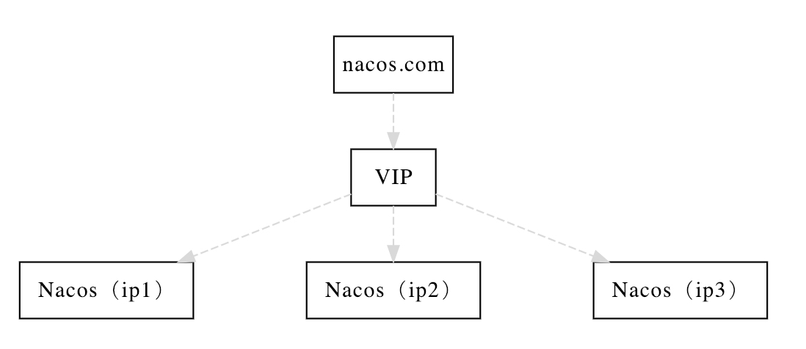
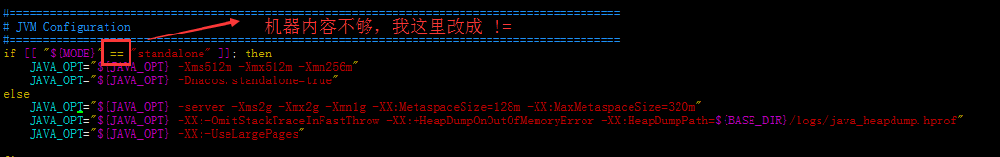

# Nacos基础教程-Nacos部署模式

---

### 演示环境

* 64 bit CentOS7；
* 64 bit JDK 1.8；
* Maven 3.3.9；
* MySQL 5.7;

### 单机模式

使用场景：测试和单机使用。

1、下载

到官网下载稳定版本解压使用：https://github.com/alibaba/nacos/releases/tag/0.8.0 。

2、安装

~~~plaintext
## 上传压缩包至服务器 /home/service

## 解压
# tar -zxvf nacos-server-0.8.0.tar.gz
# cd /home/service/nacos/bin

## 启动(linux环境)
# sh startup.sh -m standalone

## 启动(windows环境)
startup.cmd -m standalone
~~~

3、编译源码方式

~~~plaintext
# unzip nacos-source.zip
# cd nacos-master/
# mvn -Prelease-nacos clean install -U  -Dmaven.test.skip=true
# cd nacos-master/distribution/target/nacos-server-0.8.0/nacos/bin
# sh startup.sh -m standalone
~~~

4、访问Nacos

访问路径：http://192.168.200.34:8848/nacos/index.html 。登录账号：nacos/admin。

5、添加MySQL支持

单机模式默认使用嵌入式数据库实现数据的存储，不方便观察数据存储的基本情况。但是Nacos支持MySQL数据源能力，具体的操作步骤：

* 安装数据库，版本要求：mysql 5.6.5+；
* 初始化数据库；

~~~plaintext
## 创建数据库实例
mysql> GRANT ALL ON nacos.* TO nacos@"%" IDENTIFIED BY "替换成你的密码";
Query OK, 0 rows affected, 1 warning (0.17 sec)

mysql> GRANT ALL ON nacos.* TO nacos@"localhost" IDENTIFIED BY "替换成你的密码";
Query OK, 0 rows affected, 1 warning (0.01 sec)

mysql> FLUSH PRIVILEGES;
Query OK, 0 rows affected (0.21 sec)

## 执行初始化脚本
mysql> use nacos;
Database changed
mysql> source /home/service/nacos/conf/nacos-mysql.sql
~~~

修改 conf/application.properties文件：

~~~plaintext
# vim /home/service/nacos/conf/application.properties

## 增加支持mysql数据源配置 （目前只支持mysql）
spring.datasource.platform=mysql
db.num=1
db.url.0=jdbc:mysql://192.168.200.34:3306/nacos?characterEncoding=utf8&connectTimeout=1000&socketTimeout=3000&autoReconnect=true
db.user=nacos
db.password=H5s1#2wk8
~~~

【扩展点】mysql 多节点部署

再以单机模式启动Nacos，Nacos所有写嵌入式数据库的数据都写到了MySQL自动检测。

~~~plaintext
# sh startup.sh -m standalone
~~~

### 集群模式

使用场景：用于生产环境，确保高可用。

1、伪集群部署

3个或3个以上Nacos节点才能构成集群。

~~~plaintext
##　初始化３个集群节点
# mkdir nacos-cluster
# cp -r nacos nacos-cluster/nacos-8848
# cp -r nacos nacos-cluster/nacos-8849
# cp -r nacos nacos-cluster/nacos-8850

## 创建并修改集群配置文件
# cd nacos-cluster/nacos-8848/conf
# cp cluster.conf.example  cluster.conf
# vim cluster.conf
## 内容如下
#it is ip
#example
192.168.200.34:8848
192.168.200.34:8849
192.168.200.34:8850

## 修改集群节点的端口 
# vim nacos-cluster/nacos-8849/conf/application.properties
server.port=8849
# vim nacos-cluster/nacos-8850/conf/application.properties
server.port=8850
~~~

启动服务：

~~~plaintext
## 我这里服务器内存不够用，分别修改三个节点的启动脚本
# vim conf/startup.sh
~~~

~~~plaintext
# cd nacos-cluster/nacos-8848/bin
# sh startup.sh -m cluster

# cd nacos-cluster/nacos-8849/bin
# sh startup.sh -m cluster

# cd nacos-cluster/nacos-8850/bin
# sh startup.sh -m cluster
~~~

### 数据中心

使用场景：用于多数据中心场景。

   

---

