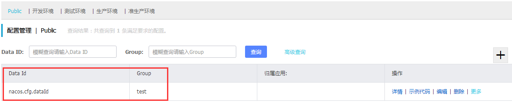
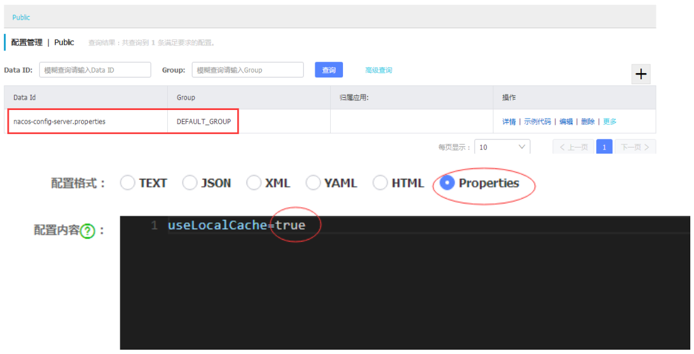

# Nacos基础教程-Nacos配置中心

---

### OpenAPI

1、发布配置

~~~plaintext
# curl -X POST "http://192.168.200.34:8847/nacos/v1/cs/configs?dataId=nacos.cfg.dataId&group=test&content=helloWorld"

true
~~~

2、获取配置

~~~plaintext
# curl -X GET "http://192.168.200.34:8847/nacos/v1/cs/configs?dataId=nacos.cfg.dataId&group=test"

helloWorld
~~~

### SpringCloud集成

1、添加依赖

~~~xml
<!-- 引入spring boot的依赖 -->
<parent>
	<groupId>org.springframework.boot</groupId>
	<artifactId>spring-boot-starter-parent</artifactId>
	<version>2.0.7.RELEASE</version>
</parent>

<!-- 引入spring cloud的依赖 -->
<dependencyManagement>
	<dependencies>
		<dependency>
			<groupId>org.springframework.cloud</groupId>
			<artifactId>spring-cloud-dependencies</artifactId>
			<version>Finchley.SR2</version>
			<type>pom</type>
			<scope>import</scope>
		</dependency>
		<dependency>
			<groupId>org.springframework.cloud</groupId>
			<artifactId>spring-cloud-alibaba-dependencies</artifactId>
			<version>0.2.0.RELEASE</version>
			<type>pom</type>
			<scope>import</scope>
		</dependency>
	</dependencies>
</dependencyManagement>
<dependency>
	<groupId>org.springframework.cloud</groupId>
	<artifactId>spring-cloud-starter-alibaba-nacos-config</artifactId>
</dependency>
~~~

2、在 bootstrap.properties 中配置 Nacos server 的地址和应用名

~~~plaintext
spring.cloud.nacos.config.server-addr=192.168.200.34:8847
spring.application.name=nacos-config-server
server.port=1909
~~~

说明：之所以需要配置 spring.application.name ，是因为它是构成 Nacos 配置管理 dataId字段的一部分。在 Nacos Spring Cloud 中，dataId 的完整格式如下：

~~~plaintext
${prefix}-${spring.profile.active}.${file-extension}
~~~

* prefix 默认为 spring.application.name 的值，也可以通过配置项 spring.cloud.nacos.config.prefix来配置。
* spring.profile.active 即为当前环境对应的 profile，详情可以参考 Spring Boot文档。 注意：当 spring.profile.active 为空时，对应的连接符 - 也将不存在，dataId 的拼接格式变成 ${prefix}.${file-extension}。
* file-exetension 为配置内容的数据格式，可以通过配置项 spring.cloud.nacos.config.file-extension 来配置。目前只支持 properties 和 yaml 类型。

3、通过 Spring Cloud 原生注解 @RefreshScope 实现配置自动更新

~~~java
@RestController
@RequestMapping("/config")
@RefreshScope
//@NacosPropertySource(dataId = "nacos-config-server", autoRefreshed = true)
public class ConfigController {
	@Value("${useLocalCache:false}")
	private String useLocalCache;

	//@NacosValue(value="${useLocalCache:false}", autoRefreshed=true)
	//private boolean useLocalCache;

	@RequestMapping("/get")
	public String get() {
		return useLocalCache;
	}
}
~~~

4、首先通过调用 Nacos Open API  设置 useLocalCache=true

~~~plaintext
curl -X POST "http://192.168.200.34:8847/nacos/v1/cs/configs?dataId=nacos-config-server.properties&group=DEFAULT_GROUP&content=useLocalCache=true"
~~~

5、启动服务

运行 NacosConfigApplication，调用 curl http://localhost:1909/config/get ，返回内容是 true，经测试返回内容是 false，不知道是不是BUG。

6、通过调用 Nacos Open API  设置 useLocalCache=other

~~~plaintext
##  发布配置
curl -X POST "http://192.168.200.34:8847/nacos/v1/cs/configs?dataId=nacos-config-server.properties&group=DEFAULT_GROUP&content=useLocalCache=other"

##  获取配置
curl -X GET "http://192.168.200.34:8847/nacos/v1/cs/configs?dataId=nacos-config-server.properties&group=DEFAULT_GROUP"
~~~

7、启动服务

再次访问 http://localhost:1909/config/get ，此时返回内容应该是为other，说明程序中的useLocalCache值已经被动态更新了(经测试，SpringCloud客户端获取不到最新值)。

8、通过UI页面修改配置

采用页面配置的方式，重新添加配置（经测试，SpringCloud客户端可以获取最新值）。

注：application.properties里面的配置，可以直接放到nacos里面。

   

---

