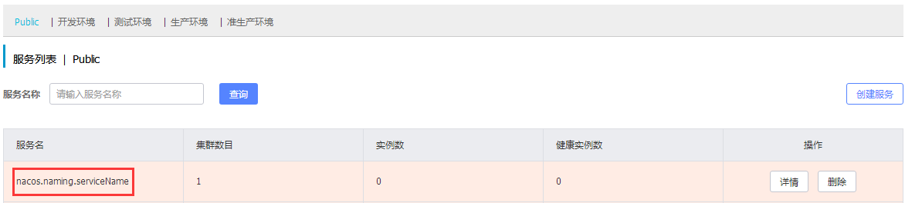
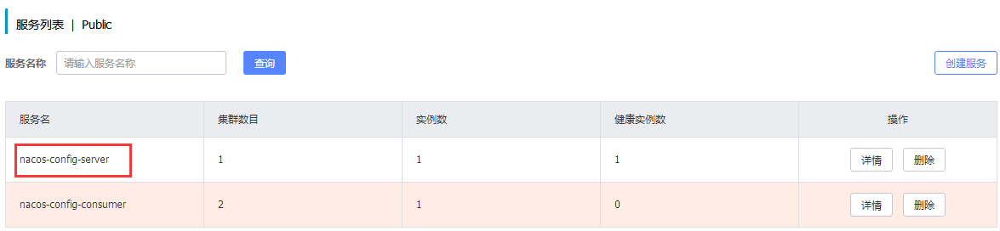
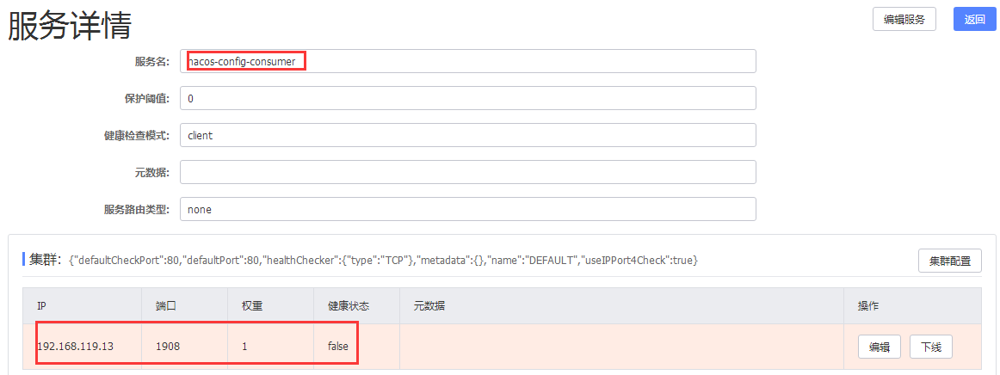
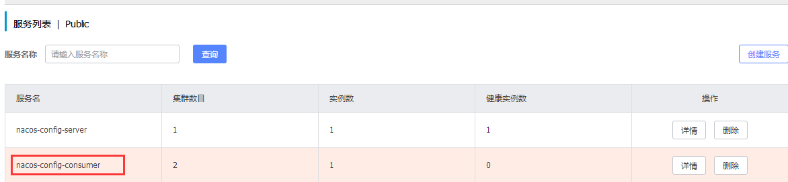
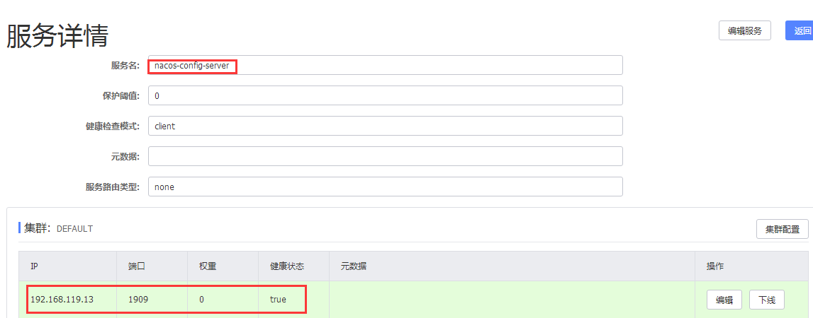

# Nacos基础教程-Nacos注册中心

---

### OpenAPI

1、服务注册

~~~plaintext
# curl -X PUT 'http://192.168.200.34:8847/nacos/v1/ns/instance?serviceName=nacos.naming.serviceName&ip=192.168.119.13&port=8080'
~~~

2、服务发现

~~~plaintext
# curl -X GET 'http://192.168.200.34:8847/nacos/v1/ns/instances?serviceName=nacos.naming.serviceName'

{"metadata":{},"dom":"nacos.naming.serviceName","cacheMillis":10000,"useSpecifiedURL":false,"hosts":[],"checksum":"b839b3d6117c429ddf33884058d049a21551340700502","lastRefTime":1551340700502,"
~~~

### SpringCloud集成

1、添加依赖

~~~xml
<!-- 引入spring boot的依赖 -->
<parent>
	<groupId>org.springframework.boot</groupId>
	<artifactId>spring-boot-starter-parent</artifactId>
	<version>2.0.7.RELEASE</version>
</parent>
<dependency>
	<groupId>org.springframework.cloud</groupId>
	<artifactId>spring-cloud-starter-alibaba-nacos-discovery</artifactId>
</dependency>

<!-- 引入spring cloud的依赖 -->
<dependencyManagement>
	<dependencies>
		<dependency>
			<groupId>org.springframework.cloud</groupId>
			<artifactId>spring-cloud-dependencies</artifactId>
			<version>Finchley.SR2</version>
			<type>pom</type>
			<scope>import</scope>
		</dependency>
		<dependency>
			<groupId>org.springframework.cloud</groupId>
			<artifactId>spring-cloud-alibaba-dependencies</artifactId>
			<version>0.2.0.RELEASE</version>
			<type>pom</type>
			<scope>import</scope>
		</dependency>
	</dependencies>
</dependencyManagement>
~~~

2、服务提供者

1）在 bootstrap.properties 中配置 Nacos server 的地址和应用名

~~~plaintext
spring.cloud.nacos.config.server-addr=192.168.200.34:8847
spring.cloud.nacos.discovery.server-addr=nacos-config-server
server.port=1909
~~~

2）通过 Spring Cloud 原生注解 @EnableDiscoveryClient 开启服务注册发现功能

~~~java
@SpringBootApplication
public class NacosConfigApplication {
	public static void main(String[] args) {
		SpringApplication.run(NacosConfigApplication.class, args);
	}
}
~~~

3）服务列表

4）服务详情

3、服务消费者

1）在 bootstrap.properties 中配置 Nacos server 的地址和应用名

~~~plaintext
spring.cloud.nacos.config.server-addr=192.168.200.34:8847
spring.cloud.nacos.discovery.server-addr=nacos-config-comsumer
server.port=1908
~~~

2）通过 Spring Cloud 原生注解 @EnableDiscoveryClient 开启服务注册发现功能。给 RestTemplate 实例添加@LoadBalanced 注解，开启 @LoadBalanced 与 Ribbon 的集成：

~~~java
@RestController
@RequestMapping("/config")
@RefreshScope
public class ConfigController {
	private final RestTemplate restTemplate;

	@Value("${server.port}")
	private String port;

	@Autowired
	public ConfigController(RestTemplate restTemplate) {
		this.restTemplate = restTemplate;
	}

	@RequestMapping("/get")
	public String get() {
		return "I'm port:"+port+ ","+restTemplate.getForObject("http://nacos-config-server/config/get", String.class);
	}
}
~~~

3）启动 NacosConfigApplication和 NacosConfigConsumerApplication ，调用http://localhost:1908/config/get ，返回内容为 I'm port:1908,true。

4）服务列表

5）服务详情

   

---

