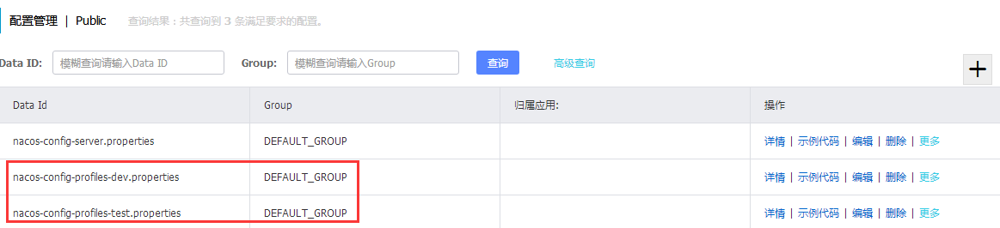
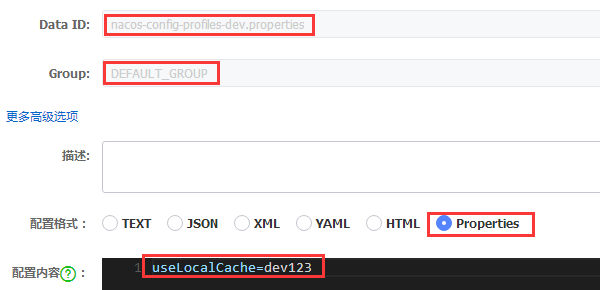
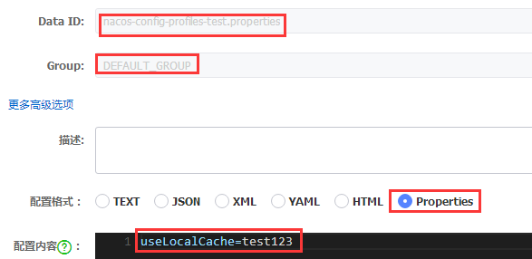
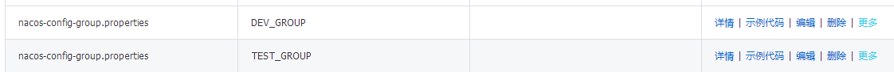
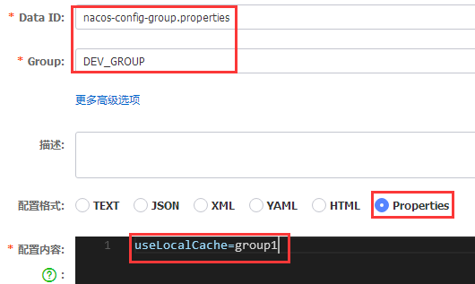
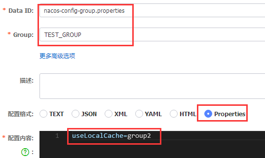
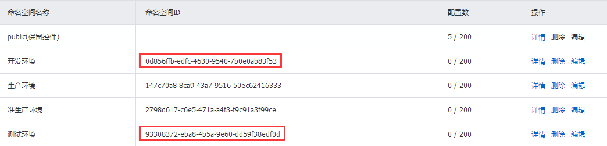
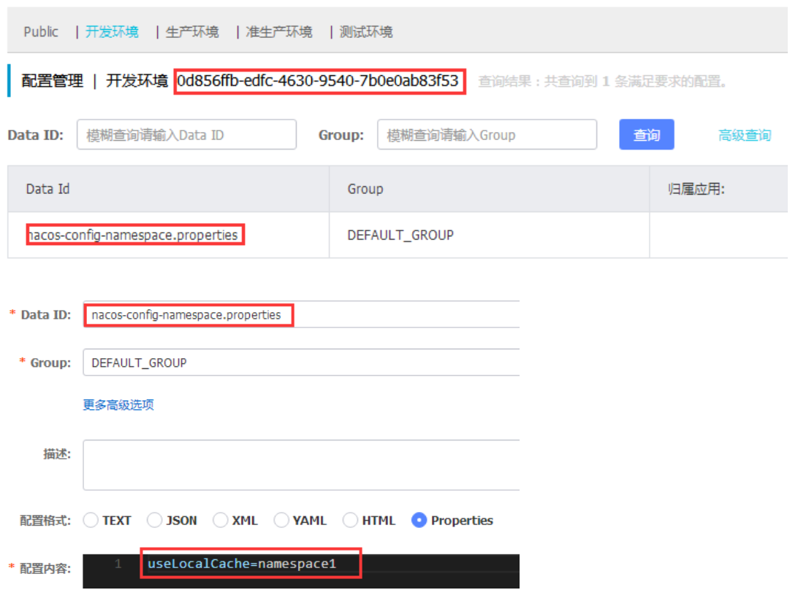
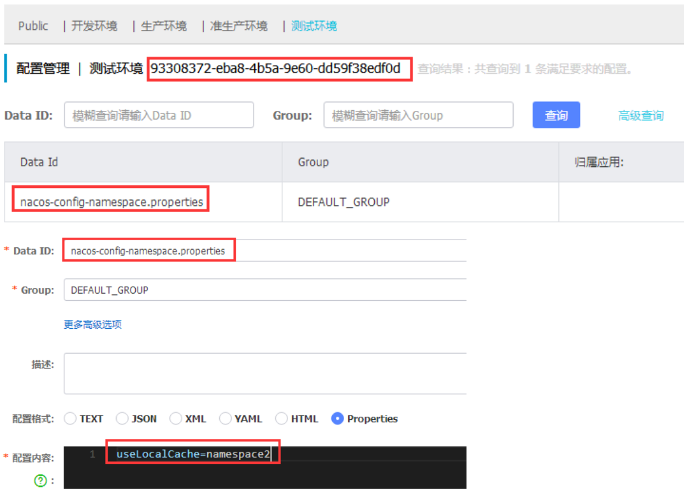

# Nacos基础教程-Nacos多环境配置中心

---

### 使用Data ID与profiles实现

默认情况下Data ID的名称格式是这样的：`${spring.application.name}.properties`，即：以Spring Cloud应用命名的properties文件。

我们在应用启动时，可以通过`spring.profiles.active`来指定具体的环境名称，此时客户端就会把要获取配置的Data ID组织为：

`${spring.application.name}-${spring.profiles.active}.properties`。

实际上，更原始且最通用的匹配规则，是这样的：

`${spring.cloud.nacos.config.prefix}-${spring.profile.active}.${spring.cloud.nacos.config.file-extension}`。

而上面的结果是因为`${spring.cloud.nacos.config.prefix}`和`${spring.cloud.nacos.config.file-extension}`都使用了默认值。

1、第一步，将microservice-cacos-config-server复制成microservice-cacos-config-multi-profiles，修改配置文件 bootstrap.properties

~~~plaintext
spring.cloud.nacos.config.server-addr=192.168.200.34:8847
#默认值
#spring.cloud.nacos.config.file-extension=properties
#服务名称
spring.application.name=nacos-config-profiles
server.port=1907
#开发环境
spring.profiles.active=dev
#测试环境
#spring.profiles.active=test
~~~

2、第二步，在Nacos中，创建两个不同环境的配置内容

开发环境配置：

测试环境配置：

3、第三步：启动应用，我们可以看到日志中打印了，加载的配置文件：

~~~plaintext
Loading nacos data, dataId: 'nacos-config-profiles-dev.properties', group: 'DEFAULT_GROUP'

Located property source: CompositePropertySource {name='NACOS', propertySources=[NacosPropertySource {name='nacos-config-profiles-dev.properties'}]}

The following profiles are active: dev
~~~

4、第四步：测试结果

~~~plaintext
curl http://localhost:1907/config/get
~~~

### 使用Group实现

Group在Nacos中是用来对Data ID做集合管理的重要概念。所以，如果我们把一个环境的配置视为一个集合，那么也就可以实现不同环境的配置管理。对于Group的用法并没有固定的规定，所以我们在实际使用的时候，需要根据我们的具体需求，可以是架构运维上对多环境的管理，也可以是业务上对不同模块的参数管理。为了避免冲突，我们需要在架构设计之初，做好一定的规划。

1、第一步，将microservice-cacos-config-multi-profiles复制成microservice-cacos-config-multi-group，修改配置文件 bootstrap.properties

~~~plaintext
spring.cloud.nacos.config.server-addr=192.168.200.34:8847
spring.application.name=nacos-config-group
server.port=1906
#开发环境
spring.cloud.nacos.config.group=DEV_GROUP
#测试环境
spring.cloud.nacos.config.group=TEST_GROUP
~~~

2、第二步：先在Nacos中，通过区分Group来创建两个不同环境的配置内容

开发环境配置：

测试环境配置：

3、第三步：启动应用，我们可以看到日志中打印了，加载的配置文件

~~~plaintext
Loading nacos data, dataId: 'nacos-config-group.properties', group: 'DEV_GROUP'

Located property source: CompositePropertySource {name='NACOS', propertySources=[NacosPropertySource {name='nacos-config-group.properties'}]}
~~~

4、第四步：测试结果

~~~plaintext
curl http://localhost:1906/config/get
~~~

### 使用Namespace实现

可用于进行租户粒度的配置隔离。不同的命名空间下，可以存在相同的Group或Data ID的配置。Namespace的常用场景之一是不同环境的配置的区分隔离，例如：开发测试环境和生产环境的资源（如配置、服务）隔离等。

1、第一步，新增多个命名空间

2、第二步：在配置列表的最上方，可以看到除了Public之外，多了几个刚才创建的Namepsace。分别在开发环境和测试环境空间下为nacos-config-namespace应用创建配置内容

开发环境配置：

测试环境配置：

3、第三步，将microservice-cacos-config-multi-profiles复制成microservice-cacos-config-multi-namespace，修改配置文件 bootstrap.properties

~~~plaintext
spring.cloud.nacos.config.server-addr=192.168.200.34:8847
spring.application.name=nacos-config-namespace
server.port=1905
#值对应开发环境的命名空间ID
spring.cloud.nacos.config.namespace=0d856ffb-edfc-4630-9540-7b0e0ab83f53
#值对应测试环境的命名空间ID
#spring.cloud.nacos.config.namespace=93308372-eba8-4b5a-9e60-dd59f38edf0d
~~~

4、第四步：启动应用，这种方式下，目前版本的日志并不会输出与Namespace相关的信息，所以还无法以此作为加载内容的判断依据。

5、第五步：测试结果

~~~plaintext
curl http://localhost:1905/config/get
~~~

### 三种方式的对比

1、第一种：通过Data ID与profile实现

优点：这种方式与Spring Cloud Config的实现非常像，用过Spring Cloud Config的用户，可以毫无违和感的过渡过来，由于命名规则类似，所以要从Spring Cloud Config中做迁移也非常简单。

缺点：这种方式在项目与环境多的时候，配置内容就会显得非常混乱。配置列表中会看到各种不同应用，不同环境的配置交织在一起，非常不利于管理。

建议：项目不多时使用，或者可以结合Group对项目根据业务或者组织架构做一些拆分规划。

2、第二种：通过Group实现

优点：通过Group按环境将各个应用的配置隔离开。可以非常方便的利用Data ID和Group的搜索功能，分别从应用维度和环境维度来查看配置。

缺点：由于会占用Group维度，所以需要对Group的使用做好规划，考虑业务上的一些配置分组冲突等问题。

建议：这种方式虽然结构上比上一种更好一些，但是依然可能会有一些混乱，主要是在Group的管理上要做好规划和控制。

3、第三种：通过Namespace实现

优点：官方建议的方式，通过Namespace来区分不同的环境，释放了Group的自由度，这样可以让Group的使用专注于做业务层面的分组管理。同时，Nacos控制页面上对于Namespace也做了分组展示，不需要搜索，就可以隔离开不同的环境配置，非常易用。

注意：不论用哪一种方式实现。对于指定环境的配置（spring.profiles.active=dev、spring.cloud.nacos.config.group=DEV_GROUP、spring.cloud.nacos.config.namespace=0d856ffb-edfc-4630-9540-7b0e0ab83f53），都不要配置在应用的bootstrap.properties中。而是在发布脚本的启动命令中，用-Dspring.profiles.active=dev的方式来动态指定，会更加灵活！

   

---

