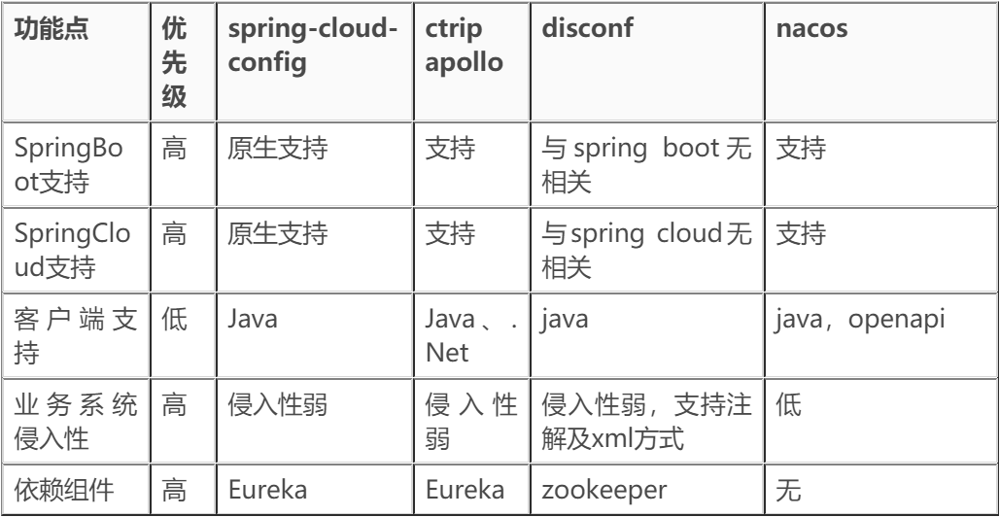
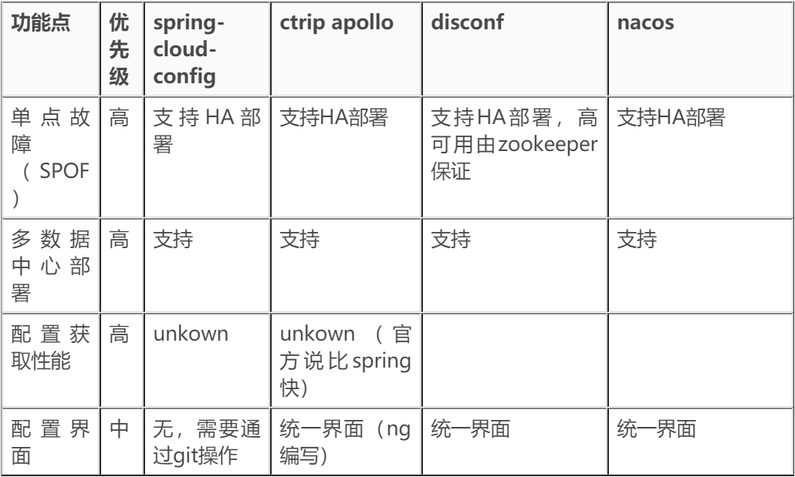
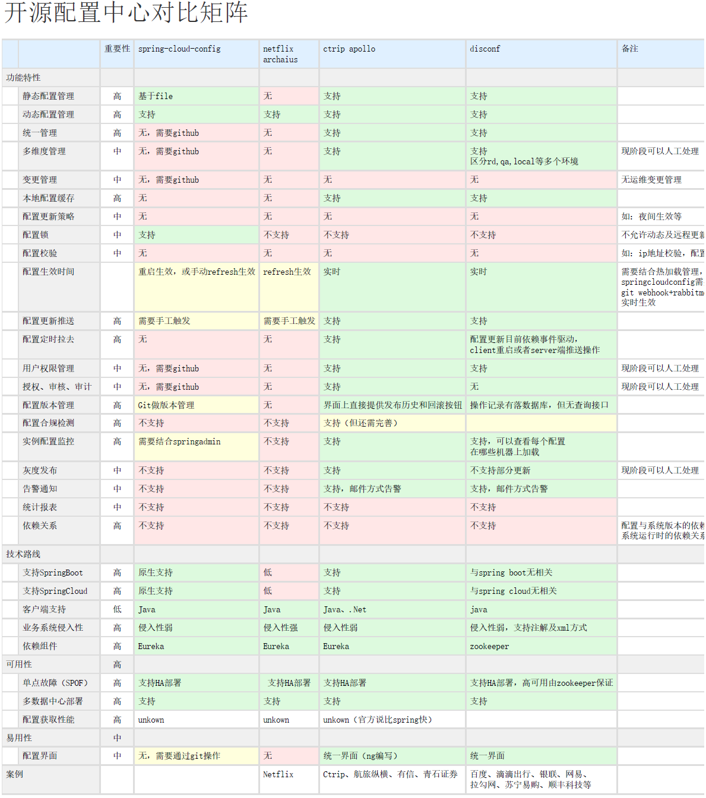
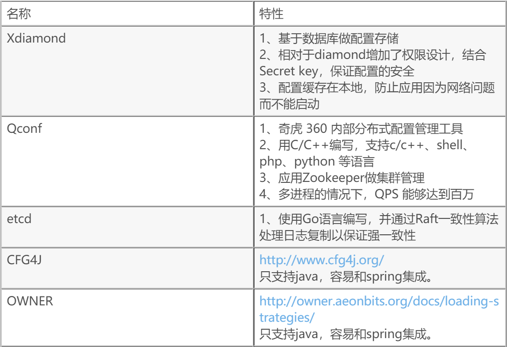

# Nacos基础教程-主流分布式配置中心对比分析

---

### 目前主流的开源配置中心有哪些

1、spring-cloud/spring-cloud-config

Spring出品，可以和Spring Cloud无缝配合，https://github.com/spring-cloud/spring-cloud-config 。

2、淘宝 diamond

https://github.com/takeseem/diamond ，已经不维护。

3、百度 disconf

Java开发，蚂蚁金服技术专家发起，业界使用广泛，https://github.com/knightliao/disconf 。

4、携程 apollo

Apollo（阿波罗）是携程框架部门研发的开源配置管理中心，具备规范的权限、流程治理等特性。https://github.com/ctripcorp/apollo/ 。

5、阿里 nacos

Java开发，阿里开源，和SpringCloud、Dubbo、Kubernetes无缝配合。https://github.com/alibaba/nacos 。

### Nacos的优势

* Dubbo + Nacos， 专为Dubbo而生的注册中心与配置中心；
* 完全兼容Spring Cloud；
* 支持Kubernetes DNS-based Service Discovery；
* 填补Spring Cloud 体系与 Kubernetes 体系的鸿沟；

### 主流配置中心对比

1、热门对比

| 对比项目     | Diamond（阿里2011年）                                        | Disconf（百度个人2015）                                      | Apollo（携程2016）                                           | Nacos（阿里2018）   |
| ------------ | ------------------------------------------------------------ | ------------------------------------------------------------ | ------------------------------------------------------------ | ------------------- |
| 配置存储     | 存储在mysql上                                                | 存储在mysql上                                                | mysql                                                        | 嵌入式数据库、mysql |
| 推拉模型     | 拉模型，每隔15s拉一次全量数据                                | 基于Zookeeper的推模型，实时推送                              | 基于http长连接，实时推送                                     |                     |
| 配置读写     | 支持实例对配置读写。支持某台实例写配置数据，并广播到其它实例上 | 只支持实例对配置读。通过在disconf-web上更新配置到达到广播写到所有应用实例 | 同disconf                                                    |                     |
| 容灾         | 多级容灾模式，配置数据会dump在本地，避免中心服务挂机时无法使用 | 多级容灾模式，优先读取本地配置文件                           | 多级容灾模式，本地有缓存。                                   |                     |
| 配置数据模型 | 只支持KV结构的数据，非配置文件模式                           | 支持传统的配置文件模式（配置文件），亦支持KV结构数据(配置项) | 集中配置，本地缓存。                                         | 集中配置，本地缓存  |
| 功能特性     | 需要地址服务器，客户端连接到地址服务器，取回diamond服务器的地址列表 | 1、对配置进行持久化管理并对外提供restful接；2、注解式编程，需要Spring编程环境；3、支持配置的上传、下载；4、支持分布式环境下的主备竞争 | 统一管理不同环境、不同集群的配置；配置修改实时生效（热发布）；版本发布管理；灰度发布；权限管理、发布审核、操作审计、客户端配置信息监控；提供Java和.Net原生客户端；提供开放平台API |                     |
| 集群数据同步 | 基于数据库和本地文件；1、server写数据时，先将数据写入mysql，然后写入本地文件；2、client订阅数据时，访问的是本地文件，不查询数据库，这样即使数据库出问题了，仍然不影响client的订阅；3、通过比较client和server的数据的MD5值感知数据变化 | 基于zookeeper实现对配置更改的实时推送；全局分布式一致性锁来实现主备统一部署、系统异常时的主备自主切换 | 全局分布式，基于Eureka作为服务注册中心                       |                     |
| 优点         | 简单、可靠、易用                                             | 基于分布式的Zookeeper来实时推送稳定性、实效性、易用性上均优于diamond | 携程开源巨作，功能强大，设计周到，Web界面美观实用，文档比较全。 |                     |
| 缺点         | 1、无访问修改权限控制；2、对于未来可能要做的基于SOA架构的服务注册发现，功能上有所欠缺 | 源码较多，阅读和使用起来相对较复杂                           | 较新                                                         |                     |

2、功能特性

| 功能点           | 优先级 | spring-cloud-config         | ctrip apollo                     | disconf                                                   | nacos | 备注                                                         |
| ---------------- | ------ | --------------------------- | -------------------------------- | --------------------------------------------------------- | ----- | ------------------------------------------------------------ |
| 静态配置管理     | 高     | 基于file                    | 支持                             | 支持                                                      |       |                                                              |
| 动态配置管理     | 高     | 支持                        | 支持                             | 支持                                                      | 支持  |                                                              |
| 统一管理         | 高     | 无，需要github              | 支持                             | 支持                                                      | 支持  |                                                              |
| 多环境           | 中     | 无，需要github              | 支持                             | 支持                                                      | 支持  |                                                              |
| 本地配置缓存     | 高     | 无                          | 支持                             | 支持                                                      |       |                                                              |
| 配置锁           | 中     | 支持                        | 不支持                           | 不支持                                                    |       | 不允许动态及远程更新                                         |
| 配置校验         | 中     | 无                          | 无                               | 无                                                        |       | 如：ip地址校验，配置                                         |
| 配置生效时间     |        | 重启生效，或手动refresh生效 | 实时                             | 实时                                                      |       | 需要结合热加载管理， spring-cloud-config需要 git webhook+rabbitmq 实时生效 |
| 配置更新推送     | 高     | 需要手工触发                | 支持                             | 支持                                                      |       |                                                              |
| 配置定时拉取     | 高     | 无                          | 支持                             | 配置更新目前依赖事件驱动， client重启或者server端推送操作 |       |                                                              |
| 用户权限管理     | 中     | 无，需要github              | 支持                             | 支持                                                      | 支持  | 现阶段可以人工处理                                           |
| 授权、审核、审计 | 中     | 无，需要github              | 支持                             | 无                                                        |       | 现阶段可以人工处理                                           |
| 配置版本管理     | 高     | Git做版本管理               | 界面上直接提供发布历史和回滚按钮 | 操作记录有落数据库，但无查询接口                          | 支持  |                                                              |
| 配置合规检测     | 高     | 不支持                      | 支持（但还需完善）               |                                                           |       |                                                              |
| 实例配置监控     | 高     | 需要结合springadmin         | 支持                             | 支持，可以查看每个配置在哪些机器上加载                    |       |                                                              |
| 灰度发布         | 中     | 不支持                      | 支持                             | 不支持部分更新                                            |       | 现阶段可以人工处理                                           |
| 告警通知         | 中     | 不支持                      | 支持，邮件方式告警               | 支持，邮件方式告警                                        |       |                                                              |
| 依赖关系         | 高     | 不支持                      | 不支持                           | 不支持                                                    |       | 配置与系统版本的依赖系统运行时的依赖关系                     |

3、技术路线兼容性

4、可用性与易用性

5、其他开源配置管理中间件

   

---

