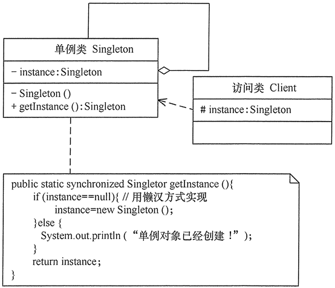
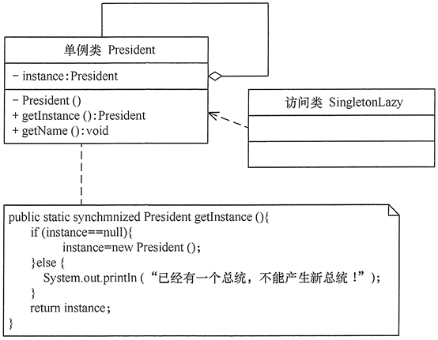
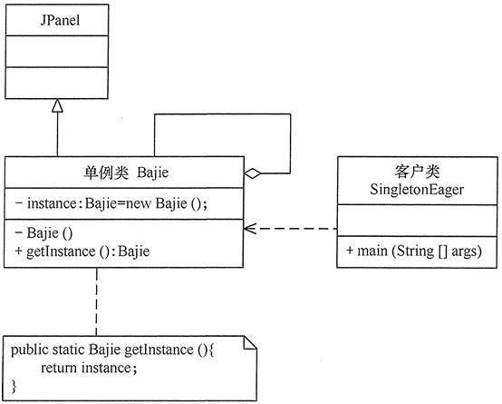
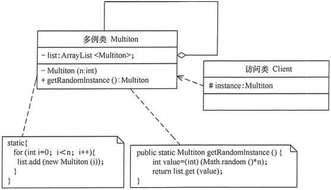

# 23种设计模式与案例-单例模式

---

### 【引言】

在有些系统中，为了节省内存资源、保证数据内容的一致性，对某些类要求只能创建一个实例，这就是所谓的单例模式。

### 【概念】

指一个类只有一个实例，且该类能自行创建这个实例的一种模式（保证一个类只有一个实例，并提供一个访问它的全局访问点）。例如，Windows 中只能打开一个任务管理器，这样可以避免因打开多个任务管理器窗口而造成内存资源的浪费，或出现各个窗口显示内容的不一致等错误。

在计算机系统中，还有 Windows 的回收站、操作系统中的文件系统、多线程中的线程池、显卡的驱动程序对象、打印机的后台处理服务、应用程序的日志对象、数据库的连接池、网站的计数器、Web 应用的配置对象、应用程序中的对话框、系统中的缓存等常常被设计成单例。

单例模式有 3 个特点：

* 单例类只有一个实例对象；
* 该单例对象必须由单例类自行创建；
* 单例类对外提供一个访问该单例的全局访问点；

### 【结构】

单例模式的主要角色如下：

* 1、单例类：包含一个实例且能自行创建这个实例的类。
* 2、访问类：使用单例的类。

### 【代码】

懒汉式：

~~~java
public class LazySingleton {
    private static volatile LazySingleton instance = null; //保证 instance 在所有线程中同步
    private LazySingleton(){} //private 避免类在外部被实例化
    public static synchronized LazySingleton getInstance() {
        //getInstance 方法前加同步
        if(instance==null) {
            instance=new LazySingleton();
        }
        return instance;
    }
}
~~~

饿汉式：

~~~java
public class HungrySingleton {
    private static final HungrySingleton instance=new HungrySingleton();
    private HungrySingleton(){}
    public static HungrySingleton getInstance() {
        return instance;
    }
}
~~~

### 【示例】

【例1】用懒汉式单例模式模拟产生美国当今总统对象。

分析：在每一届任期内，美国的总统只有一人，所以本实例适合用单例模式实现，图 2 所示是用懒汉式单例实现的结构图。

~~~java
public class SingletonLazy {
    public static void main(String[] args) {
        President zt1=President.getInstance();
        zt1.getName();    //输出总统的名字
        President zt2=President.getInstance();
        zt2.getName();    //输出总统的名字
        if(zt1==zt2) {
           System.out.println("他们是同一人！");
        } else {
           System.out.println("他们不是同一人！");
        }
    }
}

class President {
    private static volatile President instance=null; //保证instance在所有线程中同步
    //private避免类在外部被实例化
    private President() {
        System.out.println("产生一个总统！");
    }
    public static synchronized President getInstance() {
        //在getInstance方法上加同步
        if(instance==null) {
            instance=new President();
        } else {
            System.out.println("已经有一个总统，不能产生新总统！");
        }
        return instance;
    }
    public void getName() {
        System.out.println("我是美国总统：特朗普。");
    }  
}
~~~

【例2】用饿汉式单例模式模拟产生猪八戒对象。

分析：同上例类似，猪八戒也只有一个，所以本实例同样适合用单例模式实现。本实例由于要显示猪八戒的图像（点此下载该程序所要显示的猪八戒图片），所以用到了框架窗体 JFrame 组件，这里的猪八戒类是单例类，可以将其定义成面板 JPanel 的子类，里面包含了标签，用于保存猪八戒的图像，客户窗体可以获得猪八戒对象，并显示它。图 3 所示是用饿汉式单例实现的结构图。

~~~java
import java.awt.*;
import javax.swing.*;

public class SingletonEager {
    public static void main(String[] args) {
        JFrame jf=new JFrame("饿汉单例模式测试");
        jf.setLayout(new GridLayout(1,2));
        Container contentPane=jf.getContentPane();
        Bajie obj1=Bajie.getInstance();
        contentPane.add(obj1);    
        Bajie obj2=Bajie.getInstance(); 
        contentPane.add(obj2);
        if(obj1==obj2) {
            System.out.println("他们是同一人！");
        } else {
            System.out.println("他们不是同一人！");
        }   
        jf.pack();       
        jf.setVisible(true);
        jf.setDefaultCloseOperation(JFrame.EXIT_ON_CLOSE);
    }
}

class Bajie extends JPanel {
    private static Bajie instance=new Bajie();
    private Bajie() { 
        JLabel l1=new JLabel(new ImageIcon("src/Bajie.jpg"));
        this.add(l1);   
    }
    public static Bajie getInstance() {
        return instance;
    }
}
~~~

### 【应用场景】

前面分析了单例模式的结构与特点，以下是它通常适用的场景的特点。

* 1、在应用场景中，某类只要求生成一个对象的时候，如一个班中的班长、每个人的身份证号等。
* 2、当对象需要被共享的场合。由于单例模式只允许创建一个对象，共享该对象可以节省内存，并加快对象访问速度。如 Web 中的配置对象、数据库的连接池等。
* 3、当某类需要频繁实例化，而创建的对象又频繁被销毁的时候，如多线程的线程池、网络连接池等。

### 【扩展】

单例模式可扩展为有限的多例（Multitcm）模式，这种模式可生成有限个实例并保存在 ArmyList 中，客户需要时可随机获取，其结构图如图 5 所示。

   

---

