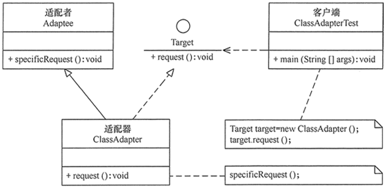
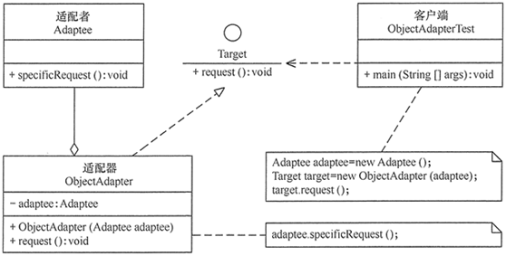
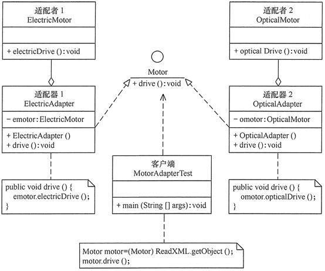
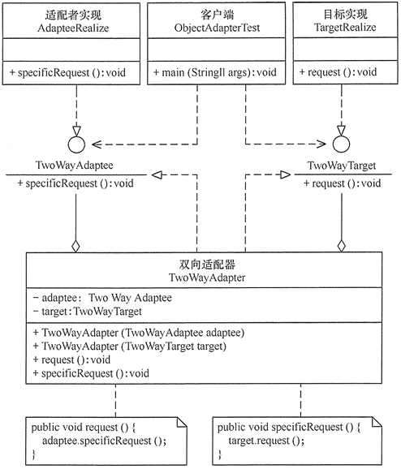

# 23种设计模式与案例-适配器模式

---

### 【引言】

在现实生活中，经常出现两个对象因接口不兼容而不能在一起工作的实例，这时需要第三者进行适配。例如，讲中文的人同讲英文的人对话时需要一个翻译，用直流电的笔记本电脑接交流电源时需要一个电源适配器，用计算机访问照相机的 SD 内存卡时需要一个读卡器等。

在软件设计中也可能出现：需要开发的具有某种业务功能的组件在现有的组件库中已经存在，但它们与当前系统的接口规范不兼容，如果重新开发这些组件成本又很高，这时用适配器模式能很好地解决这些问题。

### 【概念】

将一个类的接口转换成客户希望的另外一个接口，使得原本由于接口不兼容而不能一起工作的那些类能一起工作。适配器模式分为类结构型模式和对象结构型模式两种，前者类之间的耦合度比后者高，且要求程序员了解现有组件库中的相关组件的内部结构，所以应用相对较少些。

该模式的主要优点如下：

1、客户端通过适配器可以透明地调用目标接口。

2、复用了现存的类，程序员不需要修改原有代码而重用现有的适配者类。

3、将目标类和适配者类解耦，解决了目标类和适配者类接口不一致的问题。

其缺点是：对类适配器来说，更换适配器的实现过程比较复杂。

### 【结构】

类适配器模式：

对象适配器模式：

适配器模式（Adapter）包含以下主要角色：

1、目标（Target）接口：当前系统业务所期待的接口，它可以是抽象类或接口。

2、适配者（Adaptee）类：它是被访问和适配的现存组件库中的组件接口。

3、适配器（Adapter）类：它是一个转换器，通过继承或引用适配者的对象，把适配者接口转换成目标接口，让客户按目标接口的格式访问适配者。

### 【代码】

类适配器模式：

~~~java
public interface Target {

	public void request();

}

public class Adaptee {

	public void specificRequest() {
		System.out.println("适配者中的业务代码被调用！");
	}

}

public class ClassAdapter extends Adaptee implements Target {

	@Override
	public void request() {
		specificRequest();
	}

}

public class Test {

	public static void main(String[] args) {
		System.out.println("类适配器模式测试：");
		Target target = new ClassAdapter();
		target.request();
	}

}
~~~

对象适配器模式：

~~~java
public interface Target {

	public void request();

}

public class Adaptee {

	public void specificRequest() {
		System.out.println("适配者中的业务代码被调用！");
	}

}

public class ObjectAdapter implements Target {

	private Adaptee adaptee;

	public ObjectAdapter(Adaptee adaptee) {
		this.adaptee = adaptee;
	}

	@Override
	public void request() {
		adaptee.specificRequest();
	}

}

public class Test {

	public static void main(String[] args) {
		System.out.println("对象适配器模式测试：");
		Adaptee adaptee = new Adaptee();
		Target target = new ObjectAdapter(adaptee);
		target.request();
	}

}
~~~

### 【示例】

【例1】用适配器模式（Adapter）模拟新能源汽车的发动机。

分析：新能源汽车的发动机有电能发动机（Electric Motor）和光能发动机（Optical Motor）等，各种发动机的驱动方法不同，例如，电能发动机的驱动方法 electricDrive() 是用电能驱动，而光能发动机的驱动方法 opticalDrive() 是用光能驱动，它们是适配器模式中被访问的适配者。

客户端希望用统一的发动机驱动方法 drive() 访问这两种发动机，所以必须定义一个统一的目标接口 Motor，然后再定义电能适配器（Electric Adapter）和光能适配器（Optical Adapter）去适配这两种发动机。

我们把客户端想访问的新能源发动机的适配器的名称放在 XML 配置文件中（点此下载 XML 文件），客户端可以通过对象生成器类 ReadXML 去读取。这样，客户端就可以通过 Motor 接口随便使用任意一种新能源发动机去驱动汽车，图 3 所示是其结构图。

~~~java
//目标：发动机
public interface Motor {

	public void drive();

}

//适配者1：电能发动机
public class ElectricMotor {

	public void electricDrive() {
		System.out.println("电能发动机驱动汽车！");
	}

}

//适配者2：光能发动机
public class OpticalMotor {

	public void opticalDrive() {
		System.out.println("光能发动机驱动汽车！");
	}

}

//电能适配器
public class ElectricAdapter implements Motor {

	private ElectricMotor emotor;

	public ElectricAdapter() {
		emotor = new ElectricMotor();
	}

	@Override
	public void drive() {
		emotor.electricDrive();
	}

}

//光能适配器
public class OpticalAdapter implements Motor {

	private OpticalMotor omotor;

	public OpticalAdapter() {
		omotor = new OpticalMotor();
	}

	@Override
	public void drive() {
		omotor.opticalDrive();
	}

}

public class Test {

	public static void main(String[] args) {
		System.out.println("适配器模式测试：");
		Motor motor = new ElectricAdapter();
		motor.drive();
		motor = new OpticalAdapter();
		motor.drive();
	}

}
~~~

### 【应用场景】

适配器模式（Adapter）通常适用于以下场景。

1、以前开发的系统存在满足新系统功能需求的类，但其接口同新系统的接口不一致。

2、使用第三方提供的组件，但组件接口定义和自己要求的接口定义不同。

### 【扩展】

适配器模式（Adapter）可扩展为双向适配器模式，双向适配器类既可以把适配者接口转换成目标接口，也可以把目标接口转换成适配者接口，其结构图如图 4 所示。

~~~java
//目标接口
interface TwoWayTarget {
    public void request();
}

//适配者接口
interface TwoWayAdaptee {
    public void specificRequest();
}

//目标实现
class TargetRealize implements TwoWayTarget {
    public void request() {       
        System.out.println("目标代码被调用！");
    }
}

//适配者实现
class AdapteeRealize implements TwoWayAdaptee {
    public void specificRequest() {       
        System.out.println("适配者代码被调用！");
    }
}

//双向适配器
class TwoWayAdapter  implements TwoWayTarget,TwoWayAdaptee {
    private TwoWayTarget target;
    private TwoWayAdaptee adaptee;
    public TwoWayAdapter(TwoWayTarget target) {
        this.target=target;
    }
    public TwoWayAdapter(TwoWayAdaptee adaptee) {
        this.adaptee=adaptee;
    }
    public void request() {
        adaptee.specificRequest();
    }
    public void specificRequest() {       
        target.request();
    }
}

//客户端代码
public class TwoWayAdapterTest {
    public static void main(String[] args) {
        System.out.println("目标通过双向适配器访问适配者：");
        TwoWayAdaptee adaptee=new AdapteeRealize();
        TwoWayTarget target=new TwoWayAdapter(adaptee);
        target.request();
        System.out.println("-------------------");
        System.out.println("适配者通过双向适配器访问目标：");
        target=new TargetRealize();
        adaptee=new TwoWayAdapter(target);
        adaptee.specificRequest();
    }
}
~~~

   

---

