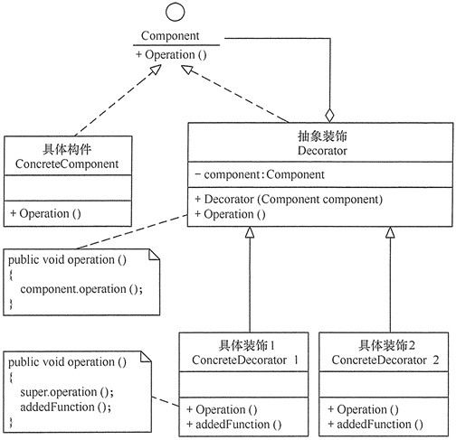
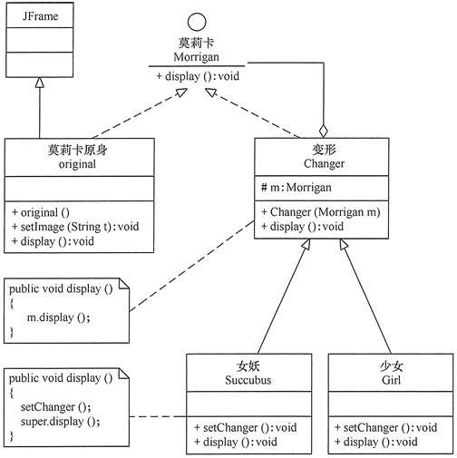
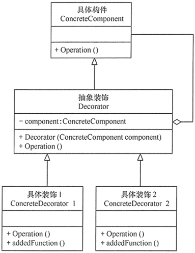
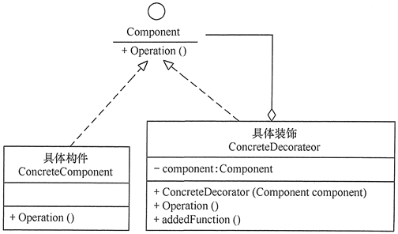

# 23种设计模式与案例-装饰器模式

---

### 【引言】

在现实生活中，常常需要对现有产品增加新的功能或美化其外观，如房子装修、相片加相框等。在软件开发过程中，有时想用一些现存的组件。这些组件可能只是完成了一些核心功能。但在不改变其结构的情况下，可以动态地扩展其功能。所有这些都可以釆用装饰模式来实现。

### 【概念】

指在不改变现有对象结构的情况下，动态地给该对象增加一些职责（即增加其额外功能）的模式（动态地给一个对象添加一些额外的职责。它提供了用子类扩展功能的一个灵活的替代，比派生一个子类更加灵活），它属于对象结构型模式。

装饰（Decorator）模式的主要优点有：

1、采用装饰模式扩展对象的功能比采用继承方式更加灵活。

2、可以设计出多个不同的具体装饰类，创造出多个不同行为的组合。

其主要缺点是：装饰模式增加了许多子类，如果过度使用会使程序变得很复杂。

### 【结构】

装饰模式主要包含以下角色：

1、抽象构件（Component）角色：定义一个抽象接口以规范准备接收附加责任的对象。

2、具体构件（Concrete Component）角色：实现抽象构件，通过装饰角色为其添加一些职责。

3、抽象装饰（Decorator）角色：继承抽象构件，并包含具体构件的实例，可以通过其子类扩展具体构件的功能。

4、具体装饰（ConcreteDecorator）角色：实现抽象装饰的相关方法，并给具体构件对象添加附加的责任。

### 【代码】

~~~java
public interface Component {

	public void operation();

}

public class ConcreteComponent implements Component {

	@Override
	public void operation() {
		System.out.println("调用具体构件角色的方法operation()");
	}

}

public class Decorator implements Component {

	private Component component;

	public Decorator(Component component) {
		this.component = component;
	}

	@Override
	public void operation() {
		component.operation();
	}

}

public class ConcreteDecorator extends Decorator {

	public ConcreteDecorator(Component component) {
		super(component);
	}

	public void operation() {
		super.operation();
		addedFunction();
	}

	public void addedFunction() {
		System.out.println("为具体构件角色增加额外的功能addedFunction()");
	}

}

public class Test {

	public static void main(String[] args) {
		Component p = new ConcreteComponent();
		p.operation();
		System.out.println("---------------------------------");
		Component d = new ConcreteDecorator(p);
		d.operation();
	}

}
~~~

### 【示例】

【例1】用装饰模式实现游戏角色“莫莉卡•安斯兰”的变身。

分析：在《恶魔战士》中，游戏角色“莫莉卡•安斯兰”的原身是一个可爱少女，但当她变身时，会变成头顶及背部延伸出蝙蝠状飞翼的女妖，当然她还可以变为穿着漂亮外衣的少女。这些都可用装饰模式来实现，在本实例中的“莫莉卡”原身有 setImage(String t) 方法决定其显示方式，而其 变身“蝙蝠状女妖”和“着装少女”可以用 setChanger() 方法来改变其外观，原身与变身后的效果用 display() 方法来显示（点此下载其原身和变身后的图片），图 2 所示是其结构图。

~~~java
public class MorriganAensland {
    public static void main(String[] args) {
        Morrigan m0=new original();
        m0.display();
        Morrigan m1=new Succubus(m0);
        m1.display();
        Morrigan m2=new Girl(m0);
        m2.display();
    }
}

//抽象构件角色：莫莉卡
interface  Morrigan {
    public void display();
}

//具体构件角色：原身
class original extends JFrame implements Morrigan {
    private static final long serialVersionUID = 1L;
    private String t="Morrigan0.jpg";
    public original() {
        super("《恶魔战士》中的莫莉卡•安斯兰");                
    }
    public void setImage(String t) {
        this.t=t;           
    }
    public void display() {   
        this.setLayout(new FlowLayout());
        JLabel l1=new JLabel(new ImageIcon("src/decorator/"+t));
        this.add(l1);   
        this.pack();       
        this.setDefaultCloseOperation(JFrame.EXIT_ON_CLOSE);  
        this.setVisible(true);
    }
}

//抽象装饰角色：变形
class Changer implements Morrigan {
    Morrigan m;   
    public Changer(Morrigan m) {
        this.m=m;
    }   
    public void display() {
        m.display();
    }
}

//具体装饰角色：女妖
class Succubus extends Changer {
    public Succubus(Morrigan m) {
        super(m);
    }   
    public void display() {
        setChanger();
        super.display();   
    }
    public void setChanger() {
        ((original) super.m).setImage("Morrigan1.jpg");           
    }
}

//具体装饰角色：少女
class Girl extends Changer {
    public Girl(Morrigan m) {
        super(m);
    }   
    public void display() {
        setChanger();
        super.display();   
    }
    public void setChanger() {
        ((original) super.m).setImage("Morrigan2.jpg");           
    }
}
~~~

### 【应用场景】

前面讲解了关于装饰模式的结构与特点，下面介绍其适用的应用场景，装饰模式通常在以下几种情况使用。

1、当需要给一个现有类添加附加职责，而又不能采用生成子类的方法进行扩充时。例如，该类被隐藏或者该类是终极类或者采用继承方式会产生大量的子类。

2、当需要通过对现有的一组基本功能进行排列组合而产生非常多的功能时，采用继承关系很难实现，而采用装饰模式却很好实现。

3、当对象的功能要求可以动态地添加，也可以再动态地撤销时。

### 【扩展】

装饰模式所包含的 4 个角色不是任何时候都要存在的，在有些应用环境下模式是可以简化的，如以下两种情况。

(1) 如果只有一个具体构件而没有抽象构件时，可以让抽象装饰继承具体构件，其结构图如图 4 所示。

(2) 如果只有一个具体装饰时，可以将抽象装饰和具体装饰合并，其结构图如图 5 所示。

   

---

