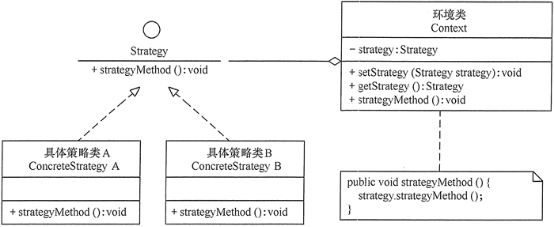
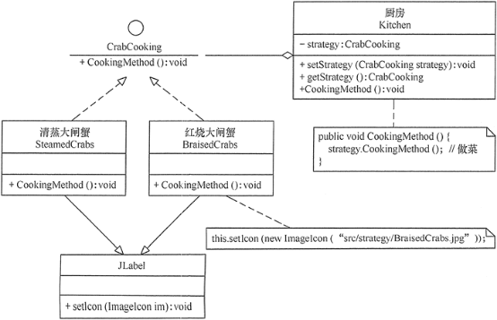
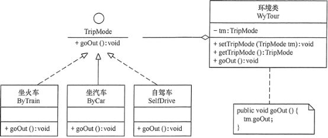
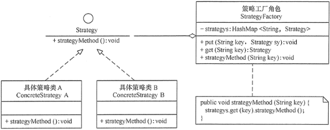

# 23种设计模式与案例-策略模式

---

### 【引言】

在现实生活中常常遇到实现某种目标存在多种策略可供选择的情况，例如，出行旅游可以乘坐飞机、乘坐火车、骑自行车或自己开私家车等，超市促销可以釆用打折、送商品、送积分等方法。

在软件开发中也常常遇到类似的情况，当实现某一个功能存在多种算法或者策略，我们可以根据环境或者条件的不同选择不同的算法或者策略来完成该功能，如数据排序策略有冒泡排序、选择排序、插入排序、二叉树排序等。

如果使用多重条件转移语句实现（即硬编码），不但使条件语句变得很复杂，而且增加、删除或更换算法要修改原代码，不易维护，违背开闭原则。如果采用策略模式就能很好解决该问题。

### 【概念】

定义了一系列算法，并将每个算法封装起来，使它们可以相互替换，且算法的变化不会影响使用算法的客户。策略模式属于对象行为模式，它通过对算法进行封装，把使用算法的责任和算法的实现分割开来，并委派给不同的对象对这些算法进行管理。

主要优点如下：

1、多重条件语句不易维护，而使用策略模式可以避免使用多重条件语句。

2、策略模式提供了一系列的可供重用的算法族，恰当使用继承可以把算法族的公共代码转移到父类里面，从而避免重复的代码。

3、策略模式可以提供相同行为的不同实现，客户可以根据不同时间或空间要求选择不同的。

4、策略模式提供了对开闭原则的完美支持，可以在不修改原代码的情况下，灵活增加新算法。

5、策略模式把算法的使用放到环境类中，而算法的实现移到具体策略类中，实现了二者的分离。

主要缺点如下：

1、客户端必须理解所有策略算法的区别，以便适时选择恰当的算法类。

2、策略模式造成很多的策略类。

### 【结构】

策略模式的主要角色如下：

1、抽象策略（Strategy）类：定义了一个公共接口，各种不同的算法以不同的方式实现这个接口，环境角色使用这个接口调用不同的算法，一般使用接口或抽象类实现。

2、具体策略（Concrete Strategy）类：实现了抽象策略定义的接口，提供具体的算法实现。

3、环境（Context）类：持有一个策略类的引用，最终给客户端调用。

### 【代码】

~~~java
public interface Strategy {

	public void strategyMethod();

}

public class ConcreteStrategyA implements Strategy {

	@Override
	public void strategyMethod() {
		System.out.println("具体策略A的策略方法被访问！");
	}

}

public class ConcreteStrategyB implements Strategy {

	@Override
	public void strategyMethod() {
		System.out.println("具体策略B的策略方法被访问！");
	}

}

public class Context {

	private Strategy strategy;

	public Strategy getStrategy() {
		return strategy;
	}

	public void setStrategy(Strategy strategy) {
		this.strategy = strategy;
	}

	public void strategyMethod() {
		strategy.strategyMethod();
	}

}

public class Test {

	public static void main(String[] args) {
		Context c = new Context();
		Strategy s = new ConcreteStrategyA();
		c.setStrategy(s);
		c.strategyMethod();

		System.out.println("-----------------");

		s = new ConcreteStrategyB();
		c.setStrategy(s);
		c.strategyMethod();
	}

}
~~~

### 【示例】

【例1】策略模式在“大闸蟹”做菜中的应用。

分析：关于大闸蟹的做法有很多种，我们以清蒸大闸蟹和红烧大闸蟹两种方法为例，介绍策略模式的应用。

首先，定义一个大闸蟹加工的抽象策略类（CrabCooking），里面包含了一个做菜的抽象方法 CookingMethod()；然后，定义清蒸大闸蟹（SteamedCrabs）和红烧大闸蟹（BraisedCrabs）的具体策略类，它们实现了抽象策略类中的抽象方法；由于本程序要显示做好的结果图（点此下载要显示的结果图），所以将具体策略类定义成 JLabel 的子类；最后，定义一个厨房（Kitchen）环境类，它具有设置和选择做菜策略的方法；客户类通过厨房类获取做菜策略，并把做菜结果图在窗体中显示出来，图 2 所示是其结构图。

~~~java
package strategy;
import java.awt.*;
import java.awt.event.*;
import javax.swing.*;

public class CrabCookingStrategy implements ItemListener {
    private JFrame f;
    private JRadioButton qz,hs;
    private JPanel CenterJP,SouthJP;
    private Kitchen cf;    //厨房
    private CrabCooking qzx,hsx;    //大闸蟹加工者   
    CrabCookingStrategy() {
        f=new JFrame("策略模式在大闸蟹做菜中的应用");
        f.setBounds(100,100,500,400);
        f.setVisible(true);       
        f.setResizable(false);
        f.setDefaultCloseOperation(JFrame.EXIT_ON_CLOSE);
        SouthJP=new JPanel();
        CenterJP=new JPanel();
        f.add("South",SouthJP);
        f.add("Center",CenterJP);
        qz=new JRadioButton("清蒸大闸蟹");
        hs=new JRadioButton("红烧大闸蟹");
        qz.addItemListener(this);
        hs.addItemListener(this);
        ButtonGroup group=new ButtonGroup();
        group.add(qz);
        group.add(hs);
        SouthJP.add(qz);
        SouthJP.add(hs);
        //---------------------------------
        cf=new Kitchen();    //厨房
        qzx=new SteamedCrabs();    //清蒸大闸蟹类
        hsx=new BraisedCrabs();    //红烧大闸蟹类
    }
    public void itemStateChanged(ItemEvent e) {
        JRadioButton jc=(JRadioButton) e.getSource();
        if(jc==qz) {
            cf.setStrategy(qzx);
            cf.CookingMethod(); //清蒸
        } else if(jc==hs) {
            cf.setStrategy(hsx);
            cf.CookingMethod(); //红烧
        }
        CenterJP.removeAll();
        CenterJP.repaint();
        CenterJP.add((Component)cf.getStrategy());       
        f.setVisible(true);
    }
    public static void main(String[] args) {       
        new CrabCookingStrategy();
    }
}

//抽象策略类：大闸蟹加工类
interface CrabCooking {
    public void CookingMethod();    //做菜方法
}

//具体策略类：清蒸大闸蟹
class SteamedCrabs extends JLabel implements CrabCooking {
    private static final long serialVersionUID=1L;
    public void CookingMethod() {
          this.setIcon(new ImageIcon("src/strategy/SteamedCrabs.jpg"));
          this.setHorizontalAlignment(CENTER);
    }
}

//具体策略类：红烧大闸蟹
class BraisedCrabs extends JLabel implements CrabCooking {
    private static final long serialVersionUID=1L;
    public void CookingMethod() {
        this.setIcon(new ImageIcon("src/strategy/BraisedCrabs.jpg"));
        this.setHorizontalAlignment(CENTER);
    }
}

//环境类：厨房
class Kitchen {
    private CrabCooking strategy;    //抽象策略
    public void setStrategy(CrabCooking strategy) {
        this.strategy=strategy;
    }
    public CrabCooking getStrategy() {
        return strategy;
    }
    public void CookingMethod() {
        strategy.CookingMethod();    //做菜   
    }
}
~~~

【例2】用策略模式实现从韶关去婺源旅游的出行方式。

分析：从韶关去婺源旅游有以下几种出行方式：坐火车、坐汽车和自驾车，所以该实例用策略模式比较适合，图 4 所示是其结构图。

### 【应用场景】

策略模式在很多地方用到，如 Java SE 中的容器布局管理就是一个典型的实例，Java SE 中的每个容器都存在多种布局供用户选择。在程序设计中，通常在以下几种情况中使用策略模式较多。

1、一个系统需要动态地在几种算法中选择一种时，可将每个算法封装到策略类中。

2、一个类定义了多种行为，并且这些行为在这个类的操作中以多个条件语句的形式出现，可将每个条件分支移入它们各自的策略类中以代替这些条件语句。

3、系统中各算法彼此完全独立，且要求对客户隐藏具体算法的实现细节时。

4、系统要求使用算法的客户不应该知道其操作的数据时，可使用策略模式来隐藏与算法相关的数据结构。

5、多个类只区别在表现行为不同，可以使用策略模式，在运行时动态选择具体要执行的行为。

### 【扩展】

在一个使用策略模式的系统中，当存在的策略很多时，客户端管理所有策略算法将变得很复杂，如果在环境类中使用策略工厂模式来管理这些策略类将大大减少客户端的工作复杂度，其结构图如图 5 所示。

   

---

