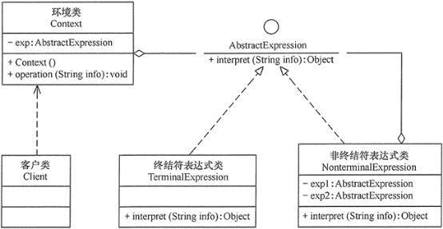
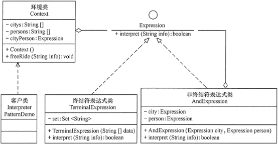

# 23种设计模式与案例-解析器模式

---

### 【引言】

在软件开发中，会遇到有些问题多次重复出现，而且有一定的相似性和规律性。如果将它们归纳成一种简单的语言，那么这些问题实例将是该语言的一些句子，这样就可以用“编译原理”中的解释器模式来实现了。

虽然使用解释器模式的实例不是很多，但对于满足以上特点，且对运行效率要求不是很高的应用实例，如果用解释器模式来实现，其效果是非常好的，本文将介绍其工作原理与使用方法。

### 【概念】

给分析对象定义一个语言，并定义该语言的文法表示，再设计一个解析器来解释语言中的句子（给定一种语言，定义它的文法表示，并定义一个解释器，该解释器用来根据文法表示来解释语言中的句子）。也就是说，用编译语言的方式来分析应用中的实例。这种模式实现了文法表达式处理的接口，该接口解释一个特定的上下文。

这里提到的文法和句子的概念同编译原理中的描述相同，“文法”指语言的语法规则，而“句子”是语言集中的元素。例如，汉语中的句子有很多，“我是中国人”是其中的一个句子，可以用一棵语法树来直观地描述语言中的句子。

解释器模式是一种类行为型模式，其主要优点如下：

1、扩展性好。由于在解释器模式中使用类来表示语言的文法规则，因此可以通过继承等机制来改变或扩展文法。

2、容易实现。在语法树中的每个表达式节点类都是相似的，所以实现其文法较为容易。

解释器模式的主要缺点如下：

1、执行效率较低。解释器模式中通常使用大量的循环和递归调用，当要解释的句子较复杂时，其运行速度很慢，且代码的调试过程也比较麻烦。

2、会引起类膨胀。解释器模式中的每条规则至少需要定义一个类，当包含的文法规则很多时，类的个数将急剧增加，导致系统难以管理与维护。

3、可应用的场景比较少。在软件开发中，需要定义语言文法的应用实例非常少，所以这种模式很少被使用到。

### 【结构】

解释器模式包含以下主要角色：

1、抽象表达式（Abstract Expression）角色：定义解释器的接口，约定解释器的解释操作，主要包含解释方法 interpret()。

2、终结符表达式（Terminal Expression）角色：是抽象表达式的子类，用来实现文法中与终结符相关的操作，文法中的每一个终结符都有一个具体终结表达式与之相对应。

3、非终结符表达式（Nonterminal Expression）角色：也是抽象表达式的子类，用来实现文法中与非终结符相关的操作，文法中的每条规则都对应于一个非终结符表达式。

4、环境（Context）角色：通常包含各个解释器需要的数据或是公共的功能，一般用来传递被所有解释器共享的数据，后面的解释器可以从这里获取这些值。

5、客户端（Client）：主要任务是将需要分析的句子或表达式转换成使用解释器对象描述的抽象语法树，然后调用解释器的解释方法，当然也可以通过环境角色间接访问解释器的解释方法。

### 【代码】

~~~java
public interface AbstractExpression {

	public Object interpret(String info);

}

public class TerminalExpression implements AbstractExpression {

	@Override
	public Object interpret(String info) {
		// TODO Auto-generated method stub
		return null;
	}

}

public class NonterminalExpression implements AbstractExpression {

	private AbstractExpression exp1;

	private AbstractExpression exp2;

	@Override
	public Object interpret(String info) {
		// TODO Auto-generated method stub
		return null;
	}

}

public class Context {

	private AbstractExpression exp;

	public Context() {
		// 数据初始化
	}

	public void operation(String info) {
		// 调用相关表达式类的解释方法
	}

}
~~~

### 【示例】

【例1】用解释器模式设计一个“韶粵通”公交车卡的读卡器程序。

说明：假如“韶粵通”公交车读卡器可以判断乘客的身份，如果是“韶关”或者“广州”的“老人” “妇女”“儿童”就可以免费乘车，其他人员乘车一次扣 2 元。

分析：本实例用“解释器模式”设计比较适合，首先设计其文法规则如下。

~~~plaintext
<expression> ::= <city>的<person>
<city> ::= 韶关|广州
<person> ::= 老人|妇女|儿童
~~~

然后，根据文法规则按以下步骤设计公交车卡的读卡器程序的类图。

1、定义一个抽象表达式（Expression）接口，它包含了解释方法 interpret(String    info)。

2、定义一个终结符表达式（Terminal Expression）类，它用集合（Set）类来保存满足条件的城市或人，并实现抽象表达式接口中的解释方法 interpret(Stringinfo)，用来判断被分析的字符串是否是集合中的终结符。

3、定义一个非终结符表达式（AndExpressicm）类，它也是抽象表达式的子类，它包含满足条件的城市的终结符表达式对象和满足条件的人员的终结符表达式对象，并实现 interpret(String info) 方法，用来判断被分析的字符串是否是满足条件的城市中的满足条件的人员。

4、最后，定义一个环境（Context）类，它包含解释器需要的数据，完成对终结符表达式的初始化，并定义一个方法 freeRide(String info) 调用表达式对象的解释方法来对被分析的字符串进行解释。其结构图如图 3 所示。

~~~java
package interpreterPattern;
import java.util.*;
/*文法规则
  <expression> ::= <city>的<person>
  <city> ::= 韶关|广州
  <person> ::= 老人|妇女|儿童
*/
public class InterpreterPatternDemo {
    public static void main(String[] args) {
        Context bus=new Context();
        bus.freeRide("韶关的老人");
        bus.freeRide("韶关的年轻人");
        bus.freeRide("广州的妇女");
        bus.freeRide("广州的儿童");
        bus.freeRide("山东的儿童");
    }
}

//抽象表达式类
interface Expression {
    public boolean interpret(String info);
}

//终结符表达式类
class TerminalExpression implements Expression {
    private Set<String> set= new HashSet<String>();
    public TerminalExpression(String[] data) {
        for(int i=0;i<data.length;i++)set.add(data[i]);
    }
    public boolean interpret(String info) {
        if(set.contains(info)) {
            return true;
        }
        return false;
    }
}

//非终结符表达式类
class AndExpression implements Expression {
    private Expression city=null;    
    private Expression person=null;
    public AndExpression(Expression city,Expression person) {
        this.city=city;
        this.person=person;
    }
    public boolean interpret(String info) {
        String s[]=info.split("的");       
        return city.interpret(s[0])&&person.interpret(s[1]);
    }
}

//环境类
class Context {
    private String[] citys={"韶关","广州"};
    private String[] persons={"老人","妇女","儿童"};
    private Expression cityPerson;
    public Context() {
        Expression city=new TerminalExpression(citys);
        Expression person=new TerminalExpression(persons);
        cityPerson=new AndExpression(city,person);
    }
    public void freeRide(String info) {
        boolean ok=cityPerson.interpret(info);
        if(ok) System.out.println("您是"+info+"，您本次乘车免费！");
        else System.out.println(info+"，您不是免费人员，本次乘车扣费2元！");   
    }
}
~~~

### 【应用场景】

前面介绍了解释器模式的结构与特点，下面分析它的应用场景。

1、当语言的文法较为简单，且执行效率不是关键问题时。

2、当问题重复出现，且可以用一种简单的语言来进行表达时。

3、当一个语言需要解释执行，并且语言中的句子可以表示为一个抽象语法树的时候，如 XML 文档解释。

注意：解释器模式在实际的软件开发中使用比较少，因为它会引起效率、性能以及维护等问题。如果碰到对表达式的解释，在 Java 中可以用 Expression4J 或 Jep 等来设计。

### 【扩展】

在项目开发中，如果要对数据表达式进行分析与计算，无须再用解释器模式进行设计了，Java 提供了以下强大的数学公式解析器：Expression4J、MESP(Math Expression String Parser) 和 Jep 等，它们可以解释一些复杂的文法，功能强大，使用简单。

现在以 Jep 为例来介绍该工具包的使用方法。Jep 是 Java expression parser 的简称，即 Java 表达式分析器，它是一个用来转换和计算数学表达式的 Java 库。通过这个程序库，用户可以以字符串的形式输入一个任意的公式，然后快速地计算出其结果。而且 Jep 支持用户自定义变量、常量和函数，它包括许多常用的数学函数和常量。

使用前先下载 Jep 压缩包，解压后，将 jep-x.x.x.jar 文件移到选择的目录中，在 Eclipse 的“Java 构建路径”对话框的“库”选项卡中选择“添加外部 JAR(X)...”，将该 Jep 包添加项目中后即可使用其中的类库。

下面以计算存款利息为例来介绍。存款利息的计算公式是：本金x利率x时间=利息，其相关代码如下：

~~~java
package interpreterPattern;
import com.singularsys.jep.*;
public class JepDemo {
    public static void main(String[] args) throws JepException {
        Jep jep=new Jep();
        //定义要计算的数据表达式
        String 存款利息="本金*利率*时间";
        //给相关变量赋值
        jep.addVariable("本金",10000);
        jep.addVariable("利率",0.038);
        jep.addVariable("时间",2);
        jep.parse(存款利息);    //解析表达式
        Object accrual=jep.evaluate();    //计算
        System.out.println("存款利息："+accrual);
    }
}
~~~

   

---

