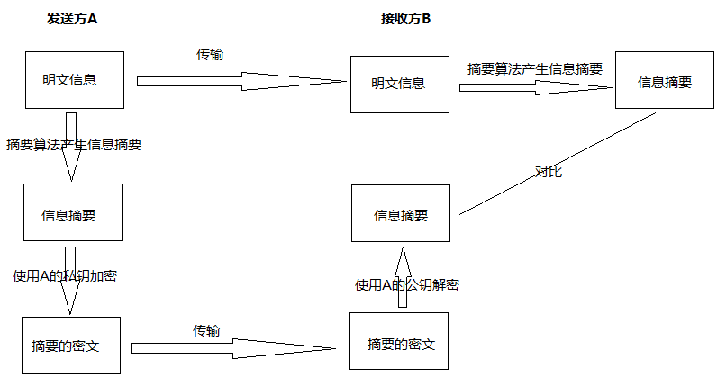
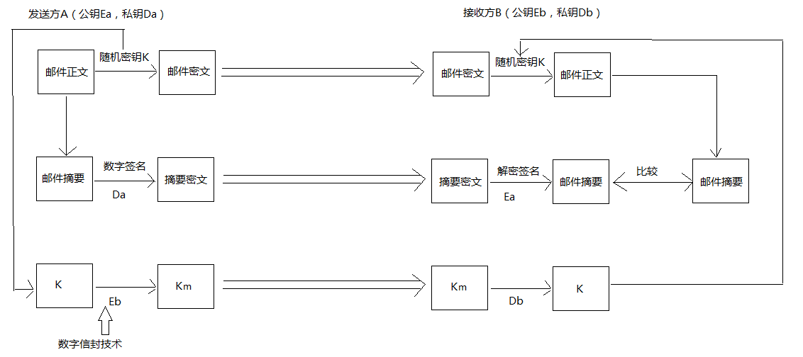

# 加密算法初识

---

### 对称加密

1、常见对称加密算法

* DES：替换+移位，56位密钥，64位数据块，速度快，密钥易产生；
* 3DES：3重DES，两个56位的密钥K1、K2，加密过程：K1加密->K2解密->K1加密；解密过程：K1解密->K2加密->K1解密；
* AES：高级加密标准RijnDael加密法，是美国联邦政府采用的一种区块加密标准。这个标准用来替代原先的DES，对其要求是“至少与3DES一样安全”；
* RC-5：RSA数据安全公司的很多产品都使用了RC-5；
* IDEA：128位密钥，64位数据块，比DES的加密性好，对计算机功能要求相对低。

2、缺陷

* 加密强度不高；
* 密钥分发困难；

### 非对称加密

1、常见非对称加密算法

* RSA：512位（或1024位）密钥，计算量极大，难破解；
* Elgamal：其基础是Diffie-Hellman密钥交换算法；
* ECC：椭圆曲线算法；
* 背包算法、Rabin、D-H；

2、缺陷

* 加密速度慢；

### 信息摘要

信息摘要主要是用于保证信息的完整性。使用单向散列函数，得到固定长度的散列值。

常用的信息摘要算法有MD5、SHA等，市场上广泛使用的MD5、SHA算法的散列值分别为128位、160位。由于SHA通常采用的密钥长度较长，因此安全性高于MD5。

### 数字签名

### 数字信封

* 发送方将原文用对称密钥加密传输（考虑到加密大数据量的效率），而将对称密钥用接收方公钥加密发送给对方；
* 接收方收到电子信封，用自己的私钥解密信封，取出对称密钥解密得到原文。

### 实例：设计邮件加密系统

要求：邮件以加密方式传输，邮件最大附件内容可达500MB，发送者不可抵赖，若邮件被第三方截获，第三方无法篡改。

分析：

* 邮件要求以加密方式传输，说明要使用加密解密技术；
* 邮件内容达到500MB，说明要加密的数据量较大；考虑到非对称加密算法的加密速度较慢，不适用于大数据量的数据加密，因此对邮件正文使用对称加密算法进行加密；
* 要求发送者不可抵赖，说明要使用数字签名技术；
* 要求第三方无法篡改，使用信息摘要技术；

根据以上分析，设计如下：

   

---

