# JVM基础知识汇总

---

### 运行时数据区域

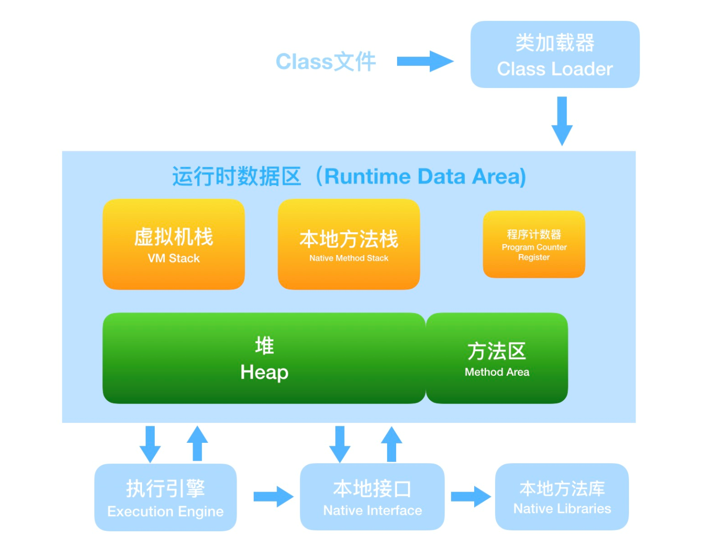

1、堆

在Java虚拟机中，堆(heap)是可供各个线程共享的运行时内存区域，也是供所有类实例和数组对象分配内存的区域。

Java堆在虚拟机启动的时候就被创建，它存储了GC(垃圾收集器)所管理的各种对象，受管理的对象无需也无法显式地销毁。

Java堆的容量可以是固定的，也可以随着程序执行的需求动态扩展，并在不需要过多空间时自动回收。Java堆所使用的内存不需要保证是连续的。

2、栈

描述的是Java方法执行的内存模型，每个方法被执行的时候都会同时创建一个栈帧用于存储局部变量表、操作栈、动态链接、方法出口等信息。每一个方法被调用直至执行完成的过程，就对应着一个栈帧在虚拟机栈中从入栈到出栈的过程。每一条Java虚拟机线程都有自己私有的Java虚拟机栈(Java Virtual Machine stack)，这个栈与线程同时创建，用于存储栈帧（Frame）。

Java虚拟机栈用于存储局部变量与一些尚未算好的结果。另外，它在方法调用和返回中也扮演了很重要的角色。因为除了栈帧的出栈和入栈之外，Java虚拟机栈不会再受其他因素的影响，所以栈帧可以在栈中分配，Java虚拟机栈所使用的内存不需要保证是连续的。

Java虚拟机规范既允许Java虚拟机栈被实现成固定大小，也允许根据计算动态来扩展和收缩。如果采用固定大小的Java虚拟机栈，那每一个线程的Java虚拟机栈容量可以在线程创建的时候独立选定。

3、方法区

用于存储已被虚拟机加载的类信息、常量、静态变量、即时编译器编译后的代码等数据。

在Java虚拟机中，方法区(method area)是可供各个线程共享的运行时内存区域。它存储了每一个类的结构信息，例如，运行时常量池( runtime constant pool)、字段和方法数据、构造函数和普通方法的字节码内容，还包括一些在类、实例、接口初始化时用到的特殊方法。

方法区在虚拟机启动的时候创建，虽然方法区是堆的逻辑组成部分，但是简单的虚拟机实现可以选择在这个区域不实现垃圾收集与压缩。方法区在实际内存空间中可以是不连续的。

4、本地方法栈

与虚拟机栈所发挥的作用非常相似，是为虚拟机使用到的native方法服务的。Java虚拟机实现可能会使用到传统的栈(通常称为C stack)来支持native方法（指使用Java以外的其他语言编写的方法）的执行，这个栈就是本地方法栈(native method stack)。

5、程序计数器

是一块较小的内存空间，它的作用可以看作是当前线程所执行的字节码的行号指示器。

Java虚拟机可以支持多条线程同时执行，每一条Java虚拟机线程都有自己的pc(program counter)寄存器。在任意时刻，一条Java虚拟机线程只会执行一个方法的代码，这个正在被线程执行的方法称为该线程的当前方法（current method）。如果这个方法不是native的，那pc寄存器就保存Java虚拟机正在执行的字节码指令的地址；如果该方法是native的，那pc寄存器的值是undefined。

6、运行时常量池

是方法区的一部分，用于存放编译期生成的各种字面量和符号引用。

运行时常量池( runtime constant pool)是class文件中每一个类或接口的常量池表（constant_pool table）的运行时表示形式，它包括了若干种不同的常量。

每一个运行时常量池都在Java虚拟机的方法区中分配，在加载类和接口到虚拟机后，就创建对应的运行时常量池。

> 运行时常量池的所处区域一直在不断的变化，在Java 6时它是方法区的一部分，Java 7又把它放到了堆内存中，Java 8之后出现了元空间，它又回到了方法区。

7、直接内存

NIO引入了一种基于通道（Channel）与缓冲区（Buffer）的I/O方式，它可以使用native函数库直接分配堆外内存，然后通过一个存储在Java堆里面的DirectByteBuffer对象作为这块内存的引用进行操作。

总结：

|          | 堆               | 栈                                   | 方法区           | 本地方法栈                           | 程序计数器 |
| -------- | ---------------- | ------------------------------------ | ---------------- | ------------------------------------ | ---------- |
| 线程私有 | 否               | 是                                   | 否               | 是                                   | 是         |
| 抛出异常 | OutOfMemoryError | OutOfMemoryError、StackOverflowError | OutOfMemoryError | OutOfMemoryError、StackOverflowError | 无         |

### 分代内存管理

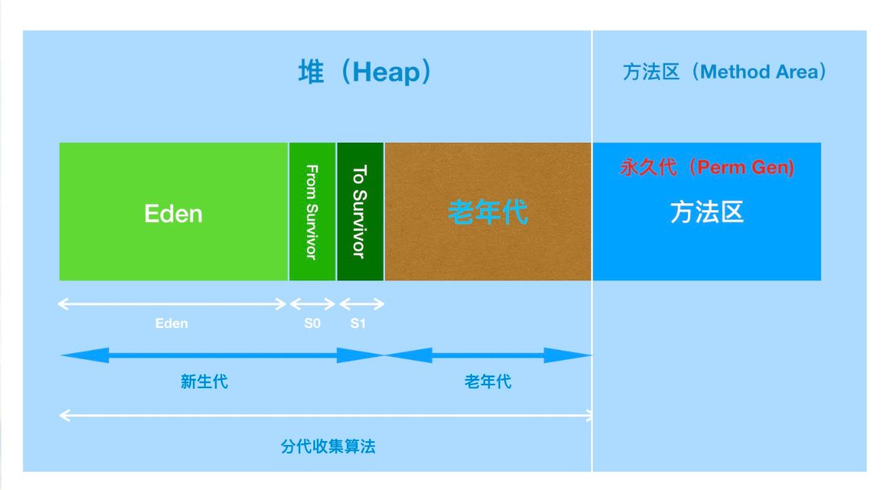

对于习惯了在 HotSpot 虚拟机上开发、部署的程序员来说，很多人都愿意将方法区称作永久代。本质上来讲两者并不等价，仅因为 Hotspot 将 GC 分代扩展至方法区，或者说使用永久代来实现方法区。在其它虚拟机上是没有永久代的概念的。也就是说方法区是规范，永久代是 Hotspot 针对该规范进行的实现。

再重复一遍就是对 Java7 及以前版本的 Hotspot 中方法区位于永久代中。同时，永久代和堆是相互隔离的，但它们使用的物理内存是连续的。永久代的垃圾收集是和老年代捆绑在一起的，因此无论谁满了，都会触发永久代和老年代的垃圾收集。

但在 Java7 中永久代中存储的部分数据已经开始转移到 Java Heap 或 Native Memory 中了。比如，符号引用 (Symbols) 转移到了 Native Memory；字符串常量池 (interned strings) 转移到了 Java Heap；类的静态变量 (class statics) 转移到了 Java Heap。

在 Java8 中，Hotspot 取消了永久代。

### Java 8 内存结构变化

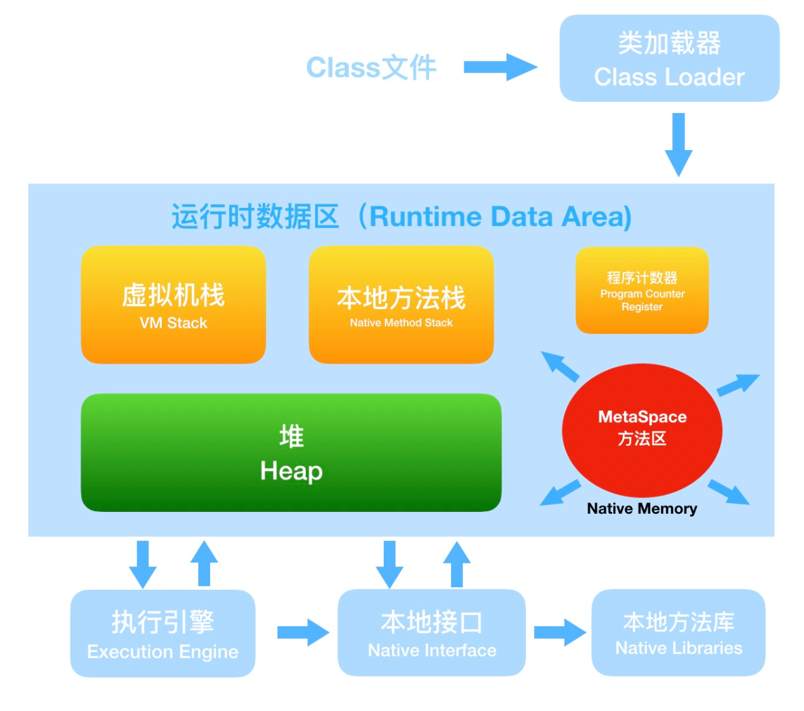

对于Java 8，HotSpots 虚拟机取消了永久代，那么是不是就没有方法区了呢？当然不是，方法区只是一个规范，只不过它的实现变了。

在Java 8 中，元空间 (Metaspace) 登上舞台，方法区存在于元空间(Metaspace)。同时，元空间不再与堆连续，而且是存在于本地内存（Native memory）。

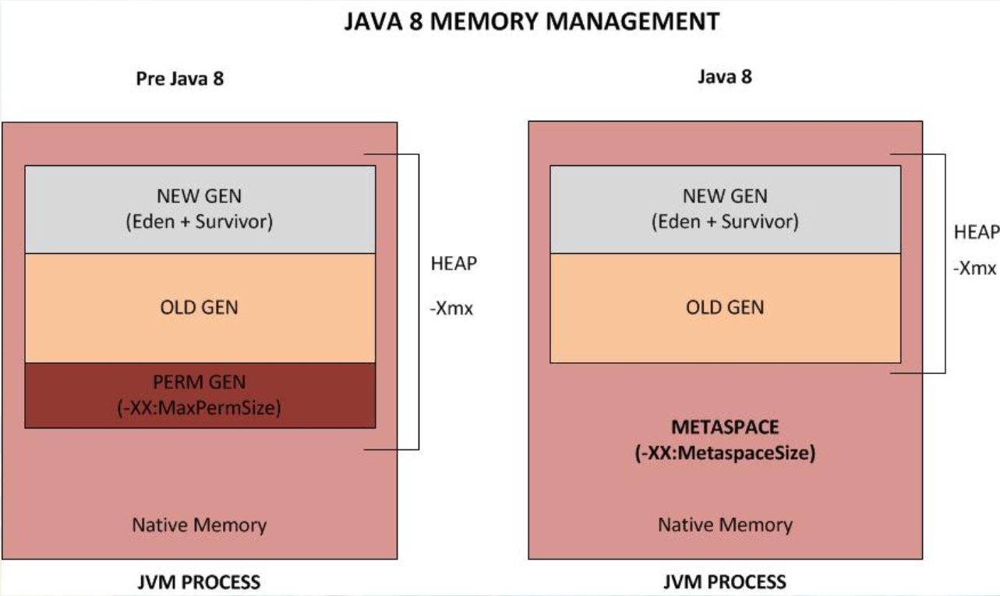

本地内存（Native memory），也称为 C-Heap，是供 JVM 自身进程使用的。当 Java Heap 空间不足时会触发 GC，但 Native memory 空间不够却不会触发 GC。元空间存在于本地内存，意味着只要本地内存足够，它不会出现像永久代中 “java.lang.OutOfMemoryError: PermGen space” 这种错误。

为什么使用元空间替换永久代？

表面上看是为了避免 OOM 异常。因为通常使用 PermSize 和 MaxPermSize 设置永久代的大小就决定了永久代的上限，但是不是总能知道应该设置为多大合适，如果使用默认值很容易遇到 OOM 错误。当使用元空间时，可以加载多少类的元数据就不再由 MaxPermSize 控制，而由系统的实际可用空间来控制。

更深层的原因还是要合并 HotSpot 和 JRockit 的代码，JRockit 从来没有所谓的永久代，也不需要开发运维人员设置永久代的大小，但是运行良好。同时也不用担心运行性能问题了，在覆盖到的测试中，程序启动和运行速度降低不超过 1%，但是这点性能损失换来了更大的安全保障。

### 常见内存溢出问题

* 堆内存溢出：创建对象达到堆的最大容量限制。
* 虚拟机栈和本地方法栈溢出：如果线程请求的栈深度大于虚拟机允许的最大深度，则抛出StackOverflowError；如果虚拟机在扩展栈时无法申请到足够的内存空间，则抛出OutOfMemoryError。
* 方法区溢出：运行时产生大量的类填满方法区（如Spring和Hibernate对类进行增强时，都会使用到CGLib这类字节码技术，增强的类越多，就需要越大的方法区来保证动态生成的Class可以加载入内存）。
* 运行时常量池溢出：
* 直接内存溢出：

### 对象访问

~~~java
Object obj = new Object();
~~~

“Object obj”这部分的语义将会反映到Java栈的本地变量表中，作为一个reference类型数据展现。而“new Object()”这部分语义将会反映到堆中，形成一块存储了Object类型所有实例数据值（Instance Data，对象中各个实例字段的数据）的结构化内存。另外，在Java堆中还必须包含能查找的此对象类型数据（如对象类型、父类、实现的接口、方法等）的地址信息，这些类型数据则存储在方法区中。

主流的对象访问方式有：

* 使用句柄访问：Java堆中将会划分出一块内存来作为句柄池，reference存储的就是对象的句柄地址，而句柄中包含了对象实例数据和类型数据各自的地址信息。

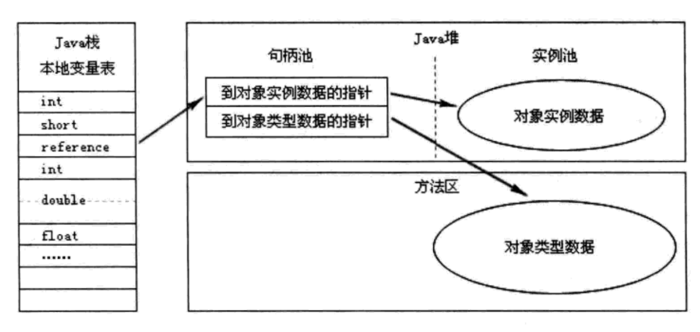

优点：reference中存储的是稳定的句柄地址，在对象被移动时只会改变句柄中的实例数据指针，而reference本身不需要被修改。

* 使用直接指针访问：Java堆对象的布局中就必须考虑如何放置访问类型数据的相关信息，reference中直接存储的就是对象地址。

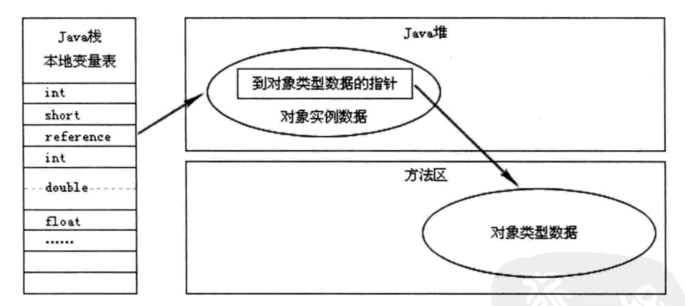

优点：速度更快，它节省了一次指针定位的时间开销。

> Sun HotSpot虚拟机使用第二种方式进行对象访问。

### 引用类型

* 强引用：Strong Reference，在程序代码中普遍存在的，类似“Object obj = new Object();”这类的引用；只要强引用还存在，垃圾收集器永远不会回收掉被引用的对象。
* 软引用：Soft Reference，用来描述一些还有用，但并非必须的对象；对于软引用关联着的对象，在系统将要发生内存溢出异常之前，将会把这些对象列进回收范围之中并进行第二次回收；如果这次回收还是没有足够的内存，才会抛出内存溢出异常。
* 弱引用：Weak Reference，也是用来描述非必须对象的，但是它的强度比软引用还要弱些；被弱引用关联的对象只能生存到下一次垃圾收集发生之前，当垃圾收集器工作时，无论当前内存是否足够，都会回收掉只被弱引用关联的对象。
* 虚引用：Phantom Reference，也称为幽灵引用或幻影引用；一个对象是否有虚引用存在，完全不会对其生存时间构成影响，也无法通过虚引用来取得一个对象实例；为一个对象设置虚引用关联的唯一目的就是希望能在这个对象被垃圾收集器回收时收到一个系统通知。

### 判断对象存活的方法

1、引用计数法

给对象中添加一个引用计数器，每当有一个地方引用它时，计数器值加1；当引用失效时，计数器值就减1；任何时刻计数器值都为0的对象就是不可能再被使用的。

缺陷：循环引用问题

~~~java
class Demo {
    public Object ref;
}

class Test {
    public static void main(String[] args) {
        Demo a = new Demo();
        Demo b = new Demo();
        a.ref = b;
        b.ref = a;
        a = null;
        b = null;
    }
}
~~~

两个对象没有任何引用，实际上这两个对象已经不可能再被访问，但是它们因为互相引用着对方，导致它们的引用计数都不为0，于是引用计数算法无法通知GC收集器回收它们。

2、根搜索算法

通过一系列名为“GC Root”的对象作为起始点，从这些节点开始向下搜索，搜索所走过的路径称为引用链；当一个对象到GC Root没有任何引用链相连（用图论的话来说就是从GC Root到这个对象不可达）时，则证明此对象是不可用的。

可成为GC Root的对象包括：

* 虚拟机栈（栈帧中的本地变量表）中引用的对象
* 方法区中的类静态属性引用的对象
* 方法区中的常量引用的对象
* 本地方法栈中JNI（即native方法）的引用的对象

### 垃圾收集算法

1、标记清除算法（Mark-Sweep）

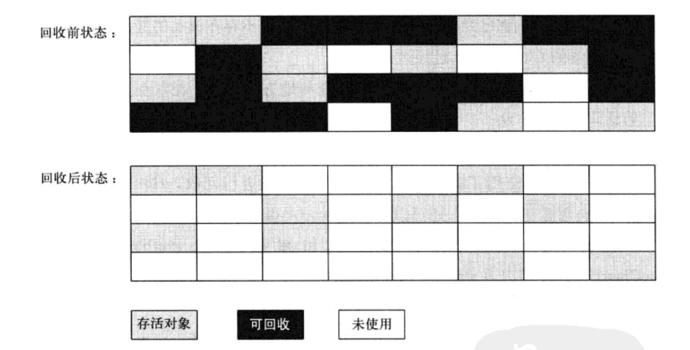

算法分为标记（Mark）和清除（Sweep）两个阶段：首先标记出所有需要回收的对象，在标记完成后统一回收掉所有被标记的对象。

缺点：

* 标记和清除过程的效率都不高
* 标记清除之后会产生大量不连续的内存碎片

2、标记整理算法（Mark-Compact）

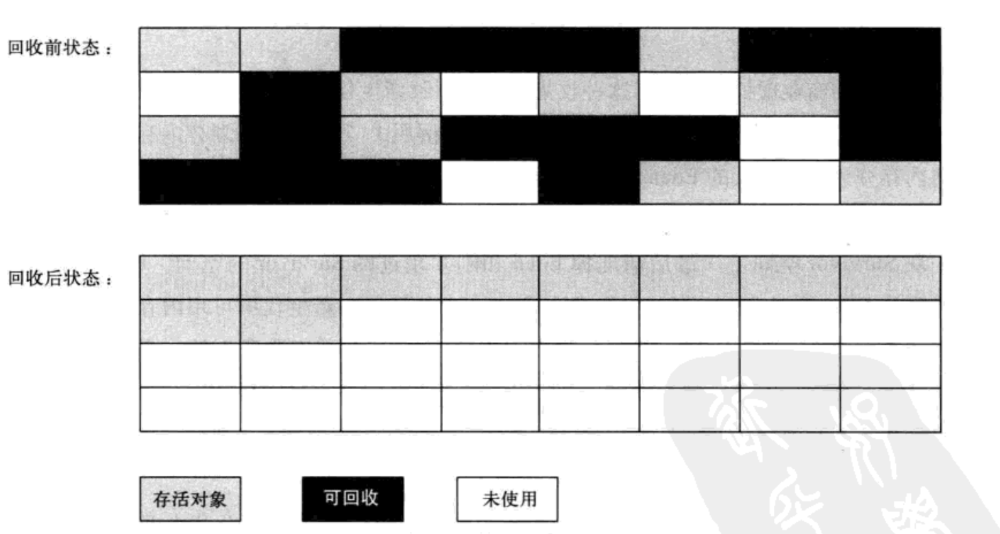

过程与标记清除算法一样，但后续步骤不是直接对可回收对象进行清理，而是让所有存活的对象都向一端移动，然后直接清理掉端边界以外的内存。

3、复制算法（Copy）

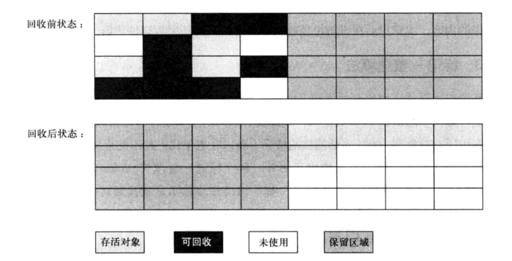

将可用内存按容量划分为大小相等的两块，每次只使用其中的一块；当这一块的内存用完了，就将还存活着的对象复制到另外一块上面去，然后再把已使用过的内存空间一次清理掉。

例如，将内存划分为一块较大的Eden空间和两块较小的Survivor空间，每次使用Eden和其中的一块Survivor空间。回收时，将Eden和Survivor中还存活着的对象一次性地拷贝到另外一块Survivor空间上，最后清理掉Eden和刚才使用过的Survivor空间。HotSpot默认Eden和Survivor的大小比例是8:1。

优点：

* 实现简单，运行高效；
* 每次只对其中的一块内存进行回收
* 不产生内存碎片

缺点：

* 可用内存缩小为原来的一半，内存利用率低

4、分代收集算法（Generation Collection）

根据对象存活周期的不同将内存划分为几块，一般是把Java堆划分为新生代和老年代，这样就可以根据各个年代的特点采用最适当的收集算法。如新生代使用复制算法，老年代使用标记清除算法或标记整理算法。

### 垃圾收集器

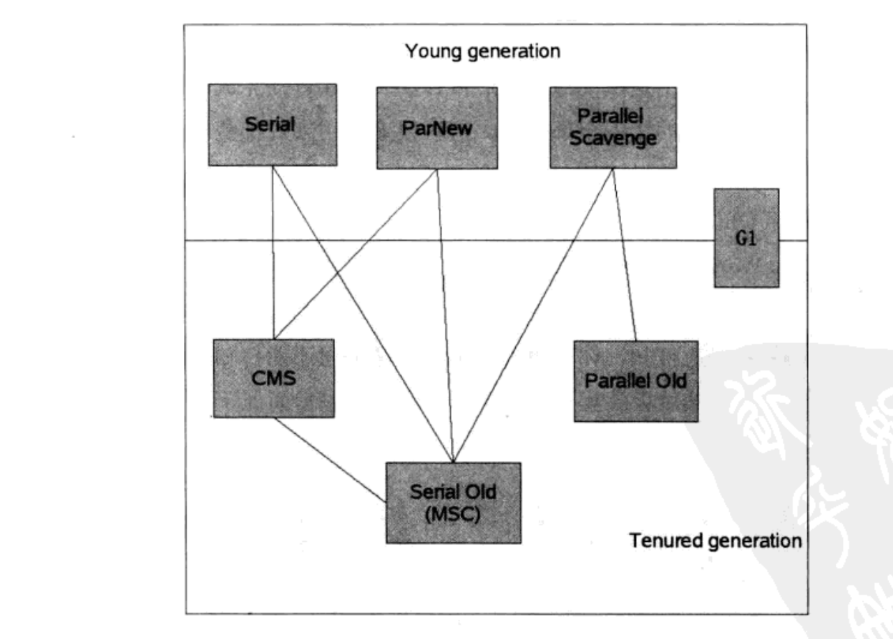

> 注：如图两个收集器之间如果存在连线，说明它们可以搭配使用。

* Serial收集器
* ParNew收集器
* Parallel Scavenge收集器
* Serial Old收集器
* Parallel Old收集器
* CMS收集器（Concurrent Mark Sweep）
* G1收集器（Garbage First）

|      | Serial   | ParNew   | Parallel Scavenge | Serial Old | Parallel Old | CMS      | G1             |
| ---- | -------- | -------- | ----------------- | ---------- | ------------ | -------- | -------------- |
| 线程 | 单线程   | 多线程   | 多线程            | 单线程     | 多线程       | 多线程   | 多线程         |
| 算法 | 复制算法 | 复制算法 | 复制算法          | 标记整理   | 标记整理     | 标记清除 | 标记整理       |
| 区域 | 新生代   | 新生代   | 新生代            | 老年代     | 老年代       | 老年代   | 新生代、老年代 |

垃圾收集器相关参数配置：

| 参数                   | 描述                                                         |
| ---------------------- | ------------------------------------------------------------ |
| UseSerialGC            | 虚拟机运行在Client模式下的默认值，使用Serial + Serial Old组合 |
| UseParNewGC            | 使用ParNew + Serial Old组合                                  |
| UseConcMarkSweepGC     | 使用ParNew + CMS + Serial Old组合（CMS出现Concurrent Mode Failure失败后，Serial Old作为后备使用） |
| UseParallelGC          | 虚拟机运行在Server模式下的默认值，使用Parallel Scavenge + Serial Old（PS Mark Sweep）组合 |
| UseParallelOldGC       | 使用Parallel Scavenge + Parallel Old组合                     |
| SurvivorRatio          | 新生代中Eden与Survivor容量的比值，默认为8                    |
| PretenureSizeThreshold | 直接晋升到老年代的对象大小，大于该值的对象将直接在老年代分配 |
| MaxTenuringThreshold   | 晋升到老年代的对象年龄，每个对象在坚持过一次MinorGC后，年龄就加1，当超过这个参数值时就进入老年代 |
| UseAdaptiveSizePolicy  | 动态调整Java堆中各个区域的大小以及进入老年代的年龄           |
| HandlePromotionFailure | 是否允许分配担保失败，即老年代的剩余空间不足以应付新生代的整个Eden和Survivor区的所有对象都存活的极端情况 |
| ParallelGCThreads      | 设置并行GC时进行内存回收的线程数                             |
| GCTimeRatio            | GC时间占总时间的比率，默认值为99，即允许1%的GC时间（仅在Parallel Scavenge生效） |
| MaxGCPauseMillis       | 设置GC最大停顿时间（仅在Parallel Scavenge生效）              |

### 内存分配与回收策略

* 对象优先在Eden分配
* 大对象直接进入老年代
* 长期存活的对象将进入老年代
* 动态对象年龄判定：如果在Survivor空间中相同年龄所有对象大小的总和大于Survivor空间的一半，年龄大于或等于该年龄的对象就可以直接进入老年代。
* 空间分配担保：当出现大量对象在Minor GC后仍然存活的情况时（最极端就是内存回收后新生代中所有对象都存活），就需要老年代进行分配担保，让Survivor无法容纳的对象直接进入老年代。

### 性能监控与故障处理工具

* jps：JVM Process Status Tool，显示指定系统内所有的HotSpot虚拟机进程；
* jstat：JVM Statistics Monitoring Tool，用于收集HotSpot虚拟机各方面的统计数据；
* jinfo：Configuration Info for Java，显示虚拟机配置信息；
* jmap：Memory Map for Java，生成虚拟机的内存转储快照；
* jhat：JVM Heap Analysis Tool，用于分析heapdump文件，它会建立一个HTTP/HTML服务器，让用户可以在浏览器上查看分析结果；
* jstack：Stack Trace for Java，显示虚拟机的线程快照；
* JConsole：
* VisualVM：

### 类加载机制

1、类加载过程

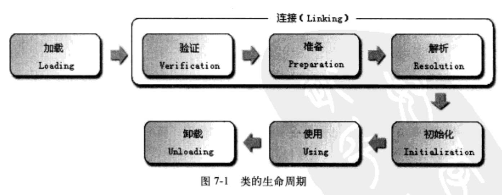

类从被加载到虚拟机内存中开始，到卸载出内存为止，它的整个生命周期包括：

* 加载（Loading）
* 验证（Verification）
* 准备（Preparation）
* 解析（Resolution）
* 初始化（Initialization）
* 使用（Using）
* 卸载（Unloading）

其中，验证、准备和解析三个部分统称为链接（Linking）。

2、类加载器的双亲委派模型

站在Java虚拟机的角度讲，只存在两种不同的类加载器：一种是启动类加载器（Bootstrap ClassLoader），该类加载器使用C++语言实现，是虚拟机自身的一部分；另外一种就是所有其它的类加载器，这些加载器都由Java语言实现，独立于虚拟机外部，且全都继承自java.lang.ClassLoader。

从开发人员的角度看，类加载器可分为三种：

* 启动类加载器（Bootstrap ClassLoader）：负责加载%JAVA_HOME%/lib目录中的，或者-Xbootclasspath参数所指定路径中的类库（如rt.jar）。
* 扩展类加载器（Extension ClassLoader）：由sun.misc.Launcher$ExtClassLoader实现，负责加载%JAVA_HOME%/lib/ext目录中的，或者java.ext.dirs系统变量所指定的路径中的所有类库。
* 系统类加载器（Application ClassLoader）：由sun.misc.Launcher$AppClassLoader实现，负责加载用户类路径下的所指定的类库。

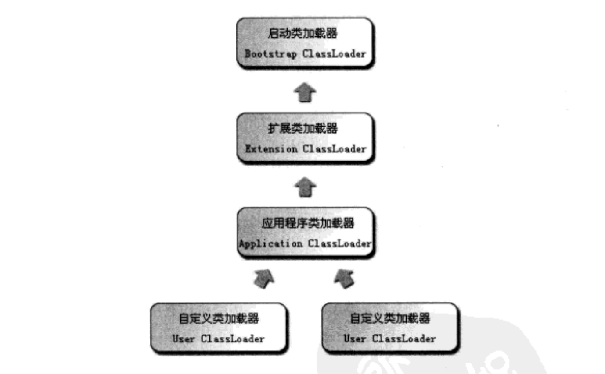

双亲委派模型要求除了顶层的启动类加载器外，其余的类加载器都应该有自己的父类加载器。这里的父子关系一般不会以继承的方式来实现，而是通过使用组合关系来复用父加载器的代码。

双亲委派模型的工作过程：如果一个类加载器收到了类加载的请求，它首先不会自己去尝试加载这个类，而是把这个请求委派给父类加载器去完成，每一个层次的类加载器都是如此，因此所有的类加载请求最终都应该传送到顶层的启动类加载器中，只有当父加载器反馈自己无法完成这个加载请求（它的搜索范围中没有找到所需的类）时，子加载器才会尝试自己去加载。

好处：Java类随着它的类加载器一起具备了一种带有优先级的层级关系。例如java.lang.Object，它存放在rt.jar中，无论哪一个类加载器要加载这个类，最终都是委派给启动类加载器进行加载，因此Object类在程序的各种类加载器环境中都是同一个类。相反，如果没有使用双亲委派模型，由各个类加载器自行去加载的话，如果用户自己写了一个名为java.lang.Object的类，并放在程序的classpath中，那系统中将会出现多个不同的Object类，Java类型体系中最基础的行为也就无从保障，应用程序也将会变得一片混乱。

### 常用JVM参数

~~~plaintext
# 栈大小
-Xss128k

# 方法区初始值
-XX:PermSize=10m

# 方法区的最大值
-XX:MaxPermSize=10m

# 直接内存最大值（默认与-Xmx一致）
-XX:MaxDirectMemorySize=10m

# 堆的最小值
-Xms20m

# 堆的最大值
-Xmx20m

# 新生代大小
-Xmn10m

# Eden区与Survivor区的比例
-XX:SurvivorRatio=8

# 
-verbose:class

# 
-verbose:gc

# 
-XX:+PrintGCDetails

# 出现内存溢出异常时Dump出当前的内存堆转储快照
-XX:+HeapDumpOnOutOfMemoryError

# 查看类的加载信息
-XX:+TraceClassLoading

# 查看类的卸载信息
-XX:+TraceClassUnLoading

# 
-XX:+UseParNewGC

# 
-XX:+UseConcMarkSweepGC

# 
-XX:ParallelGCThreads

# 晋升老年代对象年龄
-XX:PretenureSizeThreshold

# 
-XX:HandlePromotionFailure

# 
-XX:MaxGCPauseMillis

# 
-XX:GCTimeRatio

# 
-XX:+UseAdaptiveSizePolicy

# metadata的初始空间配额
-XX:MetaspaceSize

# metadata分配的最大空间
-XX：MaxMetaspaceSize

# 
-XX：MinMetaspaceFreeRatio

# 
-XX:MaxMetaspaceFreeRatio
~~~

   

---

