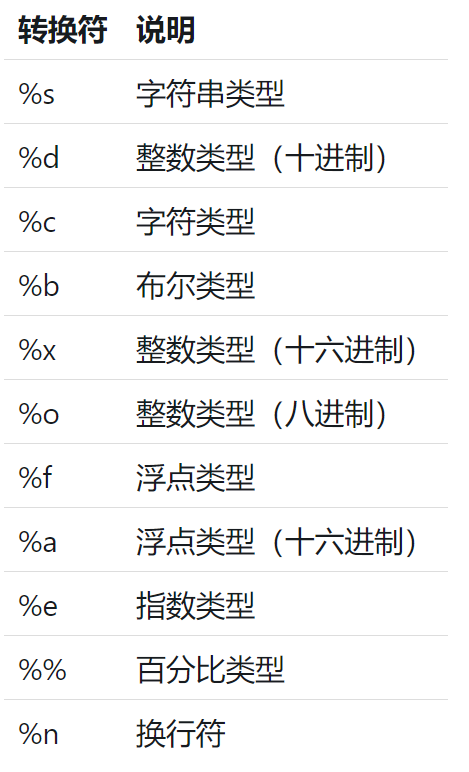

# Java面试全解析-深入理解字符串

---

### 字符串介绍

字符串是程序开发当中，使用最频繁的类型之一，有着与基础类型相同的地位，甚至在 JVM（Java 虚拟机）编译的时候会对字符串做特殊的处理，比如拼接操作可能会被 JVM 直接合成为一个最终的字符串，从而到达高效运行的目的。

1、String 特性

* String 是标准的不可变类（immutable），对它的任何改动，其实就是创建了一个新对象，再把引用指向该对象；
* String 对象赋值之后就会在常量池中缓存，如果下次创建会判定常量池是否已经有缓存对象，如果有的话直接返回该引用给创建者。

2、字符串创建

字符串创建的两种方式：

~~~java
String str = "laowang";
String str = new String("laowang");
~~~

3、注意事项

查看下面代码：

~~~java
String s1 = "laowang";
String s2 = s1;
String s3 = new String(s1);
System.out.println(s1 == s2);
System.out.println(s1 == s3);
~~~

输出结果：true、false。

为什么会这样？原因是 s3 使用 new String 时一定会在堆中重新创建一个内存区域，而 s2 则会直接使用了 s1 的引用，所以得到的结果也完全不同。

### 字符串的使用

1、字符串拼接

字符串拼接的几种方式：

~~~java
String str = "lao" + "wang";
String str = "lao"; str += "wang";
String str = "lao"; String str2 = str + "wang";
~~~

2、JVM 对字符串的优化

根据前面的知识我们知道，对于 String 的任何操作其实是创建了一个新对象，然后再把引用地址返回该对象，但 JVM 也会对 String 进行特殊处理，以此来提供程序的运行效率，比如以下代码：

~~~java
String str = "hi," + "lao" + "wang";
~~~

经过 JVM 优化后的代码是这样的：

~~~java
String str = "hi,laowang";
~~~

验证代码如下：

~~~java
String str = "hi," + "lao" + "wang";
String str2 = "hi,laowang";
System.out.println(str == str2);
~~~

执行的结果：true。

这就说明 JVM 在某些情况下会特殊处理 String 类型。

3、字符串截取

字符串的截取使用 substring() 方法，使用如下：

~~~java
String str = "abcdef";
// 结果：cdef（从下标为2的开始截取到最后，包含开始下标）
System.out.println(str.substring(2));
// 结果：cd（从下标为2的开始截取到下标为4的，包含开始下标不包含结束下标）
System.out.println(str.substring(2,4));
~~~

4、字符串格式化

字符串格式化可以让代码更简洁更直观，比如，“我叫老王，今年 30 岁，喜欢读书”在这条信息中：姓名、年龄、兴趣都是要动态改变的，如果使用“+”号拼接的话很容易出错，这个时候字符串格式化方法 String.format() 就派上用场了，代码如下：

~~~java
String str = String.format("我叫%s，今年%d岁，喜欢%s", "老王", 30, "读书");
~~~

转换符说明列表：

5、字符对比

根据前面的知识我们知道，使用 String 和 new String 声明的对象是不同的，那有没有简单的方法，可以忽略它们的创建方式（有没有 new）而只对比它们的值是否相同呢？答案是肯定的，使用 equals() 方法可以实现，代码如下：

~~~java
String s1 = "hi," + "lao" + "wang";
String s2 = "hi,";
s2 += "lao";
s2 += "wang";
String s3 = "hi,laowang";
System.out.println(s1.equals(s2)); //true
System.out.println(s1.equals(s3)); //true
System.out.println(s2.equals(s3)); //true
~~~

以上使用 equals 对比的结果都为 true。

如果要忽略字符串的大小写对比值可以使用 equalsIgnoreCase()，代码示例：

~~~java
String s1 = "Hi,laowang";
String s2 = "hi,laowang";
System.out.println(s1.equals(s2)); //false
System.out.println(s1.equalsIgnoreCase(s2)); //true
~~~

s1.equals(s2) 执行的结果为：false，s1.equalsIgnoreCase(s2) 执行的结果为：true。

6、String、StringBuffer、StringBuilder

字符串相关类型主要有这三种：String、StringBuffer、StringBuilder，其中 StringBuffer、StringBuilder 都是可以变的字符串类型，StringBuffer 在字符串拼接时使用 synchronized 来保障线程安全，因此在多线程字符串拼接中推荐使用 StringBuffer。

StringBuffer 使用：

~~~java
StringBuffer sf = new StringBuffer("lao");
// 添加字符串到尾部
sf.append("wang"); //执行结果：laowang
// 插入字符串到到当前字符串下标的位置
sf.insert(0,"hi,"); //执行结果：hi,laowang
// 修改字符中某个下标的值
sf.setCharAt(0,'H'); //执行结果：Hi,laowang
~~~

StringBuilder 的使用方法和 StringBuffer 一样，它们都继承于 AbstractStringBuilder。

### 相关面试题

1. String 属于基础数据类型吗？

答：String 不是基础数据类型，它是从堆上分配来的。基础数据类型有 8 个，分别为：boolean、byte、short、int、long、float、double、char。

2. 以下可以正确获取字符串长度的是？

A：str.length

B：str.size

C：str.length()

D：str.size()

答：C

题目解析：字符串没有 length 属性，只有 length() 方法。

3. "==" 和 equals 的区别是什么？

答："==" 对基本类型来说是值比较，对于引用类型来说是比较的是引用；而 equals 默认情况下是引用比较，只是很多类重写了 equals 方法，比如 String、Integer 等把它变成了值比较，所以一般情况下 equals 比较的是值是否相等。

① "==" 解读

对于基本类型和引用类型 == 的作用效果是不同的，如下所示：

* 基本类型：比较的是值是否相同；
* 引用类型：比较的是引用是否相同。

代码示例：

~~~java
String x = "string";
String y = "string";
String z = new String("string");
System.out.println(x==y); //true
System.out.println(x==z); //false
System.out.println(x.equals(y)); //true
System.out.println(x.equals(z)); //true
~~~

代码说明：因为 x 和 y 指向的是同一个引用，所以 == 也是 true，而 new String() 方法则重写开辟了内存空间，所以 == 结果为 false，而 equals 比较的一直是值，所以结果都为 true。

② equals 解读

equals 本质上就是 ==，只不过 String 和 Integer 等重写了 equals 方法，把它变成了值比较。看下面的代码就明白了。

首先来看默认情况下 equals 比较一个有相同值的对象，代码如下：

~~~java
class Cat {
	private String name;
	public Cat(String name) {
		this.name = name;
	}
	public String getName() {
		return name;
	}
	public void setName(String name) {
		this.name = name;
	}
}
Cat c1 = new Cat("王磊");
Cat c2 = new Cat("王磊");
System.out.println(c1.equals(c2)); //false
~~~

输出结果出乎我们的意料，竟然是 false？！

这是怎么回事，看了 equals 源码就知道了，源码如下：

~~~java
public boolean equals(Object obj) {
	return (this == obj);
}
~~~

原来 equals 本质上就是 ==。

那问题来了，两个相同值的 String 对象，为什么返回的是 true？代码如下：

~~~java
String s1 = new String("老王");
String s2 = new String("老王");
System.out.println(s1.equals(s2)); //true
~~~

同样的，当我们进入 String 的 equals 方法，找到了答案，代码如下：

~~~java
public boolean equals(Object anObject) {
	if (this == anObject) {
		return true;
	}
	if (anObject instanceof String) {
		String anotherString = (String)anObject;
		int n = value.length;
		if(n == anotherString.value.length) {
			char v1[] = value;
			char v2[] = anotherString.value;
			int i = 0;
			while(n-- != 0) {
				if (v1[i] != v2[i])
					return false;
				i++;
			}
			return true;
		}
	}
	return false;
}
~~~

原来是 String 重写了 Object 的 equals 方法，把引用比较改成了值比较。

总结来说，"==" 对于基本类型来说是值比较，对于引用类型来说是比较的是引用；而 equals 默认情况下是引用比较，只是很多类重写了 equals 方法，比如 String、Integer 等把它变成了值比较，所以一般情况下 equals 比较的是值是否相等。

4. 以下代码输出的结果是？

~~~java
String str = "laowang";
str.substring(0,1);
System.out.println(str);
~~~

A：l

B：a

C：la

D：laowang

答：D

题目解析：因为 String 的 substring() 方法不会修改原字符串内容，所以结果还是 laowang。

5. 以下字符串对比的结果是什么？

~~~java
String s1 = "hi," + "lao" + "wang";
String s2 = "hi,";
s2 += "lao";
s2 += "wang";
String s3 = "hi,laowang";
System.out.println(s1 == s2);
System.out.println(s1 == s3);
System.out.println(s2 == s3);
~~~

答：false、true、false

题目解析：String s1 = "hi," + "lao" + "wang" 代码会被 JVM 优化为：String s1 = "hi,laowang"，这样就和 s3 完全相同，s1 创建的时候会把字符"hi,laowang"放入常量池，s3 创建的时候，常量池中已经存在对应的缓存，会直接把引用返回给 s3，所以 s1==s3 就为 true，而 s2 使用了 += 其引用地址就和其他两个不同。

6. 以下 String 传值修改后执行的结果是什么？

~~~java
public static void main(String[] args) {
	String str = new String("laowang");
	change(str);
	System.out.println(str);
}
public static void change(String str) {
	str = "xiaowang";
}
~~~

答：laowang

7. 以下 StringBuffer 传值修改后的执行结果是什么？

~~~java
public static void main(String[] args) {
	StringBuffer sf = new StringBuffer("hi,");
	changeSf(sf);
	System.out.println(sf);
}
public static void changeSf(StringBuffer sf) {
	sf.append("laowang");
}
~~~

答：hi,laowang

题目解析：String 为不可变类型，在方法内对 String 修改的时候，相当修改传递过来的是一个 String 副本，所以 String 本身的值是不会被修改的，而 StringBuffer 为可变类型，参数传递过来的是对象的引用，对其修改它本身就会发生改变。

8. 以下使用 substring 执行的结果什么？

~~~java
String str = "abcdef";
System.out.println(str.substring(3, 3));
~~~

答：""(空)。

9. 判定字符串是否为空，有几种方式？

答：常用的方式有以下两种。

~~~java
str.equals("")
str.length()==0
~~~

10. String、StringBuffer、StringBuilder 的区别？

答：以下是 String、StringBuffer、StringBuilder 的区别：

* 可变性：String 为字符串常量是不可变对象，StringBuffer 与 StringBuilder 为字符串变量是可变对象；
* 性能：String 每次修改相当于生成一个新对象，因此性能最低；StringBuffer 使用 synchronized 来保证线程安全，性能优于 String，但不如 StringBuilder；
* 线程安全：StringBuilder 为非线程安全类，StringBuffer 为线程安全类。

11. String 对象的 intern() 有什么作用？

答：intern() 方法用于查找常量池中是否存在该字符值，如果常量池中不存在则先在常量池中创建，如果已经存在则直接返回。

示例代码：

~~~java
String s = "laowang";
String s2 = s.intern();
System.out.println(s == s2); //返回 true
~~~

12. `String s = new String("laowang")` 创建了几个对象？

答：创建了一个或两个对象，如果常量池中已经有了字符串 “laowang”，就只会创建一个引用对象 s 指向常量池中的对象 ”laowang“；如果常量池中没有字符串 ”laowang“，则先会在常量池中创建一个对象 ”laowang“，再创建一个引用对象 s 指向常量池中的对象，所以答案是创建一个或者两个对象。

13. 什么是字符串常量池？

字符串常量池是存储在 Java 堆内存中的字符串池，是为防止每次新建字符串带来的时间和空间消耗的一种解决方案。在创建字符串时 JVM 会首先检查字符串常量池，如果字符串已经存在池中，就返回池中的实例引用，如果字符串不在池中，就会实例化一个字符串放到池中并把当前引用指向该字符串。

14. String 不可变性都有哪些好处？

答：不可变的好处如下：

* 只有当字符串是不可变的，字符串常量池才能实现，字符串池的实现可以在运行时节约很多堆空间，因为不同的字符串变量都指向池中的同一个字符串；
* 可以避免一些安全漏洞，比如在 Socket 编程中，主机名和端口都是以字符串的形式传入，因为字符串是不可变的，所以它的值是不可改变的，否则黑客们可以钻到空子，改变字符串指向的对象的值，造成安全漏洞；
* 多线程安全，因为字符串是不可变的，所以同一个字符串实例可以被多个线程共享，保证了多线程的安全性；
* 适合做缓存的 key，因为字符串是不可变的，所以在它创建的时候哈希值就被缓存了，不需要重新计算速度更快，所以字符串很适合作缓存的中的 key。

15. String 是否可以被继承？为什么？

答：String 不能被继承。因为 String 被声明为 final（最终类），所以不能被继承，源码如下（JDK 8）。

~~~java
public final class String
	implements java.io.Serializable, Comparable<String>, CharSequence {
	//......
}
~~~

   

---

