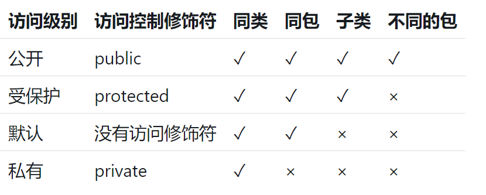

# Java面试全解析-类与Object的应用

---

### 类介绍

Java 程序是由若干个类组成的，类也是面向对象编程思想的具体实现。

以下为类的基本使用：

~~~java
public class Cat {
	// 私有属性
	private String name;
	private int age;
	// 构造方法
	public Cat() {
		
    }
	// 普通方法
	public void eat() {
		System.out.println("吃吃吃");
	}
	// 对外包装属性
	public String getName() {
		return name;
	}
	public void setName(String name) {
		this.name = name;
	}
	public int getAge() {
		return age;
	}
	public void setAge(int age) {
		this.age = age;
	}
}
~~~

### 类引用

当我们需要使用不同包下的类时，就需要使用 import 导入包或类，这个时候才能正常使用。例如，我们要使用 java.util 下的 ArrayList 就必须使用 import java.util.ArrayList，请参考以下代码：

~~~java
// 导入 ArrayList 类
import java.util.ArrayList;
class importTest {
	public static void main(String[] args) {
		ArrayList list = new ArrayList();
	}
}
~~~

类引用的高级用法

import 还可以导入静态方法和静态域的功能，比如以下代码：

~~~java
// 导入 static 静态域的功能
import static java.lang.System.*;
class staticTest {
	public static void main(String[] args) {
		out.println("hi");
	}
}
~~~

以上代码也可以顺利的执行，这也是 import 好玩的一个地方。

### 访问修饰符

在 Java 中访问修饰符有以下四种：

* public
* protected
* 默认
* private

具体介绍如下表：

* 在开发中要尽可能地加上访问修饰符（提高程序的可读性）；
* 无特殊要求的情况下，类内部的变量应该设置为私有的（防止外部篡改）。

### 构造方法

构造方法也叫构造器或构造函数，它的作用是对类进行初始化，比如以下代码：

~~~java
class Cat {
	private String name;
	private int age;
	// 构造方法
	public Cat(String name, int age) {
		this.name = name;
		this.age = age;
	}
	public static void main(String[] args) {
		Cat cat = new Cat("喵星人",2);
		System.out.println(cat.getName());
		System.out.println(cat.getAge());
	}
	public String getName() {
		return name;
	}
	public void setName(String name) {
		this.name = name;
	}
	public int getAge() {
		return age;
	}
	public void setAge(int age) {
		this.age = age;
	}
}
~~~

以上代码执行结果如下：

~~~plaintext
喵星人
2
~~~

构造方法五大原则：

* 构造方法必须与类同名；
* 构造方法的参数可以没有或者有多个；
* 构造方法不能有返回值；
* 每个类可以有一个或多个构造方法；
* 构造方法总是伴随着 new 操作一起使用。

### 继承

用法：使用 extends 关键字来实现类的继承，示例代码如下：

~~~java
class Animal {
	public void eat() {
		System.out.println("Animal");
	}
}
class Cat extends Animal {
	
}
public class eTest implements Cloneable {
	public static void main(String[] args) {
		Animal cat = new Cat();
		cat.eat();
	}
}
~~~

以上程序执行结果：Animal

继承使用技巧：

* 将公共的变量或者方法提取到超类中；
* 除非所有的方法都有继承的意义，否则不要使用继承；
* 在方法覆盖时不要改变原有方法的预期行为。

### Object

Object 类是 Java 中的一个特殊类，它是所有类的父类，Java 中的类都直接或间接的继承自 Object 类。

Object 类的常用方法如下：

* equals()：对比两个对象是否相同
* getClass()：返回一个对象的运行时类
* hashCode()：返回该对象的哈希码值
* toString()：返回该对象的字符串描述
* wait()：使当前的线程等待
* notify()：唤醒在此对象监视器上等待的单个线程
* notifyAll()：唤醒在此对象监视器上等待的所有线程
* clone()：克隆一个新对象

关于更多 Object 的内容，如克隆（深克隆、浅克隆）、线程等待和唤醒，会在后面的章节中详细介绍。

### 相关面试题

1. 类的组成部分有哪些？

答：在 Java 语言中，类主要是由方法和变量两部分组成。

2. 类与对象有哪些区别？

答：类是一个抽象的概念，是对某一事物的描述；而对象是类的实例，是实实在在存在的个体。比如，“人”就是一个类（一个概念），而老王（王磊）就是实实在在的一个“对象”。

3. Java 中可以多继承吗？

答：Java 中只能单继承，但可以实现多接口。

4. Java 中为什么不能实现多继承？

答：从技术的实现角度来说，是为了降低编程的复杂性。假设 A 类中有一个 m() 方法，B 类中也有一个 m() 方法，如果 C 类同时继承 A 类和 B 类，那调用 C 类的 m() 方法时就会产生歧义，这无疑增加了程序开发的复杂性，为了避免这种问题的产生，Java 语言规定不能多继承类，但可以实现多接口。

5. 覆盖和重载有哪些区别？

答：覆盖和重载的区别如下：

* 覆盖（Override）是指子类对父类方法的一种重写，只能比父类抛出更少的异常，访问权限不能比父类的小，被覆盖的方法不能是 private，否则只是在子类中重新定义了一个方法；
* 重载（Overload）表示同一个类中可以有多个名称相同的方法，但这些方法的参数列表各不相同。

6. 以下不属于重载特性的是？

A：方法的参数类型不同

B：方法的返回值不同

C：方法的参数个数不同

D：方法的参数顺序不同

答：B

7. 为什么方法不能根据返回类型来区分重载？

答：因为在方法调用时，如果不指定类型信息，编译器就不知道你要调用哪个方法了。比如，以下代码：

~~~java
float max(int x,int y);
int max(int x,int y);
// 方法调用
max(1,2);
~~~

因为 max(1,2) 没有指定返回值，编译器就不知道要调用哪个方法了。

8. 构造方法有哪些特征？

答：构造方法的特征如下：

* 构造方法必须与类名相同；
* 构造方法没有返回类型（void 也不能有）；
* 构造方法不能被继承、覆盖、直接调用；
* 类定义时提供了默认的无参构造方法；
* 构造方法可以私有，外部无法使用私有构造方法创建对象。

9. 构造函数能不能被覆盖？能不能被重载？

答：构造函数可以重载，但不能覆盖。

10. 以下说法正确的是？

A：类中的构造方法不能忽略

B：构造方法可以作为普通方法被调用

C：构造方法在对象被 new 时被调用

D：一个类只能有一个构造方法

答：C

11. 以下程序执行的结果是？

~~~java
class ExecTest {
	public static void main(String[] args) {
		Son son = new Son();
	}
}
class Parent{
	{
		System.out.print("1");
	}
	static{
		System.out.print("2");
	}
	public Parent(){
		System.out.print("3");
	}
}
class Son extends Parent{
	{
		System.out.print("4");
	}
	static{
		System.out.print("5");
	}
	public Son(){
		System.out.print("6");
	}
}
~~~

答：打印的结果是：251346

加载顺序如下：

* 执行父类的静态成员；
* 执行子类的静态成员；
* 父类的实例成员和实例初始化；
* 执行父类构造方法；
* 子类的实例成员和实例初始化；
* 子类构造方法。

12. 以下程序执行的结果是？

~~~java
class A {
	public int x = 0;
	public static int y = 0;
	public void m() {
		System.out.print("A");
	}
}
class B extends A {
	public int x = 1;
	public static int y = 2;
	public void m() {
		System.out.print("B");
	}
	public static void main(String[] args) {
		A myClass = new B();
		System.out.print(myClass.x);
		System.out.print(myClass.y);
		myClass.m();
	}
}
~~~

答：打印的结果是：00B

题目解析：在 Java 语言中，变量不能被重写。

13. 以下程序执行的结果是？

~~~java
class A {
	public void m(A a) {
		System.out.println("AA");
	}
	public void m(D d) {
		System.out.println("AD");
	}
}
class B extends A {
	@Override
	public void m(A a) {
		System.out.println("BA");
	}
	public void m(B b) {
		System.out.println("BD");
	}
	public static void main(String[] args) {
		A a = new B();
		B b = new B();
		C c = new C();
		D d = new D();
		a.m(a);
		a.m(b);
		a.m(c);
		a.m(d);
	}
}
class C extends B{}
class D extends B{}
~~~

答：打印结果如下。

~~~plaintext
BA
BA
BA
AD
~~~

题目解析：

* 第一个 BA：因为 A 的 m() 方法，被子类 B 重写了，所以输出是：BA；
* 第二个 BA：因为 B 是 A 的子类，当调用父类 m() 方法时，发现 m() 方法被 B 类重写了，所以会调用 B 中的 m() 方法，输出就是：BA；
* 第三个 BA：因为 C 是 B 的子类，会直接调用 B 的 m() 方法，所以输出就是：BA；
* 第四个 AD：因为 D 是 A 的子类，所以会调用 A 的 m() 方法，所以输出就是：AD。

14. Java 中的 this 和 super 有哪些区别？

答：this 和 super 都是 Java 中的关键字，起指代作用，在构造方法中必须出现在第一行，它们的区别如下：

* 基础概念：this 是访问本类实例属性或方法；super 是子类访问父类中的属性或方法。
* 查找范围：this 先查本类，没有的话再查父类；super 直接访问父类。
* 使用：this 单独使用时，表示当前对象；super 在子类覆盖父类方法时，访问父类同名方法。

15. 在静态方法中可以使用 this 或 super 吗？为什么？

答：在静态方法中不能使用 this 或 super，因为 this 和 super 指代的都是需要被创建出来的对象，而静态方法在类加载的时候就已经创建了，所以没办法在静态方法中使用 this 或 super。

16. 静态方法的使用需要注意哪些问题？

答：静态方法的使用需要注意以下两个问题：

* 静态方法中不能使用实例成员变量和实例方法；
* 静态方法中不能使用 this 和 super。

17. final 修饰符的作用有哪些？

答：final 修饰符作用如下：

* 被 final 修饰的类不能被继承；
* 被 final 修饰的方法不能被重写；
* 被 final 修饰的变量不能被修改。

18. 覆盖 equals() 方法的时候需要遵守哪些规则？

答：Oracle 官方的文档对于 equals() 重写制定的规则如下。

* 自反性：对于任意非空的引用值 x，x.equals(x) 返回值为真。
* 对称性：对于任意非空的引用值 x 和 y，x.equals(y) 必须和 y.equals(x) 返回相同的结果。
* 传递性：对于任意的非空引用值 x、y 和 z，如果 x.equals(y) 返回值为真，y.equals(z) 返回值也为真，那么 x.equals(z) 也必须返回值为真。
* 一致性：对于任意非空的引用值 x 和 y，无论调用 x.equals(y) 多少次，都要返回相同的结果。在比较的过程中，对象中的数据不能被修改。
* 对于任意的非空引用值 x，x.equals(null) 必须返回假。

此题目不要求记忆，能知道大概即可，属于加分项题目。

19. 在 Object 中 notify() 和 notifyAll() 方法有什么区别？

答：notify() 方法随机唤醒一个等待的线程，而 notifyAll() 方法将唤醒所有在等待的线程。

20. 如何使用 clone() 方法？

答：如果是同一个类中使用的话，只需要实现 Cloneable 接口，定义或者处理 CloneNotSupportedException 异常即可，请参考以下代码：

~~~java
class CloneTest implements Cloneable {
	int num;
	public static void main(String[] args) throws CloneNotSupportedException {
		CloneTest ct = new CloneTest();
		ct.num = 666;
		System.out.println(ct.num);
		CloneTest ct2 = (CloneTest) ct.clone();
		System.out.println(ct2.num);
	}
}
~~~

如果非内部类调用 clone() 的话，需要重写 clone() 方法，请参考以下代码：

~~~java
class CloneTest implements Cloneable {
	int num;
	public static void main(String[] args) throws CloneNotSupportedException {
		CloneTest ct = new CloneTest();
		ct.num = 666;
		System.out.println(ct.num);
		CloneTest ct2 = (CloneTest) ct.clone();
		System.out.println(ct2.num);
	}
	@Override
	protected Object clone() throws CloneNotSupportedException {
		return super.clone();
	}
}
public class CloneTest2 {
	public static void main(String[] args) throws CloneNotSupportedException {
		CloneTest ct = new CloneTest();
		ct.num = 666;
		System.out.println(ct.num);
		CloneTest ct2 = (CloneTest) ct.clone();
		System.out.println(ct2.num);
	}
}
~~~

### 总结

本文我们学习了类的基础用法，类引用：import 和 import static，访问修饰符的作用，构造函数和继承的特点以及使用技巧等，通过这些内容让我们对整个 Java 程序的组成，有了更加清晰直观的印象。

   

---

