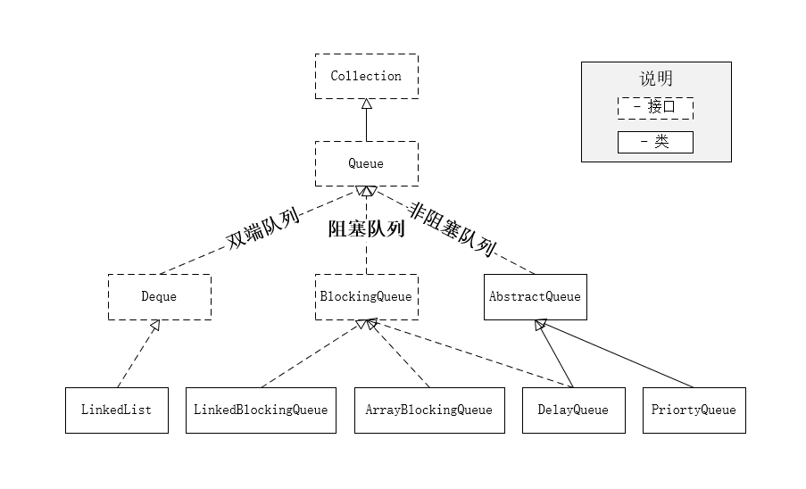
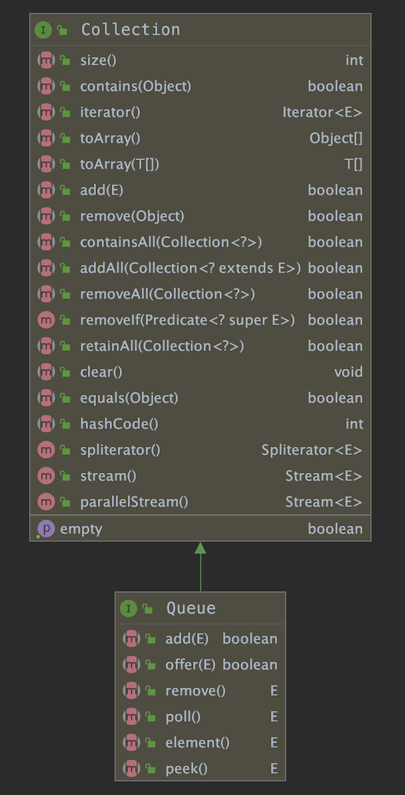

# Java面试全解析-数据结构之队列

---

队列（Queue）：与栈相对的一种数据结构， 集合（Collection）的一个子类。队列允许在一端进行插入操作，而在另一端进行删除操作的线性表，栈的特点是后进先出，而队列的特点是先进先出。队列的用处很大，比如实现消息队列。

Queue 类关系图，如下图所示：

注：为了让读者更直观地理解，上图为精简版的 Queue 类关系图。本文如无特殊说明，内容都是基于 Java 1.8 版本。 

### 队列（Queue）

1、Queue 分类

从上图可以看出 Queue 大体可分为以下三类：

* 双端队列：双端队列（Deque）是 Queue 的子类也是 Queue 的补充类，头部和尾部都支持元素插入和获取。
* 阻塞队列：阻塞队列指的是在元素操作时（添加或删除），如果没有成功，会阻塞等待执行。例如，当添加元素时，如果队列元素已满，队列会阻塞等待直到有空位时再插入。
* 非阻塞队列：非阻塞队列和阻塞队列相反，会直接返回操作的结果，而非阻塞等待。双端队列也属于非阻塞队列。

2、Queue 方法说明

Queue 方法如下图所示：

其中比较常用的方法有以下几个：

* add(E)：添加元素到队列尾部，成功返回 true，队列超出时抛出异常；
* offer(E)：添加元素到队列尾部，成功返回 true，队列超出时返回 false；
* remove(Object)：删除元素，成功返回 true，失败返回 false；
* poll()：获取并移除此队列的第一个元素，若队列为空，则返回 null；
* peek()：获取但不移除此队列的第一个元素，若队列为空，则返回 null；
* element()：获取但不移除此队列的第一个元素，若队列为空，则抛异常。

3）Queue 使用实例

~~~java
Queue<String> linkedList = new LinkedList<>();
linkedList.add("Dog");
linkedList.add("Camel");
linkedList.add("Cat");
while (!linkedList.isEmpty()) {
 	System.out.println(linkedList.poll());
}
~~~

程序执行结果：

~~~plaintext
Dog
Camel
Cat
~~~

### 阻塞队列

1、BlockingQueue

BlockingQueue 在 java.util.concurrent 包下，其他阻塞类都实现自 BlockingQueue 接口。BlockingQueue 提供了线程安全的队列访问方式，当向队列中插入数据时，如果队列已满，线程则会阻塞等待队列中元素被取出后再插入；当从队列中取数据时，如果队列为空，则线程会阻塞等待队列中有新元素再获取。

BlockingQueue 核心方法

插入方法：

* add(E)：添加元素到队列尾部，成功返回 true，队列超出时抛出异常；
* offer(E)：添加元素到队列尾部，成功返回 true，队列超出时返回 false ；
* put(E)：将元素插入到队列的尾部，如果该队列已满，则一直阻塞。 

删除方法：

* remove(Object)：移除指定元素，成功返回 true，失败返回 false；
* poll()： 获取并移除队列的第一个元素，如果队列为空，则返回 null；
* take()：获取并移除队列第一个元素，如果没有元素则一直阻塞。

检查方法：

* peek()：获取但不移除队列的第一个元素，若队列为空，则返回 null。

2、LinkedBlockingQueue

LinkedBlockingQueue 是一个由链表实现的有界阻塞队列，容量默认值为 Integer.MAX_VALUE，也可以自定义容量，建议指定容量大小，默认大小在添加速度大于删除速度情况下有造成内存溢出的风险，LinkedBlockingQueue 是先进先出的方式存储元素。

3、ArrayBlockingQueue

ArrayBlockingQueue 是一个有边界的阻塞队列，它的内部实现是一个数组。它的容量是有限的，我们必须在其初始化的时候指定它的容量大小，容量大小一旦指定就不可改变。

ArrayBlockingQueue 也是先进先出的方式存储数据，ArrayBlockingQueue 内部的阻塞队列是通过重入锁 ReenterLock 和 Condition 条件队列实现的，因此 ArrayBlockingQueue 中的元素存在公平访问与非公平访问的区别，对于公平访问队列，被阻塞的线程可以按照阻塞的先后顺序访问队列，即先阻塞的线程先访问队列。而非公平队列，当队列可用时，阻塞的线程将进入争夺访问资源的竞争中，也就是说谁先抢到谁就执行，没有固定的先后顺序。

示例代码如下：

~~~java
// 默认非公平阻塞队列
ArrayBlockingQueue queue = new ArrayBlockingQueue(6);
// 公平阻塞队列
ArrayBlockingQueue queue2 = new ArrayBlockingQueue(6,true);

// ArrayBlockingQueue 源码展示
public ArrayBlockingQueue(int capacity) {
	this(capacity, false);
}
public ArrayBlockingQueue(int capacity, boolean fair) {
	if (capacity <= 0)
		throw new IllegalArgumentException();
	this.items = new Object[capacity];
	lock = new ReentrantLock(fair);
	notEmpty = lock.newCondition();
	notFull =  lock.newCondition();
}
~~~

4、DelayQueue

DelayQueue 是一个支持延时获取元素的无界阻塞队列，队列中的元素必须实现 Delayed 接口，在创建元素时可以指定延迟时间，只有到达了延迟的时间之后，才能获取到该元素。

实现了 Delayed 接口必须重写两个方法 ，getDelay(TimeUnit) 和 compareTo(Delayed)，如下代码所示：

~~~java
class DelayElement implements Delayed {
	@Override
	// 获取剩余时间
	public long getDelay(TimeUnit unit) {
		// do something
	}
	@Override
	// 队列里元素的排序依据
	public int compareTo(Delayed o) {
		// do something
	}
}
~~~

DelayQueue 使用的完整示例，请参考以下代码：

~~~java
public class DelayTest {
	public static void main(String[] args) throws InterruptedException {
		DelayQueue delayQueue = new DelayQueue();
		delayQueue.put(new DelayElement(1000));
		delayQueue.put(new DelayElement(3000));
		delayQueue.put(new DelayElement(5000));
		System.out.println("开始时间：" +  DateFormat.getDateTimeInstance().format(new Date()));
		while (!delayQueue.isEmpty()){
			System.out.println(delayQueue.take());
		}
		System.out.println("结束时间：" +  DateFormat.getDateTimeInstance().format(new Date()));
	}

	static class DelayElement implements Delayed {
		// 延迟截止时间（单面：毫秒）
		long delayTime = System.currentTimeMillis();
		public DelayElement(long delayTime) {
			this.delayTime = (this.delayTime + delayTime);
		}
		@Override
		// 获取剩余时间
		public long getDelay(TimeUnit unit) {
			return unit.convert(delayTime - System.currentTimeMillis(), TimeUnit.MILLISECONDS);
		}
		@Override
		// 队列里元素的排序依据
		public int compareTo(Delayed o) {
			if (this.getDelay(TimeUnit.MILLISECONDS) > o.getDelay(TimeUnit.MILLISECONDS)) {
				return 1;
			} else if (this.getDelay(TimeUnit.MILLISECONDS) < o.getDelay(TimeUnit.MILLISECONDS)) {
				return -1;
			} else {
				return 0;
			}
		}
		@Override
		public String toString() {
			return DateFormat.getDateTimeInstance().format(new Date(delayTime));
		}
	}
}
~~~

程序执行结果：

~~~java
开始时间：2019-6-13 20:40:38
2019-6-13 20:40:39
2019-6-13 20:40:41
2019-6-13 20:40:43
结束时间：2019-6-13 20:40:43
~~~

### 非阻塞队列

ConcurrentLinkedQueue 是一个基于链接节点的无界线程安全队列，它采用先进先出的规则对节点进行排序，当我们添加一个元素的时候，它会添加到队列的尾部；当我们获取一个元素时，它会返回队列头部的元素。

它的入队和出队操作均利用 CAS（Compare And Set）更新，这样允许多个线程并发执行，并且不会因为加锁而阻塞线程，使得并发性能更好。

ConcurrentLinkedQueue 使用示例：

~~~java
ConcurrentLinkedQueue concurrentLinkedQueue = new ConcurrentLinkedQueue();
concurrentLinkedQueue.add("Dog");
concurrentLinkedQueue.add("Cat");
while (!concurrentLinkedQueue.isEmpty()) {
	System.out.println(concurrentLinkedQueue.poll());
}
~~~

执行结果：

~~~plaintext
Dog
Cat
~~~

可以看出不管是阻塞队列还是非阻塞队列，使用方法都是类似的，区别是底层的实现方式。

### 优先级队列

PriorityQueue 一个基于优先级堆的无界优先级队列。优先级队列的元素按照其自然顺序进行排序，或者根据构造队列时提供的 Comparator 进行排序，具体取决于所使用的构造方法。优先级队列不允许使用 null 元素。

PriorityQueue  代码使用示例：

~~~java
Queue<Integer> priorityQueue = new PriorityQueue(new Comparator<Integer>() {
	@Override
	public int compare(Integer o1, Integer o2) {
		// 非自然排序，数字倒序
		return o2 - o1;
	}
});
priorityQueue.add(3);
priorityQueue.add(1);
priorityQueue.add(2);
while (!priorityQueue.isEmpty()) {
	Integer i = priorityQueue.poll();
	System.out.println(i);
}
~~~

程序执行的结果是：

~~~java
3
2
1
~~~

PriorityQueue 注意的点：

* PriorityQueue 是非线程安全的，在多线程情况下可使用 PriorityBlockingQueue 类替代；
* PriorityQueue 不允许插入 null 元素。

### 相关面试题

1.ArrayBlockingQueue 和 LinkedBlockingQueue 的区别是什么？

答：ArrayBlockingQueue 和 LinkedBlockingQueue 都实现自阻塞队列 BlockingQueue，它们的区别主要体现在以下几个方面：

* ArrayBlockingQueue 使用时必须指定容量值，LinkedBlockingQueue 可以不用指定；
* ArrayBlockingQueue 的最大容量值是使用时指定的，并且指定之后就不允许修改；而 LinkedBlockingQueue 最大的容量为 Integer.MAX_VALUE；
* ArrayBlockingQueue 数据存储容器是采用数组存储的；而 LinkedBlockingQueue 采用的是 Node 节点存储的。

2.LinkedList 中 add() 和 offer() 有什么关系？

答：add() 和 offer() 都是添加元素到队列尾部。offer 方法是基于 add 方法实现的，Offer 的源码如下：

~~~java
public boolean offer(E e) {
	return add(e);
}
~~~

3.Queue 和 Deque 有什么区别？

答：Queue 属于一般队列，Deque 属于双端队列。一般队列是先进先出，也就是只有先进的才能先出；而双端队列则是两端都能插入和删除元素。

4.LinkedList 属于一般队列还是双端队列？

答：LinkedList 实现了 Deque 属于双端队列，因此拥有 addFirst(E)、addLast(E)、getFirst()、getLast() 等方法。

5.以下说法错误的是？

A：DelayQueue 内部是基于 PriorityQueue 实现的

B：PriorityBlockingQueue 不是先进先出的数据存储方式

C：LinkedBlockingQueue 默认容量是无限大的

D：ArrayBlockingQueue 内部的存储单元是数组，初始化时必须指定队列容量

答：C

题目解析：LinkedBlockingQueue 默认容量是 Integer.MAX_VALUE，并不是无限大的。

6.关于 ArrayBlockingQueue 说法不正确的是？

A：ArrayBlockingQueue 是线程安全的

B：ArrayBlockingQueue 元素允许为 null

C：ArrayBlockingQueue 主要应用场景是“生产者-消费者”模型

D：ArrayBlockingQueue 必须显示地设置容量

答：B

题目解析：ArrayBlockingQueue 不允许元素为 null，如果添加一个 null 元素，会抛 NullPointerException 异常。

7.以下程序执行的结果是什么？

~~~java
PriorityQueue priorityQueue = new PriorityQueue();
priorityQueue.add(null);
System.out.println(priorityQueue.size());
~~~

答：程序执行报错，PriorityQueue 不能插入 null。

8.Java 中常见的阻塞队列有哪些？

答：Java 中常见的阻塞队列如下：

* ArrayBlockingQueue，由数组结构组成的有界阻塞队列；
* PriorityBlockingQueue，支持优先级排序的无界阻塞队列；
* SynchronousQueue，是一个不存储元素的阻塞队列，会直接将任务交给消费者，必须等队列中的添加元素被消费后才能继续添加新的元素；
* LinkedBlockingQueue，由链表结构组成的阻塞队列；
* DelayQueue，支持延时获取元素的无界阻塞队列。

9.有界队列和无界队列有哪些区别？

答：有界队列和无界队列的区别如下。

* 有界队列：有固定大小的队列叫做有界队列，比如：new ArrayBlockingQueue(6)，6 就是队列的大小。
* 无界队列：指的是没有设置固定大小的队列，这些队列的特点是可以直接入列，直到溢出。它们并不是真的无界，它们最大值通常为 Integer.MAX_VALUE，只是平常很少能用到这么大的容量（超过 Integer.MAX_VALUE），因此从使用者的体验上，就相当于 “无界”。

10.如何手动实现一个延迟消息队列？

答：说到延迟消息队列，我们应该可以第一时间想到要使用 DelayQueue 延迟队列来解决这个问题。实现思路，消息队列分为生产者和消费者，生产者用于增加消息，消费者用于获取并消费消息，我们只需要生产者把消息放入到 DelayQueue 队列并设置延迟时间，消费者循环使用 take() 阻塞获取消息即可。完整的实现代码如下：

~~~java
public class CustomDelayQueue {
	// 消息编号
	static AtomicInteger MESSAGENO = new AtomicInteger(1);

	public static void main(String[] args) throws InterruptedException {
		DelayQueue<DelayedElement> delayQueue = new DelayQueue<>();
		// 生产者1
		producer(delayQueue, "生产者1");
		// 生产者2
		producer(delayQueue, "生产者2");
		// 消费者
		consumer(delayQueue);
    }

	//生产者
	private static void producer(DelayQueue<DelayedElement> delayQueue, String name) {
		new Thread(new Runnable() {
			@Override
			public void run() {
				while (true) {
					// 产生 1~5 秒的随机数
					long time = 1000L * (new Random().nextInt(5) + 1);
					try {
						Thread.sleep(time);
					} catch (InterruptedException e) {
						e.printStackTrace();
					}
					// 组合消息体
					String message = String.format("%s，消息编号：%s 发送时间：%s 延迟：%s 秒", name, MESSAGENO.getAndIncrement(), DateFormat.getDateTimeInstance().format(new Date()), time / 1000);
					// 生产消息
					delayQueue.put(new DelayedElement(message, time));
				}
			}
		}).start();
    }

	//消费者
	private static void consumer(DelayQueue<DelayedElement> delayQueue) {
		new Thread(new Runnable() {
			@Override
			public void run() {
				while (true) {
					DelayedElement element = null;
					try {
						// 消费消息
						element = delayQueue.take();
						System.out.println(element);
					} catch (InterruptedException e) {
						e.printStackTrace();
					}
				}
			}
		}).start();
	}

	// 延迟队列对象
	static class DelayedElement implements Delayed {
		// 过期时间（单位：毫秒）
		long time = System.currentTimeMillis();
		// 消息体
		String message;
		// 参数：delayTime 延迟时间（单位毫秒）
		public DelayedElement(String message, long delayTime) {
			this.time += delayTime;
			this.message = message;
		}
		@Override
		// 获取过期时间
		public long getDelay(TimeUnit unit) {
			return unit.convert(time - System.currentTimeMillis(), TimeUnit.MILLISECONDS);
		}
		@Override
		// 队列元素排序
		public int compareTo(Delayed o) {
			if (this.getDelay(TimeUnit.MILLISECONDS) > o.getDelay(TimeUnit.MILLISECONDS))
				return 1;
			else if (this.getDelay(TimeUnit.MILLISECONDS) < o.getDelay(TimeUnit.MILLISECONDS))
				return -1;
			else
				return 0;
		}
		@Override
		public String toString() {
			// 打印消息
			return message + " |执行时间：" + DateFormat.getDateTimeInstance().format(new Date());
		}
	}
}
~~~

以上程序支持多生产者，执行的结果如下：

~~~plaintext
生产者1，消息编号：1 发送时间：2019-6-12 20:38:37 延迟：2 秒 |执行时间：2019-6-12 20:38:39
生产者2，消息编号：2 发送时间：2019-6-12 20:38:37 延迟：2 秒 |执行时间：2019-6-12 20:38:39
生产者1，消息编号：3 发送时间：2019-6-12 20:38:41 延迟：4 秒 |执行时间：2019-6-12 20:38:45
生产者1，消息编号：5 发送时间：2019-6-12 20:38:43 延迟：2 秒 |执行时间：2019-6-12 20:38:45
……
~~~

### 总结

队列（Queue）按照是否阻塞可分为：阻塞队列 BlockingQueue 和 非阻塞队列。其中，双端队列 Deque 也属于非阻塞队列，双端队列除了拥有队列的先进先出的方法之外，还拥有自己独有的方法，如 addFirst()、addLast()、getFirst()、getLast() 等，支持首未插入和删除元素。队列中比较常用的两个队列还有 PriorityQueue（优先级队列）和 DelayQueue（延迟队列），可使用延迟队列来实现延迟消息队列，这也是面试中比较常考的问题之一。需要面试朋友对延迟队列一定要做到心中有数，动手写一个消息队列也是非常有必要的。

   

---

