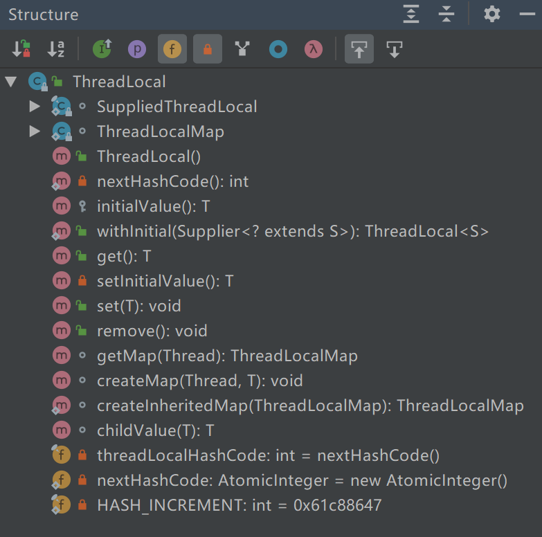
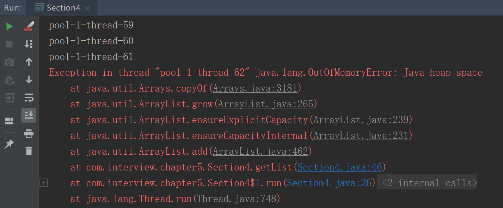
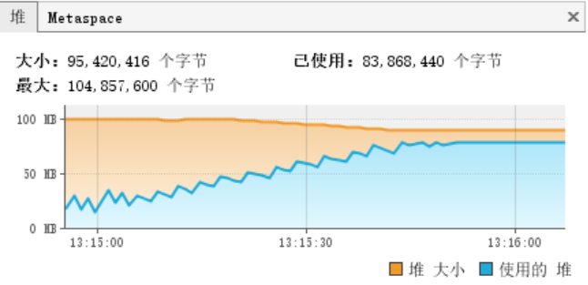
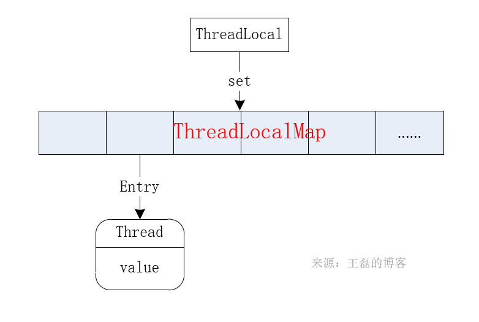

# Java面试全解析-ThreadLocal

---

1、什么是 ThreadLocal？

ThreadLocal 诞生于 JDK 1.2，用于解决多线程间的数据隔离问题。也就是说 ThreadLocal 会为每一个线程创建一个单独的变量副本。

2、ThreadLocal 有什么用？

ThreadLocal 最典型的使用场景有两个：

* ThreadLocal 可以用来管理 Session，因为每个人的信息都是不一样的，所以就很适合用 ThreadLocal 来管理；
* 数据库连接，为每一个线程分配一个独立的资源，也适合用 ThreadLocal 来实现。

其中，ThreadLocal 也被用在很多大型开源框架中，比如 Spring 的事务管理器，还有 Hibernate 的 Session 管理等，既然 ThreadLocal 用途如此广泛，那接下来就让我们共同看看 ThreadLocal 要怎么用？ThreadLocal 使用中要注意什么？以及 ThreadLocal 的存储原理等，一起来看吧。

3、ThreadLocal 基础使用

ThreadLocal 常用方法有 set(T)、get()、remove() 等，具体使用请参考以下代码。

~~~java
ThreadLocal threadLocal = new ThreadLocal();
// 存值
threadLocal.set(Arrays.asList("老王", "Java 面试题"));
// 取值
List list = (List) threadLocal.get();
System.out.println(list.size());
System.out.println(threadLocal.get());
//删除值
threadLocal.remove();
System.out.println(threadLocal.get());
~~~

以上程序执行结果如下：

~~~plaintext
2
[老王, Java 面试题]
null
~~~

ThreadLocal 所有方法，如下图所示：

4、ThreadLocal 数据共享

既然 ThreadLocal 设计的初衷是解决线程间信息隔离的，那 ThreadLocal 能不能实现线程间信息共享呢？

答案是肯定的，只需要使用 ThreadLocal 的子类 InheritableThreadLocal 就可以轻松实现，来看具体实现代码：

~~~java
ThreadLocal inheritableThreadLocal = new InheritableThreadLocal();
inheritableThreadLocal.set("老王");
new Thread(() -> System.out.println(inheritableThreadLocal.get())).start();
~~~

以上程序执行结果如下：

~~~plaintext
老王
~~~

从以上代码可以看出，主线程和新创建的线程之间实现了信息共享。

5、ThreadLocal 高级用法

内存溢出代码演示

下面我们用代码实现 ThreadLocal 内存溢出的情况，请参考以下代码。

~~~java
class ThreadLocalTest {
	static ThreadLocal threadLocal = new ThreadLocal();
	static Integer MOCK_MAX = 10000;
	static Integer THREAD_MAX = 100;
	public static void main(String[] args) throws InterruptedException {
		ExecutorService executorService = Executors.newFixedThreadPool(THREAD_MAX);
		for (int i = 0; i < THREAD_MAX; i++) {
			executorService.execute(() -> {
				threadLocal.set(new ThreadLocalTest().getList());
				System.out.println(Thread.currentThread().getName());
			});
			try {
				Thread.sleep(1000);
			} catch (InterruptedException e) {
				e.printStackTrace();
			}
		}
		executorService.shutdown();
	}
	List getList() {
		List list = new ArrayList();
		for (int i = 0; i < MOCK_MAX; i++) {
			list.add("Version：JDK 8");
			list.add("ThreadLocal");
			list.add("Author：老王");
			list.add("DateTime：" + LocalDateTime.now());
			list.add("Test：ThreadLocal OOM");
		}
		return list;
	}
}
~~~

设置 JVM（Java 虚拟机）启动参数 -Xmx=100m （最大运行内存 100 M），运行程序不久后就会出现如下异常：

此时我们用 VisualVM 观察到程序运行的内存使用情况，发现内存一直在缓慢地上升直到内存超出最大值，从而发生内存溢出的情况。

内存使用情况，如下图所示：

6、内存溢出原理分析

在开始之前，先来看下 ThreadLocal 是如何存储数据的。

首先，找到 ThreadLocal.set() 的源码，代码如下（此源码基于 JDK 8）：

~~~java
public void set(T value) {
	Thread t = Thread.currentThread();
	ThreadLocalMap map = getMap(t);
	if (map != null)
		map.set(this, value);
	else
		createMap(t, value);
}
~~~

可以看出 ThreadLocal 首先获取到 ThreadLocalMap 对象，然后再执行 ThreadLocalMap.set() 方法，进而打开此方法的源码，代码如下：

~~~java
private void set(ThreadLocal<?> key, Object value) {
	Entry[] tab = table;
	int len = tab.length;
	int i = key.threadLocalHashCode & (len-1);
	for (Entry e = tab[i];
		e != null;
		e = tab[i = nextIndex(i, len)]) {
		ThreadLocal<?> k = e.get();
		if (k == key) {
			e.value = value;
			return;
		}
		if (k == null) {
			replaceStaleEntry(key, value, i);
			return;
		}
	}
	tab[i] = new Entry(key, value);
	int sz = ++size;
	if (!cleanSomeSlots(i, sz) && sz >= threshold)
		rehash();
}
~~~

从整个代码可以看出，首先 ThreadLocal 并不存储数据，而是依靠 ThreadLocalMap 来存储数据，ThreadLocalMap 中有一个 Entry 数组，每个 Entry 对象是以 K/V 的形式对数据进行存储的，其中 K 就是 ThreadLocal 本身，而 V 就是要存储的值，如下图所示：

可以看出：一个 Thread 中只有一个 ThreadLocalMap，每个 ThreadLocalMap 中存有多个 ThreadLocal，ThreadLocal 引用关系如下：

其中：实线代表强引用，虚线代表弱引用（弱引用具有更短暂的生命周期，在执行垃圾回收时，一旦发现只具有弱引用的对象，不管当前内存空间足够与否，都会回收它的内存）。

看到这里我们就理解了 ThreadLocal 造成内存溢出的原因：如果 ThreadLocal 没有被直接引用（外部强引用），在 GC（垃圾回收）时，由于 ThreadLocalMap 中的 key 是弱引用，所以一定就会被回收，这样一来 ThreadLocalMap 中就会出现 key 为 null 的 Entry，并且没有办法访问这些数据，如果当前线程再迟迟不结束的话，这些 key 为 null 的 Entry 的 value 就会一直存在一条强引用链：Thread Ref -> Thread -> ThreaLocalMap -> Entry -> value 并且永远无法回收，从而造成内存泄漏。

7、ThreadLocal 的正确使用方法

既然已经知道了 ThreadLocal 内存溢出的原因，那解决办法就很清晰了，只需要在使用完 ThreadLocal 之后，调用remove() 方法，清除掉 ThreadLocalMap 中的无用数据就可以了。
正确使用的完整示例代码如下：

~~~java
class ThreadLocalTest {
	static ThreadLocal threadLocal = new ThreadLocal();
	static Integer MOCK_MAX = 10000;
	static Integer THREAD_MAX = 100;
	public static void main(String[] args) throws InterruptedException {
		ExecutorService executorService = Executors.newFixedThreadPool(THREAD_MAX);
		for (int i = 0; i < THREAD_MAX; i++) {
			executorService.execute(() -> {
				threadLocal.set(new ThreadLocalTest().getList());
				System.out.println(Thread.currentThread().getName());
				// 移除对象
				threadLocal.remove(); 
			});
			try {
				Thread.sleep(1000);
			} catch (InterruptedException e) {
				e.printStackTrace();
			}
		}
		executorService.shutdown();
	}
	List getList() {
		List list = new ArrayList();
		for (int i = 0; i < MOCK_MAX; i++) {
			list.add("Version：JDK 8");
			list.add("ThreadLocal");
			list.add("Author：老王");
			list.add("DateTime：" + LocalDateTime.now());
			list.add("Test：ThreadLocal OOM");
		}
		return list;
	}
}
~~~

可以看出核心代码，我们添加了一句 threadLocal.remove() 命令就解决了内存溢出的问题，这个时候运行代码观察，发现内存的值一直在一个固定的范围内，如下图所示：

这样就解决了 ThreadLocal 内存溢出的问题了。

### 相关面试题

1.ThreadLocal 为什么是线程安全的？

答：ThreadLocal 为每一个线程维护变量的副本，把共享数据的可见范围限制在同一个线程之内，因此 ThreadLocal 是线程安全的，每个线程都有属于自己的变量。

2.ThreadLocal 如何共享数据？

答：通过 ThreadLocal 的子类 InheritableThreadLocal 可以天然的支持多线程间的信息共享。

3.以下程序打印的结果是 true 还是 false？

~~~java
ThreadLocal threadLocal = new InheritableThreadLocal();
threadLocal.set("老王");
ThreadLocal threadLocal2 = new ThreadLocal();
threadLocal2.set("老王");
new Thread(() -> {
	System.out.println(threadLocal.get().equals(threadLocal2.get()));
}).start();
~~~

答：false。

题目分析：因为 threadLocal 使用的是 InheritableThreadLocal（共享本地线程），所以 threadLocal.get() 结果为"老王"，而 threadLocal2 使用的是 ThreadLocal，因此在新线程中 threadLocal2.get() 的结果为 null ，因而它们比较的最终结果为 false。

4.ThreadLocal 为什么会发生内存溢出？

答：ThreadLocal 造成内存溢出的原因：如果 ThreadLocal 没有被直接引用（外部强引用），在 GC（垃圾回收）时，由于 ThreadLocalMap 中的 key 是弱引用，所以一定就会被回收，这样一来 ThreadLocalMap 中就会出现 key 为 null 的 Entry，并且没有办法访问这些数据，如果当前线程再迟迟不结束的话，这些 key 为 null 的 Entry 的 value 就会一直存在一条强引用链：Thread Ref -> Thread -> ThreaLocalMap -> Entry -> value 并且永远无法回收，从而造成内存泄漏。

5.解决 ThreadLocal 内存溢出的关键代码是什么？

答：关键代码为 threadLocal.remove() ，使用完 ThreadLocal 之后，调用remove() 方法，清除掉 ThreadLocalMap 中的无用数据就可以避免内存溢出了。

6.ThreadLocal 和 Synchonized 有什么区别？

答：ThreadLocal 和 Synchonized 都用于解决多线程并发访问，防止任务在共享资源上产生冲突，但是 ThreadLocal 与 Synchronized 有本质的区别，Synchronized 用于实现同步机制，是利用锁的机制使变量或代码块在某一时刻只能被一个线程访问，是一种 “以时间换空间” 的方式；而 ThreadLocal 为每一个线程提供了独立的变量副本，这样每个线程的（变量）操作都是相互隔离的，这是一种 “以空间换时间” 的方式。

### 总结

ThreadLocal 的主要方法是 set(T) 和 get()，用于多线程间的数据隔离，ThreadLocal 也提供了 InheritableThreadLocal 子类，用于实现多线程间的数据共享。但使用 ThreadLocal 一定要注意用完之后使用 remove() 清空 ThreadLocal，不然会操作内存溢出的问题。

   

---

