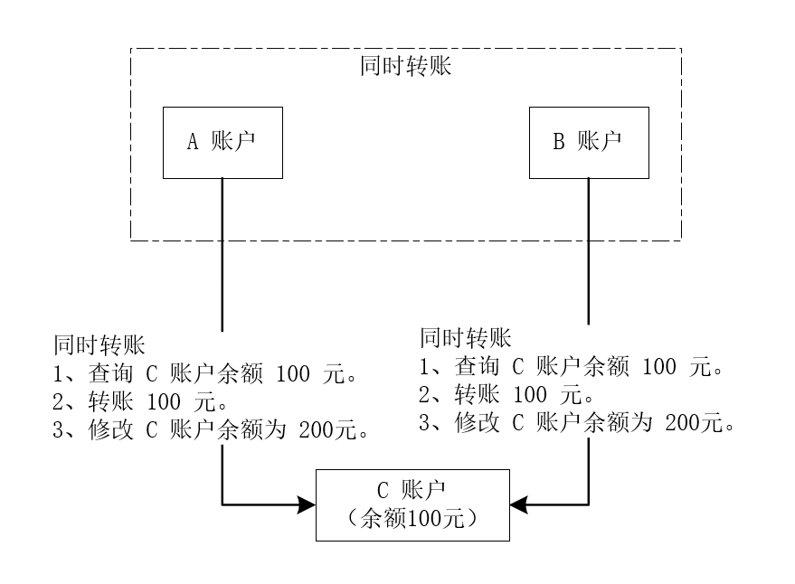

# Java面试全解析-线程安全之Synchronized和ReentrantLock

---

前面我们介绍了很多关于多线程的内容，在多线程中有一个很重要的课题需要我们攻克，那就是线程安全问题。线程安全问题指的是在多线程中，各线程之间因为同时操作所产生的数据污染或其他非预期的程序运行结果。

### 线程安全

1、非线程安全事例

比如 A 和 B 同时给 C 转账的问题，假设 C 原本余额有 100 元，A 给 C 转账 100 元，正在转的途中，此时 B 也给 C 转了 100 元，这个时候 A 先给 C 转账成功，余额变成了 200 元，但 B 事先查询 C 的余额是 100 元，转账成功之后也是 200 元。当 A 和 B 都给 C 转账完成之后，余额还是 200 元，而非预期的 300 元，这就是典型的线程安全的问题。

2、非线程安全代码示例

上面的内容没看明白没关系，下面来看非线程安全的具体代码：

~~~java
class ThreadSafeTest {
	static int number = 0;
	public static void main(String[] args) throws InterruptedException {
		Thread thread1 = new Thread(() -> addNumber());
		Thread thread2 = new Thread(() -> addNumber());
		thread1.start();
		thread2.start();
		thread1.join();
		thread2.join();
		System.out.println("number：" + number);
	}
	public static void addNumber() {
		for (int i = 0; i < 10000; i++) {
			++number;
		}
	}
}
~~~

以上程序执行结果如下：

~~~plaintext
number：12085
~~~

每次执行的结果可能略有差异，不过几乎不会等于（正确的）累计之和 20000。

3、线程安全的解决方案

线程安全的解决方案有以下几个维度：

* 数据不共享，单线程可见，比如 ThreadLocal 就是单线程可见的；
* 使用线程安全类，比如 StringBuffer 和 JUC（java.util.concurrent）下的安全类（后面文章会专门介绍）；
* 使用同步代码或者锁。

### 线程同步和锁

1、synchronized

synchronized 介绍

synchronized 是 Java 提供的同步机制，当一个线程正在操作同步代码块（synchronized 修饰的代码）时，其他线程只能阻塞等待原有线程执行完再执行。

synchronized 使用

synchronized 可以修饰代码块或者方法，示例代码如下：

~~~java
// 修饰代码块
synchronized (this) {
	// do something
}
// 修饰方法
synchronized void method() {
	// do something
}
~~~

使用 synchronized 完善本文开头的非线程安全的代码。

方法一：使用 synchronized 修饰代码块，代码如下：

~~~java
class ThreadSafeTest {
	static int number = 0;
	public static void main(String[] args) throws InterruptedException {
		Thread sThread = new Thread(() -> {
			// 同步代码
			synchronized (ThreadSafeTest.class) {
				addNumber();
			}
		});
		Thread sThread2 = new Thread(() -> {
			// 同步代码
			synchronized (ThreadSafeTest.class) {
				addNumber();
			}
		});
		sThread.start();
		sThread2.start();
		sThread.join();
		sThread2.join();
		System.out.println("number：" + number);
	}
	public static void addNumber() {
		for (int i = 0; i < 10000; i++) {
			++number;
		}
	}
}
~~~

以上程序执行结果如下：

~~~plaintext
number：20000
~~~

方法二：使用 synchronized 修饰方法，代码如下：

~~~java
class ThreadSafeTest {
	static int number = 0;
	public static void main(String[] args) throws InterruptedException {
		Thread sThread = new Thread(() -> addNumber());
		Thread sThread2 = new Thread(() -> addNumber());
		sThread.start();
		sThread2.start();
		sThread.join();
		sThread2.join();
		System.out.println("number：" + number);
	}
	public synchronized static void addNumber() {
		for (int i = 0; i < 10000; i++) {
			++number;
		}
	}
}
~~~

以上程序执行结果如下：

~~~plaintext
number：20000
~~~

synchronized 实现原理

synchronized 本质是通过进入和退出的 Monitor 对象来实现线程安全的。以下面代码为例：

~~~java
public class SynchronizedTest {
	public static void main(String[] args) {
		synchronized (SynchronizedTest.class) {
			System.out.println("Java");
		}
	}
}
~~~

当我们使用 javap 编译之后，生成的字节码如下：

~~~java
Compiled from "SynchronizedTest.java"
public class com.interview.other.SynchronizedTest {
  public com.interview.other.SynchronizedTest();
    Code:
       0: aload_0
       1: invokespecial #1                  // Method java/lang/Object."<init>":()V
       4: return
  public static void main(java.lang.String[]);
    Code:
       0: ldc           #2                  // class com/interview/other/SynchronizedTest
       2: dup
       3: astore_1
       4: monitorenter
       5: getstatic     #3                  // Field java/lang/System.out:Ljava/io/PrintStream;
       8: ldc           #4                  // String Java
      10: invokevirtual #5                  // Method java/io/PrintStream.println:(Ljava/lang/String;)V
      13: aload_1
      14: monitorexit
      15: goto          23
      18: astore_2
      19: aload_1
      20: monitorexit
      21: aload_2
      22: athrow
      23: return
    Exception table:
       from    to  target type
           5    15    18   any
          18    21    18   any
}
~~~

可以看出 JVM（Java 虚拟机）是采用 monitorenter 和 monitorexit 两个指令来实现同步的，monitorenter 指令相当于加锁，monitorexit 相当于释放锁。而 monitorenter 和 monitorexit 就是基于 Monitor 实现的。

2、ReentrantLock

ReentrantLock 介绍

ReentrantLock（再入锁）是 Java 5 提供的锁实现，它的功能和 synchronized 基本相同。再入锁通过调用 lock() 方法来获取锁，通过调用 unlock() 来释放锁。

ReentrantLock 使用

ReentrantLock 基础使用，代码如下：

~~~java
Lock lock = new ReentrantLock();
lock.lock(); //加锁
// 业务代码...
lock.unlock(); //解锁
~~~

使用 ReentrantLock 完善本文开头的非线程安全代码，请参考以下代码：

~~~java
public class LockTest {
	static int number = 0;
	public static void main(String[] args) throws InterruptedException {
		// ReentrantLock 使用
		Lock lock = new ReentrantLock();
		Thread thread1 = new Thread(() -> {
			try {
				lock.lock();
				addNumber();
			} finally {
				lock.unlock();
			}
		});
		Thread thread2 = new Thread(() -> {
			try {
				lock.lock();
				addNumber();
			} finally {
				lock.unlock();
			}
		});
		thread1.start();
		thread2.start();
		thread1.join();
		thread2.join();
		System.out.println("number：" + number);
	}
	public static void addNumber() {
		for (int i = 0; i < 10000; i++) {
			++number;
		}
	}
}
~~~

尝试获取锁

ReentrantLock 可以无阻塞尝试访问锁，使用 tryLock() 方法，具体使用如下：

~~~java
Lock reentrantLock = new ReentrantLock();
// 线程一
new Thread(() -> {
	try {
		reentrantLock.lock();
		Thread.sleep(2 * 1000);
	} catch (InterruptedException e) {
		e.printStackTrace();
	} finally {
		reentrantLock.unlock();
	}
}).start();
// 线程二
new Thread(() -> {
	try {
		Thread.sleep(1 * 1000);
		System.out.println(reentrantLock.tryLock());
		Thread.sleep(2 * 1000);
		System.out.println(reentrantLock.tryLock());
	} catch (InterruptedException e) {
		e.printStackTrace();
	}
}).start();
~~~

以上代码执行结果如下：

~~~plaintext
false
true
~~~

尝试一段时间内获取锁

tryLock() 有一个扩展方法 tryLock(long timeout, TimeUnit unit) 用于尝试一段时间内获取锁，具体实现代码如下：

~~~java
Lock reentrantLock = new ReentrantLock();
// 线程一
new Thread(() -> {
	try {
		reentrantLock.lock();
		System.out.println(LocalDateTime.now());
		Thread.sleep(2 * 1000);
	} catch (InterruptedException e) {
		e.printStackTrace();
	} finally {
		reentrantLock.unlock();
	}
}).start();
// 线程二
new Thread(() -> {
	try {
		Thread.sleep(1 * 1000);
		System.out.println(reentrantLock.tryLock(3, TimeUnit.SECONDS));
		System.out.println(LocalDateTime.now());
	} catch (InterruptedException e) {
		e.printStackTrace();
	}
}).start();
~~~

以上代码执行结果如下：

~~~plaintext
2019-07-05 19:53:51
true
2019-07-05 19:53:53
~~~

可以看出锁在休眠了 2 秒之后，就被线程二直接获取到了，所以说 tryLock(long timeout, TimeUnit unit) 方法内的 timeout 参数指的是获取锁的最大等待时间。

ReentrantLock 注意事项

使用 ReentrantLock 一定要记得释放锁，否则该锁会被永久占用。

### 相关面试题

1.ReentrantLock 常用的方法有哪些？

答：ReentrantLock 常见方法如下：

* lock()：用于获取锁
* unlock()：用于释放锁
* tryLock()：尝试获取锁
* getHoldCount()：查询当前线程执行 lock() 方法的次数
* getQueueLength()：返回正在排队等待获取此锁的线程数
* isFair()：该锁是否为公平锁

2.ReentrantLock 有哪些优势？

* ReentrantLock 具备非阻塞方式获取锁的特性，使用 tryLock() 方法。
* ReentrantLock 可以中断获得的锁，使用 lockInterruptibly() 方法当获取锁之后，如果所在的线程被中断，则会抛出异常并释放当前获得的锁。
* ReentrantLock 可以在指定时间范围内获取锁，使用 tryLock(long timeout,TimeUnit unit) 方法。

3.ReentrantLock 怎么创建公平锁？

答：new ReentrantLock() 默认创建的为非公平锁，如果要创建公平锁可以使用 new ReentrantLock(true)。

4.公平锁和非公平锁有哪些区别？

答：公平锁指的是线程获取锁的顺序是按照加锁顺序来的，而非公平锁指的是抢锁机制，先 lock() 的线程不一定先获得锁。

5.ReentrantLock 中 lock() 和 lockInterruptibly() 有什么区别？

答：lock() 和 lockInterruptibly() 的区别在于获取线程的途中如果所在的线程中断，lock() 会忽略异常继续等待获取线程，而 lockInterruptibly() 则会抛出 InterruptedException 异常。

题目解析：执行以下代码，在线程中分别使用 lock() 和 lockInterruptibly() 查看运行结果，代码如下：

~~~java
Lock interruptLock = new ReentrantLock();
interruptLock.lock();
Thread thread = new Thread(new Runnable() {
	@Override
	public void run() {
		try {
			interruptLock.lock();
			//interruptLock.lockInterruptibly();  // java.lang.InterruptedException
		} catch (Exception e) {
			e.printStackTrace();
		}
	}
});
thread.start();
TimeUnit.SECONDS.sleep(1);
thread.interrupt();
TimeUnit.SECONDS.sleep(3);
System.out.println("Over");
System.exit(0);
~~~

执行以下代码会发现使用 lock() 时程序不会报错，运行完成直接退出；而使用 lockInterruptibly() 则会抛出异常 java.lang.InterruptedException，这就说明：在获取线程的途中如果所在的线程中断，lock() 会忽略异常继续等待获取线程，而 lockInterruptibly() 则会抛出 InterruptedException 异常。

6.synchronized 和 ReentrantLock 有什么区别？

答：synchronized 和 ReentrantLock 都是保证线程安全的，它们的区别如下：

* ReentrantLock 使用起来比较灵活，但是必须有释放锁的配合动作；
* ReentrantLock 必须手动获取与释放锁，而 synchronized 不需要手动释放和开启锁；
* ReentrantLock 只适用于代码块锁，而 synchronized 可用于修饰方法、代码块等；
* ReentrantLock 性能略高于 synchronized。

7.ReentrantLock 的 tryLock(3, TimeUnit.SECONDS) 表示等待 3 秒后再去获取锁，这种说法对吗？为什么？

答：不对，tryLock(3, TimeUnit.SECONDS) 表示获取锁的最大等待时间为 3 秒，期间会一直尝试获取，而不是等待 3 秒之后再去获取锁。

8.synchronized 是如何实现锁升级的？

答：在锁对象的对象头里面有一个 threadid 字段，在第一次访问的时候 threadid 为空，JVM（Java 虚拟机）让其持有偏向锁，并将 threadid 设置为其线程 id，再次进入的时候会先判断 threadid 是否尤其线程 id 一致，如果一致则可以直接使用，如果不一致，则升级偏向锁为轻量级锁，通过自旋循环一定次数来获取锁，不会阻塞，执行一定次数之后就会升级为重量级锁，进入阻塞，整个过程就是锁升级的过程。

### 总结

本文介绍了线程同步的两种方式 synchronized 和 ReentrantLock，其中 ReentrantLock 使用更加灵活，效率也率高，不过 ReentrantLock 只能修饰代码块，使用 ReentrantLock 需要开发者手动释放锁，如果忘记释放则该锁会一直被占用。synchronized 使用场景更广，可以修饰普通方法、静态方法和代码块等。

   

---

