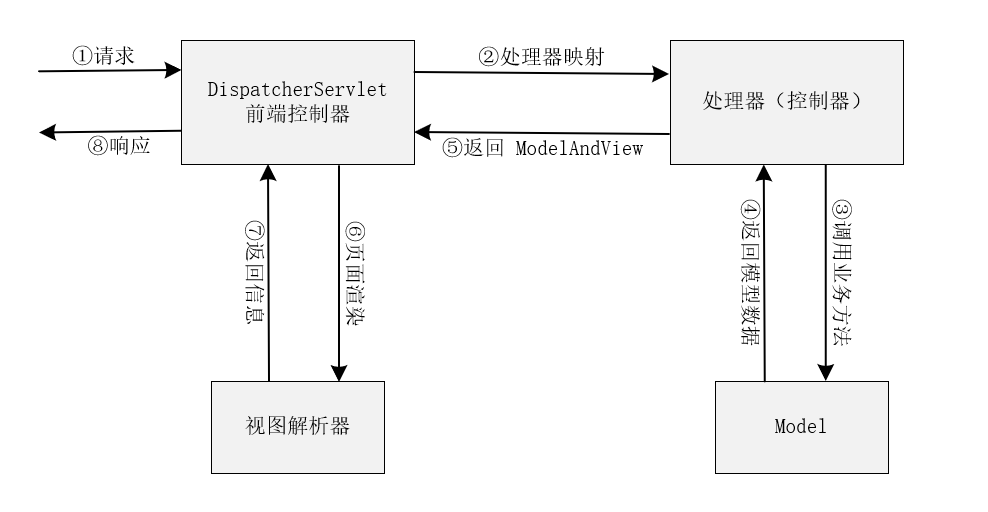
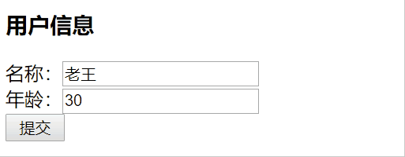
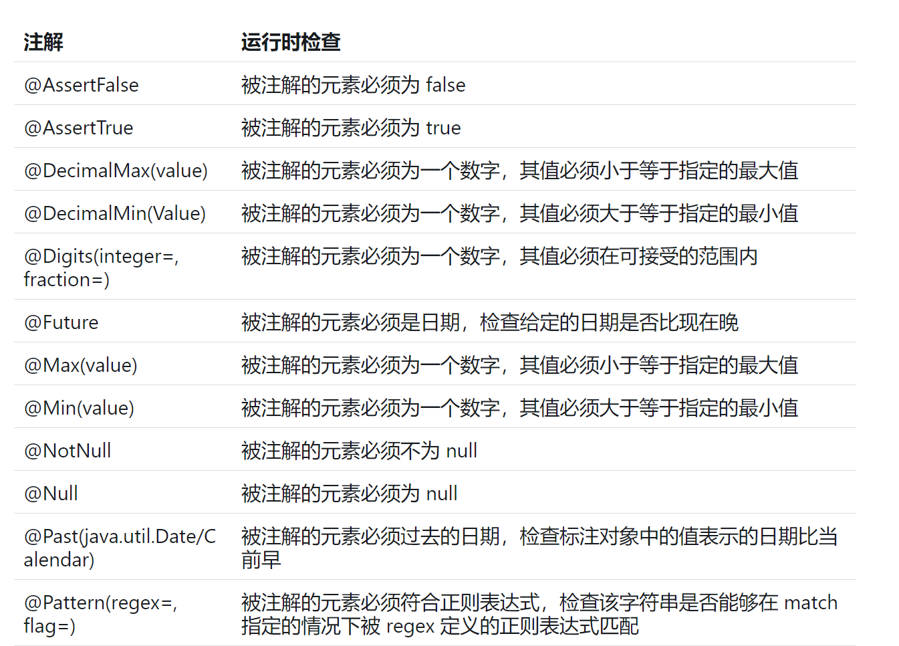

# Java面试全解析-SpringMVC核心组件

---

### Spring MVC 介绍

Spring MVC（Spring Web MVC）是 Spring Framework 提供的 Web 组件，它的实现基于 MVC 的设计模式：Controller（控制层）、Model（模型层）、View（视图层），提供了前端路由映射、视图解析等功能，让 Java Web 开发变得更加简单，也属于 Java 开发中必须要掌握的热门框架。

1、执行流程

Spring MVC 的执行流程如下：

* 客户端发送请求至前端控制器（DispatcherServlet）
* 前端控制器根据请求路径，进入对应的处理器
* 处理器调用相应的业务方法
* 处理器获取到相应的业务数据
* 处理器把组装好的数据交还给前端控制器
* 前端控制器将获取的 ModelAndView 对象传给视图解析器（ViewResolver）
* 前端控制器获取到解析好的页面数据
* 前端控制器将解析好的页面返回给客户端

流程如下图所示：

2、核心组件

Spring MVC 的核心组件如下列表所示：

* DispatcherServlet：核心处理器（也叫前端控制器），负责调度其他组件的执行，可降低不同组件之间的耦合性，是整个 Spring MVC 的核心模块。
* Handler：处理器，完成具体业务逻辑，相当于 Servlet 或 Action。
* HandlerMapping：DispatcherServlet 是通过 HandlerMapping 将请求映射到不同的 Handler。
* HandlerInterceptor：处理器拦截器，是一个接口，如果我们需要做一些拦截处理，可以来实现这个接口。
* HandlerExecutionChain：处理器执行链，包括两部分内容，即 Handler 和 HandlerInterceptor（系统会有一个默认的 HandlerInterceptor，如果需要额外拦截处理，可以添加拦截器设置）。
* HandlerAdapter：处理器适配器，Handler 执行业务方法之前，需要进行一系列的操作包括表单数据的验证、数据类型的转换、将表单数据封装到 POJO 等，这一系列的操作，都是由 HandlerAdapter 来完成，DispatcherServlet 通过 HandlerAdapter 执行不同的 Handler。
* ModelAndView：装载了模型数据和视图信息，作为 Handler 的处理结果，返回给 DispatcherServlet。
* ViewResolver：视图解析器，DispatcherServlet 通过它将逻辑视图解析成物理视图，最终将渲染结果响应给客户端。

3、自动类型转换

自动类型转换指的是，Spring MVC 可以将表单中的字段，自动映射到实体类的对应属性上，请参考以下示例。

1）JSP 页面代码

~~~jsp
<%@ page contentType="text/html;charset=UTF-8" language="java" %>
<html>
<body>
<form action="add">
	名称：<input type="input" name="name"> 
	年龄：<input type="input" name="age"> 
	<input type="submit" value=" 提交 ">
</form>
</body>
</html>
~~~

2）编写实体类

~~~java
public class PersonDTO {
	private String name;
	private int age;
	public String getName() {
		return name;
	}
	public void setName(String name) {
		this.name = name;
	}
	public int getAge() {
		return age;
	}
	public void setAge(int age) {
		this.age = age;
	}
}
~~~

3）编写控制器

~~~java
import org.springframework.web.bind.annotation.RequestMapping;
import org.springframework.web.bind.annotation.RestController;
@RestController
public class PersonController {
	@RequestMapping(value="/add", produces="text/plain;charset=utf-8")
	public String add(PersonVO person) {
		return person.getName() + ":" + person.getAge();
	}
}
~~~

4）执行结果

执行结果如下图所示：

4、中文乱码处理

业务的操作过程中可能会出现中文乱码的情况，以下是处理中文乱码的解决方案。

第一步，在 web.xml 添加编码过滤器，配置如下：

~~~xml
<filter>
	<filter-name>encodingFilter</filter-name>
	<filter-class>org.springframework.web.filter.CharacterEncodingFilter</filter-class>
	<init-param>
		<param-name>encoding</param-name>
		<param-value>UTF-8</param-value>
	</init-param>
</filter>
<filter-mapping>
	<filter-name>encodingFilter</filter-name>
	<url-pattern>/*</url-pattern>
</filter-mapping>
~~~

第二步，设置 RequestMapping 的 produces 属性，指定返回值类型和编码，如下所示：

~~~java
@RequestMapping(value  = "/add", produces = "text/plain;charset=utf-8")
~~~

5、拦截器

在 Spring MVC 中可以通过配置和实现 HandlerInterceptor 接口，来实现自己的拦截器。

1）配置全局拦截器

在 Spring MVC 的配置文件中，添加如下配置：

~~~xml
<mvc:interceptors>
	<bean class="com.learning.core.MyInteceptor"></bean>
</mvc:interceptors>
~~~

2）添加拦截器实现代码

拦截器的实现代码如下：

~~~java
import org.springframework.web.servlet.HandlerInterceptor;
import org.springframework.web.servlet.ModelAndView;
import javax.servlet.http.HttpServletRequest;
import javax.servlet.http.HttpServletResponse;
/**
 * 拦截器
 **/
public class MyInteceptor implements HandlerInterceptor {
	// 在业务处理器处理请求之前被调用
	public boolean preHandle(HttpServletRequest request, HttpServletResponse response, Object handler) throws Exception {
		System.out.println("preHandle");
		return true;
	}
	// 在业务处理器处理请求完成之后，生成视图之前执行
	public void postHandle(HttpServletRequest request, HttpServletResponse response, Object handler, ModelAndView modelAndView) throws Exception {
		System.out.println("postHandle");
	}
	// 在 DispatcherServlet 完全处理完请求之后被调用
	public void afterCompletion(HttpServletRequest request, HttpServletResponse response, Object handler, Exception ex) throws Exception {
		System.out.println("afterCompletion");
	}
}
~~~

6、参数验证

1）pom.xml 添加验证依赖包

配置如下：

~~~xml
<!-- Hibernate 参数验证包 -->
<dependency>
	<groupId>org.hibernate.validator</groupId>
	<artifactId>hibernate-validator</artifactId>
	<version>6.0.17.Final</version>
</dependency>
~~~

2）开启注解验证

在 Spring MVC 的配置文件中，添加如下配置信息：

~~~xml
<mvc:annotation-driven />
~~~

3）编写控制器

代码如下：

~~~java
import com.google.gson.JsonObject;
import com.learning.pojo.PersonDTO;
import org.springframework.validation.BindingResult;
import org.springframework.validation.ObjectError;
import org.springframework.validation.annotation.Validated;
import org.springframework.web.bind.annotation.RequestMapping;
import org.springframework.web.bind.annotation.RestController;
import java.util.List;

@RestController
public class PersonController {
	@RequestMapping(value="/check", produces="text/plain;charset=utf-8")
	public String check(@Validated PersonDTO person, BindingResult bindResult) {
		// 需要 import com.google.gson.Gson
		JsonObject result = new JsonObject();
		StringBuilder errmsg = new StringBuilder();
		if (bindResult.hasErrors()) {
			List<ObjectError> errors = bindResult.getAllErrors();
			for (ObjectError error : errors) {
				errmsg.append(error.getDefaultMessage());
			}
			result.addProperty("status", -1);
		} else {
			result.addProperty("status", 1);
		}
		result.addProperty("errmsg", errmsg.toString());
		return result.toString();
	}
}
~~~

4）编写实体类

代码如下：

~~~java
import javax.validation.constraints.Min;
import javax.validation.constraints.NotNull;
public class PersonDTO {
	@NotNull(message = "姓名不能为空")
	private String name;
	@Min(value = 18,message = "年龄不能低于18岁")
	private int age;
	public String getName() {
		return name;
	}
	public void setName(String name) {
		this.name = name;
	}
	public int getAge() {
		return age;
	}
	public void setAge(int age) {
		this.age = age;
	}
}
~~~

更多验证注解，如下所示：

5）执行结果

执行结果，如下图所示：

### 相关面试题

1. 简述一下 Spring MVC 的执行流程？

答：前端控制器（DispatcherServlet） 接收请求，通过映射从 IoC 容器中获取对应的 Controller 对象和 Method 方法，在方法中进行业务逻辑处理组装数据，组装完数据把数据发给视图解析器，视图解析器根据数据和页面信息生成最终的页面，然后再返回给客户端。

2. POJO 和 JavaBean 有什么区别？

答：POJO 和 JavaBean 的区别如下：

* POJO（Plain Ordinary Java Object）普通 Java 类，具有 getter/setter 方法的普通类都就可以称作 POJO，它是 DO/DTO/BO/VO 的统称，禁止命名成 xxxPOJO。
* JavaBean 是 Java 语言中的一种可重用组件，JavaBean 的构造函数和行为必须符合特定的约定：这个类必须有一个公共的缺省构造函数；这个类的属性使用 getter/setter 来访问，其他方法遵从标准命名规范；这个类应是可序列化的。

简而言之，当一个 POJO 可序列化，有一个无参的构造函数，它就是一个 JavaBean。

3. 如何实现跨域访问？

答：常见的跨域的实现方式有两种：使用 JSONP 或者在服务器端设置运行跨域。服务器运行跨域的代码如下：

~~~java
import org.springframework.context.annotation.Bean;
import org.springframework.context.annotation.Configuration;
import org.springframework.web.servlet.config.annotation.CorsRegistry;
import org.springframework.web.servlet.config.annotation.WebMvcConfigurer;
@Configuration
public class MyConfiguration {
	@Bean
	public WebMvcConfigurer corsConfigurer() {
		return new WebMvcConfigurer() {
			@Override
			public void addCorsMappings(CorsRegistry registry) {
				// 设置允许跨域的请求规则
				registry.addMapping("/api/**");
			}
		};
	}
}
~~~

4. 以下代码描述正确的是？

~~~java
@RequestMapping(value="/list", params={"age=10"}
public String list(){
	// do something
}
~~~

A：age 参数不传递的时候，默认值是 10

B：age 参数可以为空

C：age 参数不能为空

D：以上都不对

答：C

题目解析：params={"age=10"} 表示必须包含 age 参数，且值必须等于 10。

5. @RequestMapping 注解的常用属性有哪些？

答：@RequestMapping 常用属性如下：

* value：指定 URL 请求的实际地址，用法：`@RequestMapping(value="/index")`；
* method：指定请求的 method 类型，如 GET/POST/PUT/DELETE 等，用法：`@RequestMapping(value="/list", method=RequestMethod.POST)`；
* params：指定请求参数中必须包含的参数名称，如果不存在该名称，则无法调用此方法，用法：`@RequestMapping(value="/list",params={"name","age"})`。

6. 访问以下接口不传递任何参数的情况下，执行的结果是？

~~~java
@RequestMapping(value="/list")
@ResponseBody
public String list(int id){
	return "id="+id;
}
~~~

A：id=0

B：id=

C：页面报错 500

D：id=null

答：C

题目解析：页面报错会提示：可选的参数“id”不能转为 null，因为基本类型不能赋值 null，所以会报错。

7.访问页面时显示 403 代表的含义是？

A：服务器繁忙

B：找不到该页面

C：禁止访问

D：服务器跳转中

答：C

题目解析：常用 HTTP 状态码及对应的含义：

* 400：错误请求，服务器不理解请求的语法；
* 401：未授权，请求要求身份验证；
* 403：禁止访问，服务器拒绝请求；
* 500：服务器内部错误，服务器遇到错误，无法完成请求；
* 502：错误网关，服务器作为网关或代理，从上游服务器收到无效响应；
* 504：网关超时，服务器作为网关或代理，但是没有及时从上游服务器收到请求；

8.forward 和 redirect 有什么区别？

答：forward 和 redirect 区别如下：

* forward 表示请求转发，请求转发是服务器的行为；redirect 表示重定向，重定向是客户端行为；
* forward 是服务器请求资源，服务器直接访问把请求的资源转发给浏览器，浏览器根本不知道服务器的内容是从哪来的，因此它的地址栏还是原来的地址；redirect 是服务端发送一个状态码告诉浏览器重新请求新的地址，因此地址栏显示的是新的 URL；
* forward 转发页面和转发到的页面可以共享 request 里面的数据；redirect 不能共享数据；
* 从效率来说，forward 比 redirect 效率更高。

9. 访问以下接口不传递任何参数的情况下，执行的结果是？

~~~java
@RequestMapping(value="/list")
@ResponseBody
public String list(Integer id){
	return "id="+id;
}
~~~

A：id=0

B：id=

C：页面报错 500

D：id=null

答：D

题目解析：包装类可以赋值 null，不会报错。

10. Spring MVC 中如何在后端代码中实现页面跳转？

答：在后端代码中可以使用 `forward:/index.jsp` 或 `redirect:/index.jsp` 完成页面跳转，前者 URL 地址不会发生改变，或者 URL 地址会发生改变，完整跳转代码如下：

~~~java
@RequestMapping("/redirect")
public String redirectTest(){
	return "redirect:/index.jsp";
}
~~~

11. Spring MVC 的常用注解有哪些？

答：Spring MVC 的常用注解如下：

* @Controller：用于标记某个类为控制器；
* @ResponseBody ：标识返回的数据不是 html 标签的页面，而是某种格式的数据，如 JSON、XML 等；
* @RestController：相当于 @Controller 加 @ResponseBody 的组合效果；
* @Component：标识为 Spring 的组件；
* @Configuration：用于定义配置类；
* @RequestMapping：用于映射请求地址的注解；
* @Autowired：自动装配对象；
* @RequestHeader：可以把 Request 请求的 header 值绑定到方法的参数上。

12. 拦截器的使用场景有哪些？

答：拦截器的典型使用场景如下：

* 日志记录：可用于记录请求日志，便于信息监控和信息统计；
* 权限检查：可用于用户登录状态的检查；
* 统一安全处理：可用于统一的安全效验或参数的加密 / 解密等。

13. Spring MVC 如何排除拦截目录？

答：在 Spring MVC 的配置文件中，添加 ，用于排除拦截目录，完整配置的示例代码如下：

~~~xml
<mvc:interceptors>
	<mvc:interceptor>
		<mvc:mapping path="/**" />
		<!-- 排除拦截地址 -->
		<mvc:exclude-mapping path="/api/**" />
		<bean class="com.learning.core.MyInteceptor"></bean>
	</mvc:interceptor>
</mvc:interceptors>
~~~

14.@Validated 和 @Valid 有什么区别 ？

答：@Validated 和 @Valid 都用于参数的效验，不同的是：

* @Valid 是 Hibernate 提供的效验机制，Java 的 JSR 303 声明了 @Valid 这个类接口，而 Hibernate-validator 对其进行了实现；@Validated 是 Spring 提供的效验机制，@Validation 是对 @Valid 进行了二次封装，提供了分组功能，可以在参数验证时，根据不同的分组采用不同的验证机制；
* @Valid 可用在成员对象的属性字段验证上，而 @Validated 不能用在成员对象的属性字段验证上，也就是说 @Validated 无法提供嵌套验证。

15.Spring MVC 有几种获取 request 的方式？

答：Spring MVC 获取 request 有以下三种方式：

1）从请求参数中获取

示例代码：

~~~java
@RequestMapping("/index")
@ResponseBody
public void index(HttpServletRequest request){
	// do something
}
~~~

该方法实现的原理是 Controller 开始处理请求时，Spring 会将 request 对象赋值到方法参数中。

2） 通过 RequestContextHolder上下文获取 request 对象

示例代码：

~~~java
@RequestMapping("/index")
@ResponseBody
public void index(){
	ServletRequestAttributes servletRequestAttributes = (ServletRequestAttributes)RequestContextHolder.getRequestAttributes();
	HttpServletRequest request = servletRequestAttributes.getRequest();
	// do something
}
~~~

3）通过自动注入的方式

~~~java
@Controller
public class HomeController{
	@Autowired
	private HttpServletRequest request; //自动注入 request 对象
	// do something
}
~~~

### 总结

本文我们了解了 Spring MVC 运行的 8 个步骤和它的 8 大核心组件，也尝试了 Spring MVC 方面的类型转换，可将表单自动转换为实体对象，也使用 Hibernate 的验证功能优雅地实现了参数的验证，还可以通过配置和实现 HandlerInterceptor 接口来自定义拦截器，相信有了这些知识，可以帮助我们更高效地开发 Web 和接口项目。

   

---

