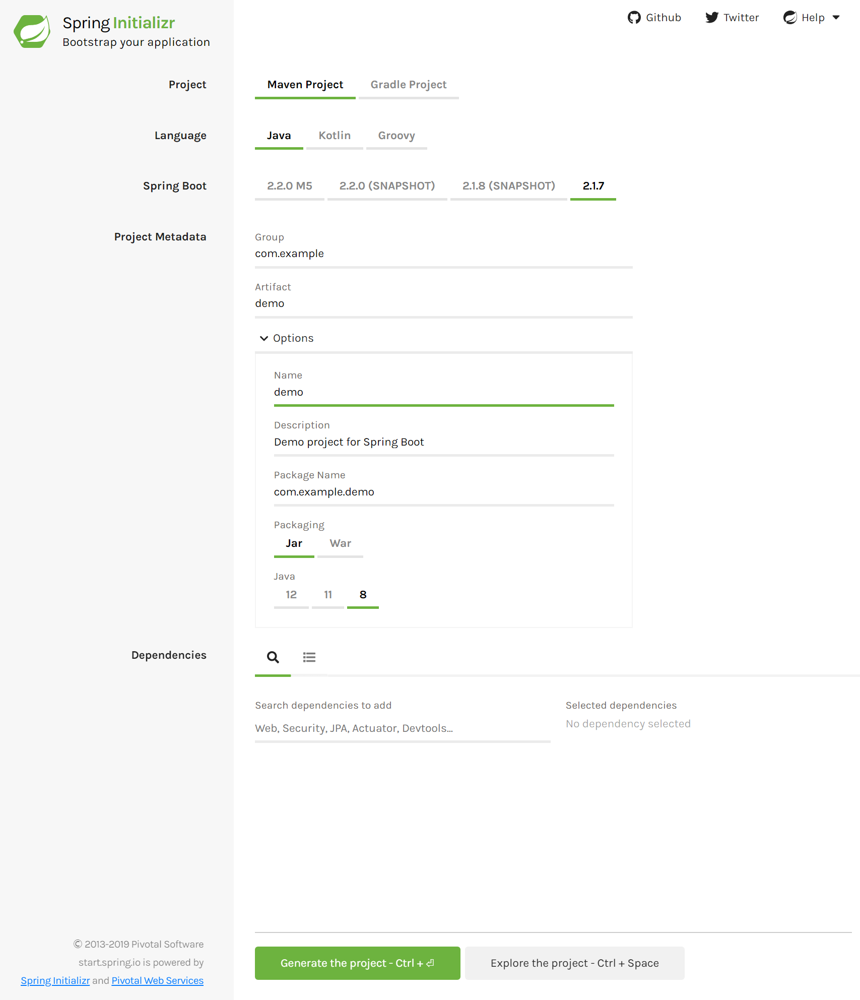
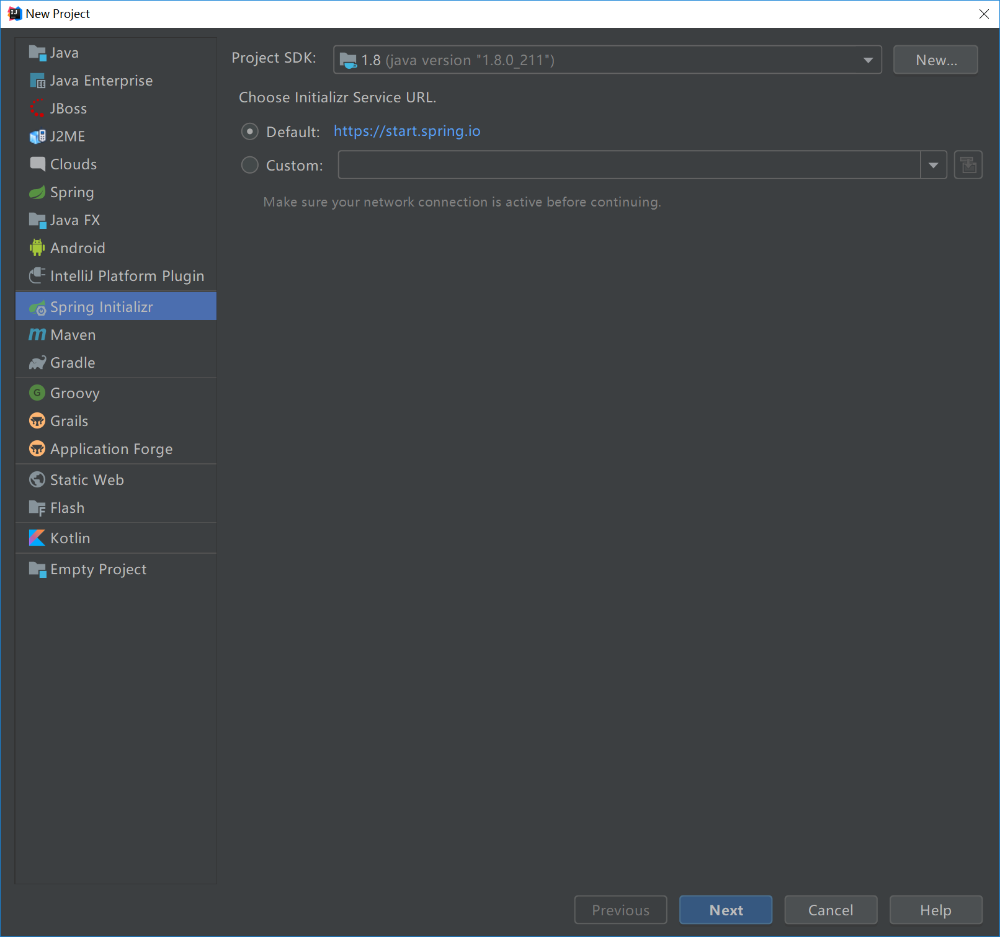
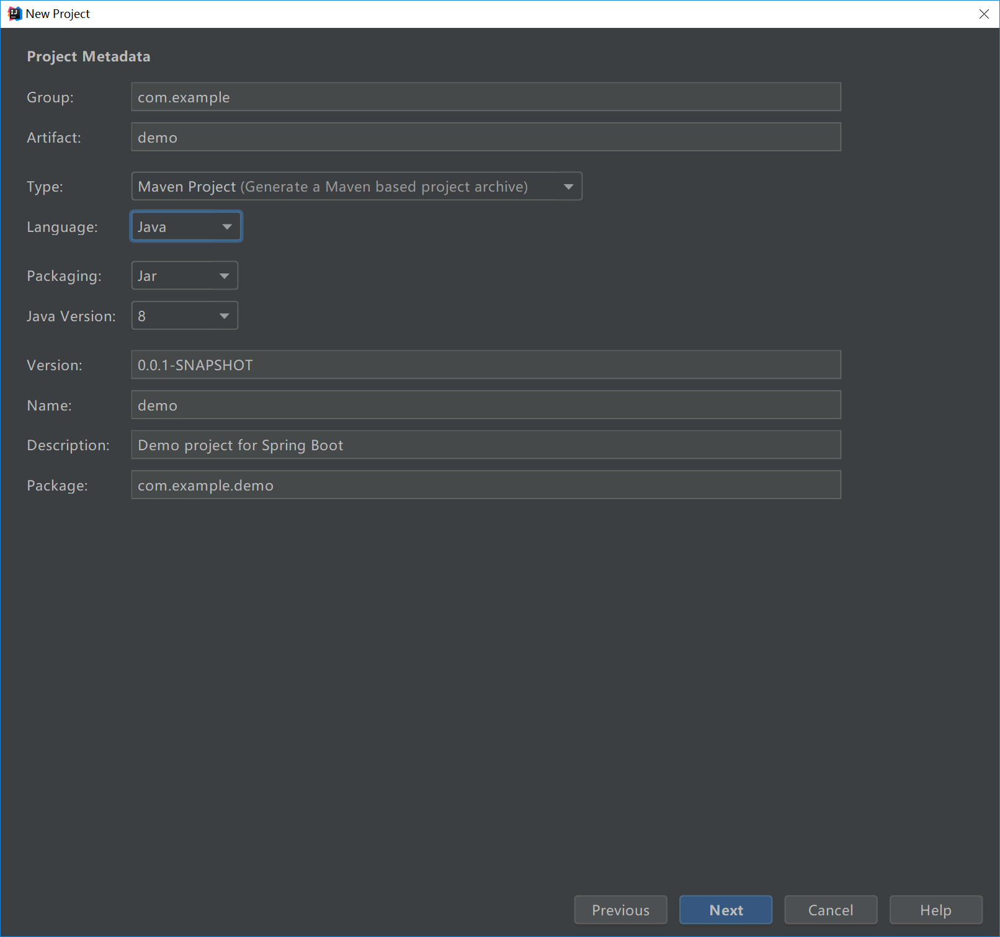
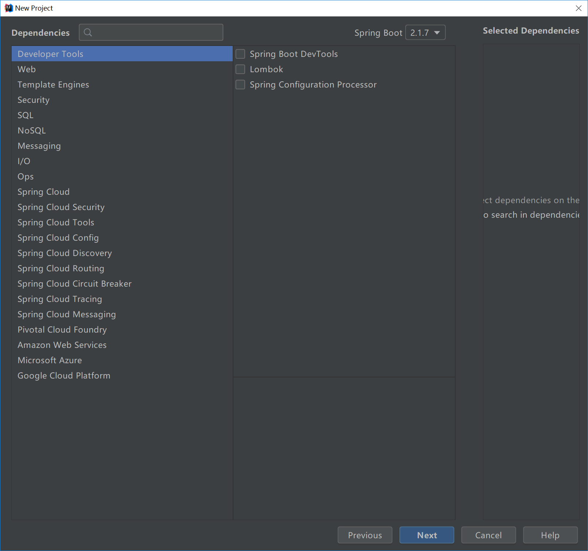
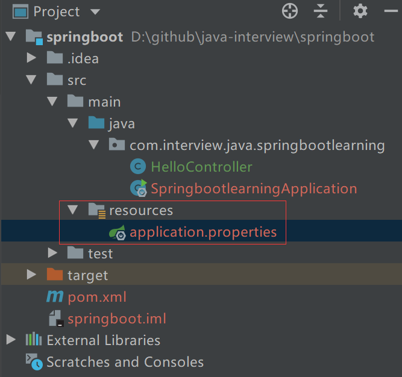
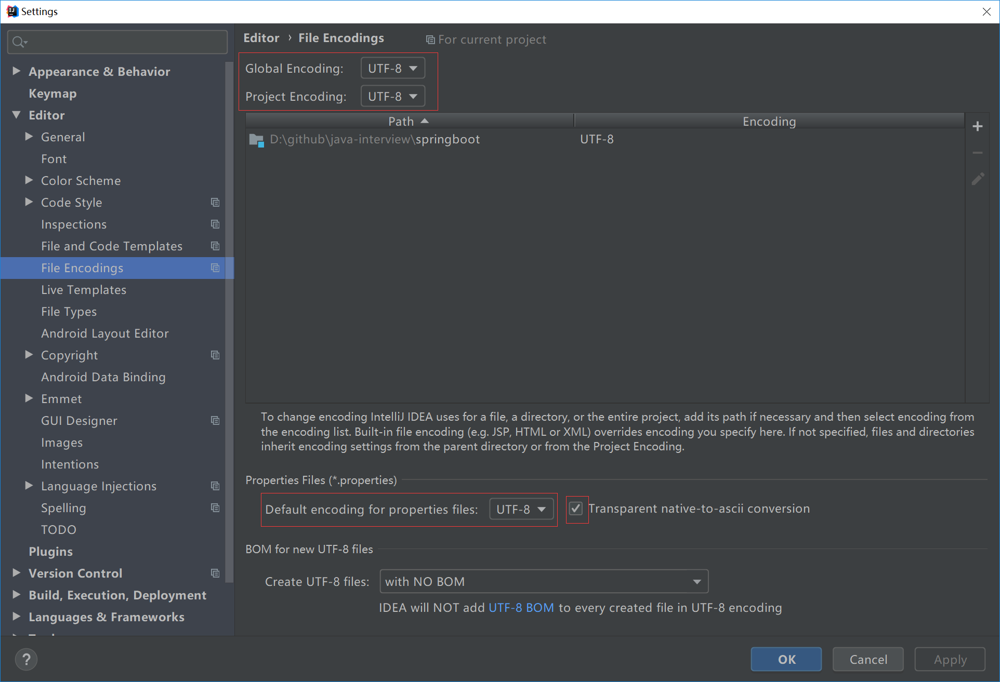

# Java面试全解析-SpringBoot

---

### 概述

1、为什么要用 Spring Boot？

Spring Boot 来自于 Spring 大家族，是 Spring 官方团队（Pivotal 团队）提供的全新框架，它的诞生解决了 Spring 框架使用较为繁琐的问题。Spring Boot 的核心思想是约定优于配置，让开发人员不需要配置任何 XML 文件，就可以像 Maven 整合 Jar 包一样，整合并使用所有框架。

2、Spring Boot 特性

* 秒级构建一个项目；
* 便捷的对外输出格式，如 REST API、WebSocket、Web 等；
* 简洁的安全集成策略；
* 内嵌容器运行，如 Tomcat、Jetty；
* 强大的开发包，支持热启动；
* 自动管理依赖；
* 自带应用监控。

3、Spring Boot 2 对系统环境的要求

* Java 8+
* Gradle 4+ or Maven 3.2+
* Tomcat 8+

### Spring Boot 使用

在开始之前，我们先来创建一个Spring Boot 项目。

Spring Boot 有两种快速创建的方式：Spring 官网在线网站创建和 IntelliJ IDEA 的 Spring Initializr 创建，下面分别来看。

1、创建 Spring Boot 项目

1）在线网站创建

在浏览器输入 https://start.spring.io， 页面打开如下图所示：

填写相应的项目信息，选择对应的 Spring Boot 和 Java 版本点击 “Generate the project”按钮下载项目压缩文件，解压后用 IDEA 打开即可。

其中 Group 和 Artifact 是 Maven 项目用来确认依赖项目的标识，比如：

~~~xml
<dependency>
	<groupId>org.springframework</groupId>
	<artifactId>spring-core</artifactId>
	<version>4.1.6.RELEASE</version>
</dependency>
~~~

Group 对应的是配置文件的 groupId，相当于项目的包名；而 Artifact 对应的是配置文件的 artifactId，相当于项目名。

2）使用 IntelliJ IDEA 创建

① 新建项目 → 选择 Spring Initialzr，如下图所示：

② 点击 Next 按钮，填写对应的项目信息（和在线网站创建的字段基本相同），如下图所示：

③ 点击 Next 按钮，选择相应的依赖信息，如下图所示：

④ 点击 Next 按钮，选择项目保存的路径，点击 Finish 创建项目完成，如下图所示：

2、创建一个 Web 应用

1）pom.xml 中添加 Web 模块的依赖，如下所示：

~~~xml
<dependency>
	<groupId>org.springframework.boot</groupId>
	<artifactId>spring-boot-starter-web</artifactId>
</dependency>
~~~

2）创建后台代码

~~~java
import org.springframework.web.bind.annotation.RequestMapping;
import org.springframework.web.bind.annotation.RestController;

@RestController
public class HelloController {
	@RequestMapping("/index")
	public String index(String name) {
		return "Hello, " + name;
	}
}
~~~

3）启动并访问项目

项目的启动类是标识了 @Spring BootApplication 的类，代码如下所示：

~~~java
import org.springframework.boot.SpringApplication;
import org.springframework.boot.autoconfigure.SpringBootApplication;
@SpringBootApplication
public class SpringbootlearningApplication {
	public static void main(String[] args) {
		SpringApplication.run(SpringbootlearningApplication.class, args);
	}
}
~~~

启动并访问 http://localhost:8080/index?name=laowang 效果如下：

到目前为止 Spring Boot 的项目就创建并正常运行了。

3、设置配置文件

Spring Boot 的配置文件，是 resources 目录下 application.properties 文件，如下图所示：

可以在配置文件中设置很多关于 Spring 框架的配置，格式如下配置所示：

~~~plaintext
# 项目运行端口
server.port=8086
# 请求编码格式
server.tomcat.uri-encoding=UTF-8
~~~

Spring Boot 的其他功能开发和 Spring 相同（Spring Boot 2 是基于 Spring Framework 5 构建的），本文就不过多的介绍了，感兴趣的朋友可以点击这里查看。

### Spring Boot 发布

Spring Boot 项目的发布方式有两种：

* 内置容器运行
* 外置容器（Tomcat）运行

1、内置容器运行

1）打包应用

使用窗口命令，在 pom.xml 同级目录下：

~~~plaintext
mvn clean package -Dmaven.test.skip=true
~~~

Dmaven.test.skip=true 表示不执行测试用例，也不编译测试用例类。

2）启动应用

后台启动 Java 程序， 命令如下：

~~~plaintext
nohup java -jar springbootlearning-0.0.1-SNAPSHOT.jar &
~~~

3）停止程序

首先查询 Java 程序的 pid

~~~plaintext
ps -ef|grep java
~~~

再停止程序

~~~plaintext
kill -9 [pid]
~~~

操作如下图所示：

4）扩展内容

指定程序运行日志文件

~~~plaintext
nohup java -jar springbootlearning-0.0.1-SNAPSHOT.jar 1>>logs 2>>errlog &
~~~

其中：

* 1：表示普通日志
* 2：表示错误日志

2、外置容器（Tomcat）运行

1）排除内置 Tomcat

~~~xml
<dependency>
	<groupId>org.springframework.boot</groupId>
	<artifactId>spring-boot-starter-tomcat</artifactId>
	<scope>provided</scope>
</dependency>
~~~

将 scope 属性设置为 provided，表示打包不会包含此依赖。

2）配置启动类

在项目的启动类中继承 Spring BootServletInitializer 并重写 configure() 方法：

~~~java
@SpringBootApplication
public class PackageApplication extends SpringBootServletInitializer {
	@Override
	protected SpringApplicationBuilder configure(SpringApplicationBuilder application) {
		return application.sources(PackageApplication.class);
	}
	public static void main(String[] args) {
		SpringApplication.run(PackageApplication.class, args);
	}
}
~~~

3）打包应用

使用窗口命令，在 pom.xml 同级目录下：

~~~plaintext
mvn clean package -Dmaven.test.skip=true
~~~

4）部署应用

打包完成会在 target 目录下生成：项目名 + 版本号.war 文件，复制到 Tomcat 的 webapps 目录下，运行 Tomcat 即可。

### 相关面试题

1.Spring Boot 2.0 支持最低的 JDK 版本是？

A：JDK 6

B：JDK 7

C：JDK 8

D：JDK 9

答：C

2.Spring、Spring Boot、Spring Cloud 是什么关系？

答：它们都是来自于 Spring 大家庭，Spring Boot 是在 Spring 框架的基础上开发而来，让更加方便使用 Spring；Spring Cloud 是依赖于 Spring Boot 而构建的一套微服务治理框架。

3.Spring Boot 项目有哪些优势？

答：Spring Boot 项目优势如下：

* 开发变得简单，提供了丰富的解决方案，快速集成各种解决方案提升开发效率；
* 配置变得简单，提供了丰富的 Starters，集成主流开源产品往往只需要简单的配置即可；
* 部署变得简单，其本身内嵌启动容器，仅仅需要一个命令即可启动项目，结合 Jenkins、Docker 自动化运维非常容易实现；
* 监控变得简单，自带监控组件，使用 Actuator 轻松监控服务各项状态。

4.如何将 Spring Boot 项目打包成 war 包？

答：在 pom.xml 里设置 `<packaging>war</packaging>` 。

5.在 Maven 项目中如何修改打包名称？

答：在 pom.xml 文件的 build 节点中，添加 finalName 节点并设置为要的名称即可，配置如下：

~~~xml
<build>
	<finalName>warName</finalName>
</build>
~~~

6.Ant、Maven、Gradle 有什么区别？

答：Ant、Maven、Gradle 是 Java 领域中主要有三大构建工具，它们的区别如下：

* Ant（AnotherNeatTool）诞生于 2000 年，是由 Java 编写，采用 XML 作为构建脚本，这样就允许你在任何环境下运行构建。Ant 是 Java 领域最早的构建工具，不过因为操作复杂，慢慢的已经被淘汰了；
* Maven 诞生于 2004 年，目的是解决程序员使用 Ant 所带来的一些问题，它的好处在于可以将项目过程规范化、自动化、高效化以及强大的可扩展性；
* Gradle 诞生于 2009 年，是一个基于 Apache Ant 和 Apache Maven 概念的项目自动化建构工具。它使用一种基于 Groovy 的特定领域语言来声明项目设置，而不是传统的 XML。结合了前两者的优点，在此基础之上做了很多改进，它具有 Ant 的强大和灵活，又有 Maven 的生命周期管理且易于使用。
* Spring Boot 官方支持 Maven 和 Gradle 作为项目构建工具。Gradle 虽然有更好的理念，但是相比 Maven 来讲其行业使用率偏低，并且 Spring Boot 官方默认使用 Maven。

7.Spring Boot 热部署有几种方式？

答：Spring Boot 热部署主要有两种方式：Spring Loaded、Spring-boot-devtools。

方式 1：Spring Loaded

在 pom.xml 文件中添加如下依赖：

~~~xml
<plugin>
	<groupId>org.springframework.boot</groupId>
	<artifactId>spring-boot-maven-plugin</artifactId>
	<dependencies>
		<dependency>
			<groupId>org.springframework</groupId>
			<artifactId>springloaded</artifactId>
			<version>1.2.6.RELEASE</version>
		</dependency>
	</dependencies>
	<configuration>
		<mainClass>此处为入口类</mainClass>
	</configuration>
</plugin>
~~~

方式 2：Spring-boot-devtools

在 pom.xml 文件中添加如下依赖：

~~~xml
<dependency>
	<groupId>org.springframework.boot</groupId>
	<artifactId>spring-boot-devtools</artifactId>
	<scope>provided</scope>
	<optional>true</optional>
</dependency>
~~~

8.Spring Boot 2.0 可以在 Tomcat 7 运行吗？为什么？

答：Spring Boot 2.0 无法在 Tomcat 7 上运行。因为 Spring Boot 2.0 使用的是 Spring Framework 5，Spring Framework 5 使用的是 Servlet 3.1，而 Tomcat 7 最高支持到 Servlet 3.0，所以 Spring Boot 2.0 无法在 Tomcat 7 上运行。

9.如何使用 Jetty 代替 Tomcat？

答：在 spring-boot-starter-web 移除现有的依赖项，添加 Jetty 依赖，配置如下：

~~~xml
<dependency>
	<groupId>org.springframework.boot</groupId>
	<artifactId>spring-boot-starter-web</artifactId>
	<exclusions>
		<exclusion>
			<groupId>org.springframework.boot</groupId>
			<artifactId>spring-boot-starter-tomcat</artifactId>
		</exclusion>
	</exclusions>
</dependency>
<dependency>
	<groupId>org.springframework.boot</groupId>
	<artifactId>spring-boot-starter-jetty</artifactId>
</dependency>
~~~

10.Spring Boot 不支持以下哪个内嵌容器？

A：Tomcat

B：Jetty

C：Undertow

D：Nginx

答：D

题目解析：Jetty 容器支持如下：

~~~xml
<dependency>
	<groupId>org.springframework.boot</groupId>
	<artifactId>spring-boot-starter-web</artifactId>
	<exclusions>
		<exclusion>
			<groupId>org.springframework.boot</groupId>
			<artifactId>spring-boot-starter-tomcat</artifactId>
		</exclusion>
	</exclusions>
</dependency>
<dependency>
	<groupId>org.springframework.boot</groupId>
	<artifactId>spring-boot-starter-jetty</artifactId>
</dependency>
~~~

Undertow 容器支持如下：

~~~xml
<dependency>
	<groupId>org.springframework.boot</groupId>
	<artifactId>spring-boot-starter-web</artifactId>
	<exclusions>
		<exclusion>
			<groupId>org.springframework.boot</groupId>
			<artifactId>spring-boot-starter-tomcat</artifactId>
		</exclusion>
	</exclusions>
</dependency>
<dependency>
	<groupId>org.springframework.boot</groupId>
	<artifactId>spring-boot-starter-undertow</artifactId>
</dependency>
~~~

11.Spring Boot 中配置文件有几种格式？

答：Spring Boot 中有 .properties 和 .yml 两种配置文件格式，它们主要的区别是书写格式不同。

.properties 配置文件格式如下：

~~~plaintext
app.user.name = hellojava
~~~

.yml 配置文件格式如下：

~~~xml
app:
    user:
        name: hellojava 
~~~

12.项目中有两个配置 application.properties 和 application.yml，以下说法正确的是？

A：application.properties 的内容会被忽略，只会识别 application.yml 的内容。

B：两个配置文件同时有效，有相同配置时，以 application.properties 文件为主。

C：application.yml 的内容会被忽略，只会识别 application.properties 的内容。

D：两个配置文件同时有效，有相同配置时，以 application.yml 文件为主。

答：B

13.RequestMapping 和 GetMapping 有什么不同？

答：RequestMapping 和 GetMapping 区别如下：

* RequestMapping 可以支持 GET、POST、PUT 请求；
* GetMapping 是一个组合注解，相当于 @RequestMapping(method = RequestMethod.GET)。

14.以下关于 @RestController 和 @Controller 说法正确的？

A：@Controller 返回 JSON 数据

B：@RestController 返回 JSON 数据

C：@APIController 返回 JSON 数据

D：以上都对

答：B

15.Spring Cache 常用的缓存注解有哪些？

答：Spring Cache 常用注解如下：

* @Cacheable：用来声明方法是可缓存，将结果存储到缓存中以便后续使用相同参数调用时不需执行实际的方法，直接从缓存中取值；
* @CachePut：使用它标注的方法在执行前，不会去检查缓存中是否存在之前执行过的结果，而是每次都会执行该方法，并将执行结果以键值对的形式存入指定的缓存中；
* CacheEvict：是用来标注在需要清除缓存元素的方法或类上的，当标记在一个类上时表示其中所有方法的执行都会触发缓存的清除操作。

16.Spring Boot Admin 和 Spring Boot Actuator 的关系是什么？

答：Spring Boot Admin 使用了 Spring Boot Actuator 接口进行 UI 美化封装的监控工具，它以图形化的方式查询单个应用的详细状态，也可以使用 Spring Boot Admin 来监控整个集群的状态。

17.如何理解 Spring Boot 中的 Stater？

答：Stater 可以理解为启动器，它是方便开发者快速集成其他框架到 Spring 中的一种技术。比如，spring-boot-starter-data-jpa 就是把 JPA 快速集成到 Spring 中。

18.常见的 starter 有哪些?

答：常见的 starter 如下：

* spring-boot-starter-web：Web 开发支持
* spring-boot-starter-data-jpa：JPA 操作数据库支持
* spring-boot-starter-data-redis：Redis 操作支持
* spring-boot-starter-data-solr：Solr 权限支持
* mybatis-spring-boot-starter：MyBatis 框架支持

19.Spring Boot Starter JDBC 和 Spring JDBC 有什么关系？

答：spring-boot-starter-jdbc 是 Spring Boot 针对 JDBC 的使用提供了对应的 Starter 包，在 Spring JDBC 上做了进一步的封装，方便在 Spring Boot 生态中更好的使用 JDBC。

20.Spring Boot 有哪几种读取配置的方式？

答：Spring Boot 可以通过 @Value、@Environment、@ConfigurationProperties 这三种方式来读取。例如，配置文件内容如下：

~~~plaintext
app.name=中文
~~~

① Value 方式

~~~java
@Value("${app.name}")
private String appName;
~~~

② Environment 方式

~~~java
public class HelloController {
	@Autowired
	private Environment environment;
	@RequestMapping("/index")
	public String index(String hiName) {
		// 读取配置文件
		String appName = environment.getProperty("app.name");
		return "Hello, " + hiName + " |@" + appName;
	}
}
~~~

③ ConfigurationProperties 方式

~~~java
@ConfigurationProperties(prefix = "app")
public class HelloController {
	// 读取配置文件，必须有 setter 方法
	private String name;
	public void setName(String name) {
		this.name = name;
	}
	@RequestMapping("/index")
	public String index(String hiName) {
		System.out.println("appname:" + name);
		return "Hello, " + hiName + " |@" + appName;
	}
}
~~~

21.使用 @Value 读取中文乱码是什么原因？如何处理？

答：这是因为配置文件的编码格式导致的，需要把编码格式设置为 UTF-8，如下图所示：

设置完成之后，重新启动 IDEA 就可以正常显示中文了。

### 总结

通过本文我们学习了 Spring Boot 的两种创建方式：在线网站创建和 IntelliJ IDEA 方式创建。知道了 Spring Boot 发布的两种方式：内置容器和外置 Tomcat，知道了 Spring Boot 项目特性，以及配置文件 .properties 和 .yml 的差异，掌握了读取配置文件的三种方式：@Value、@Environment、@ConfigurationProperties。

   

---

