# Axis2基础入门

---

### 发布服务

1、新建web工程，编写服务代码：

~~~java
public class HelloWorldService {

	public String sayHello(String name) {
		if (null == name || name.length() <= 0) {
			return "hello world!";
		} else {
			return "hello, " + name + "!";
		}
	}

}
~~~

2、通过插件生成可发布的aar文件：

依次点击Eclipse菜单 File-New-Other-Axis2 Wizards-Axis2 Service Archiver；

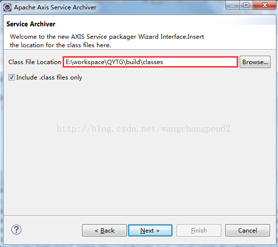

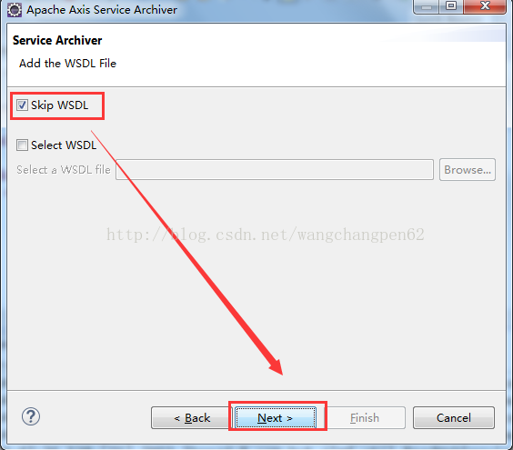

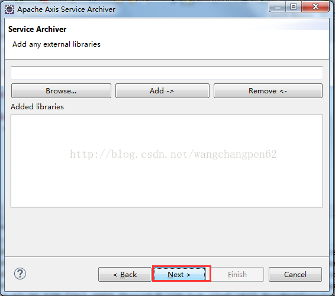

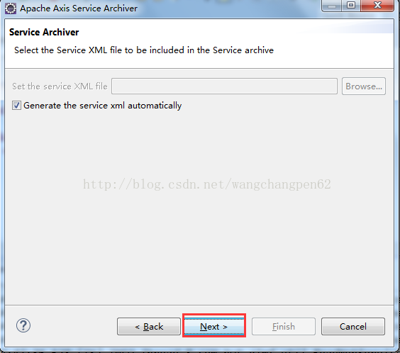

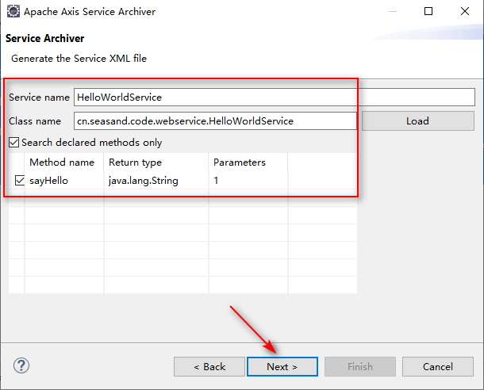

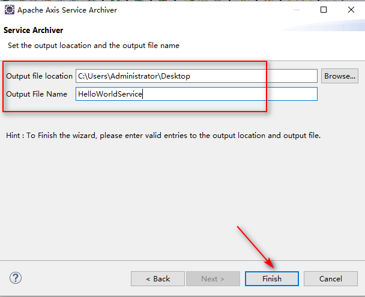

到此步骤就能生成名为HelloWorldService.aar的文件了，用压缩软件打开这个aar文件可以看到，结构与平常的war的结构很相似。

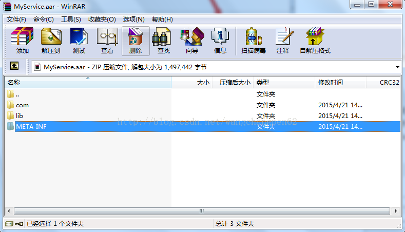

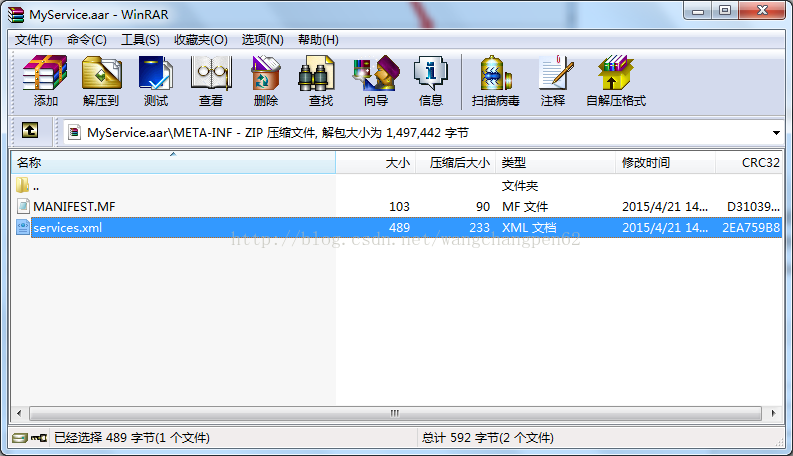

3、将上个步骤生成的HelloWorldService.aar文件放在web项目的WEB-INF/services目录下。再将下载的Axis2 Binary Distribution（例如axis2-1.7.9-bin.zip）解压，将lib目录中所有的jar包拷入到项目工程lib中，启动项目的时候就会将此webservice发布出去。

4、配置web.xml中Axis2的AxisServlet

~~~xml
<servlet>
	<servlet-name>AxisServlet</servlet-name>
	<servlet-class>org.apache.axis2.transport.http.AxisServlet</servlet-class>
	<load-on-startup>1</load-on-startup>
</servlet>
<servlet-mapping>
	<servlet-name>AxisServlet</servlet-name>
	<url-pattern>/services/*</url-pattern>
</servlet-mapping>
~~~

5、将项目发布到Tomcat服务器，启动Tomcat，访问`http://localhost:8080/axis2-demo-basic-web/services/HelloWorldService?wsdl`，即可。也可以访问`http://localhost:8080/axis2-demo-basic-web/services/HelloWorldService/sayHello?name=Mike`通过传递参数查看到调用结果。

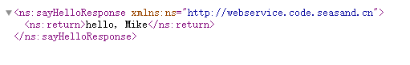

6、以上方式为在web项目中发布webservice接口，也可以将生成的HelloWorldService.aar文件放在下载的Axis2的war包中（例如axis2-1.7.9-war.zip解压出来的war包）发布。

### 调用服务

1、以RFC方式调用服务：

~~~java
public class CallHelloWorldServiceRFC {

	public static void main(String[] args) throws Exception {
		// 指定调用的WebService的URL.
		String url = "http://localhost:8080/axis2-demo-basic-web/services/HelloWorldService?wsdl";
		EndpointReference endpoint = new EndpointReference(url);

		RPCServiceClient serviceClient = new RPCServiceClient();
		Options options = serviceClient.getOptions();
		options.setTo(endpoint);

		// 指定方法的参数值.
		Object[] methodsArgs = new Object[] { "Mike" };

		// 指定方法返回值数据类型的class对象.
		Class[] clazz = new Class[] { String.class };

		// 指定wsdl文件的命名空间及要调用的方法，命名空间为通过浏览器打开wsdl文件，看到的元素targetNamespace的属性值.
		QName qname = new QName("http://helloworld.service.code.seasand.cn", "sayHello");

		// 调用方法并输出该方法的返回值,有三个参数：
		// 1.是QName对象，表示要调用的方法名;
		// 2.方法的参数值，参数类型是Object[];
		// 3.返回值class对象，参数类型是Class[];
		String ret = (String) serviceClient.invokeBlocking(qname, methodsArgs, clazz)[0];
		System.out.println(ret);
	}

}
~~~

2、通过Eclipse插件根据wsdl生成java文件方式调用服务：

依次点击Eclipse菜单 File-New-Other-Axis2 Wizards-Axis2 Code Generator；

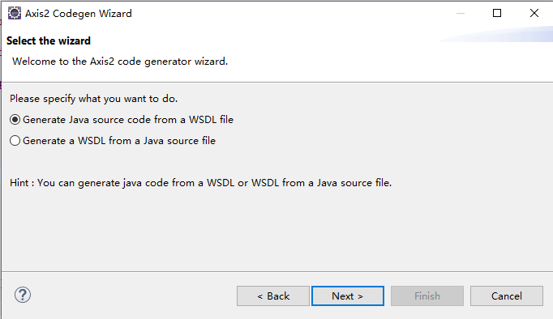

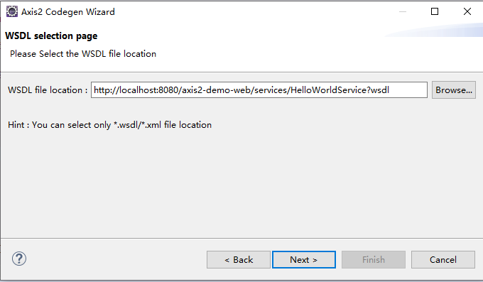

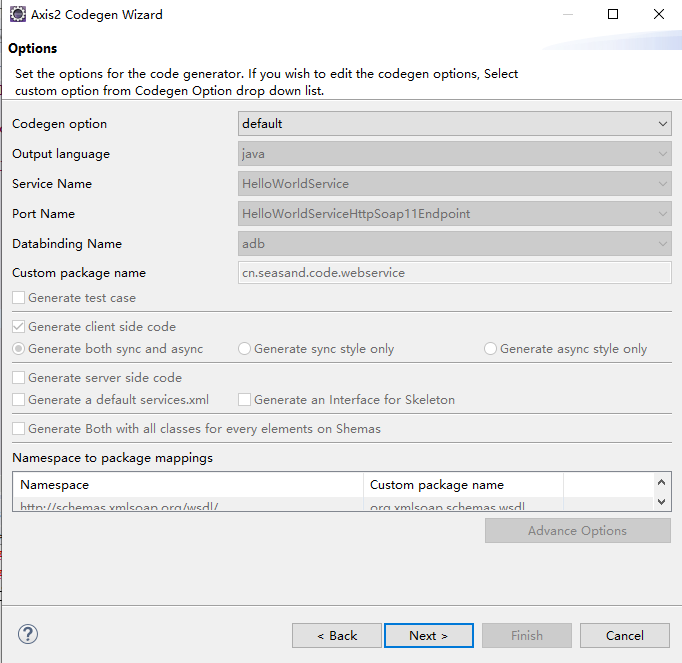

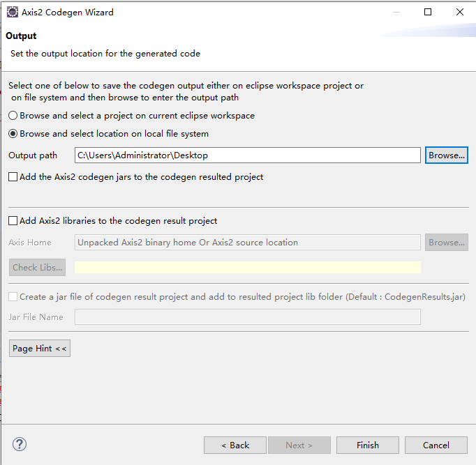

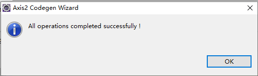

编写调用代码：

~~~java
public class CallHelloWorldService {

	public static void main(String[] args) throws Exception {
		// 首先新建一个stub(桩对象).
		HelloWorldServiceStub stub = new HelloWorldServiceStub();

		// 实例化服务端的方法对象.
		SayHello sayHello = new SayHello();

		// 为方法设置参数.
		sayHello.setName("John");

		// 执行该方法,并且接受返回值.
		String ret = stub.sayHello(sayHello).get_return();
		System.out.println(ret);
	}

}
~~~

3、使用Axis2命令行工具生成java代码方式调用服务：

1）在浏览器打开webservice的链接，网页右键另存为xml文件；

2）进入axis2\bin目录，在cmd命令行运行如下命令：

~~~plaintext
wsdl2java -uri G:\team\workspaces\src\HelloWorldService.xml -p cn.seasand.code.webservice -o G:\team\workspaces\output
~~~

命令解析：

-uri xml文件的绝对路径；

-p   生成java代码存放的包路径；

-o   生成java代码的存放路径；

3）编写调用代码

~~~java
public class CallHelloWorldService {

	public static void main(String[] args) throws Exception {
		HelloWorldServiceStub stub = new HelloWorldServiceStub();

		HelloWorldServiceStub.SayHello sayHello = new HelloWorldServiceStub.SayHello();
		sayHello.setName("Peter");
		HelloWorldServiceStub.SayHelloResponse response = stub.sayHello(sayHello);

		String ret = response.get_return();
		System.out.println(ret);
	}

}
~~~

附：

1、eclipse-plugins安装配置

将axis2-eclipse-codegen-plugin-1.7.9.zip和axis2-eclipse-service-plugin-1.7.9.zip解压出来的plugins文件夹放置到eclipse的dropins目录下，然后重启eclipse即可。

2、idea-plugins安装配置

将axis2-idea-plugin-1.7.9.zip解压缩，将解压后的文件夹移动至`%IDEA_HOME%\idea-settings\config\plugins`目录下，然后重启idea；

如果出现以下错误：plugin "axis2 idea tools" is incompatible with this installation，说明插件的版本和idea的版本不一致；

先查看idea的主版本信息，如191；然后在axis插件目录下找到plugin.xml文件,搜索idea-version，修改since-build="191.0"即可。

~~~xml
<idea-version since-build="191.0"/>
~~~

   

---

