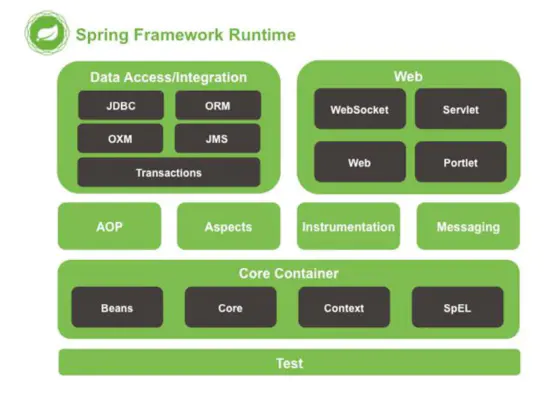
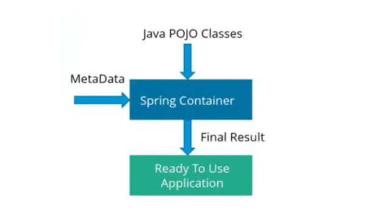
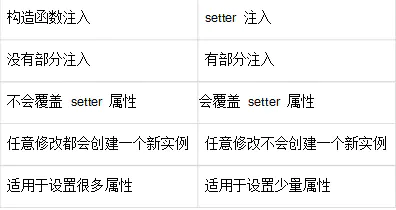
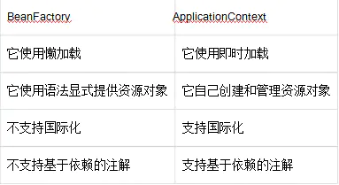
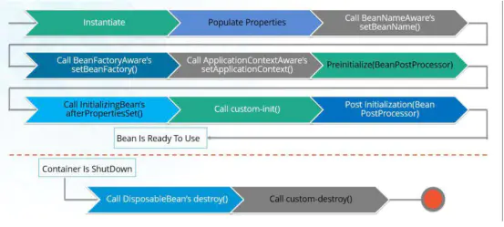
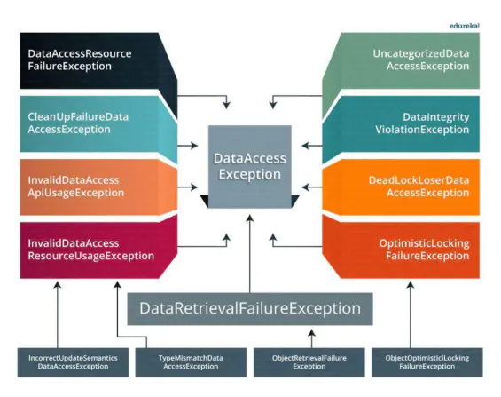
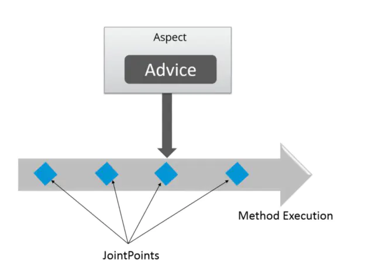
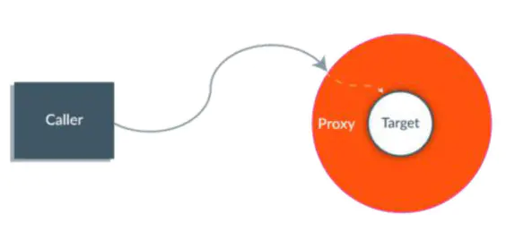
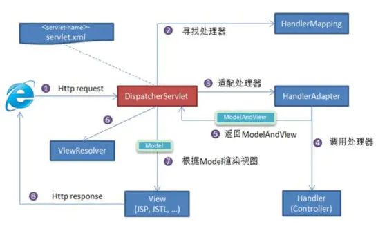

# 129道Spring系列面试题

---

### 体系结构

### 1、不同版本的 Spring Framework 有哪些主要功能？

* Spring 2.5：发布于2007年，这是第一个支持注解的版本；
* Spring 3.0：发布于2009年，它完全利用了Java5中的改进，并为JEE6提供了支持；
* Spring 4.0：发布于2013年，这是第一个完全支持Java8的版本；

### 2、什么是 Spring Framework？

* Spring 是一个开源应用框架，旨在降低应用程序开发的复杂度。
* 它是轻量级、松散耦合的。
* 它具有分层体系结构，允许用户选择组件，同时还为 J2EE 应用程序开发提供了一个有凝聚力的框架。
* 它可以集成其他框架，如 Structs、Hibernate、EJB 等，所以又称为框架的框架。

### 3、列举 Spring Framework 的优点。

* 由于 Spring Frameworks 的分层架构，用户可以自由选择自己需要的组件。
* Spring Framework 支持 POJO(Plain Old Java Object) 编程，从而具备持续集成和可测试性。
* 由于依赖注入和控制反转，JDBC 得以简化。
* 它是开源免费的。

### 4、Spring Framework 有哪些不同的功能？

* 轻量级：Spring 在代码量和透明度方面都很轻便。
* IOC：控制反转。
* AOP：面向切面编程可以将应用业务逻辑和系统服务分离，以实现高内聚。
* 容器：Spring 负责创建和管理对象（Bean）的生命周期和配置。
* MVC：对 web 应用提供了高度可配置性，其他框架的集成也十分方便。
* 事务管理：提供了用于事务管理的通用抽象层，Spring 的事务支持也可用于容器较少的环境。
* JDBC 异常：Spring 的 JDBC 抽象层提供了一个异常层次结构，简化了错误处理策略。

### 5、Spring Framework 中有多少个模块，它们分别是什么？

1）Spring 核心容器：该层基本上是 Spring Framework 的核心，它包含以下模块：

* Spring Core
* Spring Bean
* SpEL (Spring Expression Language)
* Spring Context

2）数据访问/集成：该层提供与数据库交互的支持，它包含以下模块：

* JDBC (Java DataBase Connectivity)
* ORM (Object Relational Mapping)
* OXM (Object XML Mappers)
* JMS (Java Messaging Service)
* Transaction

3）Web：该层提供了创建 Web 应用程序的支持，它包含以下模块：

* Web
* Web – Servlet
* Web – Socket
* Web – Portlet

4）AOP：该层支持面向切面编程。

5）Instrumentation：该层为类检测和类加载器实现提供支持。

6）Test：该层为使用 JUnit 和 TestNG 进行测试提供支持。

7）几个杂项模块：

* Messaging：该模块为 STOMP 提供支持。它还支持注解编程模型，该模型用于从 WebSocket 客户端路由和处理 STOMP 消息。
* Aspects：该模块为与 AspectJ 的集成提供支持。

### 6、什么是 Spring 配置文件？

Spring 配置文件是 XML 文件，该文件主要包含类信息，它描述了这些类是如何配置以及相互引入的。但是XML 配置文件过于冗长，如果没有正确规划和编写，那么在大项目中管理会变得非常困难。

### 7、Spring 应用程序有哪些不同组件？

Spring 应用一般有以下组件：

* 接口：定义功能。
* Bean 类：它包含属性，setter 和 getter 方法，函数等。
* Spring 面向切面编程（AOP）：提供面向切面编程的功能。
* Bean 配置文件：包含类的信息以及如何配置它们。
* 用户程序：它使用接口。

### 8、使用 Spring 有哪些方式？

使用 Spring 有以下方式：

* 作为一个成熟的 Spring Web 应用程序。
* 作为第三方 Web 框架，使用 Spring Frameworks 中间层。
* 用于远程使用。
* 作为企业级 Java Bean，它可以包装现有的 POJO（Plain Old Java Objects）。

### 9、什么是 Spring IOC 容器？

* Spring 框架的核心是 Spring 容器。容器创建对象，将它们装配在一起，配置它们并管理它们的完整生命周期。
* Spring 容器使用依赖注入来管理组成应用程序的组件。
* 容器通过读取提供的配置元数据来接收对象进行实例化，配置和组装的指令。该元数据可以通过 XML，Java 注解或 Java 代码提供。

### 10、什么是依赖注入？

在依赖注入中，您不必创建对象，但必须描述如何创建它们。您不是直接在代码中将组件和服务连接在一起，而是描述配置文件中哪些组件需要哪些服务，由 IoC 容器将它们装配在一起。

### 11、可以通过多少种方式完成依赖注入？

通常，依赖注入可以通过三种方式完成，即：

* 构造函数注入
* setter 注入
* 接口注入

在 Spring Framework 中，仅使用构造函数和 setter 注入。

### 12、区分构造函数注入和 setter 注入。

### 13、Spring 中有多少种 IOC 容器？

* BeanFactory：BeanFactory 就像一个包含 bean 集合的工厂类，它会在客户端要求时实例化 bean。 
* ApplicationContext：ApplicationContext 接口扩展了 BeanFactory 接口，它在 BeanFactory 基础上提供了一些额外的功能。

### 14、区分 BeanFactory 和 ApplicationContext。

### 15、列举 IoC 的一些好处。

IoC 的一些好处是：

* 它将最小化应用程序中的代码量。
* 它将使您的应用程序易于测试，因为它不需要单元测试用例中的任何单例或 JNDI 查找机制。
* 它以最小的影响和最少的侵入机制促进松耦合。
* 它支持即时的实例化和延迟加载服务。

### 16、Spring IoC 的实现机制。

Spring 中的 IoC 的实现原理就是工厂模式加反射机制。 示例：

~~~java
interface Fruit {
	public abstract void eat();
}
class Apple implements Fruit {
	public void eat(){
		System.out.println("Apple");
	}
}
class Orange implements Fruit {
	public void eat(){
		System.out.println("Orange");
	}
}
class Factory {
	public static Fruit getInstance(String ClassName) {
		Fruit f = null;
		try {
			f = (Fruit) Class.forName(ClassName).newInstance();
		} catch (Exception e) {
			e.printStackTrace();
		}
		return f;
	}
}
class Client {
	public static void main(String[] a) {
		Fruit f = Factory.getInstance("io.github.dunwu.spring.Apple");
		if(f!=null){
			f.eat();
		}
	}
}
~~~

### 17、什么是 Spring Bean？

* 它们是构成用户应用程序主干的对象。
* Bean 由 Spring IoC 容器管理。
* 它们由 Spring IoC 容器实例化，配置，装配和管理。
* Bean 是基于用户提供给容器的配置元数据创建。

### 18、Spring 提供了哪些配置方式？

1）基于 XML 配置：

bean 所需的依赖项和服务在 XML 格式的配置文件中指定。这些配置文件通常包含许多 bean 定义和特定于应用程序的配置选项，它们通常以 bean 标签开头。例如：

~~~xml
<bean id="studentbean" class="org.edureka.firstSpring.StudentBean">
	<property name="name" value="Edureka"></property>
</bean>
~~~

2）基于注解配置：

您可以通过在相关的类，方法或字段声明上使用注解，将 bean 配置为组件类本身，而不是使用 XML 来描述 bean 装配。默认情况下，Spring 容器中未打开注解装配。因此，您需要在使用它之前在 Spring 配置文件中启用它。例如：

~~~xml
<beans>
	<context:annotation-config/>
	<!-- bean definitions go here -->
</beans>
~~~

3）基于 Java API 配置：

Spring 的 Java 配置是通过使用 @Bean 和 @Configuration 来实现。 

* @Bean 注解扮演与元素相同的角色。
* @Configuration 类允许通过简单地调用同一个类中的其他 @Bean 方法来定义 bean 间依赖关系。 例如：

~~~java
@Configuration
public class StudentConfig {
	@Bean
	public StudentBean myStudent() {
		return new StudentBean();
	}
}
~~~

### 19、Spring 支持几种 bean scope？

Spring bean 支持 5 种 scope：

* Singleton：每个 Spring IoC 容器仅有一个实例。
* Prototype：每次请求都会产生一个新的实例。
* Request：每一次 HTTP 请求都会产生一个新的实例，并且该 bean 仅在当前 HTTP 请求内有效。
* Session：每一次 HTTP 请求都会产生一个新的 bean，同时该 bean 仅在当前 HTTP session 内有效。
* Global-session：类似于标准的 HTTP Session 作用域，不过它仅仅在基于 portlet 的 web 应用中才有意义。Portlet 规范定义了全局 Session 的概念，它被所有构成某个 portlet web 应用的各种不同的 portlet 所共享。在 globalsession 作用域中定义的 bean 被限定于全局 portlet Session 的生命周期范围内。如果你在 web 中使用 global session 作用域来标识 bean，那么 web 会自动当成 session 类型来使用。

> 仅当用户使用支持 Web 的 ApplicationContext 时，最后三个才可用。

### 20、Spring Bean 容器的生命周期是什么样的？

Spring Bean 容器的生命周期流程如下：

* Spring 容器根据配置中的 bean 定义中实例化 bean。
* Spring 使用依赖注入填充所有属性，如 bean 中所定义的配置。
* 如果 bean 实现 BeanNameAware 接口，则工厂通过传递 bean 的 ID 来调用 setBeanName()。
* 如果 bean 实现 BeanFactoryAware 接口，工厂通过传递自身的BeanFactory实例来调用 setBeanFactory()。
* 如果存在与 bean 关联的任何 BeanPostProcessors，则调用 preProcessBeforeInitialization() 方法。
* 如果为 bean 指定了 init 方法（ 的 init-method 属性），那么将调用它。
* 最后，如果存在与 bean 关联的任何 BeanPostProcessors，则将调用 postProcessAfterInitialization() 方法。
* 如果 bean 实现 DisposableBean 接口，当 Spring 容器关闭时，会调用 destory()。
* 如果为 bean 指定了 destroy 方法（ 的 destroy-method 属性），那么将 调用它。

### 21、什么是 Spring 的内部 Bean？

只有将 bean 用作另一个 bean 的属性时，才能将 bean 声明为内部 bean。为了定义内部 bean，Spring 的基于 XML 的配置元数据在setter或构造方法中提供了`<bean/>`元素的使用。内部 bean 总是匿名的，它们总是作为原型。 例如，假设我们有一个 Student 类，其中引用了 Person 类。这里我们将只创建一个 Person 类实例并在 Student 中使用它。

~~~java
public class Student {
	private Person person;
	//Setters and Getters
}
public class Person {
	private String name;
	private String address;
	//Setters and Getters
}
~~~

~~~xml
<bean id=“StudentBean" class="com.edureka.Student">
	<property name="person">
		<!--This is inner bean -->
		<bean class="com.edureka.Person">
			<property name="name" value=“Scott"></property>
			<property name="address" value=“Bangalore"></property>
		</bean>
	</property>
</bean>
~~~

### 22、什么是 Spring 装配？

当 bean 在 Spring 容器中组合在一起时，它被称为装配或 bean 装配。Spring 容器需要知道需要什么 bean 以及容器应该如何使用依赖注入来将 bean 绑定在一起，同时装配 bean。

### 23、自动装配有哪些方式？

Spring 容器能够自动装配 bean。也就是说，可以通过检查 BeanFactory 的内容让 Spring 自动解析 bean 的协作者。自动装配的不同模式： 

* no：这是默认设置，表示没有自动装配，应使用显式 bean 引用进行装配。
* byName：它根据 bean 的名称注入对象依赖项。它匹配并装配其属性与 XML 文件中由相同名称定义的 bean。
* byType：它根据类型注入对象依赖项。如果属性的类型与 XML 文件中的一个 bean 名称匹配，则匹配并装配属性。
* 构造函数：它通过调用类的构造函数来注入依赖项，它有大量的参数。
* autodetect：首先容器尝试通过构造函数使用 autowire 装配，如果不能，则尝试通过 byType 自动装配。

### 24、自动装配有什么局限？

* 覆盖的可能性：您始终可以使用 和 设置指定依赖项，这将覆盖自动装配。
* 基本元数据类型：简单属性（如原数据类型，字符串和类）无法自动装配。
* 令人困惑的性质：总是喜欢使用明确的装配，因为自动装配不太精确。

### 25、什么是基于注解的容器配置？

不使用 XML 来描述 bean 装配，开发人员通过在相关的类、方法或字段声明上使用注解将配置移动到组件类本身。它可以作为 XML 设置的替代方案。例如：Spring 的 Java 配置是通过使用 @Bean 和 @Configuration 来实现。

@Bean 注解扮演与`<bean/>`元素相同的角色， @Configuration 类允许通过简单地调用同一个类中的其他 @Bean 方法来定义 bean 间依赖关系。 例如：

~~~java
@Configuration
public class StudentConfig {
	@Bean
	public StudentBean myStudent() {
		return new StudentBean();
	}
}
~~~

### 26、如何在 Spring 中启动注解装配？

默认情况下，Spring 容器中未打开注解装配。因此，要使用基于注解装配，我们必须通过配置 元素在 Spring 配置文件中启用它。

### 27、@Component、 @Controller、@Repository、@Service 有何区别？

* @Component：这将 Java 类标记为 bean，它是任何 Spring 管理组件的通用构造型。Spring 的组件扫描机制现在可以将其拾取并将其拉入应用程序环境中。
* @Controller：这将一个类标记为 Spring Web MVC 控制器。标有它的 Bean 会自动导入到 IoC 容器中。
* @Service：此注解是组件注解的特化。它不会对 @Component 注解提供任何其他行为，您可以在服务层类中使用@Service 而不是 @Component，因为它以更好的方式指定了意图。
* @Repository：这个注解是具有类似用途和功能的 @Component 注解的特化。它为 DAO 提供了额外的好处，它将 DAO 导入 IoC 容器，并使未经检查的异常有资格转换为 Spring DataAccessException。

### 28、@Required 注解有什么用？

@Required 应用于 bean 属性 setter 方法，此注解仅指示必须在配置时使用 bean 定义中的显式属性值或使用自动装配填充受影响的 bean 属性。如果尚未填充受影响的 bean 属性，则容器将抛出 BeanInitializationException。 示例：

~~~java
public class Employee {
	private String name;
	@Required
	public void setName(String name){
		this.name=name;
	}
	public string getName(){
		return name;
	}
}
~~~

### 29、@Autowired 注解有什么用？

@Autowired 可以更准确地控制应该在何处以及如何进行自动装配。此注解用于在 setter 方法，构造函数，具有任意名称或多个参数的属性或方法上自动装配 bean。默认情况下，它是类型驱动的注入。

~~~java
public class Employee {
	private String name;
	@Autowired
	public void setName(String name) {
		this.name=name;
	}
	public string getName(){
		return name;
	}
}
~~~

### 30、@Qualifier 注解有什么用？

当您创建多个相同类型的 bean 并希望仅使用属性装配其中一个 bean 时，您可以使用@Qualifier 注解和 @Autowired 通过指定应该装配哪个确切的 bean 来消除歧义。 例如，这里我们分别有两个类，Employee 和 EmpAccount。在 EmpAccount 中，使用@Qualifier 指定了必须装配 id 为 emp1 的 bean。 

Employee.java

~~~java
public class Employee {
	private String name;
	@Autowired
	public void setName(String name) {
		this.name=name;
	}
	public string getName() {
		return name;
	}
}
~~~

EmpAccount,java

~~~java
public class EmpAccount {
	private Employee emp;
	@Autowired
	@Qualifier(emp1)
	public void showName() {
		System.out.println(“Employee name : ”+emp.getName);
	}
}
~~~

### 31、@RequestMapping 注解有什么用？

@RequestMapping 注解用于将特定 HTTP 请求方法映射到将处理相应请求的控制器中的特定类/方法。此注释可应用于两个级别：

* 类级别：映射请求的 URL；
* 方法级别：映射 URL 以及 HTTP 请求方法；

### 32、Spring DAO 有什么用？

Spring DAO 使得 JDBC、Hibernate 或 JDO 这样的数据访问技术更容易以一种统一的方式工作，这使得用户容易在持久性技术之间切换。它还允许您在编写代码时，无需考虑捕获每种技术不同的异常。

### 33、列举 Spring DAO 抛出的异常。

### 34、Spring JDBC API 中存在哪些类？

* JdbcTemplate
* SimpleJdbcTemplate
* NamedParameterJdbcTemplate
* SimpleJdbcInsert
* SimpleJdbcCall

### 35、使用 Spring 访问 Hibernate 的方法有哪些？

我们可以通过两种方式使用 Spring 访问 Hibernate：

* 使用 Hibernate 模板和回调进行控制反转；
* 扩展 HibernateDAOSupport 并应用 AOP 拦截器节点；

### 36、列举 Spring 支持的事务管理类型。

Spring 支持两种类型的事务管理：

* 程序化事务管理：在此过程中，在编程的帮助下管理事务。它为您提供极大的灵活性，但维护起来非常困难。
*  声明式事务管理：在此过程中，事务管理与业务代码分离。仅使用注解或基于 XML 的配置来管理事务。

### 37、Spring 支持哪些 ORM 框架？

* Hibernate
* iBatis
* JPA
* JDO
* OJB

### 38、什么是 AOP？

AOP(Aspect-Oriented Programming)，即面向切面编程，它与 OOP( Object-Oriented Programming，面向对象编程) 相辅相成，提供了与 OOP 不同的抽象软件结构的视角。在 OOP 中，我们以类(class)作为我们的基本单元，而 AOP 中的基本单元是 Aspect(切面)。

### 39、什么是 Aspect？

Aspect 由 pointcut 和 advice 组成，它既包含了横切逻辑的定义，也包括了连接点的定义。Spring AOP 就是负责实施切面的框架，它将切面所定义的横切逻辑编织到切面所指定的连接点中。AOP 的工作重心在于如何将增强编织目标对象的连接点上，这里包含两个工作：

* 如何通过 pointcut 和 advice 定位到特定的 joinpoint 上；
* 如何在 advice 中编写切面代码；

可以简单地认为，使用 @Aspect 注解的类就是切面。

### 40、什么是连接点（JoinPoint）？

程序运行中的一些时间点，例如一个方法的执行，或者是一个异常的处理。在 Spring AOP 中，join point 总是方法的执行点。

### 41、什么是通知（Advice）？

特定 JoinPoint 处的 Aspect 所采取的动作称为 Advice。Spring AOP 使用一个 Advice 作为拦截器，在 JoinPoint “周围”维护一系列的拦截器。

### 42、有哪些类型的通知（Advice）？

* Before：这些类型的 Advice 在 joinpoint 方法之前执行，并使用@Before 注解标记进行配置。
* After Returning：这些类型的 Advice 在连接点方法正常执行后执行，并使用@AfterReturning 注解标记进行配置。
* After Throwing：这些类型的 Advice 仅在 joinpoint 方法通过抛出异常退出并使用 @AfterThrowing 注解标记配置时执行。
* After (finally)：这些类型的 Advice 在连接点方法之后执行，无论方法退出是正常还是异常返回，并使用 @After 注解标记进行配置。
* Around：这些类型的 Advice 在连接点之前和之后执行，并使用@Around 注解标记进行配置。

### 43、指出在 Spring AOP 中 concern 和 cross-cutting concern 的不同之处。

* concern 是我们想要在应用程序的特定模块中定义的行为，它可以定义为我们想要实现的功能。
* cross-cutting concern 是一个适用于整个应用的行为，这会影响整个应用程序。例如，日志记录，安全性和数据传输是应用程序几乎每个模块都需要关注的问题，因此它们是跨领域的问题。

### 44、AOP 有哪些实现方式？

实现 AOP 的技术，主要分为两大类：

1）静态代理

指使用 AOP 框架提供的命令进行编译，从而在编译阶段就可生成 AOP 代理类，因此也称为编译时增强；

* 编译时编织（特殊编译器实现）；
* 类加载时编织（特殊的类加载器实现）。

2）动态代理

在运行时在内存中“临时”生成 AOP 动态代理类，因此也被称为运行时增强。

* JDK 动态代理
* CGLIB

### 45、Spring AOP and AspectJ AOP 有什么区别？

Spring AOP 基于动态代理方式实现；AspectJ 基于静态代理方式实现。SpringAOP 仅支持方法级别的 PointCut；提供了完全的 AOP 支持，它还支持属性级别的 PointCut。

### 46、如何理解 Spring 中的代理？

将 Advice 应用于目标对象后创建的对象称为代理。在客户端对象的情况下，目标对象和代理对象是相同的。 Advice + Target Object = Proxy。

### 47、什么是编织（Weaving）？

为了创建一个 advice 对象而连接一个 aspect 和其它应用类型或对象，称为编织（Weaving）。在 Spring AOP 中，编织在运行时执行。请参考下图：

### 48、Spring MVC 框架有什么用？

Spring Web MVC 框架提供"模型-视图-控制器"架构和随时可用的组件，用于开发灵活且松散耦合的 Web 应用程序。MVC 模式有助于分离应用程序的不同方面，如输入逻辑，业务逻辑和 UI 逻辑，同时在所有这些元素之间提供松散耦合。

### 49、描述一下 DispatcherServlet 的工作流程。

DispatcherServlet 的工作流程可以用一幅图来说明：

1）向服务器发送 HTTP 请求，请求被前端控制器 DispatcherServlet 捕获。

2） DispatcherServlet 根据 xxx-servlet.xml 中的配置对请求的 URL 进行解析，得到请求资源标识符（URI）。然后根据该 URI，调用 HandlerMapping 获得该 Handler 配置的所有相关的对象（包括 Handler 对象以及 Handler 对象对应的拦截器），最后以 HandlerExecutionChain 对象的形式返回。

3） DispatcherServlet 根据获得的 Handler，选择一个合适的 HandlerAdapter。（附注：如果成功获得 HandlerAdapter 后，此时将开始执行拦截器的 preHandler(…)方法）。

4）提取 Request 中的模型数据，填充 Handler 入参，开始执行 Handler（ Controller)。在填充 Handler 的入参过程中，根据你的配置，Spring 将帮你做一些额外的工作：

* HttpMessageConveter：将请求消息（如 Json、xml 等数据）转换成一个对象，将对象转换为指定的响应信息。
* 数据转换：对请求消息进行数据转换。如 String 转换成 Integer、Double 等。
* 数据根式化：对请求消息进行数据格式化。如将字符串转换成格式化数字或格式化日期等。
* 数据验证：验证数据的有效性（长度、格式等），验证结果存储到 BindingResult 或 Error 中。

5）Handler(Controller)执行完成后，向 DispatcherServlet 返回一个 ModelAndView 对象；

6）根据返回的 ModelAndView，选择一个适合的 ViewResolver（必须是已经注册到 Spring 容器中的 ViewResolver)返回给 DispatcherServlet。

7） ViewResolver 结合 Model 和 View，来渲染视图。

8）视图负责将渲染结果返回给客户端。

### 50、介绍一下 WebApplicationContext。

WebApplicationContext 是 ApplicationContext 的扩展，它具有 Web 应用程序所需的一些额外功能，它与普通的 ApplicationContext 在解析主题和决定与哪个 servlet 关联的能力方面有所不同。

### 51、什么是 Spring?

* Spring 是个 Java 企业级应用的开源开发框架。
* Spring 主要用来开发 Java 应用，但是有些扩展是针对构建 J2EE 平台的 web 应用。
* Spring 框架目标是简化 Java 企业级应用开发，并通过 POJO 为基础的编程模型促进良好的编程习惯。

### 52、使用 Spring 框架的好处是什么？

* 轻量：Spring 是轻量的，基本的版本大约 2MB。
* 控制反转：Spring 通过控制反转实现了松散耦合，对象们给出它们的依赖，而不是创建或查找依赖的对象们。
* 面向切面的编程(AOP)：Spring 支持面向切面的编程，并且把应用业务逻辑和系统服务分开。
* 容器：Spring 包含并管理应用中对象的生命周期和配置。
* MVC 框架：Spring 的 WEB 框架是个精心设计的框架，是 Web 框架的一个很好的替代品。
* 事务管理：Spring 提供一个持续的事务管理接口，可以扩展到上至本地事务下至全局事务（JTA）。
* 异常处理：Spring 提供方便的 API 把具体技术相关的异常（比如由 JDBC，Hibernate or JDO 抛出的）转化为一致的 unchecked 异常。

### 53、Spring 由哪些模块组成?

以下是 Spring 框架的基本模块：

* Core module
* Bean module
* Context module
* Expression Language module
* JDBC module
* ORM module
* OXM module
* Java Messaging Service(JMS) module
* Transaction module
* Web module
* Web-Servlet module
* Web-Struts module
* Web-Portlet module

### 54、什么是核心容器（应用上下文) 模块？

这是基本的 Spring 模块，提供 Spring 框架的基础功能，BeanFactory 是任何以 Spring 为基础的应用的核心。Spring 框架建立在此模块之上，它使 Spring 成为一个容器。

### 55、BeanFactory 实现举例。

Bean 工厂是工厂模式的一个实现，提供了控制反转功能，用来把应用的配置和依赖从真正的应用代码中分离。 最常用的 BeanFactory 实现是 XmlBeanFactory 类。

### 56、XMLBeanFactory。

最常用的就是 org.springframework.beans.factory.xml.XmlBeanFactory ，它根据 XML 文件中的定义加载 beans。该容器从 XML 文件读取配置元数据并用它去创建一个完全配置的系统或应用。

### 57、解释 AOP 模块。

AOP 模块用于发给我们的 Spring 应用做面向切面的开发， 很多支持由 AOP 联盟提供，这样就确保了 Spring 和其他 AOP 框架的共通性。这个模块将元数据编程引入 Spring。

### 58、解释 JDBC 抽象和 DAO 模块。

通过使用 JDBC 抽象和 DAO 模块，保证数据库代码的简洁，并能避免数据库资源错误关闭导致的问题，它在各种不同的数据库的错误信息之上，提供了一个统一的异常访问层。它还利用 Spring 的 AOP 模块给 Spring 应用中的对象提供事务管理服务。

### 59、解释对象/关系映射集成模块。

Spring 通过提供 ORM 模块，支持我们在直接 JDBC 之上使用一个对象/关系映射映射(ORM)工具，Spring 支持集成主流的 ORM 框架，如 Hiberate,JDO 和 iBATISSQL Maps。Spring 的事务管理同样支持以上所有 ORM 框架及 JDBC。

### 60、解释 WEB 模块。

Spring 的 WEB 模块是构建在 application context 模块基础之上，提供一个适合 web 应用的上下文。这个模块也包括支持多种面向 web 的任务，如透明地处理多个文件上传请求和程序级请求参数的绑定到你的业务对象。它也有对 JakartaStruts 的支持。

### 61、Spring 配置文件

Spring 配置文件是个 XML 文件，这个文件包含了类信息，描述了如何配置它们，以及如何相互调用。

### 62、什么是 Spring IOC 容器？

Spring IOC 负责创建对象，管理对象（通过依赖注入（DI），装配对象，配置对象，并且管理这些对象的整个生命周期。

### 63、IOC 的优点是什么？

IOC 或 依赖注入把应用的代码量降到最低。它使应用容易测试，单元测试不再需要单例和 JNDI 查找机制。最小的代价和最小的侵入性使松散耦合得以实现。IOC 容器支持加载服务时的饿汉式初始化和懒加载。

### 64、ApplicationContext 通常的实现是什么?

* FileSystemXmlApplicationContext ：此容器从一个 XML 文件中加载 beans 的定义，XML Bean 配置文件的全路径名必须提供给它的构造函数。
* ClassPathXmlApplicationContext：此容器也从一个 XML 文件中加载 beans 的定义，这里，你需要正确设置 classpath 因为这个容器将在 classpath 里找 bean 配置。
* WebXmlApplicationContext：此容器加载一个 XML 文件，此文件定义了一个 WEB 应用的所有 bean。

### 65、Bean 工厂和 Application Contexts 有什么区别？

Application Contexts 提供一种方法处理文本消息，一个通常的做法是加载文件资源（比如镜像），它们可以向注册为监听器的 bean 发布事件。另外，在容器或容器内的对象上执行的那些不得不由 bean 工厂以程序化方式处理的操作，可以在 Application Contexts 中以声明的方式处理。Application Contexts 实现了 MessageSource 接口，该接口的实现以可插拔的方式提供获取本地化消息的方法。

### 66、一个 Spring 的应用看起来象什么？

* 一个定义了一些功能的接口。
* 这实现包括属性，它的 Setter ， getter 方法和函数等。
* Spring AOP。
* Spring 的 XML 配置文件。
* 使用以上功能的客户端程序。依赖注入

### 67、什么是 Spring 的依赖注入？

依赖注入，是 IOC 的一个方面，是个通常的概念，它有多种解释。这概念是说你不用创建对象，而只需要描述它如何被创建。你不在代码里直接组装你的组件和服务，但是要在配置文件里描述哪些组件需要哪些服务，之后一个容器（IOC 容器）负责把他们组装起来。

### 68、有哪些不同类型的 IOC（依赖注入）方式？

* 构造器依赖注入：构造器依赖注入通过容器触发一个类的构造器来实现的，该类有一系列参数，每个参数代表一个对其他类的依赖。
* Setter 方法注入：Setter 方法注入是容器通过调用无参构造器或无参 static 工厂 方法实例化 bean 之后，调用该 bean 的 setter 方法，即实现了基于 setter 的依赖注入。

### 69、哪种依赖注入方式你建议使用，构造器注入，还是 Setter 方法注入？

你两种依赖方式都可以使用，构造器注入和 Setter 方法注入。最好的解决方案是用构造器参数实现强制依赖，setter 方法实现可选依赖。

### 70、什么是 Spring Beans?

Spring Beans 是那些形成 Spring 应用的主干的 Java 对象。它们被 Spring IOC 容器初始化，装配和管理。这些 beans 通过容器中配置的元数据创建。比如，以 XML 文件中`<bean/>`的形式定义。

Spring 框架定义的 Beans 都是单件 Beans。在 bean tag 中有个属性”singleton”，如果它被赋为 TRUE，bean 就是单件，否则就是一个 prototype bean。默认是 TRUE，所以所有在 Spring 框架中的 Beans 缺省都是单件。

### 71、一个 Spring Bean 定义包含什么？

一个 Spring Bean 的定义包含容器必知的所有配置元数据，包括如何创建一个 Bean，它的生命周期详情及它的依赖。

### 72、如何给 Spring 容器提供配置元数据?

这里有三种重要的方法给 Spring 容器提供配置元数据：

* XML 配置文件
* 基于注解的配置
* 基于 Java 的配置

### 73、你怎样定义类的作用域?

当定义一个bean在 Spring 里，我们还能给这个 bean 声明一个作用域，它可以通过 bean 定义中的 scope 属性来定义。如，当 Spring 要在需要的时候每次生产一个新的 bean 实例，bean 的 scope 属性被指定为 prototype。另一方面，一个 bean 每次使用的时候必须返回同一个实例，这个 bean 的 scope 属性必须设为 singleton。

### 74、解释 Spring 支持的几种 bean 的作用域。

Spring 框架支持以下五种 bean 的作用域：

* singleton：bean 在每个 Spring IoC 容器中只有一个实例。
* prototype：一个 bean 的定义可以有多个实例。
* request：每次 http 请求都会创建一个 bean，该作用域仅在基于 web 的 Spring ApplicationContext 情形下有效。
* session：在一个 HTTP Session 中，一个 bean 定义对应一个实例。该作用域仅在基于 web 的 Spring ApplicationContext 情形下有效。
* global-session：在一个全局的 HTTP Session 中，一个 bean 定义对应一个实例。该作用域仅在基于 web 的 Spring ApplicationContext 情形下有效。

缺省的 Spring bean 的作用域是 Singleton.

### 75、Spring 框架中的单例 bean 是线程安全的吗?

不是，Spring 框架中的单例 bean 不是线程安全的。

### 76、哪些是重要的 bean 生命周期方法？你能重载它们吗？

有两个重要的 bean 生命周期方法，第一个是 setup ， 它是在容器加载 bean 的时候被调用。第二个方法是 teardown 它是在容器卸载类的时候被调用。

bean 标签有两个重要的属性（init-method 和 destroy-method）。用它们你可以自己定制初始化和注销方法。它们也有相应的注解（@PostConstruct 和@PreDestroy）。

### 77、在 Spring 中如何注入一个 Java 集合？

Spring 提供以下几种集合的配置元素：

* 类型用于注入一列值，允许有相同的值。
* 类型用于注入一组值，不允许有相同的值。
* 类型用于注入一组键值对，键和值都可以为任意类型。
* 类型用于注入一组键值对，键和值都只能为 String 类型。

### 78、自动装配有哪些局限性?

* 重写：你仍需用 和 配置来定义依赖，意味着总要重写自动装配。
* 基本数据类型：你不能自动装配简单的属性，如基本数据类型，String字符串和类。
* 模糊特性：自动装配不如显式装配精确，如果有可能，建议使用显式装配。

### 79、你可以在 Spring 中注入一个 null 和一个空字符串吗？

可以。

### 80、什么是基于 Java 的 Spring 注解配置? 给一些注解的例子。

基于 Java 的配置，允许你在少量的 Java 注解的帮助下，进行你的大部分 Spring 配置而非通过 XML 文件。

以@Configuration 注解为例，它用来标记类可以当做一个 bean 的定义，被 Spring IOC 容器使用。另一个例子是@Bean 注解，它表示此方法将要返回一个对象，作为一个 bean 注册进 Spring 应用上下文。

### 81、什么是基于注解的容器配置?

相对于 XML 文件，注解型的配置依赖于通过字节码元数据装配组件，而非尖括号的声明。 开发者通过在相应的类，方法或属性上使用注解的方式，直接组件类中进行配置，而不是使用 XML 表述 bean 的装配关系。

### 82、怎样开启注解装配？

注解装配在默认情况下是不开启的，为了使用注解装配，我们必须在 Spring 配置文件中配置`<context:annotation-config/>`元素。

### 83、@Required 注解

这个注解表明 bean 的属性必须在配置的时候设置，通过一个 bean 定义的显式的属性值或通过自动装配，若@Required 注解的 bean 属性未被设置，容器将抛出 BeanInitializationException。

### 84、@Autowired 注解

@Autowired 注解提供了更细粒度的控制，包括在何处以及如何完成自动装配。它的用法和@Required 一样，修饰 setter 方法、构造器、属性或者具有任意名称和/或多个参数的 PN 方法。

### 85、@Qualifier 注解

当有多个相同类型的 bean 却只有一个需要自动装配时，将@Qualifier 注解和 @Autowire 注解结合使用以消除这种混淆，指定需要装配的确切的 bean。

### 86、在 Spring 框架中如何更有效地使用 JDBC?

使用 SpringJDBC 框架，资源管理和错误处理的代价都会被减轻。所以开发者只需写 statements 和 queries 从数据存取数据，JDBC 也可以在 Spring 框架提供的模板类的帮助下更有效地被使用，这个模板叫 JdbcTemplate 

### 87、JdbcTemplate

JdbcTemplate 类提供了很多便利的方法解决诸如把数据库数据转变成基本数据类型或对象，执行写好的或可调用的数据库操作语句，提供自定义的数据错误处理。

### 88、Spring 支持的 ORM。

Spring 支持以下 ORM：

* Hibernate
* iBatis
* JPA (Java Persistence API)
* TopLink
* JDO (Java Data Objects)
* OJB

### 89、如何通过 HibernateDaoSupport 将 Spring 和 Hibernate 结合起来？

用 Spring 的 SessionFactory 调用 LocalSessionFactory。集成过程分三步：

* 配置 the Hibernate SessionFactory。
* 继承 HibernateDaoSupport 实现一个 DAO。
* 在 AOP 支持的事务中装配。

### 90、Spring 框架的事务管理有哪些优点？

* 它为不同的事务 API 如 JTA，JDBC，Hibernate，JPA 和 JDO，提供一个不变的编程模式。
* 它为编程式事务管理提供了一套简单的 API 而不是一些复杂的事务 API。
* 它支持声明式事务管理。
* 它和 Spring 各种数据访问抽象层很好得集成。

### 91、你更倾向用那种事务管理类型？

大多数 Spring 框架的用户选择声明式事务管理，因为它对应用代码的影响最小，因此更符合一个无侵入的轻量级容器的思想。声明式事务管理要优于编程式事务管理，虽然比编程式事务管理（这种方式允许你通过代码控制事务）少了一点灵活性。

### 92、解释 AOP。

AOP，面向切面的编程， 是一种编程技术，允许程序模块化横向切割关注点，或横切典型的责任划分，如日志和事务管理。

### 93、Aspect 切面。

AOP 核心就是切面，它将多个类的通用行为封装成可重用的模块，该模块含有一组 API 提供横切功能。比如，一个日志模块可以被称作日志的 AOP 切面。根据需求的不同，一个应用程序可以有若干切面。在 Spring AOP 中，切面通过带有@Aspect 注解的类实现。

### 94、在 Spring AOP 中，关注点和横切关注的区别是什么？

关注点是应用中一个模块的行为，一个关注点可能会被定义成一个我们想实现的一个功能。横切关注点是一个关注点，此关注点是整个应用都会使用的功能，并影响整个应用，比如日志，安全和数据传输，几乎应用的每个模块都需要的功能。因此这些都属于横切关注点。

### 95、连接点

连接点代表一个应用程序的某个位置，在这个位置我们可以插入一个 AOP 切面，它实际上是个应用程序执行 Spring AOP 的位置。

### 96、通知

通知是个在方法执行前或执行后要做的动作，实际上是程序执行时要通过 SpringAOP 框架触发的代码段。Spring 切面可以应用五种类型的通知：

* before：前置通知，在一个方法执行前被调用。
* after: 在方法执行之后调用的通知，无论方法执行是否成功。
* after-returning: 仅当方法成功完成后执行的通知。
* after-throwing: 在方法抛出异常退出时执行的通知。
* around: 在方法执行之前和之后调用的通知。

### 97、切点

切入点是一个或一组连接点，通知将在这些位置执行。可以通过表达式或匹配的方式指明切入点。

### 98、什么是引入?

引入允许我们在已存在的类中增加新的方法和属性。

### 99、什么是目标对象?

被一个或者多个切面所通知的对象，它通常是一个代理对象，也指被通知（advised）对象。

### 100、什么是代理?

代理是通知目标对象后创建的对象。从客户端的角度看，代理对象和目标对象是一样的。

### 101、有几种不同类型的自动代理？

* BeanNameAutoProxyCreator
* DefaultAdvisorAutoProxyCreator
* Metadata autoproxying

### 102、什么是织入？什么是织入应用的不同点？

织入是将切面和到其他应用类型或对象连接或创建一个被通知对象的过程。织入可以在编译时，加载时，或运行时完成。

### 103、解释基于 XML Schema 方式的切面实现。

在这种情况下，切面由常规类以及基于 XML 的配置实现。

### 104、解释基于注解的切面实现。

在这种情况下(基于@AspectJ 的实现)，涉及到的切面声明的风格与带有 Java5 标注的普通 Java 类一致。

### 105、什么是 Spring 的 MVC 框架？

Spring 配备构建 Web 应用的全功能 MVC 框架。Spring 可以很便捷地和其他 MVC 框架集成，如 Struts，Spring 的 MVC 框架用控制反转把业务对象和控制逻辑清晰地隔离。它也允许以声明的方式把请求参数和业务对象绑定。

### 106、DispatcherServlet

Spring 的 MVC 框架是围绕 DispatcherServlet 来设计的，它用来处理所有的 HTTP 请求和响应。

### 107、WebApplicationContext

WebApplicationContext 继承了 ApplicationContext 并增加了一些 WEB 应用必备的特有功能，它不同于一般的 ApplicationContext ，因为它能处理主题，并找到被关联的 servlet。

### 108、什么是 Spring MVC 框架的控制器？

控制器提供一个访问应用程序的行为，此行为通常通过服务接口实现。控制器解析用户输入并将其转换为一个由视图呈现给用户的模型。Spring 用一个非常抽象的方式实现了一个控制层，允许用户创建多种用途的控制器。

### 109、@Controller 注解

该注解表明该类扮演控制器的角色，Spring 不需要你继承任何其他控制器基类或引用 Servlet API。

### 110、@RequestMapping 注解

该注解是用来映射一个 URL 到一个类或一个特定的方处理法上。

   

---

