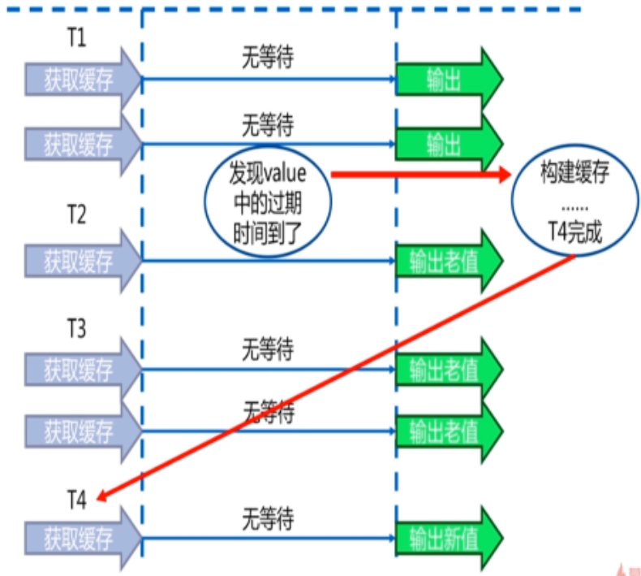

# Redis从入门到高可用、分布式实践

---

### 一、Redis简介

1、Redis是什么

高性能key-value服务器。

* 开源
* 多种数据结构
* 基于键值的存储服务系统
* 高性能、功能丰富

2、特性

* 速度快
* 持久化
* 支持多种数据结构
* 支持多语言客户端
* 功能丰富
* 简单
* 提供主从复制
* 分布式高可用

3、使用场景

* 缓存系统
* 计数器
* 消息队列
* 排行榜
* 社交网络
* 实时系统

4、安装配置

1）安装

~~~plaintext
wget http://download.redis.io/releases/redis-3.0.7.tar.gz
tar -xzf redis-3.0.7.tar.gz
ln -s redis-3.0.7 redis
cd redis
make && make install
~~~

可执行文件说明：

* redis-server：Redis服务器
* redis-cli：Redis客户端
* redis-benchmark：Redis性能测试工具
* redis-check-aof：AOF文件修复工具
* redis-check-dump：RDB文件检查工具
* redis-sentinel：Sentinel服务器（V2.8+）

2）启动方式

* 最简启动

~~~plaintext
#使用默认配置
redis-server
~~~

* 动态参数启动

~~~plaintext
redis-server --port 6379
~~~

* 配置文件启动

~~~plaintext
redis-server <config path>
~~~

3）常用配置

~~~plaintext
daemonize yes
port 6379
logfile "redis-6379.log"
dir ./
~~~

4）验证启动

~~~plaintext
ps -ef | grep redis
netstat -antpl | grep redis
redis-cli -h <ip> -p <port> ping
~~~

### 二、Redis API的使用和理解

1、通用命令

1）通用命令

* keys：遍历所有key

~~~plaintext
set java aaa
set javascript bbb
set python ccc

# 遍历所有key
keys *

# keys [pattern] 使用正则
keys ja*

# keys命令一般不在生产环境使用,用scan替代
~~~

* dbsize：计算key的总数

~~~plaintext
mset k1 v1 k2 v2 k3 v3 k4 v4
dbsize //4
sadd myset a b c d e
dbsize //5
~~~

* exists：判断key是否存在

~~~plaintext
set a b
exists a //1
del a
exists a //0
~~~

* del [key ...]：删除指定可以

~~~plaintext
set a b
del a
~~~

* expire：设置过期时间

~~~plaintext
# key在seconds秒后过期
expire key seconds

# 查看key剩余的过期时间：>=0(key的剩余过期时间值), -1(key存在且没有过期时间), -2(key已经不存在)
ttl key

# 去掉key的过期时间
persist key
~~~

* type：返回key的类型

~~~plaintext
# string hash list set zset none
set a b
type a
~~~

时间复杂度：

| 命令   | 时间复杂度 |
| ------ | ---------- |
| keys   | O(n)       |
| dbsize | O(1)       |
| del    | O(1)       |
| exists | O(1)       |
| expire | O(1)       |
| type   | O(1)       |

2）数据结构和内部编码

3）单线程

单线程为什么还这么快？

* 纯内存
* 非阻塞IO
* 避免线程切换和竞态消耗

注意点：

* 一次只能运行一条命令
* 拒绝长（慢）命令：keys、flushall、flushdb、show lua script、multi/exec、operate big value(collection)

2、字符串类型

~~~plaintext
set key value: 不管key是否存在都设置
get key: 获取
del key: 删除

setnx key value: key不存在才设置
set key value xx: key存在才设置

mset k1 v1 k2 v2 k3 v3 ...: 批量设置
mget k1 k2 k3 ...: 批量获取

getset key newvalue: 设置newvalue并且返回旧的value
append key value: 追加
getrange key start end: 获取指定下标的值
setrange key index value: 设置指定下标的值
strlen key: 返回字符串长度

incr key: key自增1，如果key不存在，自增后get(key)=1
decr key: key自减1，如果key不存在，自减后get(key)=-1
incrby key n: key自增n，如果key不存在，自增后get(key)=n
decrby key n: key自减n，如果key不存在，自减后get(key)=-n
incrbyfloat key +/-m.n: 以浮点值自增/减
~~~

3、哈希类型

~~~plaintext
hset key field value
hget key field
hdel key field

hgetall key
hkeys key
hvals key

hsetnx key field value
hexists key field
hlen key

hmset key f1 v1 f2 v2 f3 v3 ...
hmget key f1 f2 f3 ...

hincryby key field count
hincrybyfloat key field count
~~~

4、列表类型

~~~plaintext
lpush key v1 v2 v3 ...
rpush key v1 v2 v3 ...

linsert key before|after value newvalue: 在value前|后插入newvalue

lpop key
rpop key
blpop key timeout: lpop的阻塞版本，timeout为超时时间，为0表示永不阻塞

lrem key count value
根据count值，删除列表中与value相等的项
1）count>0,从左到右，删除最多count个value相等的项
2）count<0,从右到左，删除最多Math.abs(count)个value相等的项
3）count=0,删除所有value相等的项

lindex key index: 获取指定下标的列表项(左边从0开始，右边从-1开始)
ltrim key start end: 按照指定范围修剪列表(从0开始，包含头尾)
lrange key start end: 获取指定范围的列表项(从0开始，包含头尾)

llen key

lset key index newvalue: 修改指定下标的列表项
~~~

* Stack：lpush + lpop
* Queue：lpush + rpop
* Capped Collection：lpush + ltrim
* Message Queue：lpush + brpop

5、集合类型

~~~plaintext
sadd key e
srem key e

spop key: 随机弹出一个元素

scard key: 计算集合大小
sismember key e: 判断e是否在集合中
srandmember key count: 随机取count个元素
smembers key: 获取所有元素

sunion key1 key2: 并集
sinter key1 key2: 交集
sdiff key1 key2: 差集
~~~

6、有序集合类型

~~~plaintext
zadd key score e
zrem key e

zcard key: 返回元素个数

zrank key e: 获取排名
zrevrank key e: 获取排名（倒序）
zscore key e: 获取分值
zincrby key score e: 增加/减少元素的分值

zrange key start end [withscores]: 返回指定（排名）范围内升序元素[是否打印分值]
zrangebyscore key minScore maxScore [withscores]: 返回指定分数范围内的升序元素[是否打印分值]
zcount key minScore maxScore: 指定分数范围内元素个数

zremrangebyrank key start end: 删除指定排名内的元素
zremrangebyscore key minScore maxScore: 删除指定分数内的元素

zunionstore
zinterstore
~~~

### 三、Redis客户端的使用

1、Java客户端 Jedis

Maven依赖：

~~~xml
<dependency>
	<groupId>redis.clients</groupId>
	<artifactId>jedis</artifactId>
	<version>2.9.0</version>
	<type>jar</type>
	<scope>compile</scope>
</dependency>
~~~

基本使用：

~~~java
Jedis jedis = new Jedis("127.0.0.1", 6379);

jedis.set("hello", "world");
String value = jedis.get("hello");
jedis.incr("count");

jedis.hset("hash", "f1", "v1");
jedis.hset("hash", "f2", "v2");
jedis.hgetAll("hash");

jedis.rpush("list", "aaa");
jedis.rpush("list", "bbb");
jedis.rpush("list", "ccc");
jedis.lrange("list", 0, -1);

jedis.sadd("set", "111");
jedis.sadd("set", "222");
jedis.smembers("set");

jedis.zadd("zset", 12, "33");
jedis.zadd("zset", 99, "44");
jedis.zadd("zset", 65, "55");
jedis.zrangeWithScores("zset", 0, -1);
~~~

连接池方式：

~~~java
GenericObjectPoolConfig config = new GenericObjectPoolConfig();
JedisPool jedisPool = new JedisPool(config, "127.0.0.1", 6379);
Jedis jedis = null;
try {
    jedis = jedisPool.getResource();
    //...
} catch(Exception e) {
    e.printStackTrace();
} finally {
    if(null!=jedis) jedis.close();
}
~~~

2、Python客户端 redis-py

3、Go客户端 Redigo

### 四、Redis的其它功能

1、慢查询 slowlog

1）生命周期

2）两个配置

slowlog-max-len

* 先进先出队列
* 固定长度
* 保存在内存中
* 不要设置过大，默认10ms，通常设置1ms

slowlog-log-slower-than

* 慢查询阈值（微秒）
* slowlog-log-slower-than=0，记录所有命令
* slowlog-log-slower-than<0，不记录任何命令
* 不要设置过小，通常设置1000左右

3）配置方法

~~~plaintext
# 默认值
config get slowlog-max-len //128
config get slowlog-log-slower-than //10000

# 修改配置文件并重启，或者动态配置如下
config set slowlog-max-len 1000
config set slowlog-log-slower-than 1000
~~~

4）慢查询命令

~~~plaintext
slowlog get [n]：获取慢查询队列
slowlog len：获取长度
slowlog reset：清空
~~~

2、流水线 pipeline

~~~java
Jedis jedis = new Jedis("127.0.0.1", 6379);

//没有使用pipeline
for(int i=0; i<10000; i++) {
    jedis.hset("key:"+i, "field"+i, "value"+i);
}

//使用pipeline
for(int i=0; i<100; i++) {
    Pipeline pipeline = jedis.pipelined();
    for(int j=i*100; j<(i+1)*100; j++) {
        pipeline.hset("key:"+j, "field"+j, "value"+j);
    }
    pipeline.syncAndReturnAll();
}
~~~

* 注意每次pipeline携带的数据量
* pipeline每次只能作用在一个Redis节点上

> 与原生M命令相比，原生M命令是原子操作，pipeline是非原子的。

3、发布订阅

1）角色

* 发布者（publisher）
* 订阅者（subscriber）
* 通道（channel）

2）模型

3）命令

~~~plaintext
publish channel message
subscribe channel...
unsubscribe channel...

psubscribe pattern...
punsubscribe pattern...

pubsub channels：列出至少有一个订阅者的频道
pubsub numsub [channel...]：列出给定频道的订阅者数量
pubsub numpat：列出被订阅模式的数量
~~~

4）消息队列

4、bitmap

1）概念

本质还是字符串string。

2）命令

~~~plaintext
setbit key offset value：offset偏移量(相当于index)，value只能是0和1
getbit key offset
bitcount key [start end]：获取指定范围位值为1的个数

bitop op destkey key...：多个bitmap做and、or、not、xor运算并将结果保存到destkey

bitpos key targetBit [start end]：计算指定范围内第一个值为targetBit的位置
~~~

5、hyperloglog

1）概念

基于HyperLogLog算法，利用极小空间完成独立数量统计。本质还是字符串string。

2）命令

~~~plaintext
pfadd key e...
pfcount key
pfmerge destkey key...
~~~

3）局限性

* 是否能容忍错误？错误率0.81%
* 是否需要单条数据？

6、geo

1）概念

GEO，地理信息定位，存储经纬度、计算两地距离、范围计算等。本质是zset。

2）命令

~~~plaintext
# geoadd key longitude latitude member
geoadd city 116.28 39.55 beijing

# geopos key member
geopos city beijing

# geodist key member1 member2 [unit]: 计算距离，unit(m、km、mi、ft)
geodist city beijing guangzhou km

georadius
~~~

### 五、Redis持久化

1、持久化概念

Redis所有的数据保存在内存中，对数据的更新将异步地保存到磁盘上。持久化包括如下方式：

* 快照
* 写日志

2、RDB

1）基本概念

2）触发机制

* save（同步）：阻塞，新的rdb文件会替换旧的

~~~plaintext
save
~~~

* bgsave（异步）：fork子进程来完成rdb文件的创建，替换旧的

~~~plaintext
bgsave
~~~

* 自动

~~~plaintext
save 900 1
save 300 10
save 60 10000
~~~

* 全量复制
* debug reload
* shutdown

3）方式比较

| 命令   | save             | bgsave               |
| ------ | ---------------- | -------------------- |
| IO类型 | 同步             | 异步                 |
| 阻塞   | 是               | 是（阻塞发生在fork） |
| 复杂度 | O(n)             | O(n)                 |
| 优点   | 不会消耗额外内存 | 不阻塞客户端命令     |
| 缺点   | 阻塞客户端命令   | 需要fork，消耗内存   |

4）配置

~~~plaintext
save 900 1
save 300 10
save 60 10000
dbfilename dump.rdb   #dump-${port}.rdb 一台机器有多个Redis以端口区分
dir ./   #/bigdatadiskpath 指定一个足够大的空间
stop-writes-on-bgsave-error yes
rdbcompression yes
rdbchecksum yes
~~~

5）缺点

* 耗时、耗性能
* 不可控，易丢失数据

3、AOF

1）基本概念

2）三种策略

* always

* everysec

* no

3）优缺点比较

| 命令 | always                              | everysec                  | no     |
| ---- | ----------------------------------- | ------------------------- | ------ |
| 优点 | 不丢失数据                          | 每秒一次fsync，丢一秒数据 | 不用管 |
| 缺点 | IO开销较大，一般的SATA盘只有几百TPS | 丢一秒数据                | 不可控 |

4）AOF重写

优点：

* 减少磁盘占用量
* 加快恢复速度

示例：

~~~plaintext
set hello world
set hello java
set hello php
--> set hello php

incr count
incr count
--> set count 2

rpush list a
rpush list b
rpush list c
--> rpush list a b c
~~~

方式：

* bgrewriteaof命令

* AOF重写配置

~~~plaintext
#AOF文件重写需要的尺寸
auto-aof-rewrite-min-size
#AOF文件增长率
auto-aof-rewrite-percentage
~~~

~~~plaintext
# 查询命令
aof_current_size //AOF当前大小（字节）
aof_base_size //AOF上次启动和重写的大小（字节）
~~~

自动触发时机：

* aof_current_size > auto-aof-rewrite-min-size
* (aof_current_size - aof_base_size) / aof_base_size > auto-aof-rewrite-percentage

AOF重写流程：

配置：

~~~plaintext
appendonly yes
appendfilename "appendonly-${port}.aof"
appendfsync everysec
dir ./
no-appendfsync-on-rewrite yes
auto-aof-rewrite-min-size 64mb
auto-aof-rewrite-percentage 100
~~~

5）AOF阻塞

AOF阻塞定位：

* Redis日志
* info persistence命令：找到aof_delayed_fsync:100

4、RDB与AOF的抉择

1）RDB与AOF对比

| 方式       | RDB    | AOF          |
| ---------- | ------ | ------------ |
| 启动优先级 | 低     | 高           |
| 体积       | 小     | 大           |
| 恢复速度   | 快     | 慢           |
| 数据安全性 | 丢数据 | 根据策略决定 |
| 轻重       | 重     | 轻           |

2）RDB最佳策略

* “关”
* 集中管理
* 主从，从开

3）AOF最佳策略

* “开”：缓存和存储
* AOF重写集中管理
* everysec

4）最佳策略

* 小分片
* 缓存或者存储
* 监控：硬盘、内存、负载、网络
* 足够的内存

5、其它

1）fork操作

* 同步操作
* 与内存量相关：内存越大，耗时越长

2）改善fork

* 优先使用物理机或者高效支持fork操作的虚拟化技术
* 控制Redis实例最大可用内存：maxmemory
* 合理配置Linux内存分配策略：vm.overcommit_memory=1
* 降低fork频率：例如放宽AOF重写自动触发机制，不必要的全量复制

3）子进程开销和优化

* CPU：开销（RDB和AOF文件生成，属于CPU密集型），优化（不做CPU绑定，不和CPU密集型部署）
* 内存：开销（fork内存开销，copy-on-write），优化（echo never > /sys/kernel/mm/transparent_hugepage/enabled）
* 硬盘：开销（RDB和AOF文件写入，可以结合iostat、iotop分析），优化（不要和高硬盘负载部署在一起，如存储服务、消息队列等；no-appendfsync-on-rewrite=yes；根据写入量决定磁盘类型，如SSD；单机多实例持久化文件目录可以考虑分盘）

### 六、Redis复制的原理与优化

1、主从复制的作用

* 数据副本
* 扩展读性能

2、特点

* 一个master可以有多个slave；
* 一个slave只能有一个master；
* 数据流向是单向的，从master到slave；

3、命令方式实现主从复制

~~~plaintext
slaveof 127.0.0.1 6379

slaveof no one //取消
~~~

4、配置方式实现主从复制

~~~plaintext
slaveof 127.0.0.1 6379
slave-read-only yes
~~~

5、全量复制

开销：

* bgsave时间
* RDB文件网络传输时间
* slave节点清空数据时间
* slave节点加载RDB文件的时间
* 可能的AOF重写时间

6、部分复制

7、故障处理

8、常见问题

1）读写分离

* 读流量分摊到从节点
* 复制数据延迟
* 读到过期数据
* 从节点故障

2）主从配置不一致

* maxmemory不一致：丢失数据；
* hash-max-ziplist-entries：内存不一致；

3）规避全量复制

* 第一次全量复制：小主节点、低峰；
* 节点run_id不匹配：主节点重启，故障转移，哨兵或集群；
* 复制积压缓冲区不足：网络中断，部分复制无法满足；增大复制缓冲区配置rel_backlog_size，网络“增强”；

4）规避复制风暴

* 单主节点复制风暴：主节点重启，多个从节点复制

解决方法：更换复制拓扑

* 单机器复制风暴：机器宕机后，大量全量复制

解决方法：主节点分散在多个机器

### 七、Redis Sentinel

1、主从复制存在的问题

* 手动故障转移
* 写能力和存储能力受限

2、Redis Sentinel 架构

一套Sentinel可以监控多套Redis：

3、安装与配置

1）说明

* 配置开启主从节点
* 配置开启Sentinel监控主节点（Sentinel是特殊的Redis）

2）Redis详细配置

启动方式：

~~~plaintext
redis-server redis-${port}.conf
~~~

主节点redis-7000.conf：

~~~plaintext
port 7000
daemonize yes
pidfile /var/run/redis-7000.pid
logfile "redis-7000.log"
dir "/opt/soft/redis/data/"
~~~

从节点redis-7001.conf：

~~~plaintext
port 7001
daemonize yes
pidfile /var/run/redis-7001.pid
logfile "redis-7001.log"
dir "/opt/soft/redis/data/"
slaveof 127.0.0.1 7000
~~~

从节点redis-7002.conf：

~~~plaintext
port 7002
daemonize yes
pidfile /var/run/redis-7002.pid
logfile "redis-7002.log"
dir "/opt/soft/redis/data/"
slaveof 127.0.0.1 7000
~~~

3）Redis Sentinel详细配置

启动方式：

~~~plaintext
redis-sentinel redis-sentinel-${port}.conf
~~~

redis-sentinel-26379.conf：

~~~plaintext
port 26379
daemonize yes
dir "/opt/soft/redis/data/"
logfile "redis-sentinel-26379.log"
sentinel monitor mymaster 127.0.0.1 7000 2
sentinel down-after-miliseconds mymaster 30000
sentinel parallel-syncs mymaster 1
sentinel failover-timeout mymaster 180000
~~~

redis-sentinel-26380.conf：

~~~plaintext
port 26380
daemonize yes
dir "/opt/soft/redis/data/"
logfile "redis-sentinel-26380.log"
sentinel monitor mymaster 127.0.0.1 7000 2
sentinel down-after-miliseconds mymaster 30000
sentinel parallel-syncs mymaster 1
sentinel failover-timeout mymaster 180000
~~~

redis-sentinel-26381.conf：

~~~plaintext
port 26381
daemonize yes
dir "/opt/soft/redis/data/"
logfile "redis-sentinel-26381.log"
sentinel monitor mymaster 127.0.0.1 7000 2
sentinel down-after-miliseconds mymaster 30000
sentinel parallel-syncs mymaster 1
sentinel failover-timeout mymaster 180000
~~~

命令说明：

~~~plaintext
# sentinel monitor <masterName> <ip> <port> <quorum>
sentinel monitor mymaster 127.0.0.1 7000 2

# sentinel down-after-miliseconds <masterName> <timeout>
sentinel down-after-miliseconds mymaster 30000
~~~

> sentinel启动后配置文件会被重写。

4）Tips

观察发现上述配置文件只有端口号不同，其它都一样。可通过以下方式快速替换复制：

~~~plaintext
sed "s/7000/7001/g" redis-7000.conf > redis-7001.conf
sed "s/7000/7002/g" redis-7000.conf > redis-7002.conf
echo "slaveof 127.0.0.1 7000" >> redis-7001.conf
echo "slaveof 127.0.0.1 7000" >> redis-7002.conf

sed "s/26379/26380/g" redis-sentinel-26379.conf > redis-sentinel-26380.conf
sed "s/26379/26381/g" redis-sentinel-26379.conf > redis-sentinel-26381.conf
~~~

4、客户端实现

实现原理：

代码实现：

~~~java
String masterName = "mymaster";
Set<String> sentinelSet = new HashSet<String>();
sentinelSet.add("127.0.0.1:26379");
sentinelSet.add("127.0.0.1:26380");
sentinelSet.add("127.0.0.1:26381");

JedisSentinelPool pool = new JedisSentinelPool(masterName, sentinelSet, poolConfig, timeout);
Jedis jedis = null;
try {
    jedis = pool.getResource();
    //...
} catch(Exception e) {
    e.printStackTrace();
} finally {
    if(null!=jedis) jedis.close();
}
~~~

5、三个定时任务

1）每10秒每个sentinel对master和slave执行info

* 发现slave节点
* 确认主从关系

2）每2秒每个sentinel通过master节点的channel交换信息（pub/sub）

* 通过`__sentinel__:hello`频道交换
* 交换对节点的“看法”和自身信息

3）每1秒每个sentinel对其它sentinel和redis进行ping

* 心跳检测，失败判定依据

6、主观下线与客观下线

* 主观下线：每个Sentinel节点对Redis节点失败的“偏见”；
* 客观下线：所有Sentinel节点对Redis节点失败“达成共识”，即超过quorum个统一；

7、领导者选举

原因：只需要一个Sentinel节点完成故障转移。

通过如下命令希望成为领导者：

~~~plaintext
sentinel is-master-down-by-addr
~~~

选举过程：

* 每个做主观下线的Sentinel节点向其它Sentinel节点发送命令，要求将它设置为领导者；
* 收到命令的Sentinel节点如果没有同意通过其它Sentinel节点发送的命令，那么将同意该请求，否则拒绝；
* 如果该Sentinel节点发现自己的票数已经超过Sentinel集合半数且超过quorum，那么它将成为领导者；
* 如果此过程有多个Sentinel节点成为了领导者，那么将等待一段时间重新选举。

示例：

8、故障转移（由选出的一个Sentinel Leader执行）

* 从slave节点中选出一个“合适的”节点作为新的master节点；
* 对选出的slave节点执行slaveof no one 命令让其成为master节点；
* 向剩余的slave节点发送命令，让它们成为新master节点的slave节点（复制规则和parallel-syncs参数有关）；
* 更新原来master节点配置为slave，并保持着对其“关注”，当它恢复后命令它去复制新的master节点；

“合适的”slave节点是指：

* 1、slave-priority更高的；
* 2、复制偏移量最大的（即复制的最完整的）；
* 3、runId最小的（即启动最早的）；

9、高可用读写分离

### 八、Redis Cluster

1、呼唤集群

原因：并发量、数据量

解决方法：

* 增加硬件配置
* 分布式

2、数据分布

1）顺序分布与哈希分布

| 分布方式 | 特点                                                       | 示例                                            |
| -------- | ---------------------------------------------------------- | ----------------------------------------------- |
| 顺序分布 | 数据分散度易倾斜、键值业务相关、可顺序访问、支持批量操作   | BigTable、HBase                                 |
| 哈希分布 | 数据分散度高、键值分布业务无关、无法顺序访问、支持批量操作 | 一致性哈希Memcache、Redis Cluster、其它缓存产品 |

2）节点取余分区

* hash(key)%nodes

算法简单，容易实现；但是节点伸缩会使数据节点关系变化，导致大量数据迁移，建议翻倍扩容。

3）一致性哈希分区

算法描述：给定一个范围（0~2^32），节点将这个范围划分为几个部分，数据经过哈希算法后的值落在哪个部分，就顺时针寻找最近的节点，并归属于该节点。

扩容时，如在n1和n2之间插入n5，只需改变很少数的节点，其余的节点无需改动。

* 节点伸缩时只影响邻近节点，但还是有数据迁移
* 要负载均衡（如上例增加n5并没能减轻n3、n4的负载），建议翻倍扩容

4）虚拟槽分区

* 预设虚拟槽：每个槽映射一个数据子集，一般比节点数大
* 良好的哈希函数，如CRC16
* 服务端管理节点、槽、数据

3、基本架构

4、安装配置

1）配置开启节点

redis-${port}.conf：

~~~plaintext
port ${port}
daemonize yes
dir "/opt/soft/redis/data/"
dbfilename "dump-${port}.rdb"
logfile "log-${port}.log"
cluster-enabled yes
cluster-node-timeout 15000
cluster-config-file nodes-${port}.conf
cluster-require-full-coverage yes
~~~

~~~plaintext
redis-server redis-7000.conf
redis-server redis-7001.conf
redis-server redis-7002.conf
redis-server redis-7003.conf
redis-server redis-7004.conf
redis-server redis-7005.conf
~~~

2）meet

~~~plaintext
# cluster meet <ip> <port>

# 7000 -> 7001
redis-cli -h 127.0.0.1 -p 7000 cluster meet 127.0.0.1 7001
# 7000 -> 7002
redis-cli -h 127.0.0.1 -p 7000 cluster meet 127.0.0.1 7002
# 7000 -> 7003
redis-cli -h 127.0.0.1 -p 7000 cluster meet 127.0.0.1 7003
# 7000 -> 7004
redis-cli -h 127.0.0.1 -p 7000 cluster meet 127.0.0.1 7004
# 7000 -> 7005
redis-cli -h 127.0.0.1 -p 7000 cluster meet 127.0.0.1 7005
~~~

3）指派槽

~~~plaintext
# cluster addslots <slot...>

# redis-cli -h 127.0.0.1 -p 7000 cluster addslots {0...5461}
# redis-cli -h 127.0.0.1 -p 7001 cluster addslots {5462...10922}
# redis-cli -h 127.0.0.1 -p 7002 cluster addslots {10923...16383}
~~~

使用脚本批量添加：

addslots.sh

~~~plaintext
start=$1
end=$2
port=$3
for slot in `seq ${start} ${end}`
do
  echo "slot:${slot}"
  redis-cli -h 127.0.0.1 -p ${port} cluster addslots ${slot}
done
~~~

~~~plaintext
sh addslots.sh 0 5461 7000
sh addslots.sh 5462 10922 7001
sh addslots.sh 10923 16383 7002
~~~

4）设置主从

~~~plaintext
# 查询node-id
redis-cli -h 127.0.0.1 -p 7000 cluster nodes

# cluster replicate <node-id>

redis-cli -h 127.0.0.1 -p 7003 cluster replicate ${node-id-7000}
redis-cli -h 127.0.0.1 -p 7004 cluster replicate ${node-id-7001}
redis-cli -h 127.0.0.1 -p 7005 cluster replicate ${node-id-7002}
~~~

5、使用工具进行安装

1）安装Ruby

~~~plaintext
wget https://cache.ruby-lang.org/pub/ruby/2.3/ruby-2.3.1.tar.gz
tar -xvf ruby-2.3.1.tar.gz
./configure -prefix=/usr/local/ruby
make
make install
cd /usr/local/ruby
cp bin/ruby /usr/local/bin
cp bin/gem /usr/local/bin
~~~

2）安装rubygem redis

~~~plaintext
wget http://rubygems.org/downloads/redis-3.3.0.gem
gem install -l redis-3.3.0.gem
gem list -- check redis gem
~~~

3）安装redis-trib.rb

~~~plaintext
cp ${REDIS_HOME}/src/redis-trib.rb /usr/local/bin
~~~

4）使用redis-trib.rb搭建集群

~~~plaintext
# 配置开启Redis（配置文件参考前文）
redis-server redis-8000.conf
redis-server redis-8001.conf
redis-server redis-8002.conf
redis-server redis-8003.conf
redis-server redis-8004.conf
redis-server redis-8005.conf

# 一键开启
./redis-trib.rb create --replicas 1 127.0.0.1:8000 127.0.0.1:8001 127.0.0.1:8002 127.0.0.1:8003 127.0.0.1:8004 127.0.0.1:8005
~~~

6、集群伸缩

7、集群扩容

1）准备新节点

* 集群模式
* 配置和其它节点统一
* 启动后是孤儿节点

~~~plaintext
# 添加redis-6385.conf、redis-6386.conf
redis-server redis-6385.conf
redis-server redis-6386.conf
~~~

2）加入集群

* 为它迁移槽和数据实现扩容
* 作为从节点负责故障转移

~~~plaintext
cluster meet 127.0.0.1 6385
cluster meet 127.0.0.1 6386

# 或者使用工具 redis-trib.rb add-node <new_ip>:<new_port> <existing_ip>:<existing_port> --slave --master-id <arg>
redis-trib.rb add-node 127.0.0.1:6385 127.0.0.1:6379
redis-trib.rb add-node 127.0.0.1:6386 127.0.0.1:6379
~~~

3）迁移槽和数据

* 槽迁移计划

* 迁移数据

~~~plaintext
# 1、对目标节点执行，让目标节点准备导入槽的数据
cluster setslot <slot> importing <sourceNodeId>

# 2、对源节点执行，让源节点准备迁出槽的数据
cluster setslot <slot> migrating <targetNodeId>

# 3、源节点循环执行，每次获取count个属于槽的键
cluster getkeysinslot <slot> <count>

# 4、在源节点执行，把指定key迁移
migrate <targetIP> <targetPort> key 0 <timeout>

# 5、重复执行步骤3、4直到槽下所有的键数据迁移到目标节点

# 6、向集群内所有主节点发送，通知槽分配给目标节点
cluster setslot <slot> node <targetNodeId>
~~~

* 添加从节点

8、集群缩容

1）下线迁移槽

2）忘记节点

~~~plaintext
# cluster forget <downNodeId>
~~~

3）关闭节点

9、客户端路由

1）moved重定向

2）ask重定向

3）moved和ask对比

* 两者都是客户端重定向
* moved：槽已经确定迁移
* ask：槽还在迁移中

10、smart客户端

1）smart客户端原理

* 从集群中选一个可运行节点，使用cluster slots 命令初始化槽和节点映射。
* 将cluster slots的结果映射到本地，为每个节点创建JedisPool。
* 准备执行命令。

2）JedisCluster

* 基本使用

~~~java
Set<HostAndPort> nodeList = new HashSet<>();
nodeList.add(new HostAndPort(HOST1, PORT1));
nodeList.add(new HostAndPort(HOST2, PORT2));
nodeList.add(new HostAndPort(HOST3, PORT3));
JedisCluster cluster = new JedisCluster(nodeList, timeout, poolConfig);
//...
~~~

* 整合Spring
* 多节点命令实现

~~~java
//获取所有节点的JedisPool
Map<String, JedisPool> jedisPoolMap = jedisCluster.getClusterNodes();
for(Entry<String, JedisPool> entry : jedisPoolMap.entrySet()) {
    //获取每个节点的Jedis连接
    Jedis jedis = entry.getValue().getResource();
    //只删除主节点数据
    if(!isMaster(jedis)) {
        continue;
    }
    //...
}
~~~

* 批量命令实现

（1）串行mget

（2）串行IO

（3）并行IO

（4）hash_tag

（5）方案对比

| 方案     | 优点                               | 缺点                                       | 网络IO            |
| -------- | ---------------------------------- | ------------------------------------------ | ----------------- |
| 串行mget | 编程简单，少量keys满足需求         | 大量keys请求延迟严重                       | O(keys)           |
| 串行IO   | 编程简单，少量节点满足需求         | 大量node延迟严重                           | O(nodes)          |
| 并行IO   | 利用并行特性，延迟取决于最慢的节点 | 编程复杂，超时定位问题难                   | O(max_slow(node)) |
| hash_tag | 性能最高                           | 读写增加tag维护成本，tag分布易出现数据倾斜 | O(1)              |

11、故障转移

1）故障发现

* 通过ping/pong消息实现故障发现
* 主观下线：某个节点认为另一个节点不可用，“偏见”

* 客观下线：当半数以上持有槽的主节点都标注某节点主观下线

2）故障恢复

* 资格检查

~~~plaintext
每个从节点检查与故障主节点的断线时间；
超过cluster-node-timeout * cluster-slave-validity-factor 取消资格；
cluster-slave-validity-factor默认是10；
~~~

* 准备选举时间

* 选举投票

* 替换主节点

~~~plaintext
当前从节点取消复制成为主节点（slaveof no one）；
执行clusterDelSlot撤销故障主节点负责的槽，并执行clusterAddSlot把这些槽分配给自己；
向集群广播自己的pong消息，表明已经替换了故障从节点；
~~~

12、集群倾斜

1）数据倾斜（内存不均）

* 节点和槽分配不均
* 不同槽对应键值数量差异较大：CRC16正常情况下比较均匀，可能存在hash_tag
* 包含bigkey：例如大字符串、几百万元素的hash、set等
* 内存相关配置不一致：例如hash-max-ziplist-value、set-max-intset-entries等

2）请求倾斜（热点）

* 热点key：重要的key或者bigkey

优化：

* 避免bigkey
* 热键不要用hash_tag
* 当一致性不高时，可以用本地缓存+MQ

13、集群VS单机

1）集群限制

* key批量操作支持有限，例如mget、mset必须在一个slot；
* key事务和Lua支持有限，操作的key必须在一个节点；
* key是数据分区的最小粒度，不支持bigkey分区；
* 不支持多个数据库，集群模式下只有一个db0；
* 复制只支持一层，不支持树形复制结构；

2）分布式Redis不一定好

* 满足容量和性能的扩展性，但很多业务不一定需要；
* 很多场景下Redis Sentinel已经足够好

14、常见问题

1）集群完整性

cluster-require-full-coverage默认为yes，大多数业务无法容忍，建议设置为no。

2）带宽消耗

* 官方建议：1000个节点
* ping/pong消息
* 不容忽视的带宽消耗

包括以下三个方面：

* 消息发送频率：节点发现与其他节点最后通信时间超过cluster-node-timeout/2时会直接发送ping消息；
* 消息数据量：slots槽数组（2KB空间）和整个集群1/10的状态数据（10个节点状态数据约1KB）；
* 节点部署的机器规模：集群分布的机器越多且每台机器划分的节点数越均匀，则集群内整体的可用带宽越高；

优化：

* 避免大集群：避免多业务使用一个集群，大业务可以使用多集群；
* cluster-node-timeout：带宽和故障转移速度的均衡；
* 尽量均匀分配到多机器上，保证高可用和带宽；

3）pub/sub广播

问题：publish在集群每个节点广播，加重带宽；

优化：单独走一套Redis Sentinel；

4）读写分离

* 只读连接：集群模式下从节点不接受任何读写请求（重定向到负责槽的主节点、readonly命令可以读连接级别的命令）
* 读写分离：更加复杂（复制延迟、读取过期数据、从节点故障）

5）数据迁移

（1）官方工具：redis-trib.rb import

* 只能从单机迁移到集群
* 不支持在线迁移，source需要停写
* 不支持断点续传
* 单线程迁移，影响速度

（2）在线迁移

* redis-migrate-tool（唯品会）
* redis-port（豌豆荚）

### 九、缓存设计与优化

1、缓存的受益与成本

1）受益

* 加速读写
* 降低后端负载

2）成本

* 数据不一致：缓存层和数据层有时间窗口不一致，和更新策略有关；
* 代码维护成本：多了一层缓存逻辑；
* 运维成本：例如Redis Cluster；

3）使用场景

* 降低后端负载：对高消耗SQL（join结果集、分组统计结果）进行缓存；
* 加速请求响应：利用Redis/Memcache优化IO响应时间；
* 大量写合并为批量写：如计数器先Redis累加再批量写DB；

2、缓存更新策略

* LRU/LFU/FIFO算法剔除：例如maxmemory-policy；
* 超时剔除：例如expire；
* 主动更新：开发控制生命周期；

| 策略             | 一致性 | 维护成本 |
| ---------------- | ------ | -------- |
| LRU/LIRS算法剔除 | 最差   | 低       |
| 超时剔除         | 较差   | 低       |
| 主动更新         | 强     | 高       |

建议：

* 低一致性：最大内存和淘汰策略；
* 高一致性：超时剔除和主动更新结合，最大内存和淘汰策略兜底；

3、缓存粒度问题

* 通用性：全量属性更好；
* 占用空间：部分属性更好；
* 代码维护：表面上全量属性更好；

4、缓存穿透问题

1）概念

大量请求不命中。

2）原因：

* 业务代码自身问题；
* 恶意攻击、爬虫等；

3）如何发现

* 业务响应时间
* 业务本身问题
* 相关指标：总调用数、缓存层命中数、存储层命中数

4）解决方法

* 缓存空对象

存在问题：1、需要更多的键；2、缓存层和存储层数据“短期”不一致；

* 布隆过滤器拦截

5、无底洞问题

问题描述：增加缓存节点，性能没能提升反而下降。更多的机器不等于更高的性能。

优化IO的方法：

* 命令本身优化，例如慢查询keys、hgetall bigkey；
* 减少网络通信次数；
* 降低接入成本，例如客户端长连接/连接池、NIO等；

批量优化的方法：

* 串行mget
* 串行IO
* 并行IO
* hash_tag

6、热点key的重建优化

1）概念

2）目标

* 减少重建缓存的次数；
* 数据尽可能一致；
* 减少潜在危险；

3）解决方法

* 互斥锁（mutex key）
* 永远不过期

4）互斥锁

~~~java
String get(String key) {
    String value = redis.get(key);
    if(null==value) {
        String mutexKey = "mutex:key:"+key;
        if(redis.set(mutexKey, "1", "ex 180", "nx")) {
            value = db.get(key);
            redis.set(key, value);
            redis.delete(mutexKey);
        } else {
            //其它线程每隔50ms重试
            Thread.sleep(50);
            get(key);
        }
    }
    return value;
}
~~~

5）永远不过期

* 缓存层面：没有设置过期时间（没有用expire）；
* 功能层面：为每个value添加逻辑过期时间，但发现超过逻辑过期时间后，会使用单独的线程去构建缓存。

~~~java
String get(final String key) {
    V v = redis.get(key);
    String value = v.getValue();
    long logicTimeout = v.getLogicTimeout();
    if(logicTimeout >= System.currentTimeMillis()) {
        String mutexKey = "mutex:key:"+key;
        if(redis.set(mutexKey, "1", "ex 180", "nx")) {
            threadPool.execute(new Runnable() {
                public void run() {
                    String dbValue = db.get(key);
                    redis.set(key, (value, newLogicTimeout));
                    redis.delete(mutexKey);
                }
            });
        }
    }
    return value;
}
~~~

6）方案对比

| 方案       | 优点                    | 缺点                                               |
| ---------- | ----------------------- | -------------------------------------------------- |
| 互斥锁     | 思路简单，保证一致性    | 代码复杂度增加，存在死锁风险                       |
| 永远不过期 | 基本杜绝热点key重建问题 | 不能保证一致性，逻辑过期时间增加维护成本和内存成本 |

7、缓存雪崩问题

解决方法：

* 缓存层高可用
* 客户端降级
* 提前演练

### 十、Redis云平台CacheCloud

1、Redis规模化困扰

* 发布构建繁琐，私搭乱盖；
* 节点&机器等运维成本；
* 监控报警初级；

2、CacheCloud

* 一键开启Redis（Standalone、Sentinel、Cluster）
* 机器、应用、实例监控和报警
* 客户端：透明使用，功能上报
* 可视化运维：配置、扩容、Failover、机器/应用/实例上下线
* 已存在Redis直接接入和数据迁移

> https://github.com/sohutv/cachecloud

   

---

