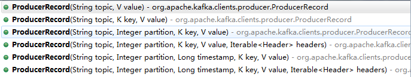

# Kafka基础教程-Kafka简介

---

### 概述

kafka是一种高吞吐量的分布式发布订阅消息系统，使用Scala编写。kafka拥有作为一个消息系统应该具备的功能，但是确有着独特的设计。可以这样来说，kafka借鉴了JMS规范的思想，但是却并没有完全遵循JMS规范。kafka是一个分布式的，分区的消息(官方称之为commit log)服务。

### 相关术语

* Topic: kafka按照Topic分类来维护消息。
* Producer： 我们将发布(publish)消息到Topic的进程称之为生产者。
* Consumer： 我们将订阅(subscribe)Topic并且处理Topic中消息的进程称之为消费者。
* Broker： kafka以集群的方式运行，集群中的每一台服务器称之为一个代理(broker)。

服务端(brokers)和客户端(producer、consumer)之间通信通过TCP协议来完成。我们为kafka提供了一个Java客户端，但是也可以使用其他语言编写的客户端。

### Topic和Log

让我们首先深入理解kafka提出一个高层次的抽象概念-Topic。

可以理解Topic是一个类别的名称，所有的message发送到Topic下面。对于每一个Topic，kafka集群按照如下方式维护一个分区(Partition,可以就理解为一个队列Queue)日志文件:

partition是一个有序的message序列，这些message按顺序添加到一个叫做commit log的文件中。每个partition中的消息都有一个唯一的编号，称之为offset，用来唯一标示某个分区中的message。

提示：每个partition，都对应一个commit-log。一个partition中的message的offset都是唯一的，但是不同的partition中的message的offset可能是相同的。

kafka集群，在配置的时间范围内，维护所有的由producer生成的消息，而不管这些消息有没有被消费。例如日志保留( log retention )时间被设置为2天。kafka会维护最近2天生产的所有消息，而2天前的消息会被丢弃。kafka的性能与保留的数据量的大小没有关系，因此保存大量的数据(日志信息)不会有什么影响。

每个consumer是基于自己在commit log中的消费进度(offset)来进行工作的。在kafka中，offset由consumer来维护：一般情况下我们按照顺序逐条消费commit log中的消息，当然我可以通过指定offset来重复消费某些消息，或者跳过某些消息。

这意味kafka中的consumer对集群的影响是非常小的，添加一个或者减少一个consumer，对于集群或者其他consumer来说，都是没有影响的，因此每个consumer维护各自的offset。

对log进行分区（partitioned），有以下目的。首先，当log文件大小超过系统文件系统的限制时，可以自动拆分。每个partition对应的log都受到所在机器的文件系统大小的限制，但是一个Topic中是可以有很多分区的，因此可以处理任意数量的数据。另一个方面，是为了提高并行度。

### Distribution

log的partitions分布在kafka集群中不同的broker上，每个broker可以请求备份其他broker上partition上的数据。kafka集群支持配置一个partition备份的数量。

针对每个partition，都有一个broker起到“leader”的作用，0个多个其他的broker作为“follwers”的作用。leader处理所有的针对这个partition的读写请求，而followers被动复制leader的结果。如果这个leader失效了，其中的一个follower将会自动的变成新的leader。每个broker都是自己所管理的partition的leader，同时又是其他broker所管理partitions的followers，kafka通过这种方式来达到负载均衡。

### Producers

生产者将消息发送到topic中去，同时负责选择将message发送到topic的哪一个partition中。通过round-robin做简单的负载均衡。也可以根据消息中的某一个关键字来进行区分。通常第二种方式使用的更多。

生产消息的几种方式：

* 指定了 patition，则直接使用；
* 未指定 patition 但指定 key，通过对 key 的 value 进行hash 选出一个 patition ；
* patition 和 key 都未指定，使用轮询选出一个 patition。

### Consumers

传统的消息传递模式有2种：队列( queuing)和（ publish-subscribe）。

在queuing模式中，多个consumer从服务器中读取数据，消息只会到达一个consumer（单播）。在 publish-subscribe 模型中，消息会被广播给所有的consumer（广播）。kafka基于这2种模式提供了一种consumer的抽象概念：consumer group。

每个consumer都要标记自己属于哪一个consumer group。发布到topic中的message中message会被传递到consumer group中的一个consumer 实例。consumer实例可以运行在不同的进程上，也可以在不同的物理机器上。

如果所有的consumer都位于同一个consumer group 下，这就类似于传统的queue模式，并在众多的consumer instance之间进行负载均衡。

如果所有的consumer都有着自己唯一的consumer group，这就类似于传统的publish-subscribe模型。

更一般的情况是，通常一个topic会有几个consumer group，每个consumer group都是一个逻辑上的订阅者（ logical subscriber ）。每个consumer group由多个consumer instance组成，从而达到可扩展和容灾的功能。这并没有什么特殊的地方，仅仅是将publish-subscribe模型中的运行在单个进程上的consumers中的consumer替换成一个consumer group。如下图所示：

说明：由2个broker组成的kafka集群，总共有4个Parition(P0-P3)。这个集群有2个Consumer Group， A有2个 consumer instances ，而B有四个。

### 消费顺序

kafka比传统的消息系统有着更强的顺序保证。在传统的情况下，服务器按照顺序保留消息到队列，如果有多个consumer来消费队列中的消息，服务器 会接受消息的顺序向外提供消息。但是，尽管服务器是按照顺序提供消息，但是消息传递到每一个consumer是异步的，这可能会导致先消费的 consumer获取到消息时间可能比后消费的consumer获取到消息的时间长，导致不能保证顺序性。这表明，当进行并行的消费的时候，消息在多个 consumer之间可能会失去顺序性。消息系统通常会采取一种“ exclusive consumer”的概念，来确保同一时间内只有一个consumer能够从队列中进行消费，但是这实际上意味着在消息处理的过程中是不支持并行的。

kafka在这方面做的更好。通过Topic中并行度的概念，即partition，kafka可以同时提供顺序性保证和多个consumer同时消费时的负载均衡。实现的原理是通过将一个topic中的partition分配给一个consumer group中的不同consumer instance。通过这种方式，我们可以保证一个partition在同一个时刻只有一个consumer instance在消费，从而保证顺序。虽然一个topic中有多个partition，但是一个consumer group中同时也有多个consumer instance，通过合理的分配依然能够保证负载均衡。需要注意的是，一个consumer group中的consumer instance的数量不能比一个Topic中的partition的数量多。

kafka只在partition的范围内保证消息消费的局部顺序性，不能在同一个topic中的多个partition中保证总的消费顺序性。通常来说，这已经可以满足大部分应用的需求。但是，如果的确有在总体上保证消费的顺序的需求的话，那么我们可以通过将topic的partition数量设置为1，将consumer group中的consumer instance数量也设置为1。

### Guarantees

从较高的层面上来说的话，kafka提供了以下的保证：

1）发送到一个Topic中的message会按照发送的顺序添加到commit log中。意思是，如果消息 M1，M2由同一个producer发送，M1比M2发送的早的话，那么在commit log中，M1的offset就会比commit 2的offset小。

2）一个consumer在commit log中可以按照发送顺序来消费message如果一个topic的备份因子( replication factor )设置为N，那么kafka可以容忍N-1个服务器的失败，而存储在commit log中的消息不会丢失。

   

---

