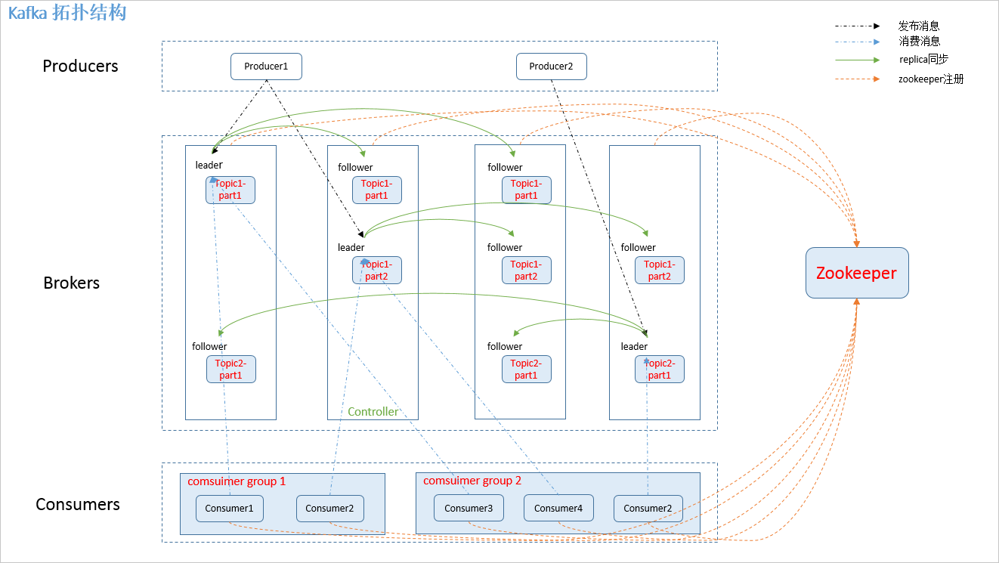
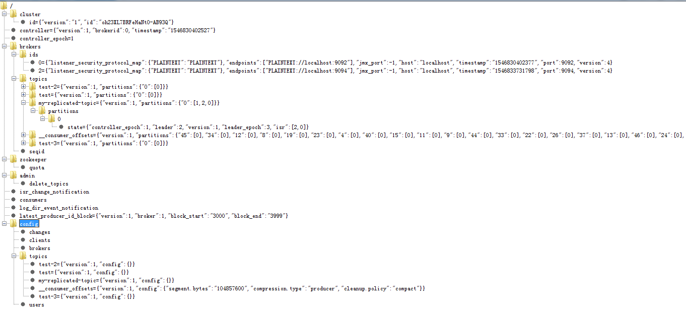
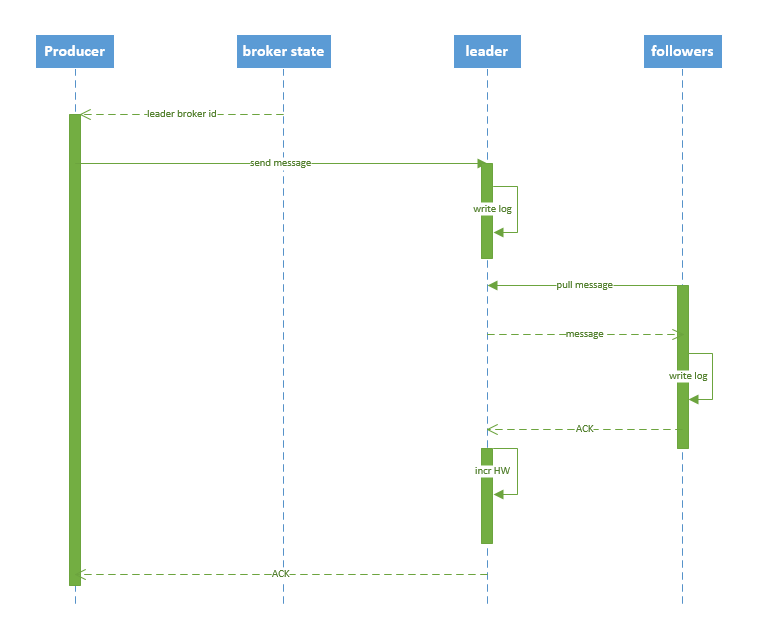
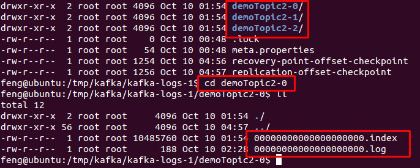
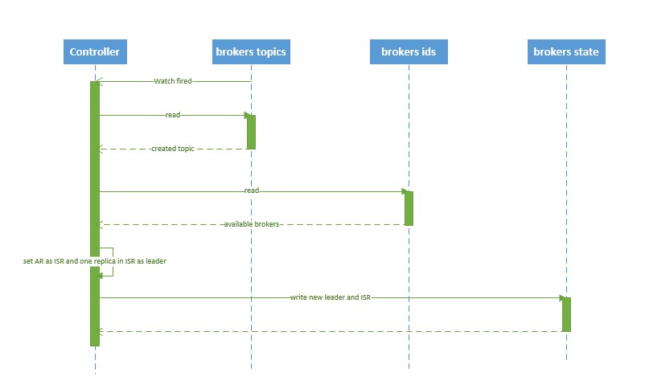
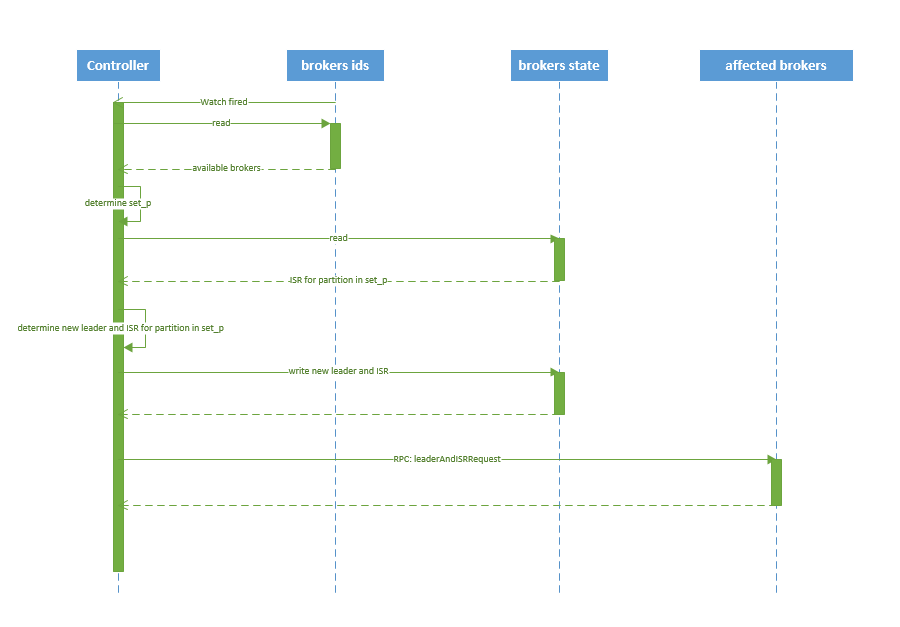
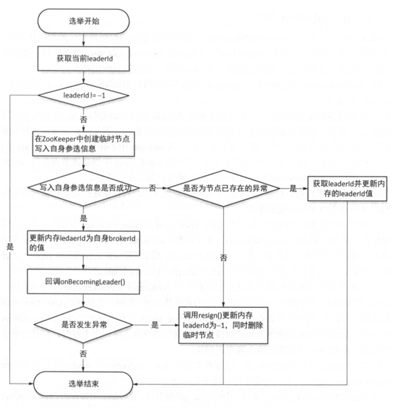
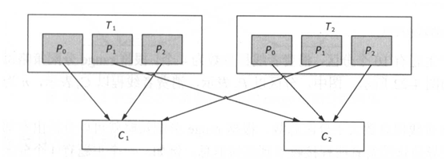
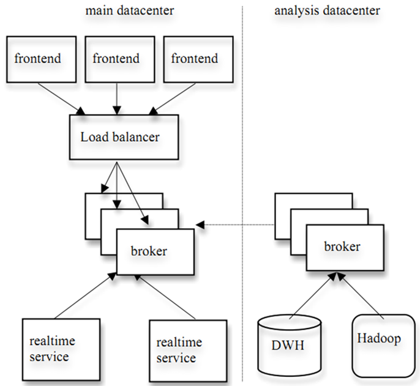

# Kafka基础教程-Kafka设计原理

---

### 为什么需要消息系统

1、解耦

允许你独立的扩展或修改两边的处理过程，只要确保它们遵守同样的接口约束。

2、冗余

消息队列把数据进行持久化直到它们已经被完全处理，通过这一方式规避了数据丢失风险。许多消息队列所采用的"插入-获取-删除"范式中，在把一个消息从队列中删除之前，需要你的处理系统明确的指出该消息已经被处理完毕，从而确保你的数据被安全的保存直到你使用完毕。

3、扩展性

因为消息队列解耦了你的处理过程，所以增大消息入队和处理的频率是很容易的，只要另外增加处理过程即可。

4、灵活性 & 峰值处理能力

在访问量剧增的情况下，应用仍然需要继续发挥作用，但是这样的突发流量并不常见。如果为以能处理这类峰值访问为标准来投入资源随时待命无疑是巨大的浪费。使用消息队列能够使关键组件顶住突发的访问压力，而不会因为突发的超负荷的请求而完全崩溃。

5、可恢复性

系统的一部分组件失效时，不会影响到整个系统。消息队列降低了进程间的耦合度，所以即使一个处理消息的进程挂掉，加入队列中的消息仍然可以在系统恢复后被处理。

6、顺序保证

在大多使用场景下，数据处理的顺序都很重要。大部分消息队列本来就是排序的，并且能保证数据会按照特定的顺序来处理。（Kafka 保证一个 Partition 内的消息的有序性）

7、缓冲

有助于控制和优化数据流经过系统的速度，解决生产消息和消费消息的处理速度不一致的情况。

8、异步通信

很多时候，用户不想也不需要立即处理消息。消息队列提供了异步处理机制，允许用户把一个消息放入队列，但并不立即处理它。想向队列中放入多少消息就放多少，然后在需要的时候再去处理它们。

### kafka架构

1、拓扑结构

2、相关概念

kafka 相关名词解释如下：

* producer：消息生产者，发布消息到 kafka 集群的终端或服务。
* broker：kafka 集群中包含的服务器。
* topic：每条发布到 kafka 集群的消息属于的类别，即 kafka 是面向 topic 的。
* partition：partition 是物理上的概念，每个 topic 包含一个或多个 partition。kafka 分配的单位是 partition。
* consumer：从 kafka 集群中消费消息的终端或服务。
* Consumer group：high-level consumer API 中，每个 consumer 都属于一个 consumer group，每条消息只能被 consumer group 中的一个 Consumer 消费，但可以被多个 consumer group 消费。
* replica：partition 的副本，保障 partition 的高可用。
* leader：replica 中的一个角色， producer 和 consumer 只跟 leader 交互。
* follower：replica 中的一个角色，从 leader 中复制数据。
* controller：kafka 集群中的其中一个服务器，用来进行 leader election 以及 各种 failover。
* zookeeper：kafka 通过 zookeeper 来存储集群的 meta 信息。

3、zookeeper节点

kafka 在 zookeeper 中的存储结构如下图所示：

### producer发布消息

1、写入方式

producer 采用 push 模式将消息发布到 broker，每条消息都被 append 到 patition 中，属于顺序写磁盘（顺序写磁盘效率比随机写内存要高，保障 kafka 吞吐率）。

2、消息路由

producer 发送消息到 broker 时，会根据分区算法选择将其存储到哪一个 partition。其路由机制为：

* 指定了 patition，则直接使用；
* 未指定 patition 但指定 key，通过对 key 的 value 进行hash 选出一个 patition；
* patition 和 key 都未指定，使用轮询选出一个 patition。

附上 java 客户端分区源码，一目了然：

~~~java
//创建消息实例
public ProducerRecord(String topic, Integer partition, Long timestamp, K key, V value) {
	if (topic == null)
		throw new IllegalArgumentException("Topic cannot be null");
	if (timestamp != null && timestamp < 0)
		throw new IllegalArgumentException("Invalid timestamp " + timestamp); 
	this.topic = topic;
	this.partition = partition;
	this.key = key;
	this.value = value;
	this.timestamp = timestamp;
}

//计算 patition，如果指定了 patition 则直接使用，否则使用 key 计算
private int partition(ProducerRecord<K, V> record, byte[] serializedKey , byte[] serializedValue, Cluster cluster) {
	Integer partition = record.partition();
	if (partition != null) {
		List<PartitionInfo> partitions = cluster.partitionsForTopic(record.topic());
		int lastPartition = partitions.size() - 1;
		if (partition < 0 || partition > lastPartition) {
			throw new IllegalArgumentException(String.format("Invalid partition given with record: %d is not in the range [0...%d].", partition, lastPartition));
		}
		return partition;
	}
	return this.partitioner.partition(record.topic(), record.key(), serializedKey, record.value(), serializedValue, cluster);
}

// 使用 key 选取 patition
public int partition(String topic, Object key, byte[] keyBytes, Object value, byte[] valueBytes, Cluster cluster) {
	List<PartitionInfo> partitions = cluster.partitionsForTopic(topic);
	int numPartitions = partitions.size();
	if (keyBytes == null) {
		int nextValue = counter.getAndIncrement();
		List<PartitionInfo> availablePartitions = cluster.availablePartitionsForTopic(topic);
		if (availablePartitions.size() > 0) {
			int part = DefaultPartitioner.toPositive(nextValue) % availablePartitions.size();
			return availablePartitions.get(part).partition();
		} else {
			return DefaultPartitioner.toPositive(nextValue) % numPartitions;
		}
	} else {
		//对 keyBytes 进行 hash 选出一个 patition
		return DefaultPartitioner.toPositive(Utils.murmur2(keyBytes)) % numPartitions;
	}
}
~~~

3、写入流程

producer 写入消息序列图如下所示：

流程说明：

* producer 先从 zookeeper 的 "/brokers/.../state" 节点找到该 partition 的 leader；
* producer 将消息发送给该 leader；
* leader 将消息写入本地 log；
* followers 从 leader pull 消息，写入本地 log 后 leader 发送 ACK；
* leader 收到所有 ISR 中的 replica 的 ACK 后，增加 HW（high watermark，最后 commit 的 offset） 并向 producer 发送 ACK。

4、producer delivery guarantee

一般情况下存在三种情况：

* At most once 消息可能会丢，但绝不会重复传输；
* At least one 消息绝不会丢，但可能会重复传输；
* Exactly once 每条消息肯定会被传输一次且仅传输一次；

当 producer 向 broker 发送消息时，一旦这条消息被 commit，由于 replication 的存在，它就不会丢。但是如果 producer 发送数据给 broker 后，遇到网络问题而造成通信中断，那 Producer 就无法判断该条消息是否已经 commit。虽然 Kafka 无法确定网络故障期间发生了什么，但是 producer 可以生成一种类似于主键的东西，发生故障时幂等性的重试多次，这样就做到了 Exactly once，但目前还并未实现。所以目前默认情况下一条消息从 producer 到 broker 是确保了 At least once，可通过设置 producer 异步发送实现At most once。

### broker保存消息

1、存储方式

物理上把 topic 分成一个或多个 patition（对应 server.properties 中的 num.partitions=3 配置），每个 patition 物理上对应一个文件夹（该文件夹存储该 patition 的所有消息和索引文件），如下：

2、存储策略

无论消息是否被消费，kafka 都会保留所有消息。有两种策略可以删除旧数据：

* 基于时间：log.retention.hours=168；
* 基于大小：log.retention.bytes=1073741824

需要注意的是，因为Kafka读取特定消息的时间复杂度为O(1)，即与文件大小无关，所以这里删除过期文件与提高 Kafka 性能无关。

3、topic创建与删除

1）创建 topic

创建 topic 的序列图如下所示：

流程说明：

~~~plaintext
1. controller 在 ZooKeeper 的 /brokers/topics 节点上注册 watcher，当 topic 被创建，则 controller 会通过 watch 得到该 topic 的 partition/replica 分配。
2. controller从 /brokers/ids 读取当前所有可用的 broker 列表，对于 set_p 中的每一个 partition：
2.1 从分配给该 partition 的所有 replica（称为AR）中任选一个可用的 broker 作为新的 leader，并将AR设置为新的 ISR
2.2 将新的 leader 和 ISR 写入 /brokers/topics/[topic]/partitions/[partition]/state
3. controller 通过 RPC 向相关的 broker 发送 LeaderAndISRRequest。
~~~

2）删除 topic

删除 topic 的序列图如下所示：

流程说明：

~~~plaintext
1. controller 在 zooKeeper 的 /brokers/topics 节点上注册 watcher，当 topic 被删除，则 controller 会通过 watch 得到该 topic 的 partition/replica 分配。
2. 若 delete.topic.enable=false，结束；否则 controller 注册在 /admin/delete_topics 上的 watch 被 fire，controller 通过回调向对应的 broker 发送 StopReplicaRequest。
~~~

### kafka HA

1、replication

如图.1所示，同一个 partition 可能会有多个 replica（对应 server.properties 配置中的 default.replication.factor=N）。没有 replica 的情况下，一旦 broker 宕机，其上所有 patition 的数据都不可被消费，同时 producer 也不能再将数据存于其上的 patition。引入replication 之后，同一个 partition 可能会有多个 replica，而这时需要在这些 replica 之间选出一个 leader，producer 和 consumer 只与这个 leader 交互，其它 replica 作为 follower 从 leader 中复制数据。

Kafka 分配 Replica 的算法如下：

* 将所有 broker（假设共 n 个 broker）和待分配的 partition 排序；
* 将第 i 个 partition 分配到第（i mod n）个 broker 上；
* 将第 i 个 partition 的第 j 个 replica 分配到第（(i + j) mode n）个 broker上；

2、leader failover

当 partition 对应的 leader 宕机时，需要从 follower 中选举出新 leader。在选举新leader时，一个基本的原则是，新的 leader 必须拥有旧 leader commit 过的所有消息。

kafka 在 zookeeper 中（/brokers/.../state）动态维护了一个 ISR（in-sync replicas），由3.3节的写入流程可知 ISR 里面的所有 replica 都跟上了 leader，只有 ISR 里面的成员才能选为 leader。对于 f+1 个 replica，一个 partition 可以在容忍 f 个 replica 失效的情况下保证消息不丢失。

当所有 replica 都不工作时，有两种可行的方案：

* 等待 ISR 中的任一个 replica 活过来，并选它作为 leader。可保障数据不丢失，但时间可能相对较长。
* 选择第一个活过来的 replica（不一定是 ISR 成员）作为 leader。无法保障数据不丢失，但相对不可用时间较短。

kafka 0.8.* 使用第二种方式。kafka 通过 Controller 来选举 leader，流程请参考5.3节。

3、broker failover

kafka broker failover 序列图如下所示：

流程说明：

~~~plaintext
1.controller 在 zookeeper 的 /brokers/ids/[brokerId] 节点注册 Watcher，当 broker 宕机时 zookeeper 会 fire watch
2. controller 从 /brokers/ids 节点读取可用broker
3. controller决定set_p，该集合包含宕机 broker 上的所有 partition
4. 对 set_p 中的每一个 partition
4.1 从/brokers/topics/[topic]/partitions/[partition]/state 节点读取 ISR    
4.2 决定新 leader（如4.3节所描述）
4.3 将新 leader、ISR、controller_epoch 和 leader_epoch 等信息写入 state 节点
5. 通过 RPC 向相关 broker 发送 leaderAndISRRequest 命令
~~~

4、controller failover

当 controller 宕机时会触发 controller failover。每个 broker 都会在 zookeeper 的 "/controller" 节点注册 watcher，当 controller 宕机时 zookeeper 中的临时节点消失，所有存活的 broker 收到 fire 的通知，每个 broker 都尝试创建新的 controller path，只有一个竞选成功并当选为 controller。

当新的 controller 当选时，会触发 KafkaController.onControllerFailover 方法，在该方法中完成如下操作：

* 读取并增加 Controller Epoch；
*  在 reassignedPartitions Patch(/admin/reassign_partitions) 上注册 watcher；
*  在 preferredReplicaElection Path(/admin/preferred_replica_election) 上注册 watcher；
*  通过 partitionStateMachine 在 broker Topics Patch(/brokers/topics) 上注册 watcher；
*  若 delete.topic.enable=true（默认值是 false），则 partitionStateMachine 在 Delete Topic Patch(/admin/delete_topics) 上注册 watcher；
*  通过 replicaStateMachine在 Broker Ids Patch(/brokers/ids)上注册Watch；
*  初始化 ControllerContext 对象，设置当前所有 topic，“活”着的 broker 列表，所有 partition 的 leader 及 ISR等；
*  启动 replicaStateMachine 和 partitionStateMachine；
*  将 brokerState 状态设置为 RunningAsController；
*  将每个 partition 的 Leadership 信息发送给所有“活”着的 broker；
*  若 auto.leader.rebalance.enable=true（默认值是true），则启动 partition-rebalance 线程；
*  若 delete.topic.enable=true 且Delete Topic Patch(/admin/delete_topics)中有值，则删除相应的Topic。

5、分区leader选举原理

补充：kafka的组协调器与消费者协调器，组协调器负责选举出消费者leader，消费者leader根据分区分配策略匹配消费者与分区的消费关系 。

* 分区与消费者消费分配策略
* round-robin分区分配策略

### consumer消费消息

1、consumer APIkafka 提供了两套 consumer API：

* The high-level Consumer API；
* The SimpleConsumer API；

其中 high-level consumer API 提供了一个从 kafka 消费数据的高层抽象，而 SimpleConsumer API 则需要开发人员更多地关注细节。

1）The high-level consumer API

high-level consumer API 提供了 consumer group 的语义，一个消息只能被 group 内的一个 consumer 所消费，且 consumer 消费消息时不关注 offset，最后一个 offset 由 zookeeper 保存。

使用 high-level consumer API 可以是多线程的应用，应当注意：

* 如果消费线程大于 patition 数量，则有些线程将收不到消息；
* 如果 patition 数量大于线程数，则有些线程多收到多个 patition 的消息；
* 如果一个线程消费多个 patition，则无法保证你收到的消息的顺序，而一个 patition 内的消息是有序的；

2）The SimpleConsumer API

如果你想要对 patition 有更多的控制权，那就应该使用 SimpleConsumer API，比如：

* 多次读取一个消息；
* 只消费一个 patition 中的部分消息；
* 使用事务来保证一个消息仅被消费一次；

但是使用此 API 时，partition、offset、broker、leader 等对你不再透明，需要自己去管理。你需要做大量的额外工作：

* 必须在应用程序中跟踪 offset，从而确定下一条应该消费哪条消息；
* 应用程序需要通过程序获知每个 Partition 的 leader 是谁；
* 需要处理 leader 的变更；

使用 SimpleConsumer API 的一般流程如下：

* 查找到一个“活着”的 broker，并且找出每个 partition 的 leader；
* 找出每个 partition 的 follower；
* 定义好请求，该请求应该能描述应用程序需要哪些数据；
* fetch 数据；
* 识别 leader 的变化，并对之作出必要的响应；

以下针对 high-level Consumer API 进行说明。

2、consumer group

如 2.2 节所说， kafka 的分配单位是 patition。每个 consumer 都属于一个 group，一个 partition 只能被同一个 group 内的一个 consumer 所消费（也就保障了一个消息只能被 group 内的一个 consuemr 所消费），但是多个 group 可以同时消费这个 partition。

kafka 的设计目标之一就是同时实现离线处理和实时处理，根据这一特性，可以使用 spark/Storm 这些实时处理系统对消息在线处理，同时使用 Hadoop 批处理系统进行离线处理，还可以将数据备份到另一个数据中心，只需要保证这三者属于不同的 consumer group。如下图所示：

3、消费方式

consumer 采用 pull 模式从 broker 中读取数据。

push 模式很难适应消费速率不同的消费者，因为消息发送速率是由 broker 决定的。它的目标是尽可能以最快速度传递消息，但是这样很容易造成 consumer 来不及处理消息，典型的表现就是拒绝服务以及网络拥塞。而 pull 模式则可以根据 consumer 的消费能力以适当的速率消费消息。

对于 Kafka 而言，pull 模式更合适，它可简化 broker 的设计，consumer 可自主控制消费消息的速率，同时 consumer 可以自己控制消费方式——即可批量消费也可逐条消费，同时还能选择不同的提交方式从而实现不同的传输语义。

4、consumer delivery guarantee

如果将 consumer 设置为 autocommit，consumer 一旦读到数据立即自动 commit。如果只讨论这一读取消息的过程，那 Kafka 确保了 Exactly once。

但实际使用中应用程序并非在 consumer 读取完数据就结束了，而是要进行进一步处理，而数据处理与 commit 的顺序在很大程度上决定了consumer delivery guarantee：

* 读完消息先 commit 再处理消息：这种模式下，如果 consumer 在 commit 后还没来得及处理消息就 crash 了，下次重新开始工作后就无法读到刚刚已提交而未处理的消息，这就对应于 At most once。
* 读完消息先处理再 commit：这种模式下，如果在处理完消息之后 commit 之前 consumer crash 了，下次重新开始工作时还会处理刚刚未 commit 的消息，实际上该消息已经被处理过了。这就对应于 At least once。
* 如果一定要做到 Exactly once，就需要协调 offset 和实际操作的输出：精典的做法是引入两阶段提交。如果能让 offset 和操作输入存在同一个地方，会更简洁和通用。这种方式可能更好，因为许多输出系统可能不支持两阶段提交。比如，consumer 拿到数据后可能把数据放到 HDFS，如果把最新的 offset 和数据本身一起写到 HDFS，那就可以保证数据的输出和 offset 的更新要么都完成，要么都不完成，间接实现 Exactly once。（目前就 high-level API而言，offset 是存于Zookeeper 中的，无法存于HDFS，而SimpleConsuemr API的 offset 是由自己去维护的，可以将之存于 HDFS 中）。

总之，Kafka 默认保证 At least once，并且允许通过设置 producer 异步提交来实现 At most once（见文章《kafka consumer防止数据丢失》）。而 Exactly once 要求与外部存储系统协作，幸运的是 kafka 提供的 offset 可以非常直接非常容易得使用这种方式。更多关于 kafka 传输语义的信息请参考《Message Delivery Semantics》。

5、consumer rebalance

当有 consumer 加入或退出、以及 partition 的改变（如 broker 加入或退出）时会触发 rebalance。consumer rebalance算法如下：

* 将目标 topic 下的所有 partirtion 排序，存于PT；
* 对某 consumer group 下所有 consumer 排序，存于 CG，第 i 个consumer 记为 Ci；
* N=size(PT)/size(CG)，向上取整；
* 解除 Ci 对原来分配的 partition 的消费权（i从0开始）；
* 将第i*N到（i+1）*N-1个 partition 分配给 Ci；

在 0.8.*版本，每个 consumer 都只负责调整自己所消费的 partition，为了保证整个consumer group 的一致性，当一个 consumer 触发了 rebalance 时，该 consumer group 内的其它所有其它 consumer 也应该同时触发 rebalance。这会导致以下几个问题：

* Herd effect：任何 broker 或者 consumer 的增减都会触发所有的 consumer 的 rebalance；
* Split Brain：每个 consumer 分别单独通过 zookeeper 判断哪些 broker 和 consumer 宕机了，那么不同 consumer 在同一时刻从 zookeeper 看到的 view 就可能不一样，这是由 zookeeper 的特性决定的，这就会造成不正确的 reblance 尝试；
* 调整结果不可控：所有的 consumer 都并不知道其它 consumer 的 rebalance 是否成功，这可能会导致 kafka 工作在一个不正确的状态。

基于以上问题，kafka 设计者考虑在0.9.*版本开始使用中心 coordinator 来控制 consumer rebalance，然后又从简便性和验证要求两方面考虑，计划在 consumer 客户端实现分配方案。（见文章《Kafka Detailed Consumer Coordinator Design》和《Kafka Client-side Assignment Proposal》），此处不再赘述。

### 注意事项

1、producer 无法发送消息的问题

最开始在本机搭建了kafka伪集群，本地 producer 客户端成功发布消息至 broker。随后在服务器上搭建了 kafka 集群，在本机连接该集群，producer 却无法发布消息到 broker（奇怪也没有抛错）。最开始怀疑是 iptables 没开放，于是开放端口，结果还不行（又开始是代码问题、版本问题等等，倒腾了很久）。最后没办法，一项一项查看 server.properties 配置，发现以下两个配置：

~~~plaintext
# The address the socket server listens on. It will get the value returned from 
# java.net.InetAddress.getCanonicalHostName() if not configured.
#   FORMAT:
#     listeners = security_protocol://host_name:port
#   EXAMPLE:
#     listeners = PLAINTEXT://your.host.name:9092
listeners=PLAINTEXT://:9092
	# Hostname and port the broker will advertise to producers and consumers. If not set,
	# it uses the value for "listeners" if configured. Otherwise, it will use the value
	# returned from java.net.InetAddress.getCanonicalHostName().　
	#advertised.listeners=PLAINTEXT://your.host.name:9092
~~~

以上说的就是 advertised.listeners 是 broker 给 producer 和 consumer 连接使用的，如果没有设置，就使用 listeners，而如果 host_name 没有设置的话，就使用 java.net.InetAddress.getCanonicalHostName() 方法返回的主机名。修改方法：

~~~plaintext
1. listeners=PLAINTEXT://121.10.26.XXX:9092
2. advertised.listeners=PLAINTEXT://121.10.26.XXX:9092
~~~

修改后重启服务，正常工作。关于更多 kafka 配置说明，见文章《Kafka学习整理三(borker(0.9.0及0.10.0)配置)》。

### 参考资料

* [官网](http://kafka.apache.org/documentation.html#semantics)
* [Kafka设计解析（一）- Kafka背景及架构介绍](http://www.jasongj.com/2015/03/10/KafkaColumn1/)
* [Kafka设计解析（二）- Kafka High Availability （上）](http://www.jasongj.com/2015/04/24/KafkaColumn2/)
* [Kafka设计解析（三）- Kafka High Availability （下）](http://www.jasongj.com/2015/06/08/KafkaColumn3/)
* [Kafka设计解析（四）- Kafka Consumer设计解析](http://www.jasongj.com/2015/08/09/KafkaColumn4/)
* [Kafka设计解析（五）- Kafka性能测试方法及Benchmark报告 ](http://www.jasongj.com/2015/12/31/KafkaColumn5_kafka_benchmark/)
* [Kafka和DistributedLog技术对比](http://www.infoq.com/cn/articles/technology-comparison-of-kafka-and-distributedlog?utm_campaign=rightbar_v2&utm_source=infoq&utm_medium=articles_link&utm_content=link_text)

   

---

