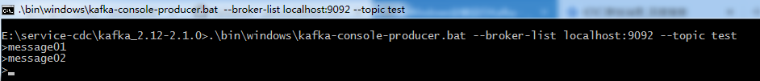

# Kafka基础教程-Kafka Windows环境操作手册

---

### 环境准备

1、安装JDK

由于Kafka是用Scala语言开发的，运行在JVM上，因此在安装Kafka之前需要先安装JDK。

安装过程（略）。

查看版本：

2、安装zookeeper

安装过程（略）。

启动服务端：

~~~plaintext
## 进入zookeeper bin目录
运行 zkServer.cmd
~~~

启动客户端：

~~~plaintext
## 进入zookeeper bin目录
运行 zkCli.cmd
~~~

待kafka启动后，查看zookeeper节点：

### 安装kafka

~~~plaintext
1、下载安装包
## 下载kafka 二进制版本
## http://kafka.apache.org/downloads
~~~

~~~plaintext
2、 解压并进入Kafka目录，如：E:\service-cdc\kafka_2.12-2.1.0

3、 进入config目录找到文件server.properties并打开

4、 修改日志路径
log.dirs=E:\kafka-logs

5、 如果zookeeper不在本机，则修改以下配置
zookeeper.connect=localhost:2181

6、 Kafka 默认在9092端口上运行，并连接zookeeper的默认端口：2181

7、启动kafka 
进入Kafka安装目录 E:\service-cdc\kafka_2.12-2.1.0 ,按下Shift+右键，选择“打开命令窗口”选项，打开命令行，输入以下命令：
bin\windows\kafka-server-start.bat  config\server.properties
~~~

注意：不要关了这个kafka启动窗口，启用Kafka前请确保ZooKeeper实例已经准备好并开始运行。

### 测试

1、创建主题

~~~plaintext
1、 进入Kafka安装目录，按下Shift+右键，选择“打开命令窗口”选项，打开命令行，输入：
.\bin\windows\kafka-topics.bat --create --zookeeper localhost:2181 --replication-factor 1 --partitions 1 --topic test

2、查看主题
.\bin\windows\kafka-topics.bat --list --zookeeper localhost:2181
~~~

2、创建生产者

~~~plaintext
进入Kafka安装目录D:\Kafka\kafka_2.12-0.11.0.0，按下Shift+右键，选择“打开命令窗口”选项，打开命令行，输入：

.\bin\windows\kafka-console-producer.bat --broker-list localhost:9092 --topic test
~~~

3、创建消费者

~~~plaintext
进入Kafka安装目录，按下Shift+右键，选择“打开命令窗口”选项，打开命令行，输入：

.\bin\windows\kafka-console-consumer.bat --bootstrap-server localhost:9092 --topic test --from-beginning
~~~

### 参考资料

* http://kafka.apache.org/
* http://www.cnblogs.com/cyfonly/p/5954614.html

   

---

