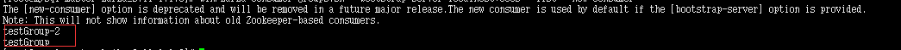

# Kafka基础教程-Kafka Linux环境操作手册

---

### 环境准备

1、目录规划

2、安装JDK

由于Kafka是用Scala语言开发的，运行在JVM上，因此在安装Kafka之前需要先安装JDK。

3、安装Zookeeper

~~~plaintext
## 下载安装包
# wget https://mirrors.tuna.tsinghua.edu.cn/apache/zookeeper/stable/zookeeper-3.4.12.tar.gz

## 解压安装包
# tar -zxvf zookeeper-3.4.12.tar.gz
# cd zookeeper-3.4.12
# cp conf/zoo_sample.cfg conf/zoo.cfg

## 启动zk服务端
# bin/zkServer.sh start
## 启动zk客户端
# bin/zkCli.sh
## 查看zk的根目录相关节点
# ls /
~~~

参考：[Centos7 搭建 zookeeper 伪集群](https://shimo.im/docs/Lstu3oj8BbUeydJB/)

### kafka单机

1、安装kafka

~~~plaintext
## 下载kafka 最新版
## http://mirrors.tuna.tsinghua.edu.cn/apache/kafka/
# wget https://mirrors.tuna.tsinghua.edu.cn/apache/kafka/2.1.0/kafka_2.12-2.1.0.tgz

# tar -zxf kafka_2.12-2.1.0.tgz
# mv kafka_2.12-2.1.0 /usr/local/kafka
# cd /usr/local/kafka
~~~

2、启动服务

~~~plaintext
## 启动脚本语法：kafka-server-start.sh [-daemon] server.properties
## 可以看到，server.properties的配置路径是一个强制的参数，-daemon表示以后台进程运行，否则ssh客户端退出后，就会停止服务。(注意，在启动kafka时会使用linux主机名关联的ip址，所以需要把主机名和linux的ip映射配置到本地host里，用vim /etc/hosts)

## 启动服务
# bin/kafka-server-start.sh -daemon config/server.properties

# 通过zookeeper客户端查看节点数据
# /usr/local/zookeeper/bin/zkCli.sh
## 查看zk的根目录kafka相关节点
# ls /
[cluster, brokers, zookeeper, admin, isr_change_notification, consumers, log_dir_event_notification, latest_producer_id_block, config]

## 查看 brokers
# ls /brokers
[ids, topics, seqid]
# ls /brokers/ids
	[0]
~~~

3、创建主题

~~~plaintext
## 现在我们来创建一个名字为“test”的Topic，这个topic只有一个partition，并且备份因子也设置为1
# bin/kafka-topics.sh --create --zookeeper 192.168.43.138:2181 --replication-factor 1 --partitions 1 --topic test

## 现在我们可以通过以下命令来查看kafka中目前存在的topic
# bin/kafka-topics.sh --list --zookeeper 192.168.43.138:2181

##　除了我们通过手工的方式创建Topic，我们可以配置broker，当producer发布一个消息某个指定的Topic，但是这个Topic并不存在时，就自动创建。
~~~

4、发送消息

~~~plaintext
## kafka自带了一个producer命令客户端，可以从本地文件中读取内容，或者我们也可以以命令行中直接输入内容，并将这些内容以消息的形式发送到kafka集群中。在默认情况下，每一个行会被当做成一个独立的消息。
## 首先我们要运行发布消息的脚本，然后在命令中输入要发送的消息的内容：
# bin/kafka-console-producer.sh --broker-list 192.168.43.138:9092 --topic test
>this is a msg
>>this is a another msg 
~~~

5、消费消息

~~~plaintext
## 老版本
# bin/kafka-console-consumer.sh --zookeeper 192.168.43.138:2181 --topic test   --from-beginning

## 新版本
# bin/kafka-console-consumer.sh --bootstrap-server 192.168.43.138:9092  --consumer-property group.id=testGroup --consumer-property client.id=consumer-1  --topic test
~~~

1）单播消费

~~~plaintext
## 一条消息只能被某一个消费者消费的模式，类似queue模式，只需让所有消费者在同一个消费组里即可。分别在两个客户端执行如下消费命令，然后往主题里发送消息，结果只有一个客户端能收到消息
# bin/kafka-console-consumer.sh --bootstrap-server 192.168.43.138:9092  --consumer-property group.id=testGroup --topic test
~~~

测试结果：

~~~plaintext
启动两个consumer,group.id=testGroup --topic test
1）启动第一个consumer,第一个consumer开始接收消息
2）启动第二个consumer,第一个consumer暂停接收消息，第二个consumer开始接收消息
3）关闭第二个consumer，第一个consumer开始接收消息
~~~

2）多播消费

~~~plaintext
## 一条消息能被多个消费者消费的模式，类似publish-subscribe模式费，针对Kafka同一条消息只能被同一个消费组下的某一个消费者消费的特性，要实现多播只要保证这些消费者属于不同的消费组即可。我们再增加一个消费者，该消费者属于testGroup-2消费组，结果两个客户端都能收到消息
# bin/kafka-console-consumer.sh --bootstrap-server 192.168.43.138:9092  --consumer-property group.id=testGroup-2 --topic test 
~~~

测试结果：

~~~plaintext
1）不影响testGroup的消息接收
2）testGroup2的消息接收原理同testGroup
~~~

6、其它命令

1）查看组名

~~~plaintext
## 如果你是通过不同的终端窗口来运行以上的命令，你将会看到在producer终端输入的内容，很快就会在consumer的终端窗口上显示出来。
以上所有的命令都有一些附加的选项；当我们不携带任何参数运行命令的时候，将会显示出这个命令的详细用
## 查看组名（老版本不支持）
# bin/kafka-consumer-groups.sh --bootstrap-server 192.168.43.138:9092 --list --new-consumer
~~~

2）查看消费偏移量

~~~plaintext
## 查看消费者的消费偏移量（老版本不支持）
## Note: This will not show information about old Zookeeper-based consumers.
# bin/kafka-consumer-groups.sh --bootstrap-server 192.168.43.138:9092 --describe --group testGroup
~~~

* currrnt-offset：当前消费的偏移量；
* log-end-offset：最新消息偏移量；

3）消费多主题

~~~plaintext
## 消费多主题
# bin/kafka-console-consumer.sh --bootstrap-server 192.168.43.138:9092 --whitelist "test|test-2"
~~~

### kafka集群

1、配置broker

对于kafka来说，一个单独的broker意味着kafka集群中只有一个节点。要想增加kafka集群中的节点数量，只需要多启动几个broker实例即可。为了有更好的理解，现在我们在一台机器上同时启动三个broker实例。

创建其他2个broker的配置文件：

~~~plaintext
# cp config/server.properties config/server-1.properties
# cp config/server.properties config/server-2.properties
# mv config/server.properties config/server-0.properties
~~~

配置节点0：

~~~plaintext
# vim config/server-0.properties
broker.id=0
## 如果配置ip后broker无效，则将ip改成域名，并配置hosts
listeners=PLAINTEXT://192.168.54.193:9092
log.dirs=/logs/kafka-logs-0
## 如果要保证消息的顺序性，一个broker只设置一个分区
## 如果要增加消息的吞吐量，一个broker可设置多个分区
#num.partitions=2
~~~

配置节点1：

~~~plaintext
# vim config/server-1.properties
broker.id=1
listeners=PLAINTEXT://192.168.54.193:9093
log.dirs=/logs/kafka-logs-1
~~~

配置节点2：

~~~plaintext
# vim config/server-2.properties
broker.id=2
listeners=PLAINTEXT://192.168.54.193:9094
log.dirs=/logs/kafka-logs-2
~~~

2、启动broker

~~~plaintext
## 守护进程
# bin/kafka-server-start.sh -daemon config/server-0.properties
# bin/kafka-server-start.sh -daemon config/server-1.properties
# bin/kafka-server-start.sh -daemon config/server-2.properties

## 前端启动
# bin/kafka-server-start.sh  config/server-0.properties
# bin/kafka-server-start.sh  config/server-1.properties
# bin/kafka-server-start.sh  config/server-2.properties
~~~

3、创建topic

现在我们创建一个新的topic，备份因子设置为3：

~~~plaintext
# bin/kafka-topics.sh --create --zookeeper 192.168.43.138:2181 --replication-factor 3 --partitions 1 --topic my-replicated-topic
~~~

4、查询topic

现在我们已经有了集群，并且创建了一个3个备份因子的topic，但是到底是哪一个broker在为这个topic提供服务呢(因为我们只有一个分区，所以肯定同时只有一个broker在处理这个topic)？

~~~plaintext
# bin/kafka-topics.sh --describe --zookeeper 192.168.43.138:2181 --topic my-replicated-topic
~~~

以下是输出内容的解释。

第一行是所有分区的概要信息，之后的每一行表示每一个partition的信息。因为目前我们只有一个partition，因此关于partition的信息只有一行。

* leader节点负责给定partition的所有读写请求。
* replicas 表示某个partition在哪几个broker上存在备份。不管这个几点是不是”leader“，甚至这个节点挂了，也会列出。 
* isr 是replicas的一个子集，它只列出当前还存活着的，并且备份了该partition的节点。
* 现在我们的案例中，1号节点是leader，即使用server-1.properties启动的那个进程。

我们可以运行相同的命令查看之前创建的名称为”test“的topic：

~~~plaintext
# bin/kafka-topics.sh --describe --zookeeper 192.168.43.138:2181 --topic test 
~~~

之前设置了topic的partition数量为1，备份因子为1，因此显示就如上所示了。

5、发送消息

现在我们向新建的topic中发送一些message：

~~~plaintext
# bin/kafka-console-producer.sh --broker-list 192.168.43.138:9092 --topic my-replicated-topic
>my test msg 1
>my test msg 2
~~~

6、消费消息

~~~plaintext
# bin/kafka-console-consumer.sh --bootstrap-server 192.168.43.138:9092 --from-beginning --topic my-replicated-topic
my test msg 1
my test msg 2
~~~

7、容错性检查

现在我们来测试我们容错性，因为broker1目前是leader，所以我们要将其kill

~~~plaintext
# ps -ef | grep server-1.properties
# kill -9 17857
~~~

现在再执行命令：

~~~plaintext
# bin/kafka-topics.sh --describe --zookeeper 192.168.43.138:9092 --topic my-replicated-topic

偶发异常：
WARN Client session timed out, have not heard from server in 15017ms for sessionid 0x0 (org.apache.zookeeper.ClientCnxn)

Exception in thread "main" kafka.zookeeper.ZooKeeperClientTimeoutException: Timed out waiting for connection while in state: CONNECTING
~~~

我们可以看到，leader节点已经变成了broker 2，要注意的是，在Isr中，已经没有了1号节点。leader的选举也是从ISR(in-sync replica)中进行的。

此时，我们依然可以 消费新消息：

~~~plaintext
# bin/kafka-console-consumer.sh --bootstrap-server 192.168.43.138:9092  --consumer-property group.id=testGroup --topic my-replicated-topic
my test msg 1
my test msg 2
~~~

查看主题分区对应的leader信息：

8、多分区检查

~~~plaintext
## 修改broker配置num.partitions=2
## 重新启动节点
bin/kafka-server-start.sh -daemon config/server-0.properties
bin/kafka-server-start.sh -daemon config/server-1.properties
bin/kafka-server-start.sh -daemon config/server-2.properties
~~~

1）创建topic

~~~plaintext
# bin/kafka-topics.sh --create --zookeeper 192.168.43.138:2181 --replication-factor 3 --partitions 2 --topic my-partitions-topic
~~~

2）查询topic

~~~plaintext
# bin/kafka-topics.sh --describe --zookeeper 192.168.43.138:2181 --topic my-partitions-topic
~~~

3）发送消息

~~~plaintext
# bin/kafka-console-producer.sh --broker-list 192.168.43.138:9092 --topic my-partitions-topic
~~~

4）消费消息

~~~plaintext
# bin/kafka-console-consumer.sh --bootstrap-server 192.168.43.138:9092  --from-beginning --consumer-property group.id=testGroup --topic my-partitions-topic
~~~

5）动态监测消息偏移量

~~~plaintext
# bin/kafka-consumer-groups.sh --bootstrap-server 192.168.43.138:9092 --describe --group testGroup
~~~

疑问：发送3条消息后，为什么两个分区的offset都为3 ?

经测试：不断发消息，消息是是轮询的方式，发送到partions0和partions1两个分区。

消费完后，current-offset 增加。

   

---

