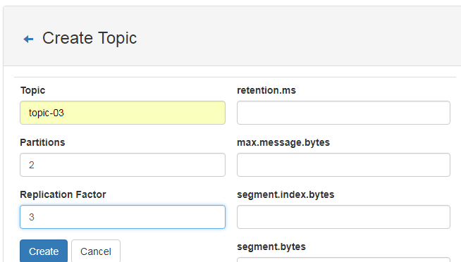

# Kafka基础教程-Kafka可视化工具

---

### kafka-manager简介

kafka-manager是目前最受欢迎的kafka集群管理工具，最早由雅虎开源，用户可以在Web界面执行一些简单的集群管理操作。具体支持以下内容：

* 管理多个集群；
* 轻松检查群集状态（主题，消费者，偏移，代理，副本分发，分区分发）；
* 运行首选副本选举；
* 使用选项生成分区分配以选择要使用的代理；
* 运行分区重新分配（基于生成的分配）；
* 使用可选主题配置创建主题（0.8.1.1具有与0.8.2+不同的配置）；
* 删除主题（仅支持0.8.2+并记住在代理配置中设置deete.topic.enabe = true）；
* 主题列表现在指示标记为删除的主题（仅支持0.8.2+）；
* 批量生成多个主题的分区分配，并可选择要使用的代理；
* 批量运行重新分配多个主题的分区；
* 将分区添加到现有主题；
* 更新现有主题的配置；

kafka-manager 项目地址：https://github.com/yahoo/kafka-manager 。

### kafka-manager安装

1、安装yum源

~~~plaintext
# curl https://bintray.com/sbt/rpm/rpm | sudo tee /etc/yum.repos.d/bintray-sbt-rpm.repo

# yum install -y sbt
~~~

2、解压安装包

方法一：

~~~plaintext
# cd /usr/local/src/kafka/
# git clone https://github.com/yahoo/kafka-manager.git
# cd kafka-manager/
~~~

方法二：

~~~plaintext
# https://github.com/yahoo/kafka-manager/releases
# cd /usr/local/src/kafka/
# wget https://codeload.github.com/yahoo/kafka-manager/zip/1.3.3.22
# unzip 压缩包
~~~

3、sbt编译

~~~plaintext
# cd kafka-manager
##　编译kafka-manager
# ./sbt clean dist
Getting org.scala-sbt sbt 0.13.9  (this may take some time)...
~~~

~~~plaintext
当了现以下提示，说明安装已经完成
[info] Your package is ready in /usr/local/src/kafka/kafka-manager/target/universal/kafka-manager-1.3.3.22.zip
~~~

4、安装

环境准备：Java 8+

kafka集群搭建参考：[CentOS7.5搭建Kafka2.11-1.1.0集群](https://www.cnblogs.com/frankdeng/p/9403883.html)。

~~~plaintext
## 重新解压编译好的zip文件
# unzip /usr/local/src/kafka/kafka-manager/target/universal/kafka-manager-1.3.3.22.zip -D /usr/local/kafka-manager

## 修改配置
# cd /usr/local/kafka-manager
# vim  config/applicaiton.conf
kafka-manager.zkhosts="127.0.0.1:2181"
~~~

5、启动服务

启动zk集群，kafka集群，再启动kafka-manager服务。

bin/kafka-manager 默认的端口是9000，可通过 -Dhttp.port，指定端口; -Dconfig.file=conf/application.conf指定配置文件:

~~~plaintext
nohup bin/kafka-manager -Dconfig.file=conf/application.conf -Dhttp.port=8080 &
~~~

6、查看进程

~~~plaintext
# jps
~~~

7、启动脚本

~~~plaintext
# chmod u+x kafka-manager.sh

#!/bin/bash
nohup bin/kafka-manager -Dconfig.file=conf/application.conf -Dhttp.port=8080 &
~~~

### kafka-manager配置

1、新增Cluster

Cluster -> Add Cluster：

2、查看集群状态

3、查看broker

4、查看topic

5、查看Consumers

### kafka-manager管理

1、新增主题

Topic-->Create：

2、查看主题

Topic-->list：

3、发送消息

~~~plaintext
# bin/kafka-console-producer.sh --broker-list localhost:9092 --topic topic-03
~~~

4、接收消息

~~~plaintext
# bin/kafka-console-consumer.sh --bootstrap-server localhost:9092 --from-beginning --topic topic-03
~~~

### 异常说明

1、异常1

~~~plaintext
Loaded plugins: fastestmirror, refresh-packagekit, security
Setting up Install Process
Loading mirror speeds from cached hostfile
YumRepo Error: All mirror URLs are not using ftp, http[s] or file. 
Eg. </html>/
removing mirrorlist with no valid mirrors: /var/cache/yum/x86_64/6/base/mirrorlist.txt
Error: Cannot find a valid baseurl for repo: base
~~~

处理：

~~~plaintext
# 换种方式安装yum源
# curl https://bintray.com/sbt/rpm/rpm | sudo tee /etc/yum.repos.d/bintray-sbt-rpm.repo
# yum install -y sbt
~~~

2、异常2

~~~plaintext
Error: Invalid or corrupt jarfile /root/.sbt/launchers/0.13.9/sbt-launch.jar
~~~

处理：

~~~plaintext
包没有下载完，等待 sbt clean dist 执行完，会有一点慢
~~~

### 参考资料

* [CentOS 7上安装Kafka Manager](https://jingyan.baidu.com/article/48b37f8dd884bf1a646488e1.html)
* [CentOS 7上安装zookeeper教程](https://jingyan.baidu.com/article/b87fe19e434aa052183568ee.html)
* [kafka manager安装配置和使用](https://blog.csdn.net/spark_csdn/article/details/80791429)
* [Centos修改镜像为国内的阿里云源](https://www.jianshu.com/p/3c006a59aed7)
* [CentOS修改镜像为国内阿里云源或163源](https://blog.csdn.net/spark_csdn/article/details/80791429)

   

---

