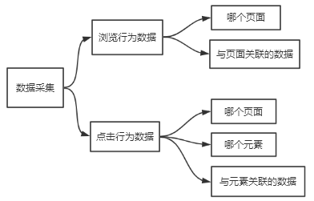
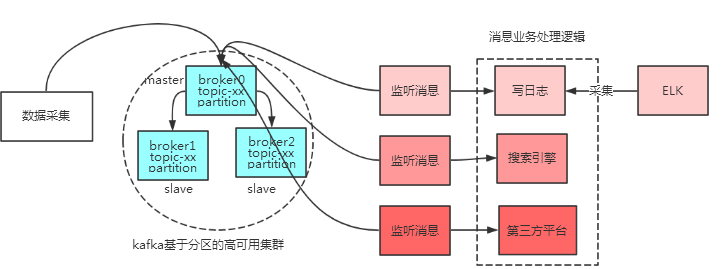
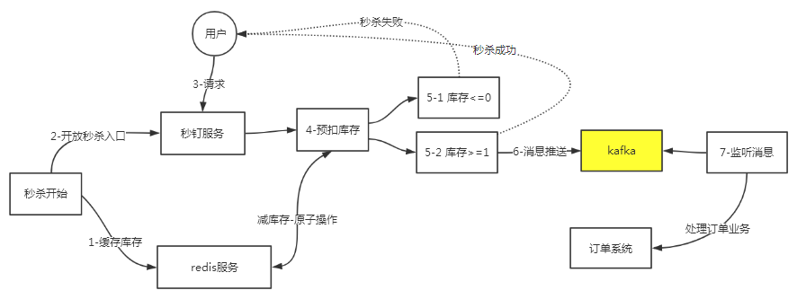

# Kafka基础教程-Kafka应用实战

---

### 准备工作

* Java 访问 kafka实例；
* Spring 整合kafka；
* 基于kafka的用户行为数据采集；
* 基于kafka的日志收集；
* 基于kafka的流量削峰；

### 基于kafka的用户行为数据采集

1、采集需求

通常的用户行为数据要采集的就是浏览和点击行为，如下图：

2、总体架构

* 客户端（消息生产者）采集用户行为数据，发送消息至kafka服务端；
* 客户端（消息消费者）基于TCP长连接，不断监听轮询，从kafka接取消息；
* 接消息转成json格式，写日志文件（如果项目中已集成es，可以直接调用es API写数据）；
* 通过ELK采集日志，并进行报表展示；

3、URL规划

| 不同客户端的URL             | 说明                                         |
| --------------------------- | -------------------------------------------- |
| /report/{terminal}/pageview | 不同终端的浏览记录，terminal：pc/ios/android |
| /report/{terminal}/click    | 不同终端的点击事件，terminal：pc/ios/android |

4、浏览行为数据

自己也可以在此基础上添加一些附加信息用于业务区分，如客户端类型、事件类型、接收消息的时间，上报消息的IP等。

~~~plaintext
ReportData {
	userId = '已登录用户的ID，未登录用户自动生成ID标识',
	createTime = '采集时间',
	page = '访问的页面地址',
	operate = 'null',
	metaData = ReportMetaData {
		title = '页面标题',
		clickData = []
	}
}
~~~

5、点击行为数据

~~~plaintext
ReportData {
	userId = '已登录用户的ID，未登录用户自动生成ID标识',
	createTime = '采集时间',
	page = '访问的页面地址',
	operate = '操作的按钮',
	//采集的元数据停下
	metaData = ReportMetaData {
		title = '页面标题',
		clickData =
			//如果有多个按钮，则有多个ReportClickData
			[ReportClickData {
				tagType = '点击的按钮，如:INPUT',
				content = '输入的内容'
			},
			ReportClickData {
				tagType = '点击的按钮，如：TEXTAREA',
				content = '输入的内容'
			}]
	}
}
~~~

### 基于kafka的流量削峰

1、秒杀需求

缓解短时间内大流量带来的系统访问瓶颈。

2、总体架构

   

---

