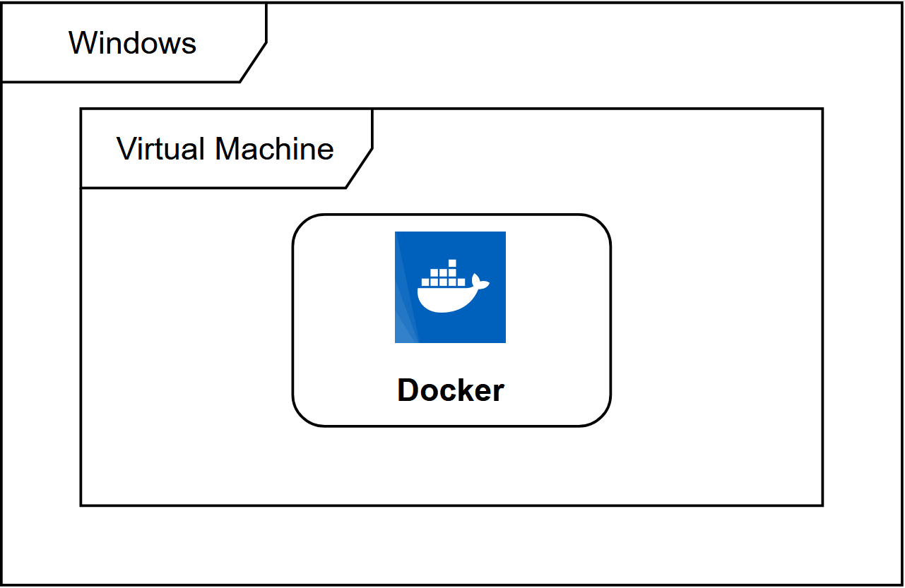
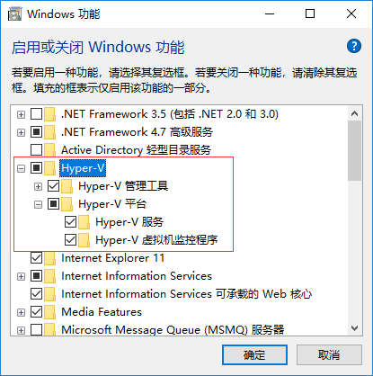
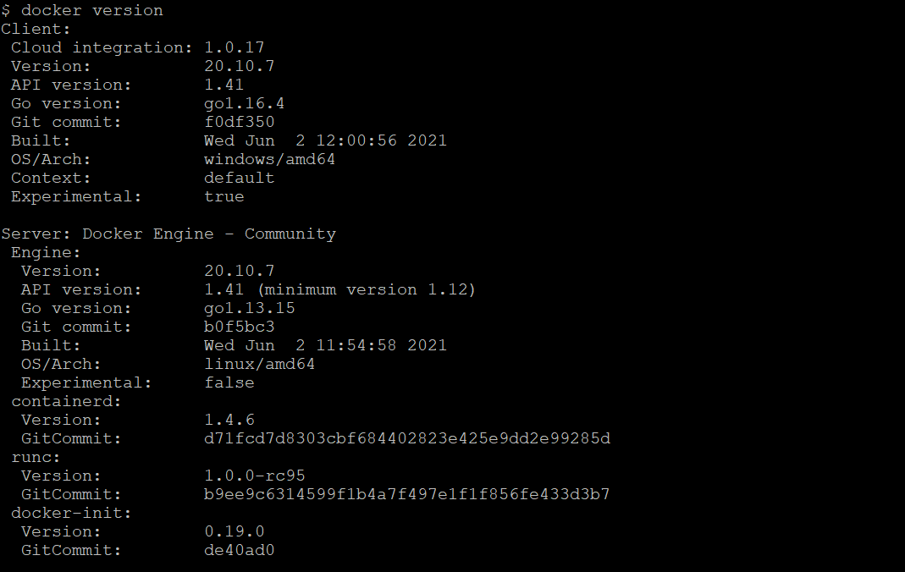
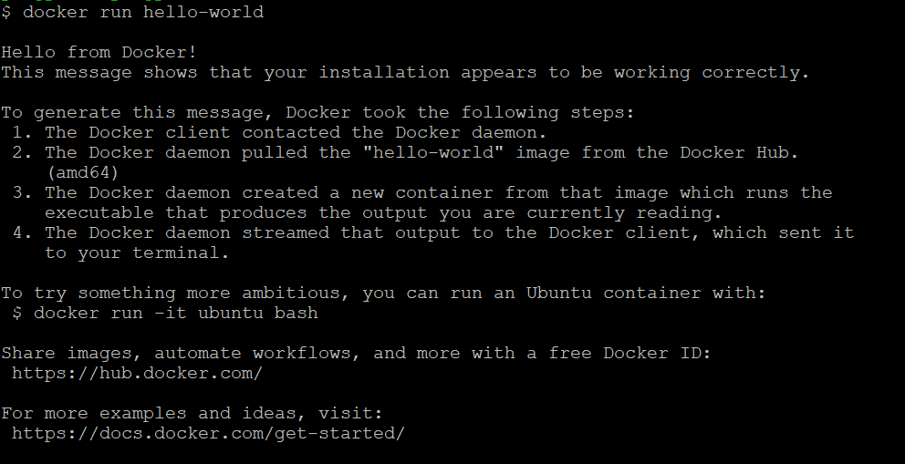
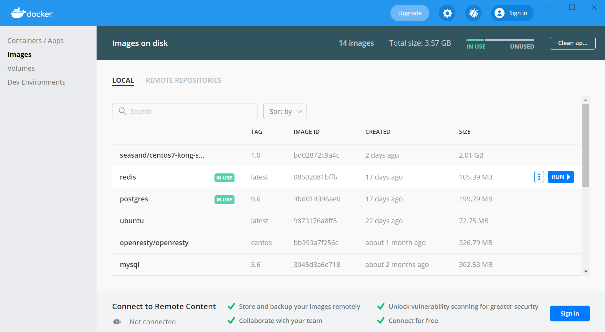
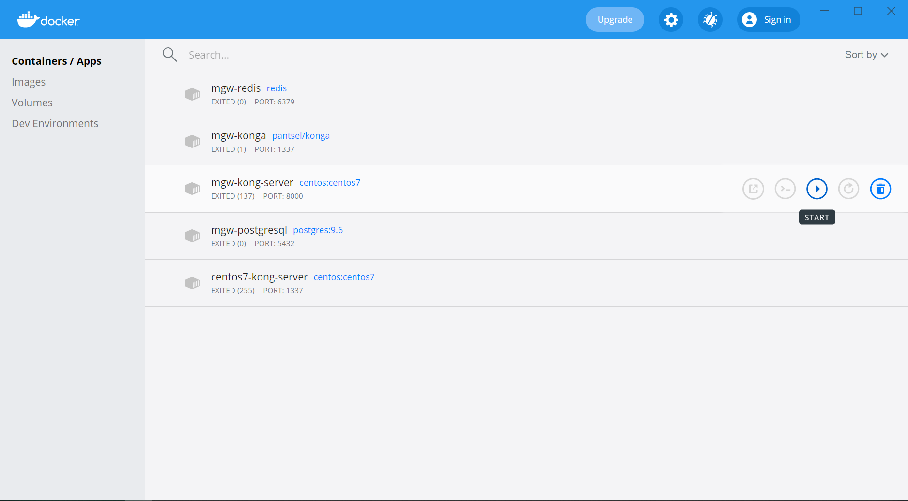
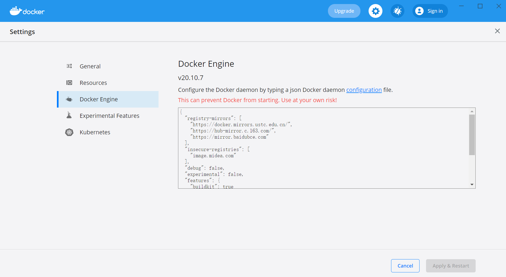

# 基于Windows搭建Docker环境

---

### 原理概述

Docker 并非是一个通用的容器工具，它依赖于已存在并运行的 Linux 内核环境。Docker 实质上是在已经运行的 Linux 下制造了一个隔离的文件环境，因此它执行的效率几乎等同于所部署的 Linux 主机。因此，Docker 必须部署在 Linux 内核的系统上。如果其他系统想部署 Docker 就必须安装一个虚拟 Linux 环境。

Docker Desktop 是 Docker 在 Windows 10 操作系统上的官方安装方式，其原理是先在虚拟机中安装 Linux 然后再安装 Docker。Docker Desktop 的官方下载地址为 [https://hub.docker.com/editions/community/docker-ce-desktop-windows](https://hub.docker.com/editions/community/docker-ce-desktop-windows) 。

> 注意：Docker Desktop 仅适用于 Windows 10 操作系统专业版、企业版、教育版和部分家庭版。

### 启用 Hyper-V

Hyper-V 是微软开发的虚拟机，类似于 VMWare 或 VirtualBox，仅适用于 Windows 10，这是 Docker Desktop for Windows 所使用的虚拟机。

在 Windows 10 系统中启用 Hyper-V 功能，可以依次进行如下操作：

* 右键点击【开始】菜单；
* 选择【应用和功能】；
* 选择【程序和功能】；
* 选择【启用或关闭Windows功能】；
* 找到并勾选【Hyper-V】相关选项；
* 点击【确定】。

也可以通过命令的方式来启用 Hyper-V 功能，以管理员身份运行 PowerShell，并执行以下命令：

~~~shell
Enable-WindowsOptionalFeature -Online -FeatureName Microsoft-Hyper-V -All
~~~

> 注意：开启 Hyper-V 功能后需要重新启动操作系统才会生效。

### 安装 Docker

Docker Desktop 的安装过程比较简单，只需要双击下载的 Docker for Windows Installer 安装文件，一路 Next，最后点击 Finish 完成安装。

安装完成后，Docker 会自动启动。通知栏上会出现个小鲸鱼的图标，这表示 Docker 正在运行。

我们可以在命令行执行 `docker version` 来查看当前安装的 Docker 版本信息：

执行`docker run hello-world` 来载入测试镜像进行测试：

执行以上命令都能正常输出相应信息，说明 Docker Desktop 在本地系统已经安装成功。

### Docker Desktop 简单使用

1、Docker 功能面板（Dashboard）

Docker Desktop 启动后，点击通知栏上的小鲸鱼图标，即可打开 Docker Dashboard 功能面板。

在镜像（Images）管理界面，可以查看本地的镜像并进行管理，以及使用镜像实例化容器：

在容器（Containers）管理界面，可以查看容器的状态，以及对容器进行启动、停止、重启等常规操作，还可以启动一个命令行进入到容器执行相关命令：

以上是比较常用的功能简介，更多功能和具体操作可以查阅相关文档。

2、 更改镜像源

为了加快镜像下载速度，可以添加常用的国内镜像源地址。右键点击通知栏上的小鲸鱼图标，选择 Settings 菜单项，进入 Docker Desktop 的设置界面：

在 Docker Engine 界面，找到`registry-mirrors`配置项，添加镜像源地址：

~~~plaintext
"registry-mirrors": [
  "https://docker.mirrors.ustc.edu.cn/",
  "https://hub-mirror.c.163.com/",
  "https://mirror.baidubce.com"
]
~~~

### 参考资料

* [Docker官方安装文档](https://docs.docker.com/docker-for-windows/install/)
* [Windows Docker安装](https://www.runoob.com/docker/windows-docker-install.html)

   

---

