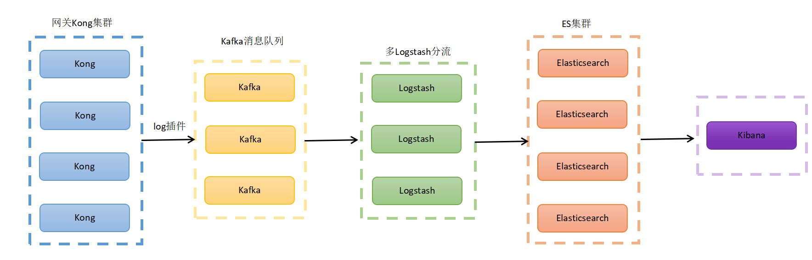
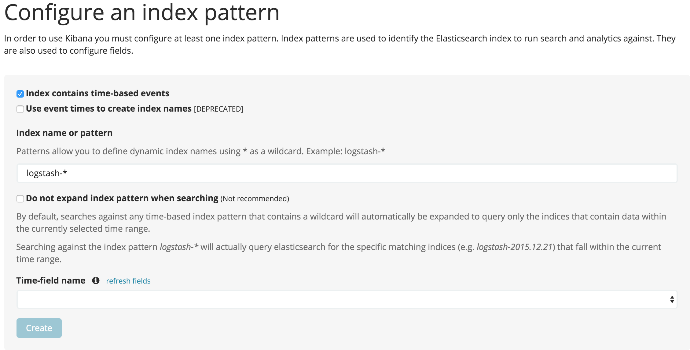
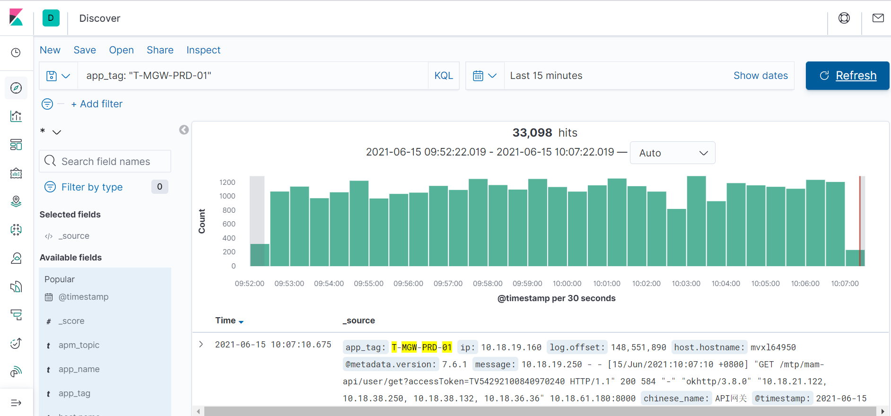
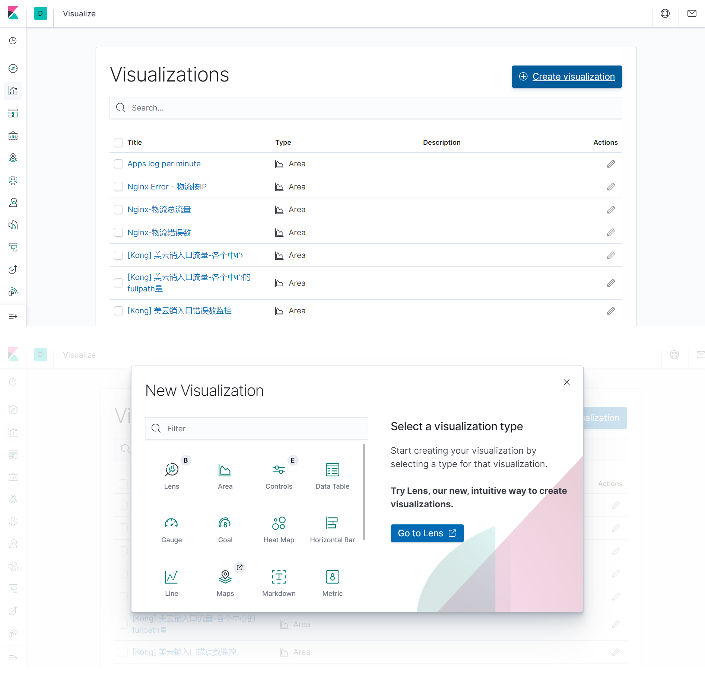
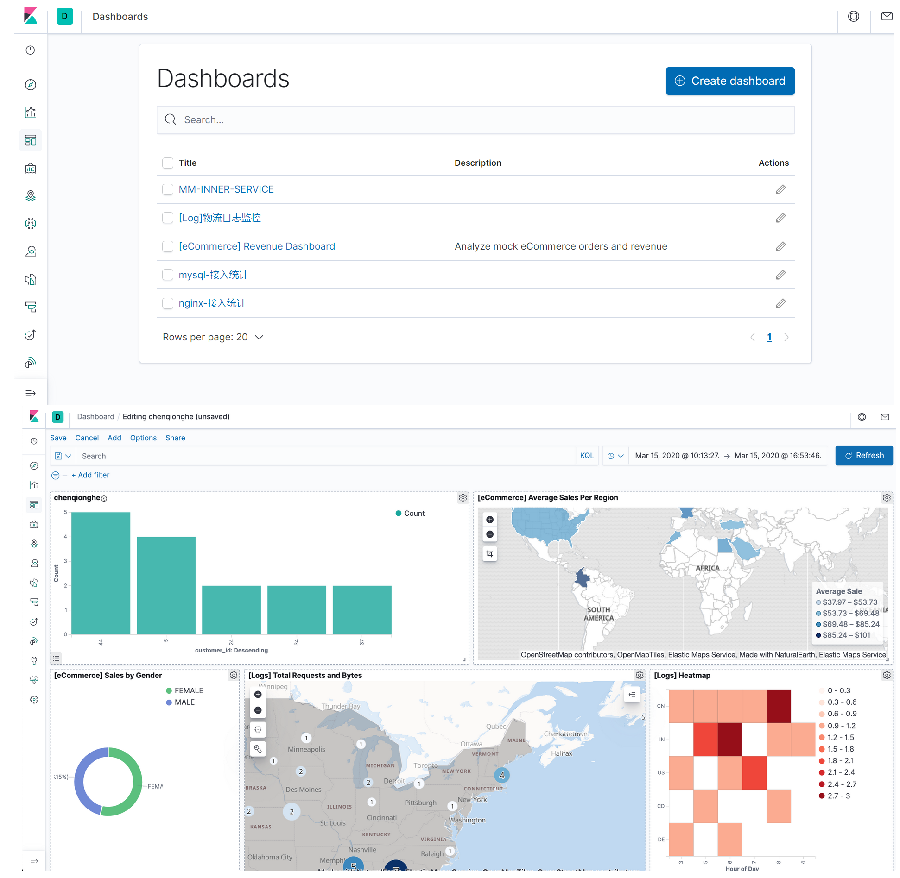
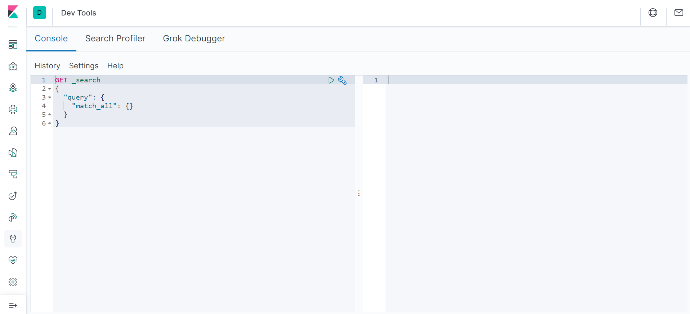
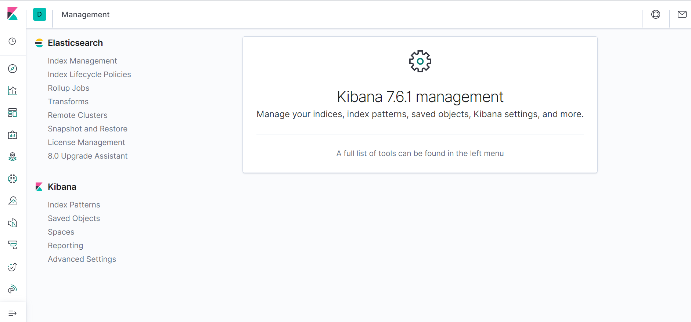

# 网关日志插件ELK部署文档

---

## 网关ELK架构介绍

### 为什么需要ELK？

一般来说大型系统都是一个分布式部署的架构，不同的服务模块部署在不同的服务器上。当有问题出现时，大部分情况下需要根据问题暴露的关键信息，定位到具体的服务器和服务模块。系统运维和开发人员可以通过日志了解服务器软硬件信息、检查配置过程中的错误及错误发生的原因。经常分析日志可以了解服务器的负荷，性能安全性，从而及时采取措施纠正错误。

通常，日志被分散地储存在不同的设备上，如果还在使用依次登录每台机器的传统方法查阅日志，这是十分繁琐和效率低下的。使用集中化的日志管理，构建一套集中式日志系统，将所有服务器上的日志收集汇总，可以提高定位问题的效率。

集中化管理日志后，日志的统计和检索又成为一件比较麻烦的事情。一般我们使用grep、awk和wc等Linux命令能实现检索和统计，但是对于要求更高的查询、排序和统计等要求以及庞大的机器数量，依然使用这样的方法难免有点力不从心。

开源实时日志分析ELK平台能够完美地解决我们上述的问题。ELK其实并不是一款软件，而是一整套解决方案，由ElasticSearch、Logstash和Kibana三个开源工具组成（即ELK是三个软件产品的首字母缩写）。这三款软件都是开源软件，通常是配合使用，而且又先后归于 Elastic.co 公司名下，故被简称为ELK协议栈（ELK Stack）。

### ELK平台简介

1、Elasticsearch

Elasticsearch 是一个实时的分布式搜索和分析引擎，是 Elastic Stack 的核心组件。它是一个建立在全文搜索引擎 Apache Lucene 基础上的搜索引擎，使用Java语言编写，可以用于全文搜索，结构化搜索以及分析。它为所有类型的数据提供了实时的搜索和分析服务，不管是结构化或非结构化的文本、数值数据或是地理信息数据，Elasticsearch 都能够高效地以一种支持快速查询的方式存储和索引它们。

Elasticsearch 的主要特点是实时分析、分布式实时文件存储、高可用、易扩展，支持集群（Cluster）、分片（Shards）和复制（Replicas）。

> 附：[Elasticsearch 7.4 官方文档](https://www.elastic.co/guide/en/elasticsearch/reference/7.4/index.html)

2、Logstash

Logstash 是一个具备实时管道处理能力的开源数据收集引擎，能够同时从多个来源采集数据，转换数据，然后将数据发送到您最喜欢的存储库中。

Logstash 能够动态地采集、转换和传输数据，不受格式或复杂度的影响。利用 Grok 从非结构化数据中派生出结构，从 IP 地址解码出地理坐标，匿名化或排除敏感字段，并简化整体处理过程。

数据往往以各种各样的形式，或分散或集中地存在于很多系统中。Logstash 支持各种输入选择 ，可以在同一时间从众多常用来源捕捉事件，能够以连续的流式传输方式，轻松地从您的日志、指标、Web 应用、数据存储以及各种 AWS 服务采集数据。

> 附：[Logstash 7.4 官方文档](https://www.elastic.co/guide/en/logstash/7.4/index.html)

3、Kibana

Kibana 是一个设计用来和 Elasticsearch 协同工作的开源的数据分析和可视化 Web 平台，基于 Apache 开源协议，可以使用它和存储在 Elasticsearch 中的数据进行搜索、查看和交互。通过它提供的大量图表、表格，你可以轻松地进行更高级的数据分析和数据可视化任务。它提供简洁的、基于浏览器的界面能够使你快速地创建和分享实时的动态数据面板。

> 附：[Kibana 7.4 官方文档](https://www.elastic.co/guide/en/kibana/7.4/index.html)

4、ELK平台架构

Elasticsearch 是一个分布式的搜索和分析引擎，在ELK架构中主要用于存储数据，是核心组件之一。Logstash （以及Beats构件）主要进行数据的收集、聚合、过滤以及增强，并将其存储到 Elasticsearch 中。Kibana 能够让你交互式地检索和查看数据，并对集群进行管理和监控。其整体工作过程如下：

如图，Logstash 收集 AppServer 产生的 Log，并存放到 Elasticsearch 集群中，而 Kibana 则从 Elasticsearch 集群中查询数据生成图表，再返回给Browser。

### 网关系统集成ELK

网关系统ELK工作流程如下：

* Kong集群中的每个Kong服务通过日志插件将日志推送到Kafka；
* 使用Kafka消息队列作为缓冲，可以避免日志采集量过大从而给 Elasticsearch 造成太大压力，避免出现丢失数据的情况；
* Logstash通过设置kafka的input插件，从Kafka收集日志，然后由一系列filter插件对日志数据进行相应处理，最后再由output插件输送到ES集群存储下来；
* Elasticsearch 是ELK的核心，负责索引日志的存储和检索；
* Kibana从ES集群中查询数据，并以各种图表形式展现出来。

结合网关系统的实际情况，部署了若干套ELK环境，具体部署情况如下：

| Elasticsearch                                                | Logstash                                    | Kibana      | 备注                               |
| ------------------------------------------------------------ | ------------------------------------------- | ----------- | ---------------------------------- |
| 10.18.19.61 10.18.19.62 10.18.19.63                  | 10.18.19.61                                 | 10.18.19.61 | PaaS DEV PaaS SIT 内部 SIT |
| 10.18.19.67 10.18.19.68 10.18.19.69                  | 10.18.19.67                                 | 10.18.19.67 | PaaS UAT 内部 UAT              |
| 10.16.93.135 10.16.93.136 10.16.93.137               | 10.16.93.140                                |             | PaaS VER 内部 VER              |
| 10.18.19.85 10.18.19.86 10.18.19.87 10.18.19.88 10.18.19.89 10.18.19.90 10.18.61.185 10.18.61.186 10.18.58.145 10.18.58.146 10.18.58.147 10.18.58.148 10.18.58.149 10.18.58.150 | 10.18.19.85 10.18.19.86 10.18.19.87 | 10.18.19.85 | PaaS PROD 内部 PROD            |

> 附：网关生产环境最新ELK服务器分布可参考 [网关生产环境网络](http://confluence.midea.com/pages/viewpage.action?pageId=147554674) 。

## ELK环境搭建部署

### 准备工作

1、系统相关

* 操作系统版本：CentOS 7；
* 操作用户：apps；
* ELK组件部署路径：/apps/svr ；

2、ELK各组件版本

* Elasticsearch 7.4.0
* Logstash 7.4.0
* Kibana 7.4.0

> 注：ELK官方推荐Elasticsearch、Logstash、Kibana使用的版本最好要保持一致。

3、关于JDK

Elasticsearch 是基于Java构建的，在其安装目录的`jdk`子目录下已经内置了一个 OpenJDK 。如果你想要使用自己的JDK，可以通过设置`JAVA_HOME`环境变量。Elasticsearch 7.4.0 要求的JDK最低版本为1.8 。

4、关于Kafka

Kafka的安装部署可通过[盖亚平台](http://gaea.midea.com/)进行，具体操作请查阅相关文档，此处不作叙述。

### 部署Elasticsearch

1、下载安装

~~~shell
curl -O https://artifacts.elastic.co/downloads/elasticsearch/elasticsearch-7.4.0-linux-x86_64.tar.gz
tar -xzf elasticsearch-7.4.0-linux-x86_64.tar.gz
cd elasticsearch-7.4.0/
~~~

> 如遇网络问题无法正常下载，可先将Elasticsearch下载到本地，然后再上传到服务器。

2、配置

Elasticsearch的配置文件位于 `$ES_HOME/config/elasticsearch.yml`，主要修改的配置项如下：

* cluster.name：ES集群名称；
* node.name：ES节点名称；
* path.data：ES数据目录；
* path.logs：ES日志目录；
* bootstrap.memory_lock：锁定物理内存地址，防止es内存被交换出去，也就是避免es使用swap交换分区，频繁的交换，会导致IOPS变高；
* network.host：ES服务绑定的IP地址；
* http.port：ES服务绑定的端口号；
* transport.tcp.port：设置TCP传输端口；
* discovery.seed_hosts：提供群集中其他节点的列表，这些节点符合主要条件且可能是实时且可联系的，以便为发现过程设定种子， 此设置通常应包含群集中所有符合主节点的节点的地址；
* cluster.initial_master_nodes：启动全新集群时，必须明确列出符合条件的节点的名称或IP地址，这些节点的投票应在第一次选举中计算；
* gateway.recover_after_nodes：只要指定数量的节点加入集群，就开始进行恢复；

修改配置示例（以 10.18.19.85 为例）：

~~~shell
vi config/elasticsearch.yml
~~~

添加或修改以下内容：

~~~plaintext
cluster.name: gw-application
node.name: es-10.18.19.85-prod
path.data: /apps/svr/data/elasticsearch/
path.logs: /apps/svr/logs/elasticsearch/
bootstrap.memory_lock: false
network.host: 10.18.19.85
http.port: 9200
transport.tcp.port: 9300
discovery.seed_hosts: ["10.18.19.85", "10.18.19.86", "10.18.19.87", "10.18.19.88", "10.18.19.89", "10.18.19.90", "10.18.61.185", "10.18.61.186", "10.18.58.145", "10.18.58.146", "10.18.58.147", "10.18.58.148", "10.18.58.149", "10.18.58.150"]
cluster.initial_master_nodes: ["es-10.18.19.85-prod", "es-10.18.19.86-prod", "es-10.18.19.87-prod", "es-10.18.19.88-prod", "es-10.18.19.89-prod", "es-10.18.19.90-prod", "es-10.18.61.185-prod", "es-10.18.61.186-prod", "10.18.58.145", "10.18.58.146", "10.18.58.147", "10.18.58.148", "10.18.58.149", "10.18.58.150"]
gateway.recover_after_nodes: 3
~~~

各环境的具体配置，可参考下表：

| 环境/态 | 服务器       |                                                              |
| ------- | ------------ | ------------------------------------------------------------ |
| DEV/SIT | 10.18.19.61  | [配置项](assets/10.18.19.61-elasticsearch.yml.md)、[完整配置](assets/10.18.19.61-elasticsearch.yml) |
| DEV/SIT | 10.18.19.62  | [配置项](assets/10.18.19.62-elasticsearch.yml.md)、[完整配置](assets/10.18.19.62-elasticsearch.yml) |
| DEV/SIT | 10.18.19.63  | [配置项](assets/10.18.19.63-elasticsearch.yml.md)、[完整配置](assets/10.18.19.63-elasticsearch.yml) |
| UAT     | 10.18.19.67  | [配置项](assets/10.18.19.67-elasticsearch.yml.md)、[完整配置](assets/10.18.19.67-elasticsearch.yml) |
| UAT     | 10.18.19.68  | [配置项](assets/10.18.19.68-elasticsearch.yml.md)、[完整配置](assets/10.18.19.68-elasticsearch.yml) |
| UAT     | 10.18.19.69  | [配置项](assets/10.18.19.69-elasticsearch.yml.md)、[完整配置](assets/10.18.19.69-elasticsearch.yml) |
| VER     | 10.16.93.135 | [配置项](assets/10.16.93.135-elasticsearch.yml.md)、[完整配置](assets/10.16.93.135-elasticsearch.yml) |
| VER     | 10.16.93.136 | [配置项](assets/10.16.93.136-elasticsearch.yml.md)、[完整配置](assets/10.16.93.136-elasticsearch.yml) |
| VER     | 10.16.93.137 | [配置项](assets/10.16.93.137-elasticsearch.yml.md)、[完整配置](assets/10.16.93.137-elasticsearch.yml) |
| PROD    | 10.18.19.85  | [配置项](assets/10.18.19.85-elasticsearch.yml.md)、[完整配置](assets/10.18.19.85-elasticsearch.yml) |
| PROD    | 10.18.19.86  | [配置项](assets/10.18.19.86-elasticsearch.yml.md)、[完整配置](assets/10.18.19.86-elasticsearch.yml) |
| PROD    | 10.18.19.87  | [配置项](assets/10.18.19.87-elasticsearch.yml.md)、[完整配置](assets/10.18.19.87-elasticsearch.yml) |
| PROD    | 10.18.19.88  | [配置项](assets/10.18.19.88-elasticsearch.yml.md)、[完整配置](assets/10.18.19.88-elasticsearch.yml) |
| PROD    | 10.18.19.89  | [配置项](assets/10.18.19.89-elasticsearch.yml.md)、[完整配置](assets/10.18.19.89-elasticsearch.yml) |
| PROD    | 10.18.19.90  | [配置项](assets/10.18.19.90-elasticsearch.yml.md)、[完整配置](assets/10.18.19.90-elasticsearch.yml) |
| PROD    | 10.18.61.185 | [配置项](assets/10.18.61.185-elasticsearch.yml.md)、[完整配置](assets/10.18.61.185-elasticsearch.yml) |
| PROD    | 10.18.61.186 | [配置项](assets/10.18.61.186-elasticsearch.yml.md)、[完整配置](assets/10.18.61.186-elasticsearch.yml) |
| PROD    | 10.18.58.145 | [配置项](assets/10.18.58.145-elasticsearch.yml.md)、[完整配置](assets/10.18.58.145-elasticsearch.yml) |
| PROD    | 10.18.58.146 | [配置项](assets/10.18.58.146-elasticsearch.yml.md)、[完整配置](assets/10.18.58.146-elasticsearch.yml) |
| PROD    | 10.18.58.147 | [配置项](assets/10.18.58.147-elasticsearch.yml.md)、[完整配置](assets/10.18.58.147-elasticsearch.yml) |
| PROD    | 10.18.58.148 | [配置项](assets/10.18.58.148-elasticsearch.yml.md)、[完整配置](assets/10.18.58.148-elasticsearch.yml) |
| PROD    | 10.18.58.149 | [配置项](assets/10.18.58.149-elasticsearch.yml.md)、[完整配置](assets/10.18.58.149-elasticsearch.yml) |
| PROD    | 10.18.58.150 | [配置项](assets/10.18.58.150-elasticsearch.yml.md)、[完整配置](assets/10.18.58.150-elasticsearch.yml) |

调整JVM参数：

~~~shell
vi config/jvm.options
~~~

调整配置项如下，可根据服务器配置的高低作相应调整：

~~~plaintext
-Xms7g
-Xmx7g
~~~

当前各环境Elasticsearch服务JVM参数配置情况如下：

| 环境/态 | 服务器       | JVM参数配置        |
| ------- | ------------ | ------------------ |
| DEV/SIT | 10.18.19.61  | -Xms7g 、 -Xmx7g   |
| DEV/SIT | 10.18.19.62  | -Xms7g 、 -Xmx7g   |
| DEV/SIT | 10.18.19.63  | -Xms7g 、 -Xmx7g   |
| UAT     | 10.18.19.67  | -Xms7g 、 -Xmx7g   |
| UAT     | 10.18.19.68  | -Xms7g 、 -Xmx7g   |
| UAT     | 10.18.19.69  | -Xms7g 、 -Xmx7g   |
| VER     | 10.16.93.135 | -Xms2g 、 -Xmx2g   |
| VER     | 10.16.93.136 | -Xms2g 、 -Xmx2g   |
| VER     | 10.16.93.137 | -Xms2g 、 -Xmx2g   |
| PROD    | 10.18.19.85  | -Xms7g 、 -Xmx7g   |
| PROD    | 10.18.19.86  | -Xms9g 、 -Xmx9g   |
| PROD    | 10.18.19.87  | -Xms10g 、 -Xmx10g |
| PROD    | 10.18.19.88  | -Xms12g 、 -Xmx12g |
| PROD    | 10.18.19.89  | -Xms12g 、 -Xmx12g |
| PROD    | 10.18.19.90  | -Xms10g 、 -Xmx10g |
| PROD    | 10.18.61.185 | -Xms10g 、 -Xmx10g |
| PROD    | 10.18.61.186 | -Xms10g 、 -Xmx10g |
| PROD    | 10.18.58.145 | -Xms12g 、 -Xmx12g |
| PROD    | 10.18.58.146 | -Xms7g 、 -Xmx7g   |
| PROD    | 10.18.58.147 | -Xms12g 、 -Xmx12g |
| PROD    | 10.18.58.148 | -Xms12g 、 -Xmx12g |
| PROD    | 10.18.58.149 | -Xms12g 、 -Xmx12g |
| PROD    | 10.18.58.150 | -Xms12g 、 -Xmx12g |

> Tips：由于需要修改的配置项比较多，在搭建Elasticsearch集群的时候，每个节点上都做同样的配置，不仅工作量巨大且容易出错。通过观察可以发现，大部分配置项都是固定不变的，只有小部分是跟当前节点相关的（如`node.name`、`network.host`等）。因此，可以将当前配置好的Elasticsearch文件夹作为模板，重新打包，然后上传至其它服务器节点，在其它服务器上只需要作少许修改即可。

~~~shell
zip -r elasticsearch-7.4.0.zip elasticsearch-7.4.0/

scp elasticsearch-7.4.0.zip apps@10.18.19.86:/apps/svr
scp elasticsearch-7.4.0.zip apps@10.18.19.87:/apps/svr
scp elasticsearch-7.4.0.zip apps@10.18.19.88:/apps/svr
......
~~~

3、启动运行

Elasticsearch的启动脚本位于`$ES_HOME/bin/elasticsearch`，直接执行该脚本即可启动Elasticsearch。默认情况下，Elasticsearch以前台进程方式运行并将日志直接打印到标准输出。如果要以后台进程方式启动Elasticsearch，可以通过加上参数`-d`的方式，如下所示：

~~~shell
cd /apps/svr/elasticsearch-7.4.0
./bin/elasticsearch -d
~~~

查看Elasticsearch进程是否存在：

~~~shell
ps aux|grep elasticsearch
~~~

查看Elasticsearch日志是否正常输出：

~~~shell
tail -20f ~/svr/logs/elasticsearch/gw-application.log
~~~

附：Elasticsearch启动时可能会遇到的错误

~~~plaintext
max virtual memory areas vm.max_map_count [65530] is too low, increase to at least [262144]
~~~

问题翻译过来就是：elasticsearch用户拥有的内存权限太小，至少需要262144。解决方法如下：

~~~shell
sudo sysctl -w vm.max_map_count=262144
~~~

4、验证启动

可以通过向服务器的9200端口发起一个HTTP请求来测试Elasticsearch是否正常运行：

~~~shell
curl -X GET "localhost:9200/?pretty"
~~~

如果能得到类似于下面的响应，说明启动成功。

~~~plaintext
{
  "name" : "Cp8oag6",
  "cluster_name" : "elasticsearch",
  "cluster_uuid" : "AT69_T_DTp-1qgIJlatQqA",
  "version" : {
    "number" : "7.4.0",
    "build_flavor" : "default",
    "build_type" : "tar",
    "build_hash" : "f27399d",
    "build_date" : "2016-03-30T09:51:41.449Z",
    "build_snapshot" : false,
    "lucene_version" : "8.2.0",
    "minimum_wire_compatibility_version" : "1.2.3",
    "minimum_index_compatibility_version" : "1.2.3"
  },
  "tagline" : "You Know, for Search"
}
~~~

5、关闭

通过kill进程的方式来关闭Elasticsearch：

~~~shell
ps aux|grep elasticsearch
kill <elasticsearch-pid>
~~~

### 部署Logstash

1、下载安装

~~~shell
curl -O https://artifacts.elastic.co/downloads/logstash/logstash-7.4.0.tar.gz
tar -xzf logstash-7.4.0.tar.gz
cd logstash-7.4.0/
~~~

> 如遇网络问题无法正常下载，可先将Logstash下载到本地，然后再上传到服务器。

2、配置

Logstash的配置文件位于 `$LOGSTASH_HOME/config/logstash.yml`，主要修改的配置项如下：

* node.name：节点名称；
* path.data：Logstash存储数据的路径；
* queue.type：指定用于事件缓冲区的内部队列模型；
* http.host：主机；
* http.port：端口号；
* xpack.monitoring.enabled：开启X-Pack监控；
* xpack.monitoring.collection.pipeline.details.enabled：监控管道详情；
* xpack.monitoring.elasticsearch.hosts：Elasticsearch集群地址；
* xpack.monitoring.elasticsearch.sniffing：嗅探Elasticsearch集群的其它节点；
* log.level：日志级别；

除了`logstash.yml`，还需要添加一个配置文件用于配置说明Logstash的input、output和filter过程使用到的插件及其配置。在`$LOGSTASH_HOME/config`路径下提供了一个官方示例`logstash-sample.conf`，可以在此基础上作进一步的修改。官方示例如下：

~~~plaintext
# Sample Logstash configuration for creating a simple
# Beats -> Logstash -> Elasticsearch pipeline.

input {
  beats {
    port => 5044
  }
}

output {
  elasticsearch {
    hosts => ["http://localhost:9200"]
    index => "%{[@metadata][beat]}-%{[@metadata][version]}-%{+YYYY.MM.dd}"
    #user => "elastic"
    #password => "changeme"
  }
}
~~~

最后，在配置文件 `config/pipelines.yml` 中添加新的 pipeline 配置并指定其配置文件，主要修改的配置项如下：

* pipeline.id：管道ID；
* pipeline.workers：指定管道用于并行执行filter、output过程的工作线程数量；
* path.config：Logstash配置文件路径；

修改配置示例（以 10.18.19.85 为例）：

1）第一步，修改`config/logstash.yml`配置文件：

~~~shell
vi config/logstash.yml
~~~

添加或修改以下内容：

~~~plaintext
node.name: logstash-10.18.19.85-prod
path.data: ./data

queue.type: persisted

http.host: "10.18.19.85"
http.port: 9600

xpack.monitoring.enabled: true
xpack.monitoring.collection.pipeline.details.enabled: true
xpack.monitoring.elasticsearch.hosts: ["http://10.18.19.85:9200", "http://10.18.19.86:9200", "http://10.18.19.87:9200", "http://10.18.19.88:9200", "http://10.18.19.89:9200", "http://10.18.19.90:9200"]
xpack.monitoring.elasticsearch.sniffing: false
~~~

2）第二步，添加`config/logstash.conf`，用于配置Logstash的input、output和filter：

~~~shell
vi config/logstash.conf
~~~

添加以下内容：

~~~plaintext
input {
  kafka {
    id => "logstash-10.18.19.85-prod"
    codec => json {
      charset => "UTF-8"
    }

    decorate_events => true
    bootstrap_servers => "10.18.19.82:9092, 10.18.19.83:9092, 10.18.19.84:9092"
    group_id => "kong_logger_prod"
    topics => ["gw_kong_prod", "gw_kong_response_prod", "gw_kong_prod_internal", "gw_kong_response_prod_internal"]
    auto_offset_reset => "latest"
    consumer_threads => 4
  }
}

filter {
  mutate {
    add_field => {"topic" => "%{[@metadata][kafka][topic]}"}
    lowercase => "[inbound][system]"
  }
  ruby {
    code => "event.set('index_date', event.get('@timestamp').time.localtime + 8*60*60)"
  }
  mutate {
    convert => ["index_date", "string"]
    gsub => ["index_date", "T([\S\s]*?)Z", ""]
    gsub => ["index_date", "-", "."]
  }
}

output {
  elasticsearch {
    hosts => ["http://10.18.19.85:9200", "http://10.18.19.86:9200", "http://10.18.19.87:9200", "http://10.18.19.88:9200", "http://10.18.19.89:9200", "http://10.18.19.90:9200"]
    index => "%{topic}-%{[inbound][system]}-%{index_date}"
  }
}
~~~

3）第三步，修改`config/pipelines.yml`配置文件：

~~~shell
vi config/pipelines.yml
~~~

添加如下内容：

~~~plaintext
 - pipeline.id: "gw-logstash-10.18.19.85"
   pipeline.workers: 4
   path.config: "./config/logstash.conf"
~~~

各环境的具体配置，可参考下表：

| 环境/态 | 服务器       | logstash.yml                                                 | logstash.conf                                 | pipelines.yml                                                |
| ------- | ------------ | ------------------------------------------------------------ | --------------------------------------------- | ------------------------------------------------------------ |
| DEV/SIT | 10.18.19.61  | [配置项](assets/10.18.19.61-logstash.yml.md)、[完整配置](assets/10.18.19.61-logstash.yml) | [完整配置](assets/10.18.19.61-logstash.conf)  | [配置项](assets/10.18.19.61-pipelines.yml.md)、[完整配置](assets/10.18.19.61-pipelines.yml) |
| UAT     | 10.18.19.67  | [配置项](assets/10.18.19.67-logstash.yml.md)、[完整配置](assets/10.18.19.67-logstash.yml) | [完整配置](assets/10.18.19.67-logstash.conf)  | [配置项](assets/10.18.19.67-pipelines.yml.md)、[完整配置](assets/10.18.19.67-pipelines.yml) |
| VER     | 10.16.93.140 | [配置项](assets/10.16.93.140-logstash.yml.md)、[完整配置](assets/10.16.93.140-logstash.yml) | [完整配置](assets/10.16.93.140-logstash.conf) | [配置项](assets/10.16.93.140-pipelines.yml.md)、[完整配置](assets/10.16.93.140-pipelines.yml) |
| PROD    | 10.18.19.85  | [配置项](assets/10.18.19.85-logstash.yml.md)、[完整配置](assets/10.18.19.85-logstash.yml) | [完整配置](assets/10.18.19.85-logstash.conf)  | [配置项](assets/10.18.19.85-pipelines.yml.md)、[完整配置](assets/10.18.19.85-pipelines.yml) |
| PROD    | 10.18.19.86  | [配置项](assets/10.18.19.86-logstash.yml.md)、[完整配置](assets/10.18.19.86-logstash.yml) | [完整配置](assets/10.18.19.86-logstash.conf)  | [配置项](assets/10.18.19.86-pipelines.yml.md)、[完整配置](assets/10.18.19.86-pipelines.yml) |
| PROD    | 10.18.19.87  | [配置项](assets/10.18.19.87-logstash.yml.md)、[完整配置](assets/10.18.19.87-logstash.yml) | [完整配置](assets/10.18.19.87-logstash.conf)  | [配置项](assets/10.18.19.87-pipelines.yml.md)、[完整配置](assets/10.18.19.87-pipelines.yml) |

4）第四步，根据服务器机器的性能，适当调整JVM参数：

~~~shell
vi config/jvm.options
~~~

修改内容如下：

~~~plaintext
-Xms4g
-Xmx4g
~~~

当前各环境Logstash服务JVM参数配置如下：

| 环境/态 | 服务器       | 参数配置         |
| ------- | ------------ | ---------------- |
| DEV/SIT | 10.18.19.61  | -Xms4g 、 -Xmx4g |
| UAT     | 10.18.19.67  | -Xms4g 、 -Xmx4g |
| VER     | 10.16.93.140 | -Xms2g 、 -Xmx2g |
| PROD    | 10.18.19.85  | -Xms4g 、 -Xmx4g |
| PROD    | 10.18.19.86  | -Xms4g 、 -Xmx4g |
| PROD    | 10.18.19.87  | -Xms4g 、 -Xmx4g |

3、启动运行

Logstash的启动脚本位于`$LOGSTASH_HOME/bin/logstash`，为了便于Logstash的启动，自定义启动脚本`start.sh`：

~~~shell
vi start.sh
~~~

脚本内容如下：

~~~shell
#!/bin/sh

nohup ./bin/logstash > /dev/null 2>&1 &
~~~

然后赋以执行权限：

~~~shell
chmod +x start.sh
~~~

执行脚本，即可启动Logstash：

~~~shell
./start.sh
~~~

4、验证启动

查看Logstash进程是否存在：

~~~shell
ps aux|grep logstash
~~~

查看Logstash的日志输出：

~~~shell
tail -20f logs/logstash-plain.log
~~~

5、关闭

通过kill进程方式来关闭Logstash：

~~~shell
ps aux|grep logstash
kill <logstash-pid>
~~~

### 部署Kibana

1、下载安装

~~~shell
curl -O https://artifacts.elastic.co/downloads/kibana/kibana-7.4.0-linux-x86_64.tar.gz
tar -xzf kibana-7.4.0-linux-x86_64.tar.gz
cd kibana-7.4.0-linux-x86_64/
~~~

> 如遇网络问题无法正常下载，可先将Kibana下载到本地，然后再上传到服务器。

2、配置

Kibana的配置文件位于 `$KIBANA_HOME/config/kibana.yml`，主要修改的配置项如下：

* server.host：Kibana服务绑定的IP地址；
* server.port：Kibana服务绑定的端口号；
* elasticsearch.hosts：Elasticsearch实例的URL地址；

修改配置示例（以 10.18.19.85 为例）：

~~~plaintext
server.host: "10.18.19.85"

server.port: 5601

elasticsearch.hosts: ["http://10.18.19.85:9200", "http://10.18.19.86:9200", "http://10.18.19.87:9200", "http://10.18.19.88:9200", "http://10.18.19.89:9200", "http://10.18.19.90:9200", "http://10.18.61.185:9200", "http://10.18.61.186:9200"]
~~~

各环境的具体配置，可参考下表：

| 环境/态 | 服务器      |                                                              |
| ------- | ----------- | ------------------------------------------------------------ |
| DEV/SIT | 10.18.19.61 | [配置项](assets/10.18.19.61-kibana.yml.md)、[完整配置](assets/10.18.19.61-kibana.yml) |
| UAT     | 10.18.19.67 | [配置项](assets/10.18.19.67-kibana.yml.md)、[完整配置](assets/10.18.19.67-kibana.yml) |
| PROD    | 10.18.19.85 | [配置项](assets/10.18.19.85-kibana.yml.md)、[完整配置](assets/10.18.19.85-kibana.yml) |

3、启动运行

Kibana的启动脚本位于 `$KIBANA_HOME/bin/kibana`，直接执行该脚本即可启动Kibana：

~~~shell
./bin/kibana
~~~

默认情况下，Kibana会以前台方式运行并将日志打印到标准输出。为了方便Kibana的启动运行，自定义一个启动脚本`start.sh`：

~~~shell
vi start.sh
~~~

脚本内容如下：

~~~shell
#!/bin/sh

nohup /apps/svr/kibana-7.4.0-linux-x86_64/bin/kibana serve > /dev/null 2>&1 &
~~~

然后赋以执行权限：

~~~shell
chmod +x start.sh
~~~

执行脚本，即可启动Kibana：

~~~shell
./start.sh
~~~

4、验证启动

打开浏览器，访问 `<Kibana服务IP>:<端口>`，如能正常打开Kibana服务页面，则说明Kibana启动成功。

5、关闭

使用kill进程方式关闭Kibana：

~~~shell
ps aux|grep kibana
kill <kibana-pid>
~~~

## 网关ELK基本使用

### Kibana的基本使用

1、访问 Kibana

Kibana 是一个 Web 应用程序，可以通过 5601 端口进行访问，只需要在浏览器中指定 `<Kibana运行的服务器IP>:<端口号>`即可。例如，`http://localhost:5601`。

当访问 Kibana 时，默认情况下，Discover 页面加载时选择了默认的索引模式，时间过滤器设置的时间为过去15分钟，查询设置为匹配所有 (`\*`) 。

2、配置索引模式连接 Elasticsearch

在开始使用 Kibana 之前，需要指定 Elasticsearch 索引。第一次访问 Kibana 时，系统会提示定义一个 `index pattern` （索引模式）来匹配一个或多个索引。除了在初次使用 Kibana 时配置外，也可以在任何时候通过 Management 页面增加新的索引模式。

指定一个索引模式来匹配一个或多个 Elasticsearch 索引名称。默认情况下，Kibana 会认为数据是通过 Logstash 解析送进 Elasticsearch 的，因此这种情况可以使用默认的 `logstash-*` 作为索引模式，其中的星号 (`*`) 匹配0或多个索引名称中的字符。如果 Elasticsearch 索引遵循其他命名约定，请输入一个恰当的模式。该模式也可以直接用单个索引的名称。

点击 Create 增加索引模式。默认情况下，第一个模式被自动配置为默认的。当索引模式不止一个时，可以通过点击 Management > Index Patterns 索引模式条目上的星星图标来指定默认的索引模式。

3、Discover 页面

通过 Discover 页面，可以交互式地搜索数据，可以访问与选定索引模式匹配的每个索引中的每个文档，可以提交搜索请求、过滤搜索结果、查看文档数据，还可以看到与搜索查询匹配的文档数，并获取字段值的统计信息。如果索引模式中配置了时间字段，还可以在这个页面的顶部看到基于时间分布的文档数量柱状图。

1）设置时间过滤器

时间过滤器按照指定的时间段展示搜索结果。时间过滤器默认的时间段为最近15分钟，可以使用页面顶部的 Time Picker 来调整时间段和刷新频率。

2）搜索

通过在搜索栏输入搜索条件，可以在匹配当前索引模式的索引中进行搜索。可以进行简单的文本查询，或使用 Lucene 语法，或使用基于 JSON 的 Elasticsearch 查询（DSL） 。以下是几个示例：

* 直接输入文本字符串来进行简单文本搜索。例如，查询 Web 服务器日志的时候输入 `safari` 来搜索所有字段中包含词条 `safari` 的文档。
* 可以用字段名作为前缀来根据指定字段进行搜索。例如，输入 `status:200` 来搜索字段 `status` 中包含词条 `200` 的文档。
* 可以通过中括号指定范围搜索， [START_VALUE TO END_VALUE] 。例如，搜索状态为 `4xx` 的条目，您可以输入 `status:[400 TO 499]` 。
* 可以通过布尔操作符 AND 、 OR 和 NOT 来指定更多的搜索条件。例如，搜索状态为 `4xx` 而且扩展名为 `php` 或 `html` 的条目，可以输入 `status:[400 TO 499] AND (extension:php OR extension:html)` 。

> 更多查询语法请参考：[Kibana Query Language](https://www.elastic.co/guide/en/kibana/7.4/kuery-query.html) 、[Lucene 语法](https://lucene.apache.org/core/2_9_4/queryparsersyntax.html) 、[Elasticsearch DSL](https://www.elastic.co/guide/en/elasticsearch/reference/6.0/query-dsl.html)

3）查看文档数据

提交一个搜索查询后，Documents 表中就会列出500个匹配查询的最新文档。默认情况下, Documents 表显示的是为所选索引模式和 `_source` 文档配置的时间字段的本地化版本，可以从 Fields 列表或文档的字段数据中选择字段向文档表中进行添加或移除。

4、Visualize 页面

Visualize 用于查看所有 Kibana 提供的可视化控件种类。Kibana 可视化控件基于 Elasticsearch 的查询，利用一系列的 Elasticsearch 查询聚合功能来提取和处理数据，再通过创建图表来呈现数据分布和趋势。点击 Visualize 菜单，进入可视化图表创建界面，可以发现 Kibana 自带有十多种类型的图表。

5、Dashboard 页面

Dashboard 主要用于展示保存的可视化结果集合。创建一个Dashboard，把在 Visualize 中定义好的图表添加进来，即可定制出非常丰富的面板。

6、Console 页面

Console 的主要功能是使用交互控制台向 Elasticsearch 提交 REST 请求，控制台插件提供一个用户界面来和 Elasticsearch 的 REST API 交互。控制台有两个主要部分：editor，用来编写提交给 Elasticsearch 的请求；response 面板，用来展示请求结果的响应。可以在页面顶部的文本框中输入 Elasticsearch 服务器的地址，默认地址是`localhost:9200`。

7、Management 页面

Management 主要进行 Kibana 的配置和管理已保存的对象。

> 附：Kibana 界面语言默认为英文，如需更改为中文，可在`config/kibana.yml`添加`i18n.locale: "zh-CN"`，重新启动后即可生效。

### 网关日志排查示例

以生产环境（10.18.19.85）为例进行说明。

1、明确生产环境 Kibana 服务地址为`http://10.18.19.85:5601`，打开浏览器，访问该地址，即可打开 Kibana 服务页面。

2、明确索引模式

网关系统 Kong 服务的日志通过 Logstash 进行采集，然后存储到 Elasticsearch 集群中。在 Logstash 的 output 插件中指定了相应的日志数据存储进 ES 时的索引名称，通过查询 Logstash 的配置文件 `logstash.conf`，可以得到具体的索引名称，如下：

~~~plaintext
input {
  kafka {
    id => "logstash-10.18.19.85-prod"
    codec => json {
      charset => "UTF-8"
    }

    decorate_events => true
    bootstrap_servers => "10.18.19.82:9092, 10.18.19.83:9092, 10.18.19.84:9092"
    group_id => "kong_logger_prod"
    topics => ["gw_kong_prod", "gw_kong_response_prod", "gw_kong_prod_internal", "gw_kong_response_prod_internal"]
    auto_offset_reset => "latest"
    consumer_threads => 4
  }
}

filter {
  mutate {
    add_field => {"topic" => "%{[@metadata][kafka][topic]}"}
    lowercase => "[inbound][system]"
  }
  ruby {
    code => "event.set('index_date', event.get('@timestamp').time.localtime + 8*60*60)"
  }
  mutate {
    convert => ["index_date", "string"]
    gsub => ["index_date", "T([\S\s]*?)Z", ""]
    gsub => ["index_date", "-", "."]
  }
}

output {
  elasticsearch {
    hosts => ["http://10.18.19.85:9200", "http://10.18.19.86:9200", "http://10.18.19.87:9200", "http://10.18.19.88:9200", "http://10.18.19.89:9200", "http://10.18.19.90:9200"]
    index => "%{topic}-%{[inbound][system]}-%{index_date}"
  }
}
~~~

可以看出索引名称是由`topic`、`[inbound][system]`、`index_date`等几部分组合而成的，例如：`gw_kong_prod_internal-mgw-2021.06.12`。因此，在此基础上可以建立索引模式了。

进入 Management 页面增加新的索引模式，索引模式可以使用前缀加上通配符`*`的形式，例如：`gw_kong_prod_internal-mgw-*`。一旦建立了索引模式，以后就可以重复使用了。因此，如果已经建立了该索引模式，就不需要重复创建了，直接使用现存的即可。

3、进入 Kibana 的 Discover 页面，选择对应的索引模式，调整时间范围，再根据关键字进行搜索，即可查询到对应的日志数据。

## FAQ

1、Elasticsearch启动过程中报`vm.max_map_count`错误，该如何解决？

Elasticsearch启动过程中，可能会出现以下错误信息：

~~~plaintext
max virtual memory areas vm.max_map_count [65530] is too low, increase to at least [262144]
~~~

以下是摘自Elasticsearch官网的一段话：

> Elasticsearch uses a mmapfs directory by default to store its indices. The default operating system limits on mmap counts is likely to be too low, which may result in out of memory exceptions.

翻译过来就是 Elasticsearch 使用到了虚拟内存来存储索引，如果系统默认值设置过低，会导致内存溢出。在Linux系统下，解决方法如下：

~~~shell
sysctl -w vm.max_map_count=262144
~~~

注意该命令须以`root`来执行。如果要永久性地更改该值，可以修改`/etc/sysctl.conf`文件的`vm.max_map_count`。

> 附：[参考资料](https://www.elastic.co/guide/en/elasticsearch/reference/7.4/vm-max-map-count.html)。

2、日志数据异常丢失，如何通过日志链路排查问题出在哪？

可以通过日志ELK的架构链路，一步一步排查链路的各个环节，最终确定出现问题的节点，相关流程如下：

* 首先确认 Kong 服务是否正常运行，检查其 `error.log`、`access.log` 是否正常输出日志；然后搜索目标日志数据，如果搜索不到，说明有异常发生，否则进行下一步；
* 检查 `logger` 日志插件是否正常工作，是否将日志数据推送到了 Kafka；
* 确认 Kafka 是否正常运行，检查目标日志数据是否还在 Kafka，或者已经被 Logstash 消费；
* 确认 Logstash 是否正常运行，检查其配置是否正确；
* 确认 Elasticsearch 是否正常运行，在 Elasticsearch 中查询目标日志数据，如果查询不到，说明 Elasticsearch 发生异常丢失数据，可通过排查 Elasticsearch 自身的日志进一步确定异常原因，从而寻求解决方法。

3、如何使用日志排查问题？

4、待补充...

   

---

