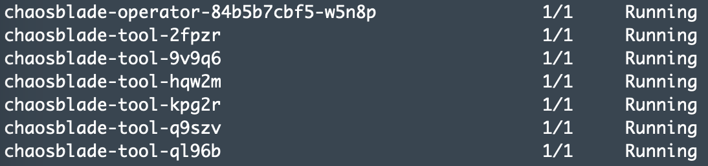
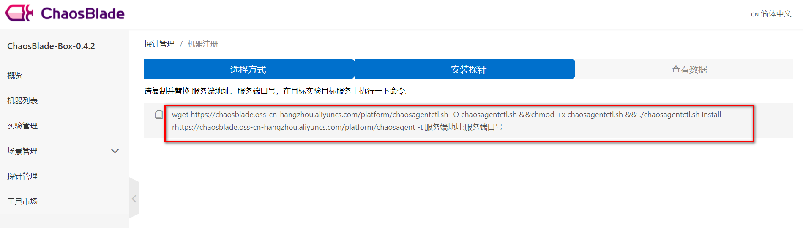

# 混沌测试工具ChaosBlade使用指南

---

## ChaosBlade

### ChaosBlade简介

ChaosBlade 是阿里巴巴 2019 年开源的混沌工程项目，包含混沌工程实验工具 chaosblade 和混沌工程平台 chaosblade-box，旨在通过混沌工程帮助企业解决云原生过程中的高可用问题。实验工具 chaosblade 支持 3 大系统平台，4 种编程语言应用，共涉及 200 多个实验场景，3000 多个实验参数，可以精细化地控制实验范围。

相关资料：

* [ChaosBlade官方介绍](https://github.com/chaosblade-io/chaosblade/blob/master/README_CN.md)
* [阿里巴巴混沌测试工具ChaosBlade两万字解读](https://blog.csdn.net/u013256816/article/details/99917021)

### ChaosBlade安装部署

下载 ChaosBlade 混沌测试工具程序 `chaosblade-1.5.0-linux-{ARCH}.tar.gz`（其中 ARCH=amd64/arm64）：

~~~shell
wget https://github.com/chaosblade-io/chaosblade/releases/download/v1.5.0/chaosblade-1.5.0-linux-amd64.tar.gz

# 内网地址
wget http://mgw-chaosblade-repo.sit.cce.com/repo/chaosblade/chaosblade-1.5.0-linux-amd64.tar.gz
~~~

解压缩至 `/opt/chaosblade` 目录下（需要root权限）：

~~~shell
mv chaosblade-1.5.0-linux-amd64.tar.gz /opt/
cd /opt
tar -zxvf chaosblade-1.5.0-linux-amd64.tar.gz
mv chaosblade-1.5.0 chaosblade
~~~

查看 ChaosBlade 版本信息：

~~~shell
./blade version
~~~

至此，ChaosBlade 混沌测试工具已经安装成功 。

> 附：[ChaosBlade官方安装指南](https://github.com/chaosblade-io/chaosblade/releases)。

### ChaosBlade使用指南

详情请参考 [ChaosBlade操作手册](https://chaosblade-io.gitbook.io/chaosblade-help-zh-cn/)。

## ChaosBlade-Operator

### ChaosBlade-Operator简介

ChaosBlade-Operator 是 ChaosBlade 的 Kubernetes 平台实验场景实现，其将混沌实验通过 Kubernetes 标准的 CRD 方式定义，能够很方便地使用 Kubernetes 资源操作的方式来创建、更新、删除实验场景，包括使用 kubectl、client-go 等方式执行，而且还可以使用上述的 chaosblade cli 工具执行。

相关资料：

* [ChaosBlade-Operator官方介绍](https://github.com/chaosblade-io/chaosblade-operator/blob/master/README_CN.md)

### ChaosBlade-Operator安装部署

执行 Kubernetes 实验场景，需要提前部署 ChaosBlade-Operator，ChaosBlade-Operator 需要使用 Helm 安装。

下载安装包：

~~~shell
# 从GitHub下载
wget https://github.com/chaosblade-io/chaosblade-operator/releases/download/v1.5.0/chaosblade-operator-1.5.0.tgz

# 从阿里云OSS下载
wget https://chaosblade.oss-cn-hangzhou.aliyuncs.com/agent/github/1.5.0/chaosblade-operator-1.5.0.tgz

# 内网地址
wget http://mgw-chaosblade-repo.sit.cce.com/repo/chaosblade-operator/chaosblade-operator-1.5.0.tgz
~~~

为 chaosblade 创建一个 namespace：

~~~shell
kubectl create namespace chaosblade
~~~

安装 ChaosBlade-Operator：

~~~shell
helm install --namespace chaosblade --name chaosblade-operator chaosblade-operator-1.5.0.tgz
~~~

ChaosBlade-Operator 启动后将会在每个节点部署一个 `chaosblade-tool` Pod 和一个 `chaosblade-operator` Pod。可通过以下命令查看安装结果：

~~~shell
kubectl get pod -n chaosblade | grep chaosblade
~~~

如果显示 `chaosblade-operator` 和 `chaosblade-tool` Pod 都处于 Running 状态，说明部署成功。

> 附：[ChaosBlade-Operator官方安装指南](https://github.com/chaosblade-io/chaosblade-operator/releases)。

### ChaosBlade-Operator使用指南

详情请参考 [ChaosBlade-Operator使用手册](https://chaosblade-io.gitbook.io/chaosblade-help-zh-cn/blade-create-k8s)。

参考资料：

* [ChaosBlade-Operator实验场景](https://github.com/sunny0826/chaosblade-operator-experiment)
* [ChaosBlade：从零开始的混沌工程（一）](https://developer.aliyun.com/article/763882?spm=a2c6h.13262185.0.0.247178636chkoy)
* [ChaosBlade：从零开始的混沌工程（二）](https://developer.aliyun.com/article/764462?spm=a2c6h.13262185.0.0.247178636chkoy)
* [ChaosBlade：从零开始的混沌工程（三）](https://developer.aliyun.com/article/765093?spm=a2c6h.13262185.0.0.247178636chkoy)
* [ChaosBlade：从零开始的混沌工程（四）](https://developer.aliyun.com/article/768558?spm=a2c6h.13262185.0.0.247178636chkoy)
* [ChaosBlade：从零开始的混沌工程（五）](https://developer.aliyun.com/article/769800?spm=a2c6h.13262185.0.0.247178636chkoy)

## ChaosBlade-Box

### ChaosBlade-Box简介

ChaosBlade-Box 是阿里巴巴集团在 2021 年年初开源的混沌工程控制台，可以将混沌实验的操作平台化。用户通过这个平台可以实现工具部署、混沌实验设计、实验触发等操作，未来还计划支持复杂调度、报告自动生成等功能。ChaosBlade-Box 的目标是云原生场景，但它也支持我们的物理机器场景。

混沌工程平台 ChaosBlade-Box 支持实验工具托管，除已托管 ChaosBlade 外，还支持 Litmuschaos 等实验工具。

相关资料：

* [ChaosBlade-Box官方简介](https://github.com/chaosblade-io/chaosblade-box)

### ChaosBlade-Box安装部署

#### 创建MySQL容器服务

1、创建MySQL镜像

~~~shell
# 拉取 MySQL 5.6 docker镜像
docker pull mysql:5.6

# 列出 image id
docker image ls

# 重新打tag
docker tag {image id} image.midea.com/mgw/mysql:5.6

# push到mgw镜像仓库
docker login http://image.midea.com #输入账号密码
docker push image.midea.com/mgw/mysql:5.6
~~~

2、创建MySQL服务

在[容器云平台](http://bard.midea.com/index.html)新建容器 `mgw-chaosblade-mysql`，并挂载镜像 `image.midea.com/mgw/mysql:5.6`。

设置环境变量：

~~~plaintext
MYSQL_DATABASE = chaosblade
MYSQL_ROOT_PASSWORD = mgw@root
~~~

关联配置：

~~~plaintext
t-mgw-chaosblade-mysql-configmap = /etc/mysql/conf.d
~~~

在【配置中心】-【配置管理】新建配置项：`t-mgw-chaosblade-mysql`，并添加配置文件 `chaosblade-mysql.cnf`，内容如下：

~~~plaintext
[client]
default-character-set=utf8mb4

[mysqld]
character-set-client-handshake=FALSE
character-set-server=utf8mb4
collation-server=utf8mb4_unicode_ci
default-time_zone='+8:00'

[mysql]
default-character-set=utf8mb4
~~~

最后，启动服务即可。

3、使用容器云平台提供的MySQL

通过【[容器云平台](http://bard.midea.com/index.html)】-【应用市场】-【应用商店】- 使用【mysql-standalone】模板 快速创建MySQL服务，服务名称为 `mgw-chaosblade-mysql`。创建成功后，在【应用实例】可以查看该服务。使用该方法可以降低自己创建MySQL服务的难度。

#### ChaosBlade-Box控制台部署

1、下载混沌测试控制台 `chaosblade-box` 的应用jar包：

~~~shell
# 从GitHub下载
wget https://github.com/chaosblade-io/chaosblade-box/releases/download/v0.4.2/chaosblade-box-web-0.4.2.jar

# 或者从阿里云加速镜像仓库下载
wget https://chaosblade.oss-cn-hangzhou.aliyuncs.com/platform/release/0.4.2/chaosblade-box-web-0.4.2.jar

# 内网地址
wget http://mgw-chaosblade-repo.sit.cce.com/repo/chaosblade-box/chaosblade-box-web-0.4.2.jar
~~~

2、构建镜像

Dockerfile：

~~~shell
FROM image.midea.com/apm/prd/openjdk8:0.0.2
LABEL maintainer="yangyh115 <yangyh115@meicloud.com>"

ARG DATASOURCE_URL
ARG DATASOURCE_USERNAME
ARG DATASOURCE_PASSWORD

ENV DATASOURCE_URL=${DATASOURCE_URL}
ENV DATASOURCE_USERNAME=${DATASOURCE_USERNAME}
ENV DATASOURCE_PASSWORD=${DATASOURCE_PASSWORD}

RUN ln -sf /usr/share/zoneinfo/Asia/Shanghai /etc/localtime
RUN echo 'Asia/Shanghai' > /etc/timezone

RUN mkdir /apps
WORKDIR /apps
COPY ./chaosblade-box-web-0.4.2.jar /apps/chaosblade-box-web-0.4.2.jar

ENTRYPOINT java -Duser.timezone=Asia/Shanghai -jar chaosblade-box-web-0.4.2.jar --spring.datasource.url="${DATASOURCE_URL}" --spring.datasource.username=${DATASOURCE_USERNAME} --spring.datasource.password=${DATASOURCE_PASSWORD} > chaosblade-box-web.log 2>&1

EXPOSE 8080

~~~

开始构建：

~~~shell
# 本地生成docker镜像，注意修改版本号
docker build -t image.midea.com/mgw/chaosblade-admin:1.0 -f Dockerfile .

# 本地运行容器实例，验证一下效果
docker run -d -it \
  --name mgw-chaosblade-admin \
  -p 8080:8080 \
  -e DATASOURCE_URL="jdbc:mysql://public.gaeadevops.midea.com:22145/chaosblade?characterEncoding=utf8&useSSL=false&serverTimezone=Asia/Shanghai" \
  -e DATASOURCE_USERNAME=root \
  -e DATASOURCE_PASSWORD=mgw@root \
  image.midea.com/mgw/chaosblade-admin:1.0

# 浏览器验证
# http://localhost:8080/

# push到镜像仓库
docker login http://image.midea.com #输入账号密码
docker push image.midea.com/mgw/chaosblade-admin:1.0
~~~

3、创建服务

在[容器云平台](http://bard.midea.com/index.html)新建容器 `mgw-chaosblade-admin`，并挂载镜像 `image.midea.com/mgw/chaosblade-admin:1.0`。

设置环境变量：

~~~plaintext
DATASOURCE_URL = jdbc:mysql://sit.bard.midea.com:37873/chaosblade?characterEncoding=utf8&useSSL=false&serverTimezone=Asia/Shanghai
DATASOURCE_USERNAME = root
DATASOURCE_PASSWORD = mgw@root
~~~

> 注：此处的数据源信息为连接MySQL的信息，请根据实际情况作修改。

最后，启动服务即可。

4、访问入口

* [ChaosBlade-Box控制台](http://mgw-chaosblade-admin.sit.cce.com/)

> 附：[ChaosBlade-Box官方安装指南](https://github.com/chaosblade-io/chaosblade-box/releases)。

### ChaosBlade-Box使用指南

#### 安装探针&演练工具

##### 主机

1、SSH方式安装

路径：【探针管理】-【安装探针】-【SSH】。

输入目标主机的IP地址、端口、用户名和密码，然后进行安装即可。

**注意，此种方式需要连接外网。内网用户可以选择手动安装方式。**

2、手动安装

2.1、安装探针

路径：【探针管理】-【安装探针】-【手动安装】- 复制安装命令到目标主机上执行。

安装命令：

~~~shell
wget https://chaosblade.oss-cn-hangzhou.aliyuncs.com/platform/chaosagentctl.sh -O chaosagentctl.sh && chmod +x chaosagentctl.sh && ./chaosagentctl.sh install -r https://chaosblade.oss-cn-hangzhou.aliyuncs.com/platform/chaosagent -t 服务端地址:服务端口号
~~~

以上命令的执行过程是：首先下载 `chaosagentctl.sh` 脚本，然后赋以执行权限，再执行安装命令，安装探针 `chaosagent`，同时指定要注册到 ChaosBlade-Box 控制台服务的地址。

相应的，执行命令修改为：

~~~shell
wget https://chaosblade.oss-cn-hangzhou.aliyuncs.com/platform/chaosagentctl.sh -O chaosagentctl.sh && chmod +x chaosagentctl.sh && ./chaosagentctl.sh install -r https://chaosblade.oss-cn-hangzhou.aliyuncs.com/platform/chaosagent -t mgw-chaosblade-admin.sit.cce.com:80
~~~

由上面命令可以看到，下载 `chaosagentctl.sh` 和 `chaosagent` 需要连接外网，但是生产环境机器无法访问外网，所以可以将 `chaosagentctl.sh` 和 `chaosagent` 上传到内网服务器。相应的，执行命令也应该作一些更改：

~~~shell
wget http://mgw-chaosblade-repo.sit.cce.com/repo/chaosagent/chaosagentctl.sh -O chaosagentctl.sh && chmod +x chaosagentctl.sh && ./chaosagentctl.sh install -r http://mgw-chaosblade-repo.sit.cce.com/repo/chaosagent/chaosagent -t mgw-chaosblade-admin.sit.cce.com:80
~~~

**注意，探针程序 `chaosagent` 的安装需要 `root` 权限。**

探针安装完成之后，查看探针程序是否已经启动：

~~~shell
ps -ef | grep chaos
~~~

探针安装成功后，即可在【机器列表】查看到该机器。

附：

通过 `chaosagentctl.sh` 脚本，除了可以安装探针程序 `chaosagent` 之外，还可以用来控制探针程序 `chaosagent` 的启动、关闭、重启、卸载等操作。

2.2、安装演练工具

注：此处的演练工具即是指ChaosBlade。

安装命令：

~~~shell
wget https://chaosblade.oss-cn-hangzhou.aliyuncs.com/platform/chaostoolsctl.sh -O chaostoolsctl.sh && chmod +x chaostoolsctl.sh && ./chaostoolsctl.sh install -n chaosblade -v 1.5.0  -r https://chaosblade.oss-cn-hangzhou.aliyuncs.com/agent/github/1.5.0/chaosblade-1.5.0-linux-amd64.tar.gz
~~~

与安装探针类似，首先下载 `chaostoolsctl.sh` 脚本，然后再通过脚本安装 `chaosblade` 演练工具。因为不能访问外网，同样地把 `chaostoolsctl.sh` 和 `chaosblade` 上传到内网。所以，安装命令最终修改为：

~~~shell
wget http://mgw-chaosblade-repo.sit.cce.com/repo/chaosblade/chaostoolsctl.sh -O chaostoolsctl.sh && chmod +x chaostoolsctl.sh && ./chaostoolsctl.sh install -n chaosblade -v 1.5.0  -r http://mgw-chaosblade-repo.sit.cce.com/repo/chaosblade/chaosblade-1.5.0-linux-amd64.tar.gz
~~~

安装完成后，可以查看演练工具 `chaosblade` 的版本：

~~~shell
./blade version
~~~

附：

`chaostoolsctl.sh` 可以安装、卸载演练工具 `chaosblade`。

##### Kubernetes

1、安装探针

路径：【探针管理】-【安装探针】-【Kubernetes】。

输入机器名称和 Kubeconfig ，开启采集即可。开启采集后，节点、Pod、容器等可能会过 30 秒到 1 分钟的样子被采集到。

值得一提的是它并不是探针，只是注册一个 Kubernetes 集群。

2、安装演练工具

需要手动安装 `chaosblade-operator`，详细安装步骤请参考前文 ChaosBlade-Operator 部分。

#### 创建演练任务

路径：【实验管理】-【创建演练】

选择参与演练的机器，并添加演练场景（此处以CPU满载为例）：

调整演练场景参数：

添加监控：监控内容是可选的，目前支持接入 prometheus，ChaosBlade-Box 内置了一些 promsql 表达式，只要添加下 prometheus 的 api 地址即可，例如 `/api/v1/query`。

执行演练：

通过服务器监控信息，可以看到CPU负载达到了100%：

最后，实验完毕记得终止掉演练任务。

> 附：[ChaosBlade-Box用户手册](https://www.yuque.com/docs/share/bc9ad412-6f96-463b-b72d-6773b5fb5ea3?#)。

